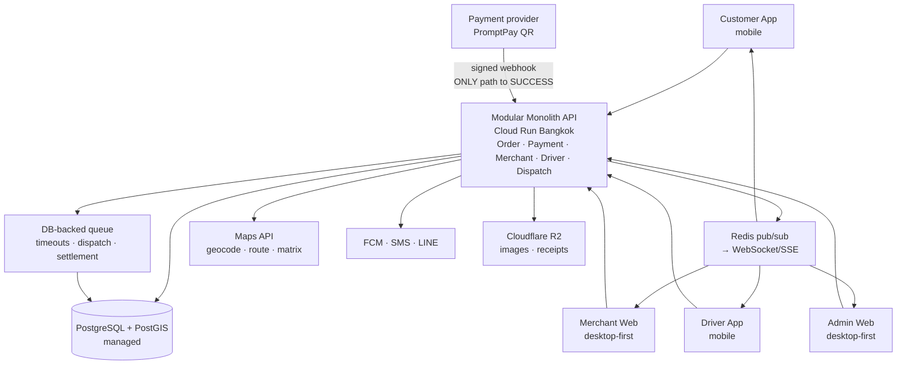
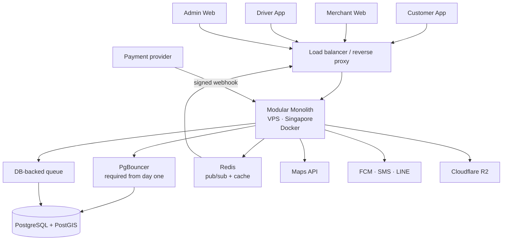
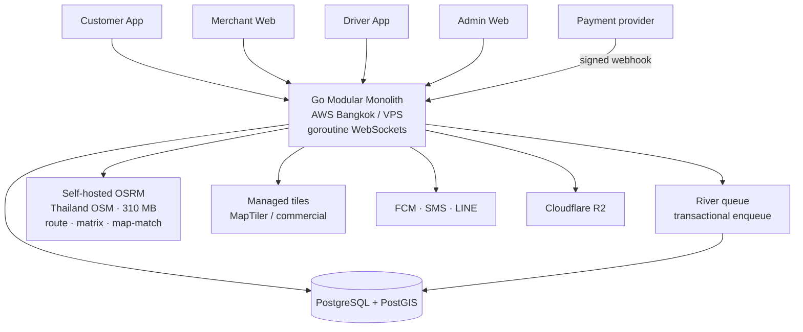

# Architecture Candidates

Three end-to-end candidates assembled from the research in this directory. **None is a decision.** Each is a coherent combination that a Product Owner could actually choose — not options invented to fill a quota.

**What is held constant across all three,** because the evidence points the same way regardless of the other choices (see `ai/RESEARCH/DECISION_MATRIX.md` confidence ratings):

- **PostgreSQL** — the only database best-in-class on all three weighted criteria (SSI for ledger integrity, PostGIS indexed KNN for driver matching, GIN-indexed `jsonb` for phase-generic entities)
- **Cloudflare R2** for object storage — $0 egress
- **OpenTelemetry + Sentry + Grafana Cloud** for observability
- **FCM + Thai SMS gateway + LINE** for notifications
- **Monorepo** on this repository

What varies: **backend stack, hosting model, and how much operational complexity is accepted up front.**

⚠️ All three assume the open payment (Q-001), legal-structure (Q-002), and PromptPay-refund (Q-020) questions are resolved first — none of these candidates is buildable without those answers.

---

## ARCH-A — Modular Monolith on managed PaaS

**Shape:** NestJS (or Laravel) modular monolith → managed Postgres → Cloud Run Bangkok. Database-backed queue. WebSocket via Redis pub/sub. Polling as the initial real-time implementation, upgraded later.

**Pros:** Lowest operational burden — no servers to patch. Bangkok region gives latency, PDPA data residency, and Tier 1 pricing simultaneously. Single transaction boundary satisfies CON-001/CON-003 without distributed-transaction machinery. Cheapest realistic starting point (~$0–30/mo).

**Cons:** Cloud Run cold starts need min-instances ≥1 to avoid hurting order-taking UX (which removes the scale-to-zero saving). Moderate vendor lock-in to GCP. Scaling is all-or-nothing until modules are deliberately split.

**Best when:** the team is small, wants to ship fast, and prefers paying a vendor over running infrastructure.

---

## ARCH-B — Modular Monolith on plain VPS

**Shape:** Same application architecture as ARCH-A, but self-hosted on a VPS (DigitalOcean/Vultr Singapore) with self-managed or managed Postgres. Same queue, real-time, and integration choices.

**Pros:** Lowest cost and **lowest lock-in of the three** — plain Linux, portable anywhere. No cold starts. Full control over PgBouncer, autovacuum, and connection tuning. Predictable flat monthly bill ($5–15 at Stage 1).

**Cons:** You own OS patching, backups, monitoring, and uptime. Singapore-hosted, so PDPA cross-border transfer needs SCCs (legal but an extra step — see `ai/RESEARCH/INFRASTRUCTURE.md`). Requires someone who genuinely enjoys operating servers.

**Best when:** cost and portability matter most, and there's operational skill on the team.

---

## ARCH-C — Go monolith with self-hosted routing

**Shape:** Go modular monolith → PostgreSQL → containers (AWS Bangkok or VPS). **Self-hosted OSRM for routing/matrix** instead of a commercial maps API. River (Postgres-backed, transactional) for queues. Native goroutine WebSockets.

**Pros:** Most resource-efficient — goroutine WebSockets make driver-location fan-out cheap, the one place raw efficiency genuinely matters. **Self-hosted OSRM converts the most volatile cost line (maps, $100–1,000+/mo at Stage 3) into a fixed VPS cost** — viable because Thailand's OSM extract is only 310 MB. River's transactional enqueue directly serves CON-003. Matches what Grab actually runs.

**Cons:** **Highest operational complexity** — you now run a routing engine and tile strategy as well as the app. Weakest Thai hiring-cost profile (Go commands a premium). Go's queue ecosystem is the least mature. ⚠️ Self-hosted OSM routing quality in rural Buntharik is **unverified** (Q-018) — this candidate bets on it.

**Best when:** engineering capability is strong, Stage 3 scale is a realistic near-term expectation, and maps cost is a material concern.

---

## Comparison

| | ARCH-A | ARCH-B | ARCH-C |
|---|---|---|---|
| Backend | NestJS or Laravel | NestJS or Laravel | Go |
| Hosting | Cloud Run Bangkok | VPS Singapore | AWS Bangkok / VPS |
| Routing | Commercial API | Commercial API | **Self-hosted OSRM** |
| Stage 1 cost | ~$0–30/mo | ~$5–15/mo | ~$15–40/mo |
| Ops burden | **Lowest** | Moderate | **Highest** |
| Lock-in | Moderate (GCP) | **Lowest** | Low–moderate |
| Data residency | ✅ In-country | ⚠️ SCCs needed | ✅ In-country |
| Cold starts | Needs min-instances | None | None |
| Hiring pool (TH) | Good (Laravel) / Moderate (Nest) | Same | **Weakest** |
| Scales to Stage 3 | Yes, with work | Yes, with work | **Best** |

## How to choose

The candidates differ mainly on **who operates the infrastructure** and **how much complexity is accepted now to save cost later**:

- Prefer **ARCH-A** if shipping speed and minimal ops matter most.
- Prefer **ARCH-B** if cost, portability, and control matter most and ops skill exists.
- Prefer **ARCH-C** only if there's genuine Go capability *and* maps cost or Stage 3 scale is a near-term concern — otherwise it buys complexity against problems BANHAO doesn't have yet.

**All three are reversible in the ways that matter**: the modular-monolith boundary is preserved in each, PostgreSQL is constant, and the payment integration is isolated behind a provider layer. The genuinely hard-to-reverse decision is **not in this document** — it is the payment provider and legal structure (Q-001, Q-002), because those touch money movement and merchant onboarding.
