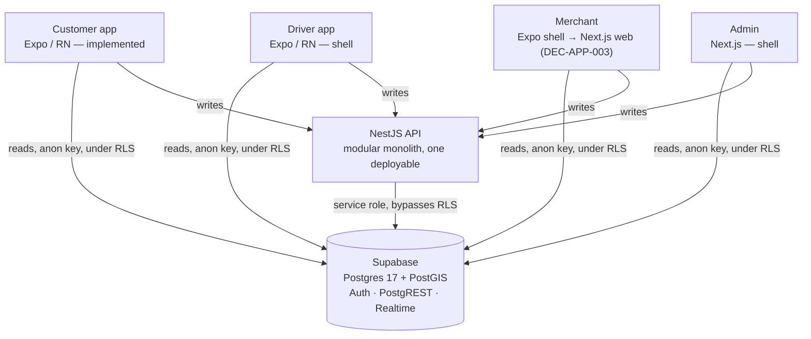
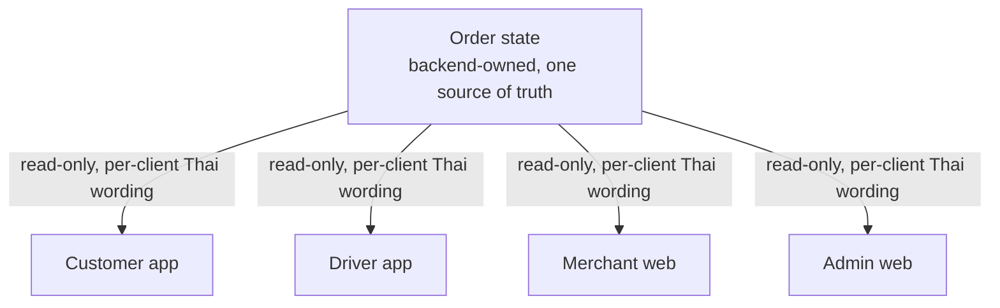

# Architecture

## Scope of this document

This file describes the system **as built and deployed**, verified by reading the
repository at commit `e471ec1d` (the database checkpoint) and `14289652` (current
`main`). It is an orientation summary.

**The authoritative source for application implementation is
[`BANHAO-APP-ARCHITECTURE-V1.md`](BANHAO-APP-ARCHITECTURE-V1.md)** — internally
locked as *BANHAO Application Architecture V1.1 — APPROVED / READY FOR
IMPLEMENTATION*. Where this file and V1.1 disagree, **V1.1 wins** and this file is
the bug. Business decisions (`DEC-NNN`) still outrank both.

> ### ⚠️ Correction — 2026-08-12
>
> Every earlier version of this file stated there was **"no implemented system
> architecture in this repository — no backend, no database, no API, no auth, no
> deployment infrastructure."** That was true when written on 2026-08-09. **It has
> been false since 2026-08-09**, and it actively misled any agent that read it
> first into designing from a blank slate.
>
> Corrected under Phase A / A-1, on the instruction of V1.1 §0 and §19. The
> previous text is preserved in Git history and in
> [`PROJECT_HISTORY.md`](PROJECT_HISTORY.md); nothing has been erased, only
> superseded.

## Runtime shape

## Data access boundary — DEC-APP-008

The single most consequential decision in the application architecture:

| Direction | Path |
|---|---|
| **Reads** | Client → Supabase (PostgREST / Realtime, anon key) **under RLS** |
| **Writes** | Client → NestJS API → Supabase (service role, inside a transaction) |

**Two documented exceptions**, both non-financial, both already granted write
policies by the deployed RLS: `carts` / `cart_items` / `cart_item_options`, and
`rider_availability`.

This satisfies ADR-001 (NestJS is the only trusted *writer*) and ADR-002 (no
client *write* grants on domain tables) without contradiction — direct reads
violate neither. Every table that must not be client-read (`payments`, `refunds`,
`ledger_*`, `outbox`, `jobs`, `audit_logs`, `merchant_bank_accounts`) has no
client policy at all, so the boundary is enforced by the database rather than by
convention.

## Frontend

| App | Framework | State |
|---|---|---|
| `apps/customer` | Expo / React Native 0.76 | **Implemented** — 31 design states, 4-tab navigation, phone-OTP auth against live Supabase, `profiles` read/write under RLS, repository seam, 5 test suites |
| `apps/driver` | Expo / React Native | Shell — `App.tsx`, `app.json`, no `src/`. Stays native (DEC-APP-003) |
| `apps/merchant` | Expo (current) | Shell. **Approved target is Next.js web** (DEC-APP-003) — a restaurant works on a browser, and this removes app-store review from the launch path |
| `apps/admin` | Next.js 15 (App Router) | Shell — `layout.tsx`, `page.tsx` |

Design tokens and shared React Native components live in `packages/ui`
(source-exported, no build step). Fonts: IBM Plex Sans Thai, bundled.

Everything in the customer app except authentication and `profiles` is
**mock-backed** through `apps/customer/src/repositories/` — that seam is the
designated swap point for Supabase-backed reads (Phase C).

## Backend

**NestJS 10 + Express**, a modular monolith (DEC-009, ADR-001). One repository,
one image, **two entrypoints**:

| Entrypoint | Process | State |
|---|---|---|
| `api` | HTTP server | **Built** |
| `worker` | Scheduled tick | **Not built** — Phase A |

The worker is not a separate service and gets no copy of business logic
(ADR-010, ADR-012). It is driven by a Cloudflare Worker cron calling
`/internal/tick` (DEC-APP-010) — **no Redis, no message broker, no Kubernetes, no
always-on worker container.** The schema already carries `outbox` and `jobs` with
the partial indexes a poller wants.

Built and working in `apps/api/src`:

- `SupabaseService` — two concerns, deliberately: a `service_role` client
  (`admin`, bypasses RLS, backend-only) and `verifyAccessToken()` using `jose` +
  `SUPABASE_JWT_SECRET`.
- `SupabaseAuthGuard` (global) → `RolesGuard` (global) → `ResponseInterceptor`,
  with a global `HttpExceptionFilter`.
- `PaymentProvider` interface + `NullPaymentProvider`. No real provider
  (Q-001 `OPEN`). Provider SDKs may only be imported under `payments/providers/`.
- `loadServerEnv()` (zod) called before `NestFactory.create`, so a misconfigured
  deployment fails at boot rather than at the first request.

Domain modules (`orders`, `catalog`, `ledger`, `delivery`, …) are **deliberately
not scaffolded** — an empty module implies work that does not exist. See
`apps/api/src/modules/README.md`.

## API

Two routes exist: `GET /health` (`@Public()`) and `GET /api/v1/me`.

Conventions (V1.1 §6): base `/api/v1`; webhooks outside it at `/webhooks/*`;
every state change is a command, never `PATCH { state }` (ADR-009); mutations
that create money or dispatch effects carry `Idempotency-Key`; authenticated by
default with `@Public()` to opt out.

- **Success:** `{ success: true, data }` — implemented by `ResponseInterceptor`.
- **Failure:** `{ success: false, error: { code, details?, correlationId, message? } }`.
  **`error.code` is the canonical contract.** Clients resolve the code to their
  own Thai copy; the API never decides presentation language or wording. Any
  `message` is a developer-facing English default for logs, never rendered.

⚠️ The current `HttpExceptionFilter` derives `code` from the HTTP status
(409 → `CONFLICT`), carries no `correlationId`, and treats `message` as required.
That does not yet meet the contract above. **Assigned to Phase A / A-2–A-4** —
extend the existing filter, do not replace it.

## Database

**Supabase — PostgreSQL 17.6 + PostGIS**, project `banhao-dev`,
region `ap-southeast-1`. **LOCKED at checkpoint `e471ec1d`.**

16 migrations in `supabase/migrations/`, 40 application tables across ten
domains: identity, merchant, catalog, cart, order, payment, ledger, rider,
delivery, audit/notification/infrastructure.

Do not add a table, view, policy, RPC, or migration without an explicit
instruction. See [`DATABASE_DESIGN.md`](DATABASE_DESIGN.md) and
[`DATABASE_MIGRATION_V1_REPORT.md`](DATABASE_MIGRATION_V1_REPORT.md).

Two structural safeguards worth knowing before touching anything nearby:

- **Rider reads are column-scoped views, not table access.** `rider_order_view`,
  `rider_order_item_view` and `rider_order_item_option_view` are the rider's only
  read path to an order; the rider policies on `orders` / `order_items` /
  `order_item_options` were dropped. The views are `security_invoker = false`
  **and** `security_barrier = true` — the barrier is load-bearing, not cosmetic.
- **`release_rider_assignment(uuid, text, text)`** is the sole sanctioned way to
  release a rider for reassignment. `SECURITY INVOKER`, `service_role`-only
  EXECUTE, both statements of the release invariant atomic in one call.

## Authentication / Authorization

**Supabase Auth, phone OTP.** Test OTP is configured on `banhao-dev`; no SMS
provider yet (Q-019).

Flow, as built and correct: `signInWithOtp` → `verifyOtp` → session persisted in
`AsyncStorage` with `autoRefreshToken` → the `handle_new_user` trigger creates
the `profiles` row → the client reads its own profile under
`profiles_select_own` → API calls carry `Authorization: Bearer <access_token>` →
`SupabaseAuthGuard` verifies → profile lookup → `request.user`. No profile row
gives a `401`; it is deliberately **not** auto-provisioned.

The approved model is **five layers, kept distinct** (V1.1 §5):

| Layer | Owner | Question | State |
|---|---|---|---|
| 1. Authentication | Supabase Auth | Who is this user? | **Built** |
| 2. Global role / capability | NestJS guards | What capability class? | **Built, stale** |
| 3. Domain membership | `restaurant_members`, `riders`, `platform_staff` | Which merchant/rider domain? | Schema only |
| 4. Resource authorization | NestJS guards + services | May they touch *this* resource? | Not built |
| 5. RLS | PostgreSQL | May this session see this row? | **Built, hardened** |

Application-layer authorization and database RLS **must never diverge**.

⚠️ **They currently can.** `RolesGuard` authorizes on `profiles.role` — a column
**no RLS policy consults** (DEC-033 replaced generic roles with domain
membership; all deployed policies contain zero `profiles.role` references). The
guard is inert today because no route uses `@Roles()`, but the divergence is
silent, and `role = 'MERCHANT'` cannot express *"may accept orders for restaurant
X"*, which is the question every merchant endpoint actually asks. **Assigned to
DEC-APP-004, Phase B** — it blocks every merchant and rider endpoint.

`SUPABASE_SERVICE_ROLE_KEY` bypasses RLS, exists only in `apps/api`, and must
never reach any client bundle (CON-005).

## Storage

Supabase Storage free tier (1 GB) for images; Cloudflare R2 at Stage 2.
**Not yet used** — no upload path exists.

## External services

| Concern | Choice | State |
|---|---|---|
| Payments | PromptPay QR via a provider, webhook-confirmed | **No provider selected** (Q-001). `NullPaymentProvider` only |
| Push | Expo Push + FCM | Not built |
| SMS OTP | ThaiBulkSMS (~฿0.15/credit) | Not configured — Supabase Test OTP in dev |
| Maps | MapLibre GL + OSM tiles | Prototype only (Q-018) |
| Error tracking | Sentry free tier | Phase A |

CON-002 stands: **only a signature-verified provider webhook may confirm a
payment.** A client screen must never decide one succeeded.

## Deployment

**Nothing is hosted yet.** `apps/api/Dockerfile` (multi-stage, non-root `USER
node`, HEALTHCHECK on `/health`) and `docker-compose.yml` exist and build.

Approved targets (V1.1 §12): **Cloud Run** `asia-southeast3` (Bangkok),
request-based billing, `min-instances=0` (DEC-APP-009) for the API; **Cloudflare
Pages** for the two web apps; **Cloudflare Worker cron** for the tick
(DEC-APP-010). Architectural target is $0/month — a free-tier assumption, not a
guarantee, and the Cloud Run / Bangkok pricing figures carry
`COST VERIFICATION REQUIRED` until re-checked against current GCP pricing.

CI is `.github/workflows/ci.yml` — four jobs: `verify` (lint → typecheck → test →
build), `rls` (applies every migration to a throwaway Postgres and asserts
authorization), `docker` (builds the image, no push), `secrets-scan`.

**No deploy workflow exists yet** — Phase A. Cloud deployment happens only after
the local validation gate passes: build → tests → local Docker boot → API
integration tests.

## Core Entities

Documented in `docs/05-architecture/BANHAO Product Architecture.dc.html`, section
"06 — SCALING", and echoed in the Design System's component-naming rationale.
Still current — this is forward-looking phase design, not superseded.

| Entity | Phase 1 (Food) | Phase 2 (Delivery) | Phase 3 (Ride) | Phase 4 (Shopping) |
|---|---|---|---|---|
| Merchant | ร้านอาหาร (restaurant) | จุดรับพัสดุ (drop-off point) | — | ร้านค้า / ตลาด (shop/market) |
| Product | เมนูอาหาร (menu item) | พัสดุ + ขนาด (parcel + size) | ประเภทรถ (vehicle type) | สินค้า + สต็อก (item + stock) |
| Order | ออเดอร์อาหาร (food order) | งานส่งของ (delivery job) | การเดินทาง (trip) | คำสั่งซื้อ (purchase order) |
| Delivery | ส่งจากร้านถึงบ้าน (shop→home) | ต้นทาง→ปลายทาง (origin→dest) | จุดรับ→จุดส่ง (pickup→dropoff) | ส่งจากร้านถึงบ้าน (shop→home) |
| Driver | ไรเดอร์มอเตอร์ไซค์ (motorbike rider) | ไรเดอร์/กระบะ (rider/pickup truck) | คนขับรับส่ง (chauffeur) | ไรเดอร์ (rider) |

The explicit design goal: expanding to a new phase should require adding only a
home-screen service icon, a service-specific detail screen, and a pricing
formula. Cart, Checkout, Tracking, Rating, Order History and the Driver App are
meant to be reused unchanged, because every screen reads from one shared,
backend-owned state.

## State machines

**Order, Payment, Delivery and Settlement are four separate state domains**
(DEC-018, CON-001). They are never merged into one enum.

The canonical definitions are **not** in this file — build from these:

| Domain | Source |
|---|---|
| Order | [`ORDER_LIFECYCLE.md`](ORDER_LIFECYCLE.md) — DEC-019's nine states, plus the full old→new mapping |
| Payment | [`PAYMENT_LIFECYCLE.md`](PAYMENT_LIFECYCLE.md) — states, idempotency, refunds |
| Delivery | [`RIDER_LIFECYCLE.md`](RIDER_LIFECYCLE.md) and `supabase/migrations/20260811000009_delivery_domain.sql` |
| Settlement | [`SETTLEMENT_MODEL.md`](SETTLEMENT_MODEL.md) — six tables deferred; not buildable in V1 |

> The twelve-state Order machine and the paired Payment table that used to live
> in this file are **superseded** (DEC-018, DEC-019, DEC-022) and were removed
> here to stop them being read as current. Both survive in full:
> `ORDER_LIFECYCLE.md` carries the complete old→new mapping, `PAYMENT_LIFECYCLE.md`
> carries the payment states including the two dormant cash states (DEC-016),
> the original design canvas is unchanged, and Git history holds the prior text.

Do not use the superseded names (`NEW`, `ACCEPTED`, `READY`, `DRIVER_ASSIGNED`,
`COMPLETED`, `NO_DRIVER`) in new work.

Implemented in the deployed schema as the `orders.state` CHECK constraint —
transitions are guarded conditional `UPDATE`s with the state test in the `WHERE`
clause (ADR-003). Never `SELECT`-then-check-then-`UPDATE`.

## Client / state relationship

**No client may compute or infer its own order status** (REQ-002). All four
surfaces read the same stored value; only the wording differs. That is why a
state is an English identifier (`READY_FOR_PICKUP`) and its Thai label is
per-client copy — a customer sees อาหารพร้อมแล้ว, a merchant sees รอไรเดอร์, a
rider sees รับได้เลย, from one stored value. A Thai label column in the database
would break this by making one wording canonical for all three actors
(DEC-APP-012).

## Ledger model

Every order's ledger balances to exactly zero (CON-003): customer payment in =
merchant payout + rider payout + platform fee + refunds out, with no unaccounted
remainder. Money is **integer satang** — never floating point, never rounded
mid-calculation.

Enforced by transaction-level assertion plus mandatory reconciliation, **not** by
a zero-sum trigger (DEC-034 — no such trigger exists in the schema, by decision).
Ledger and history rows are append-only: corrected with a compensating record,
never an edit, and even the service role is refused by unconditional triggers.

Full model and worked examples: [`SETTLEMENT_MODEL.md`](SETTLEMENT_MODEL.md).
