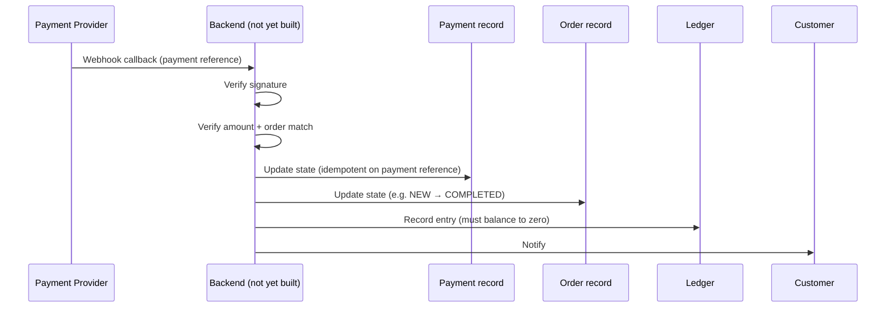
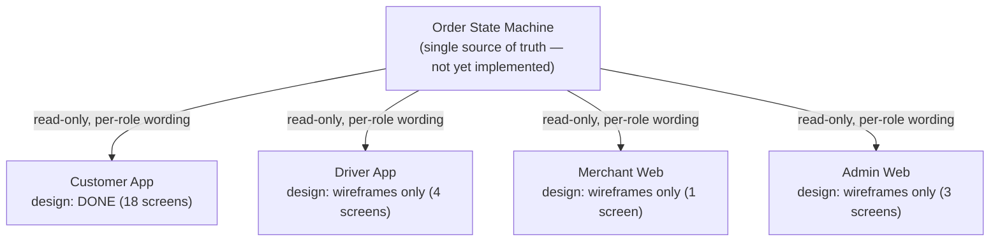

# Architecture

## Scope of this document

There is **no implemented system architecture** in this repository — no backend, no database, no API, no auth, no deployment infrastructure (verified by a full-repository search on 2026-08-09: no `package.json`, framework files, schema files, Dockerfile, or CI config exist anywhere).

What follows is split into two kinds of content, kept explicitly distinct per the instructions in `AGENTS.md` ("source code is implementation truth"):

1. **Documented design intent** — architecture that the `.dc.html` design canvases specify in prose/diagrams, with file+section citations. This is product/design truth, not proof anything is built.
2. **Unimplemented / unknown** — layers with zero evidence in the repository, explicitly marked `UNKNOWN / NOT VERIFIED` rather than guessed at.

## Frontend

UNKNOWN / NOT VERIFIED. No frontend application framework, build tooling, or component library is present. The only frontend-shaped artifacts are the standalone `.dc.html` design canvases (see `design/`), which are self-contained static/interactive documents, not an application scaffold.

## Backend

UNKNOWN / NOT VERIFIED. No backend language, framework, or service code exists in this repository.

## API

UNKNOWN / NOT VERIFIED. No endpoints, contracts, or API framework exist. `docs/06-api/` is an empty placeholder.

## Database

UNKNOWN / NOT VERIFIED. No schema, migrations, or database technology choice exists. The **domain model that a future schema would need to support** is documented, however — see [Core Entities](#core-entities) and the state machines below.

## Authentication / Authorization

UNKNOWN / NOT VERIFIED. The Customer App design includes login and OTP-verification screens (`03 เข้าสู่ระบบ`, `04 ยืนยัน OTP` in `design/customer/BANHAO Customer App.dc.html`), implying phone/OTP-based auth is the intended UX — but no auth mechanism, provider, or token scheme is specified anywhere.

## Storage

UNKNOWN / NOT VERIFIED. No file/object storage is referenced anywhere in the repository.

## External Services

UNKNOWN / NOT VERIFIED which specific providers. What's documented at the *category* level:

- A payment provider offering PromptPay QR, integrated via webhook (provider identity not chosen — see `docs/04-payment` closing note: "เอกสารนี้เป็นการออกแบบผลิตภัณฑ์ ยังไม่ผูกกับผู้ให้บริการรายใด" — "this is a product design, not yet bound to any provider").
- Map tiles: the tracking prototype uses OpenStreetMap tiles via Leaflet (CDN), but this is a prototype choice, not a stated production decision.

## Deployment

UNKNOWN / NOT VERIFIED. No hosting target, Dockerfile, or CI/CD configuration exists.

## Core Entities

Documented in `docs/05-architecture/BANHAO Product Architecture.dc.html`, section "06 — SCALING" (data array at line ~474), and echoed in the Design System's component-naming rationale (`design/design-system/BANHAO Design System.dc.html:34`):

| Entity | Phase 1 (Food) | Phase 2 (Delivery) | Phase 3 (Ride) | Phase 4 (Shopping) |
|---|---|---|---|---|
| Merchant | ร้านอาหาร (restaurant) | จุดรับพัสดุ (drop-off point) | — | ร้านค้า / ตลาด (shop/market) |
| Product | เมนูอาหาร (menu item) | พัสดุ + ขนาด (parcel + size) | ประเภทรถ (vehicle type) | สินค้า + สต็อก (item + stock) |
| Order | ออเดอร์อาหาร (food order) | งานส่งของ (delivery job) | การเดินทาง (trip) | คำสั่งซื้อ (purchase order) |
| Delivery | ส่งจากร้านถึงบ้าน (shop→home) | ต้นทาง→ปลายทาง (origin→dest) | จุดรับ→จุดส่ง (pickup→dropoff) | ส่งจากร้านถึงบ้าน (shop→home) |
| Driver | ไรเดอร์มอเตอร์ไซค์ (motorbike rider) | ไรเดอร์/กระบะ (rider/pickup truck) | คนขับรับส่ง (chauffeur) | ไรเดอร์ (rider) |

The explicit design goal (same section): expanding to a new phase should require adding only three things — a home-screen service icon, a service-specific detail screen (e.g. parcel size, vehicle type), and a pricing formula. Cart, Checkout, Tracking, Rating, Order History, and the Driver App are meant to be reused unchanged, because every screen is meant to read from one shared Order state machine.

## Order State Machine

**Documented as the single source of truth for the whole system** — "ทุก client อ่านจาก state เดียวกัน แต่แสดงคนละถ้อยคำ" ("every client reads from the same state, each just displays different wording"), with an explicit rule that no screen may compute its own status.

Source: `docs/05-architecture/BANHAO Product Architecture.dc.html`, section "03 — ORDER STATE MACHINE" (data array at line ~396).

| State | Customer sees | Driver sees | Shop sees | Changed by |
|---|---|---|---|---|
| `NEW` | ส่งออเดอร์ให้ร้านแล้ว | — | ออเดอร์ใหม่ · กดรับใน 3 นาที | System |
| `ACCEPTED` | ร้านรับออเดอร์แล้ว | — | รับแล้ว รอเริ่มทำ | Shop |
| `PREPARING` | ร้านกำลังเตรียมอาหาร | งานถูกจับคู่ · ไปที่ร้าน | กำลังทำ | Shop |
| `READY` | อาหารพร้อมแล้ว | อาหารพร้อม · รับได้เลย | รอไรเดอร์ | Shop |
| `DRIVER_ASSIGNED` | ไรเดอร์กำลังไปรับอาหาร | กำลังไปที่ร้าน | ไรเดอร์กำลังมา | System |
| `PICKED_UP` | ไรเดอร์รับอาหารแล้ว | รับแล้ว · ไปส่งลูกค้า | ส่งออกจากร้านแล้ว | Driver |
| `DELIVERING` | อาหารกำลังเดินทางมาหาคุณ | กำลังไปหาลูกค้า | — | Driver |
| `COMPLETED` | ส่งสำเร็จ · ให้คะแนนหน่อย | งานเสร็จ · ได้ ฿38 | เสร็จสิ้น | Driver |
| `NO_DRIVER` | ยังหาไรเดอร์ไม่ได้ | — | ยังไม่มีไรเดอร์รับ | System (5-min timeout) |
| `PAYMENT_FAILED` | ชำระเงินไม่สำเร็จ | — | — | Payment system |
| `REJECTED` | ร้านไม่สามารถรับออเดอร์ได้ | — | ปฏิเสธแล้ว | Shop |
| `CANCELLED` | ออเดอร์ถูกยกเลิก · คืนเงินแล้ว | งานถูกยกเลิก | ยกเลิก | Customer / Admin |

Documented error paths: `NEW → REJECTED` (shop declines within 3 min) · `READY → NO_DRIVER` (no rider found within 5 min) · any state before `PICKED_UP` can go to `CANCELLED` by the customer · `PAYMENT_FAILED` can only occur while PromptPay is unconfirmed.

Documented refund rules: cancel before `PREPARING` → full automatic refund. Cancel during `PREPARING` → requires shop confirmation. After `PICKED_UP` → cannot cancel; must go through the support center.

## Payment State Machine

**Documented as a separate, parallel state machine from Order State — the two must never be collapsed into one.** Source: `docs/04-payment/BANHAO Payment Architecture.dc.html`, section "02 — STATE MACHINE" (data array at line ~361).

| Payment state | Customer sees | Paired order state | Changed by |
|---|---|---|---|
| `CREATED` | กำลังสร้างรายการชำระเงิน | `PENDING_PAYMENT` | System |
| `PENDING` | รอการชำระเงิน · แสดง QR และเวลานับถอยหลัง | `PENDING_PAYMENT` | Waiting on user |
| `PROCESSING` | กำลังตรวจสอบการชำระเงิน | `PENDING_PAYMENT` | Provider |
| `SUCCESS` | ชำระเงินสำเร็จ | `NEW → COMPLETED` | **Webhook only** |
| `FAILED` | ยังยืนยันการชำระเงินไม่ได้ | `PENDING_PAYMENT` | Provider |
| `EXPIRED` | QR นี้หมดอายุแล้ว | `PENDING_PAYMENT` | System (10-min timeout) |
| `CANCELLED` | ยกเลิกรายการชำระเงิน | `CANCELLED` | Customer / System |
| `REFUND_PENDING` | กำลังดำเนินการคืนเงิน | `CANCELLED` | System / Admin |
| `REFUND_PROCESSING` | ธนาคารกำลังดำเนินการ | `CANCELLED` | Provider |
| `REFUNDED` | คืนเงินสำเร็จ | `CANCELLED` | **Webhook only** |
| `CASH_PENDING` | จ่ายเงินสดปลายทาง | `NEW → DELIVERING` | System |
| `CASH_COLLECTED` | จ่ายเงินแล้ว ขอบคุณครับ | `COMPLETED` | Driver |

## Payment Confirmation Flow (documented design intent)

Source: `docs/04-payment/BANHAO Payment Architecture.dc.html`, section "01 — ARCHITECTURE".

> "Webhook คือทางเดียวที่เปลี่ยน Payment เป็น SUCCESS" — the webhook is the only path that can move Payment to SUCCESS. Every step must be idempotent, keyed on a single payment reference — a duplicate callback must read back the existing result, not create a new record.

This diagram represents **documented design intent only** — "Backend" here is a conceptual box with no implementation; nothing in this flow currently runs.

## Client / State Relationship (documented design intent)

Documented rule: no client may compute or infer its own order status — all four surfaces are meant to read from the same backend-owned state.

## Ledger Model

Source: `docs/04-payment/BANHAO Payment Architecture.dc.html`, section "04 — LEDGER". Every order must net to zero: customer payment in = merchant payout + driver payout + platform fee + refunds out, with no unaccounted remainder. Cash collected by a driver is recorded as a liability owed to the platform ("Cash Collection"), never as driver income — UI must keep the two visually and numerically separate (see `P-D2` wireframe, section "05 — DRIVER").
