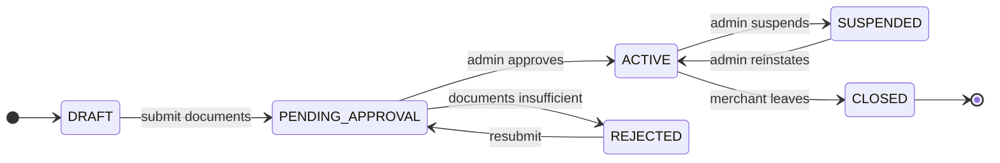

# BANHAO — Business Rules

The source of truth for **how BANHAO works as a business**, written so that an
AI agent can read it and know what to build without re-asking the Product Owner
about anything already decided.

Written 2026-08-10 (EVENT-013). Companion documents:
[`DOMAIN_MODEL.md`](DOMAIN_MODEL.md) ·
[`ORDER_LIFECYCLE.md`](ORDER_LIFECYCLE.md) ·
[`RIDER_LIFECYCLE.md`](RIDER_LIFECYCLE.md) ·
[`PAYMENT_LIFECYCLE.md`](PAYMENT_LIFECYCLE.md) ·
[`SETTLEMENT_MODEL.md`](SETTLEMENT_MODEL.md) ·
[`OPEN_BUSINESS_QUESTIONS.md`](OPEN_BUSINESS_QUESTIONS.md)

---

## How to read this document

Every rule carries a status. **Do not treat them as equivalent.**

| Status | Meaning | May an agent build on it? |
|---|---|---|
| `ACCEPTED` | Approved by the Product Owner (a `DEC-NNN`), or accepted product truth (`CON-NNN`, `REQ-NNN`, design canvas). | Yes. Changing it needs Product Owner approval. |
| `PROPOSED` | This analysis's suggestion. **Not approved.** | No. Implement only after the Product Owner accepts it. |
| `OPEN` | Genuinely undecided. Tracked in `OPEN_BUSINESS_QUESTIONS.md`. | No. Do not guess — see `AGENTS.md`. |
| `LEGAL_REVIEW_REQUIRED` | Cannot be concluded by an agent or an engineer at all. | **No.** Never mark it accepted. |

A rule may be **`ACCEPTED` in model and `OPEN` in numbers** — that combination
is deliberate and appears throughout the money sections. It means the direction
of the money is decided and the amount is not.

**On 2026-08-10 the Product Owner locked seventeen decisions, DEC-016 through
DEC-032** (`docs/DECISIONS.md`, EVENT-014). Where a rule below cites a `DEC-01x`
or `DEC-02x`/`DEC-03x`, it is approved and no longer merely proposed.

Where a rule cites a number that came from the design's sample data, it is
labelled `(sample)`. The design canvas states this about itself:
*"ข้อมูลตัวเลขทั้งหมดในเอกสารเป็นข้อมูลตัวอย่างเพื่อการออกแบบ"* — every figure in
that document is illustrative. **DEC-025 says so explicitly of the 10%
commission example: it must not become a business rule by default.**

Money is always **integer satang** (CON-003). Times are **Asia/Bangkok**.

---

## 1. What BANHAO is

`ACCEPTED`

A **three-sided local marketplace** for อำเภอบุณฑริก จังหวัดอุบลราชธานี. Phase 1
is Food Delivery; Phases 2–4 (Parcel, Ride, Shopping) reuse the same domain
model (DEC-005, REQ-004).

```
        Customer
           │ pays
           ▼
        BANHAO ──── takes a fee
        ╱      ╲
   Merchant   Rider
   (cooks)    (delivers)
```

### Actors

| Actor | Thai | Role | Identity |
|---|---|---|---|
| **Customer** | ลูกค้า | Places and pays for orders | Phone + OTP (live) |
| **Merchant** | ร้านค้า / ร้านอาหาร | Owns a Restaurant, cooks | `OPEN` — BQ-005 |
| **Rider** | ไรเดอร์ | Collects and delivers; may hold cash | `OPEN` — BQ-022 |
| **BANHAO** | บ้านเฮา | Operates the platform; owns Order, Payment, Ledger | Admin role |

The `user_role` enum already exists in the database with `CUSTOMER` as the
default and role changes restricted to a service-role-only function
(`set_user_role()`), verified live — see migration
`20260809000003_harden_profiles_rls.sql`.

### Launch parameters

`ACCEPTED` — `docs/05-architecture` § 01 STRATEGY

| Parameter | Value |
|---|---|
| Opening merchants | 20–30 restaurants within a **3 km radius of ตลาดสดบุณฑริก** |
| Merchant ceiling before Phase 2 | Food only until **80 restaurants** |
| Rider pool | **8–12 riders** |
| Payment methods | **Online payment only — DEC-016.** Cash on Delivery is **disabled** in Phase 1 (the design canvas's "cash + PromptPay" scope is superseded). No in-app wallet — deliberately excluded for regulatory burden and UI cost |
| Success metric | **35% repeat-order rate within 14 days** — not downloads |
| Failure ceiling | **Under 5%** of orders cancelled for lack of a rider |

The stated competitive position is *accuracy of delivery fee and time*, not
feature count — "ความแม่นของค่าส่งและเวลา ไม่ใช่จำนวนฟีเจอร์". This is why
BQ-026 (delivery fee model) was therefore a strategic decision rather than a
pricing detail. It is now decided: **DEC-035** sets a flat ฿10 for Phase 1,
accepting that fee *accuracy* through distance pricing waits until the
coordinate infrastructure exists.

### The scope rule that overrides feature requests

`ACCEPTED` — CON-004 / DEC-007

Any feature that lengthens the core path (open app → choose shop → choose food →
order → wait → receive), **even by one step**, is deferred to a later phase.
Services that are not live render as dimmed "coming soon" cards with no
destination screen.

---

## 2. Customer

### 2.1 What a customer needs in order to place an order

`ACCEPTED` where marked, otherwise `OPEN`

| Requirement | Status | Notes |
|---|---|---|
| A verified phone number | `ACCEPTED` | Supabase Phone OTP; live and verified. `profiles.phone` mirrors the Auth identity and is **not client-writable** |
| A `profiles` row | `ACCEPTED` | Auto-created by trigger on signup; role defaults to `CUSTOMER` |
| A delivery address inside the service area | `OPEN` | BQ-001, BQ-003 |
| A cart with one merchant's items meeting that merchant's minimum | `OPEN` | BQ-008, BQ-010 |
| A payment method | `ACCEPTED` | PromptPay QR or cash |
| A display name | Not required | Optional; `display_name` is the only column a client may write |

No email, no password, no ID document. The whole customer identity is a phone
number.

### 2.2 Authentication

`ACCEPTED`

Phone + 6-digit OTP. Sessions persist across app restarts. A phone-number change
must go through Supabase Auth's OTP-verified flow — never a direct table update.
Real SMS delivery is **not yet configured** and needs an NBTC-registered sender
ID with roughly two weeks of lead time (Q-019).

### 2.3 Addresses

`OPEN` — BQ-001, BQ-002, BQ-003. What the design shows: a selectable list of
labelled addresses (`บ้านของฉัน`), each with a full Thai address line, a contact
name and a phone number, plus a `+ เพิ่มที่อยู่ใหม่` affordance with no form
behind it.

`PROPOSED` constraint regardless of how BQ-001/002 resolve: **an order stores an
address snapshot**, not only a reference. Editing an address must never rewrite
where a past order went.

### 2.4 Cancellation and refunds — the customer's view

`ACCEPTED` — `docs/05-architecture` § 03

| When | Rule |
|---|---|
| Before `PREPARING` | Full refund, automatic |
| During `PREPARING` | Requires merchant confirmation |
| After `PICKED_UP` | Cannot cancel; must go through the support centre |

Everything beyond these three sentences is `OPEN` — Q-003, extended by BQ-016
(fees, post-pickup outcomes) and BQ-031 (what a partial refund contains).

**⚠️ The refund promise the app currently makes may not be deliverable.** The
Customer App tells customers *"เงินจะเข้าบัญชีเดิมที่ใช้จ่าย ภายใน 1–3 วันทำการ"*
— back to the original account within 1–3 business days. Q-020 found that **no
examined payment provider supports native PromptPay refunds**. Until Q-020 is
answered, that copy is a commitment the platform cannot keep.

### 2.5 Ratings

`ACCEPTED` (structure) / `OPEN` (rules — BQ-036)

After delivery the customer may rate the **restaurant** and the **rider**
separately, 1–5 stars each, with predefined tag chips
(`อาหารอร่อย`, `ตรงตามสั่ง`, `แพ็กดี`, `ปริมาณคุ้มค่า` for the shop;
`ส่งเร็ว`, `สุภาพ`, `ขับปลอดภัย` for the rider) and a **skip** option. There is
no free-text comment field in the design. Aggregate ratings are displayed with a
review count (`⭐ 4.8 (326 รีวิว)`).

### 2.6 Support

`ACCEPTED` (the commitment) / `OPEN` (the mechanism — BQ-037)

The payment detail screen publishes support availability as
**every day 08:00–21:00**. Post-pickup cancellations route here.

---

## 3. Merchant and restaurant

### 3.1 Onboarding

`OPEN` — BQ-005. Documented artefacts only: a `สมัครร้านใหม่` (register) screen,
a `รออนุมัติ` (awaiting approval) state, and an admin approval queue showing
`ทะเบียนพาณิชย์` (commercial registration) and `บัญชีธนาคาร` (bank account) as
the documents reviewed.

### 3.2 Restaurant lifecycle

`PROPOSED` — BQ-006. The design documents only three facts: approval exists,
open/closed exists, suspension exists. The state set below is this analysis's
proposal, **not** an accepted model.



**Kept deliberately separate from lifecycle** — whether a restaurant is
*accepting orders right now* is **derived**, not a lifecycle state:

```
accepting_orders =
      lifecycle == ACTIVE
  AND within opening hours for today (Asia/Bangkok)
  AND NOT temporarily_closed
  AND now < (closing_time − preparation_time)      ← cutoff, BQ-007
```

Merging "approved" and "open" is the classic source of *suspended shop still
taking orders*.

### 3.3 Opening hours

`OPEN` — BQ-007. Documented: `เปิด 09:00–20:00 ทุกวัน` on the shop page; a
closed state that names the **next** opening time
(`ร้านจะเปิดอีกครั้งพรุ่งนี้ 10:00 น.`) and offers a *notify me* action;
`เวลาเปิด-ปิด` and `เปิด/ปิดร้านชั่วคราว` as separate merchant settings.

`PROPOSED`: per-day intervals (allowing multiple windows per day), a temporary
close carrying a reason and an auto-reopen time, and an order cutoff of
`preparation_time` before closing. Timezone is **Asia/Bangkok** everywhere;
store instants in UTC and resolve business days in Bangkok local time.

### 3.4 Menu

`ACCEPTED` (structure) / `OPEN` (BQ-009)

- A restaurant's menu is organised into **sections/categories**
  (`แนะนำ`, `อาหารจานเดียว`, `ส้มตำ`, `เครื่องดื่ม`).
- An item has a name, description, price, and image.
- An item may have **option groups**. The design shows three, one marked
  `ต้องเลือก` (required): `เลือกเนื้อสัตว์` (required), `ระดับความเผ็ด`,
  `เพิ่มไข่`. Each option may carry a **price delta** (`+฿10`, `+฿15`).
- The customer may attach a free-text **note to the kitchen**
  (`หมายเหตุถึงร้าน`).
- Whether option groups can be multi-select, and how sold-out works, is `OPEN`.

### 3.5 Merchant-controlled settings

`ACCEPTED` that they exist (merchant sitemap), `OPEN` as to their rules:
minimum order value (`ยอดขั้นต่ำ`), delivery radius (`รัศมีส่ง`), bank account,
staff accounts, notification settings, opening hours, menu and prices.

### 3.6 The merchant's operating loop

`ACCEPTED`

New order arrives with **an alarm that keeps sounding until acknowledged**
(`มีเสียงเตือนดังจนกว่าจะกดรับ`) → accept or reject **within 3 minutes** → start
cooking → mark food ready → hand to rider. The merchant board is a Kanban with
columns `ใหม่ · รับแล้ว · กำลังทำ · รอไรเดอร์ · ไรเดอร์รับแล้ว · เสร็จแล้ว`,
designed to be readable from **2 metres away** on a tablet behind the counter.

---

## 4. Cart

### 4.1 One cart = one restaurant

`ACCEPTED` — **DEC-017**. A customer **cannot** create a multi-restaurant cart
in Phase 1. Adding an item from a different restaurant clears or blocks the
cart, with an explicit prompt.

Why: multi-merchant carts require multi-pickup routing against a pool of 8–12
riders, and would lengthen the core path (CON-004). The Customer App is already
built this way, so nothing needs rework. **Resolves BQ-010.**

### 4.2 Everything else about the cart

What the design shows: a cart headed by **one shop** with its distance and ETA,
line items with options, notes and quantity steppers, a remove action, an
`+ เพิ่มรายการ` action, an empty state, and a price breakdown of
`ค่าอาหาร / ค่าส่ง / ค่าบริการ / ส่วนลด / รวมทั้งหมด`.

`PROPOSED`, pending BQ-011:

1. **The cart is a draft, not a contract.** Prices, availability and opening
   hours are re-validated at checkout.
2. **The order is the contract.** At creation, an order snapshots every line
   price, fee and discount in satang. It is never recomputed from the catalogue
   afterwards — CON-003 depends on this.

---

## 5. Pricing

### 5.1 The documented formula

`ACCEPTED` — the formula, and (as of 2026-08-24) the delivery and service fee
amounts. The discount term is still `OPEN` (BQ-030).

```
total = subtotal + delivery_fee + service_fee − discount        (never below 0)
```

**Approved Phase 1 fees:** `delivery ฿10` (1000 satang, **DEC-035**) ·
`service ฿5` (500 satang, **DEC-036**). Money is integer satang throughout
(CON-003).

**Still a sample:** the `BANHAO7 −฿10` discount, and every fee figure inside
`apps/customer/src/mocks/pricing.ts` — including its
`SAMPLE_DELIVERY_FEE_SATANG = 1500`, which does **not** match the approved
฿10 and must not be used as the source of truth. The client is not the pricing
authority; the server prices every order.

**Inconsistency resolved (BQ-026 → DEC-035):** onboarding and the shop cards
said `ค่าส่งเริ่มต้น 10 บาท` / `ค่าส่ง ฿10`, while the shop page and checkout
said `ค่าส่ง ฿15` labelled `ค่าส่ง (1.2 กม.)`. The approved Phase 1 fee is a
**flat ฿10 with no distance component**, so the `฿15` and the `(1.2 กม.)`
distance label are both superseded — the distance label describes a model that
Phase 1 does not use.

### 5.2 Delivery fee — model and amount accepted

`ACCEPTED — MODEL` — **DEC-023**: `Customer → delivery fee → rider earning`.
The delivery fee is conceptually associated with delivery compensation.

`ACCEPTED — PHASE 1 PRICING` — **DEC-035**: a **flat 1000 satang (฿10) per
order**, regardless of distance. Phase 1 has no distance calculation, no bands,
no zones and no routing/geocoding dependency in the fee.

⚠️ **Distance-banded pricing is not approved.** The table below recommended it,
and it remains the likely future direction — but it is **not** Phase 1
behaviour, and adopting it requires a new Product Owner decision plus the
coordinate and geocoding infrastructure it depends on (customer addresses carry
no `lat`/`lng` today; TQ-004 and Q-018 are `OPEN`). Do not implement or
pre-build for it.

The models below are retained as the record of how DEC-035 was reached — they
are history, not a live decision:

| Model | Complexity | Fairness | Needs good geodata? | Fit for Buntharik |
|---|---|---|---|---|
| Flat | Lowest | Poor at range | No | Workable but wastes the accuracy advantage |
| **Distance banded** (0–2 / 2–5 / 5–10 km) | Low | Good | Tolerant | **Recommended** — survives geocoding error |
| Base + per-km | Medium | Best in theory | **Sensitive** — 200 m of error moves the price | Risky while Q-018 is open |
| Zone-to-zone matrix | High | Good | Needs zones defined | Stage 2 |

That guidance — bands and prices belong in `ServiceArea` configuration, never
hard-coded (§32 of the task brief) — was written for a **banded** model. Phase 1
is flat, so no `ServiceArea`, `zones` or `delivery_fee_bands` table is required
and none exists; the schema lock is untouched. The guidance returns if and when
banded pricing is approved.

### 5.3 Service fee — model and amount accepted; refundability still open

`ACCEPTED — MODEL` — **DEC-024**: `Customer → service fee → BANHAO`. It is
platform revenue, distinct from commission and from the delivery fee.

`ACCEPTED — PHASE 1 PRICING` — **DEC-036**: a **fixed 500 satang (฿5) per
order**. Not a percentage, not a percentage with a cap or minimum, not tiered,
not restaurant-specific.

**`OPEN`** — BQ-027's remaining half: whether the service fee survives a refund.
That is **Phase F** scope, must not be inferred from DEC-036, and does not block
order creation. The `฿5` in `apps/customer/src/mocks/pricing.ts` numerically
matches the approved amount but remains a **sample** — the authority is DEC-036,
and that constant must not be imported into backend code.

### 5.4 Merchant commission — model accepted, rate open

`ACCEPTED — MODEL` — **DEC-025**: `Merchant → commission → BANHAO`.
**`OPEN — NUMERIC RATE`** — Q-010, BQ-028. DEC-025 states explicitly that the
10% appearing throughout the design samples **must not become a business rule by
default.** Model comparison: [`SETTLEMENT_MODEL.md`](SETTLEMENT_MODEL.md) § 5.

---

## 6. Order

Full treatment: [`ORDER_LIFECYCLE.md`](ORDER_LIFECYCLE.md).

**`ACCEPTED` — DEC-019, the core lifecycle:**

```
CREATED → PENDING_PAYMENT → PAID → MERCHANT_ACCEPTED → PREPARING
        → READY_FOR_PICKUP → PICKED_UP → DELIVERING → DELIVERED
```

After `MERCHANT_ACCEPTED`, **`PREPARING` and `RIDER_SEARCHING` run in
parallel.** The restaurant never waits for a rider before starting to cook.

Other load-bearing rules:

- `ACCEPTED` **DEC-018 / CON-001** — Order, Payment, Delivery and Settlement are
  four separate state domains. **No giant Order status enum.**
- `ACCEPTED` **REQ-002** — every client reads the same canonical order state and
  only varies the wording. No screen may compute its own status.
- `ACCEPTED` **DEC-027** — `REFUNDED` is a payment state, never an order
  outcome. A refunded cancellation is `Order = CANCELLED` + `Payment = REFUNDED`.
- `ACCEPTED` — merchant accept window **3 minutes**.
- `ACCEPTED` **DEC-022** — no-rider is **not** an order state and never
  auto-cancels an order.
- **Resolved by the lock:** BQ-012 (`PENDING_PAYMENT` now exists) and BQ-014
  (the `NO_DRIVER` contradiction).
- `OPEN` — **who pays for wasted food (BQ-015, P0)**, merchant accept-timeout
  behaviour (BQ-013), delivery failure (BQ-017), exception **state names**.

---

## 7. Rider

Full treatment: [`RIDER_LIFECYCLE.md`](RIDER_LIFECYCLE.md).

**Rider availability is a first-class business constraint, not an
implementation detail.** With 8–12 riders for an entire district, dispatch
decides whether the product works at all.

**`ACCEPTED` — the dispatch decisions:**

- **DEC-020** — rider search starts at **`MERCHANT_ACCEPTED`**, in parallel with
  cooking. The dispatch model is **broadcast to eligible online riders, first to
  accept wins**. No scoring or route optimisation in Phase 1.
- **DEC-021** — a rider who accepts and then cancels sends the delivery
  `RIDER_ASSIGNED → RIDER_REASSIGNING → RIDER_SEARCHING → broadcast`. **The
  order is not cancelled.**
- **DEC-022** — no rider available means `retry → manual dispatch → operator
  decision`. **An order is never auto-cancelled because a search failed.**
  Operator options include continuing the search, merchant delivery, or
  cancel + refund.

Other rules:

- `ACCEPTED` **DEC-023** — the delivery fee funds rider compensation.
  **DEC-035** sets the Phase 1 fee at a flat ฿10 (1000 satang). **DEC-044**
  (2026-09-05) resolves the rider side: a flat **฿12 (1200 satang) per
  completed delivery**, no distance/base/zone component. The ฿2-per-delivery
  gap between the two locked figures is documented, not funded, by either
  decision.
- `ACCEPTED` **DEC-004 / REQ-001**, **dormant in Phase 1** — cash a rider
  collects is a platform liability, never income, displayed separately. No rider
  handles cash while COD is disabled (DEC-016), but the rule is not repealed.
- `ACCEPTED`, dormant — the cash-limit dispatch block and cash netting. Limit
  value still `OPEN` (Q-004).
- **`DEC-044` (2026-09-05) — no rider-side platform fee in Phase 1.** The
  design's own `D-13` sample shows one (`ค่าธรรมเนียมแพลตฟอร์ม −฿38`); it is
  not activated. This line was previously (incorrectly) tagged `ACCEPTED` in
  this document while its rate was still `OPEN` under BQ-029 — DEC-044
  supersedes that tag with an explicit no.
- **`DEC-044` (2026-09-05) — no surge/peak bonus and no minimum earnings
  guarantee in Phase 1.** The `D-13` sample's peak-hour bonus
  (`โบนัสชั่วโมงเร่งด่วน ฿72`) is not activated either.
- `ACCEPTED` **DEC-037** — the Phase 1 dispatch parameters: a **60-second**
  rider accept window, **60-second** broadcast rounds on the existing tick, and
  **one active delivery per rider**. Eligibility is `APPROVED` + online + a
  valid recorded location — **no radius, zone or ranking**. Resolves BQ-020 and
  BQ-021, and the working-area half of BQ-022.
- `OPEN` — cancellation compensation and waiting fees (BQ-024, unaffected by
  DEC-044 — its own separate `RIDER_COMPENSATION` ledger line); the rest of
  BQ-022 (onboarding, approval, contractor status) is `OPEN` and
  `LEGAL_REVIEW_REQUIRED`.
- **Deferred with COD** — BQ-023, whether the rider fronts cash to the merchant
  at pickup. Unanswered; it returns the day COD does.

---

## 8. Payment

Full treatment: [`PAYMENT_LIFECYCLE.md`](PAYMENT_LIFECYCLE.md).

- `ACCEPTED` **DEC-016** — **Phase 1 is online payment only. COD is disabled**,
  but `payment_method` stays extensible so COD returns without a redesign.
- `ACCEPTED` **CON-002** — only a **signature-verified provider webhook** may
  move a payment to `SUCCESS` or `REFUNDED`. A client screen never decides that
  money arrived.
- `ACCEPTED` **DEC-028 / REQ-003** — payment operations are **idempotent** on
  `order_id` + `payment_reference` + `idempotency_key`. A duplicate callback
  reads back the existing result.
- `ACCEPTED` **DEC-030** — a duplicate payment **never increases an order's
  value**. ฿185 paid twice is not a ฿370 order; the surplus is a refund
  obligation.
- `ACCEPTED` **DEC-029** — a payment arriving after timeout must be resolvable
  to an order and a payment attempt. Whether it is accepted, refunded or
  manually reviewed is `OPEN`.
- `ACCEPTED` **DEC-027** — refund lives in the payment domain.
- `ACCEPTED` — PromptPay QR expires after **10 minutes**; expiry kills the QR,
  not the order.
- `ACCEPTED` **DEC-015** — provider access only through the `PaymentProvider`
  abstraction. **No provider is selected** (Q-001) — and DEC-016 makes that
  choice more urgent, since online is now the only way to be paid.

---

## 9. Settlement

Full treatment: [`SETTLEMENT_MODEL.md`](SETTLEMENT_MODEL.md).

- `ACCEPTED` **CON-003** — every order's ledger balances to exactly zero.
- `ACCEPTED` **DEC-026** — settlement is a **separate financial domain**:
  `customer payment → BANHAO financial records → merchant settlement / rider
  settlement / BANHAO revenue`. ⛔ **Implementation not started, and blocked.**
- `ACCEPTED` — merchants and riders are paid in **transfer rounds**
  (`รอบโอน`), weekly in the design's sample (`โอนทุกวันจันทร์ เวลา 10:00 น.`).
- `ACCEPTED` — the operator's daily screen is a **reconciliation** view, not a
  revenue chart. With COD disabled the Phase 1 identities are
  `online received = total sales` and
  `merchant payouts + rider payouts + platform revenue + refunds = total sales`.
- **Simplified by DEC-016** — the cash-order rule (cash orders skip the transfer
  round, commission netted from the next one) does not apply in Phase 1, so
  BQ-033 is deferred with COD.
- `OPEN` — commission rate (Q-010/BQ-028), service fee **refundability**
  (BQ-027 — the amount is decided by DEC-036), promotion funding (BQ-030),
  cycle specifics (BQ-032), negative balances (BQ-034). The delivery and
  service fee **amounts** are decided (DEC-035, DEC-036).
- ⚖️ `LEGAL_REVIEW_REQUIRED` — Q-002: merchant of record, settlement legal
  structure, tax structure, regulatory classification, and whether BANHAO's own
  split/transfer-round design is regulated payment facilitation.

---

## 10. Cash on delivery — disabled in Phase 1

`ACCEPTED` — **DEC-016. COD is disabled.** Phase 1 is **online payment only**.
This supersedes the design canvas's Phase 1 scope
(`Phase 1 เงินสด + พร้อมเพย์ QR`).

**COD is disabled, not deleted.** The rule is that it must **not** be hard-coded
as permanently unsupported:

| Must stay extensible | Why |
|---|---|
| `payment_method` is an open enum, not a boolean | COD returns without redesigning Order, Payment, Delivery or Settlement |
| Payment states `CASH_PENDING` / `CASH_COLLECTED` remain in the model | Unreachable in Phase 1 |
| `RiderCashBalance` remains in the model | Dormant |
| **DEC-004 / REQ-001 remain ACCEPTED** | Cash is still a liability, still displayed separately, the moment COD returns. **Do not delete these records.** |

What Phase 1 consequently does *not* have: rider cash floats, change
calculation, cash remittance, cash reconciliation, cash-limit dispatch blocking,
and cash-order commission netting.

⚠️ **Two consequences worth holding onto:**

1. **Q-001 and Q-020 became more blocking, not less.** With cash gone, 100% of
   revenue and 100% of refunds depend on an unchosen provider and a PromptPay
   refund mechanism research says does not exist natively. Removing cash also
   removed one of the four candidate refund mechanisms (cash refund via rider).
2. **A customer without a banking app cannot order at all.** A demand-side risk
   to watch in a rural district, not resolved here.

Deferred questions that return with COD, unanswered: **BQ-023** (rider fronting
cash to the merchant at pickup), **Q-004** (cash remittance limit), **BQ-033**
(cash fee netting), and the cash half of **BQ-034**.

The regulatory dimension is deferred too but not closed: OCPB's "Dee-Delivery"
initiative targets cash-on-delivery specifically (Q-017),
`LEGAL_REVIEW_REQUIRED` before COD is ever enabled.

---

## 11. Promotions

`ACCEPTED` (one example) / `OPEN` (the model — BQ-030)

The only documented promotion is `BANHAO7`: **฿10 off when the order reaches
฿100**, framed as "free delivery for the first 7 days" — a discount presented as
a delivery subsidy. The account screen shows a coupon wallet (`2 คูปอง`,
`คูปองของฉัน`) and the admin sitemap has `โปรโมชั่นและคูปอง`.

Derived from the design's own ledger arithmetic (see BQ-030): **the platform
absorbs the discount** — the merchant is paid commission on the full,
undiscounted menu price. This is a strong signal but it is inference from sample
data, not policy.

`PROPOSED` model:

| Dimension | Proposal |
|---|---|
| Types | Percentage off · fixed amount off · delivery-fee subsidy · free item |
| Scope | Platform-wide · per merchant · per customer segment (e.g. first order) |
| Conditions | Minimum spend · first order only · date window · usage cap |
| **Funder** | **Recorded on the promotion and copied onto the order.** `PLATFORM` or `MERCHANT` or a split |
| Stacking | At most one coupon **plus** one merchant promotion per order |

Without a funder field the ledger cannot balance a discounted order (CON-003).

---

## 12. Refunds

Full treatment: [`PAYMENT_LIFECYCLE.md`](PAYMENT_LIFECYCLE.md) § Refund.

Four things must be kept distinct — collapsing them is how refunds corrupt a
ledger:

| Concern | What it is |
|---|---|
| **Payment refund** | Money returned to the customer through the provider rail |
| **Merchant settlement reversal** | Removing an amount from what the merchant is owed |
| **Rider compensation** | Whether the rider still gets paid — usually **yes** if they did the work |
| **Platform fee reversal** | Whether BANHAO keeps its commission and service fee |

`ACCEPTED` **DEC-027** — refund belongs to the payment domain, and `REFUNDED` is
never a substitute for order cancellation. The correct representation is
`Order = CANCELLED` **and** `Payment = REFUNDED`.

The cash refund rule (nothing to refund before collection; cash-adjustment entry
plus an operator refund after) is dormant under DEC-016.

🚨 `OPEN` and blocking (Q-020): PromptPay has **no native refund**. Candidate
mechanisms — wallet credit (which may itself be regulated e-money), manual bank
transfer, ~~cash refund via rider~~ (**removed by DEC-016**), or narrowing the
cancellation window. The launch strategy already rejected an in-app wallet for
regulatory reasons, so the wallet-credit workaround is harder than it first
appears — and disabling COD has now removed one of the four candidates
altogether.

The refund **policy** — full versus partial, what each component contributes,
and post-pickup outcomes — remains `OPEN` (Q-003, BQ-016, BQ-031). §29 of the
decision lock keeps final refund policy explicitly out of scope.

---

## 13. Notifications

`ACCEPTED` (the events) / `OPEN` (channels — BQ-035)

Events that must produce a notification, per actor:

| Event | Customer | Merchant | Rider | Admin |
|---|---|---|---|---|
| Order created / payment pending | ✓ | — | — | — |
| Payment succeeded | ✓ | ✓ (new order alarm) | — | — |
| Payment failed / expired | ✓ | — | — | — |
| Merchant accepted | ✓ | — | — | — |
| Merchant rejected | ✓ | — | — | ✓ |
| Preparing / ready | ✓ | — | ✓ (job offer) | — |
| Rider assigned | ✓ | ✓ | ✓ | — |
| Picked up / delivering | ✓ | ✓ | — | — |
| Delivered | ✓ (+ rating prompt) | ✓ | ✓ | — |
| No rider found | ✓ | ✓ | — | ✓ |
| Rider reassigning (DEC-021) | — | ✓ | ✓ | ✓ |
| Cancelled | ✓ | ✓ | ✓ | ✓ |
| Refund initiated / completed | ✓ | — | — | ✓ |
| ~~Cash limit reached~~ | — | — | dormant — DEC-016 | dormant |
| Payout sent / failed | — | ✓ | ✓ | ✓ |

The merchant's new-order alert is not an ordinary notification: the design
requires **a sound that continues until the order is acknowledged**.

No notification provider may be selected here — see `ai/RESEARCH/NOTIFICATIONS.md`
and Q-019.

---

## 14. Manual operations and operator fallback

`ACCEPTED` — **DEC-031** and **DEC-032**. ⛔ **No Admin App is to be built now**
— the capability is documented, the implementation is not started.

**DEC-031 — manual operations are an intentional Phase 1 capability.** The
system assumes ~50 restaurants, a small rider pool, local geography, a solo
operator and low volume. **Automation is not a requirement for every edge case.**
An edge case answered with "an operator handles it" is a design outcome, not a
gap.

**DEC-032 — the operator must be able to resolve exceptional situations
manually**: no rider, rider cancellation, customer unreachable, restaurant
issue, refund review.

| Capability | Source | Status |
|---|---|---|
| Manual dispatch — assign a rider by hand | Admin sitemap `จ่ายงานด้วยมือ` | `ACCEPTED` — DEC-022, DEC-032 |
| Force-unassign a rider from a job | `A-03` `ปุ่มบังคับปลดงาน` | `ACCEPTED` — routes via `RIDER_REASSIGNING` (DEC-021) |
| Decide the outcome of a no-rider order | — | `ACCEPTED` — **DEC-022**, and the *only* way such an order ends |
| Cancel an order | Order state machine | `ACCEPTED` |
| Issue a refund / review a refund | Payment state machine | `ACCEPTED` — mechanism `OPEN` (Q-020) |
| Match an unreconciled payment by hand | `P-A2` | `ACCEPTED` |
| Handle a late payment | — | `ACCEPTED` — DEC-029; the policy is `OPEN` |
| Approve or reject merchants and riders | `A-12` approval queue | `ACCEPTED` |
| Suspend / reinstate an account | Admin sitemap `ระงับ / ปลดระงับ` | `ACCEPTED` |
| Call merchant, rider or customer | `A-03` call button | `ACCEPTED` |

`PROPOSED` and **not** part of the lock: **every manual override writes an audit
record** — actor, timestamp, before and after state, and a reason. Sub-roles can
wait (Q-014, BQ-038); a missing audit trail cannot be reconstructed later.

---

## 15. Business hours and time

`ACCEPTED` / `PROPOSED` as noted

| Rule | Status |
|---|---|
| Timezone is **Asia/Bangkok** for all business-day logic | `PROPOSED` (implied throughout; never stated) |
| Store instants in UTC; resolve days, hours and settlement cutoffs in Bangkok time | `PROPOSED` |
| Restaurant opening hours govern whether orders may be placed | `ACCEPTED` |
| Temporary close overrides opening hours | `ACCEPTED` (setting exists) |
| Order cutoff = closing time − preparation time | `PROPOSED` — BQ-007 |
| Average preparation time is tracked per merchant (`เวลาทำเฉลี่ย 11 นาที`) | `ACCEPTED` (sample) |
| Support hours 08:00–21:00 daily | `ACCEPTED` |
| Merchant transfer round: Mondays 10:00 | `ACCEPTED` (sample) |

Thai holidays are **not** modelled and, per BQ-007, temporary close is proposed
as sufficient for Phase 1.

---

## 16. Service area and geography

`ACCEPTED` — **DEC-031**: the launch district must be **configuration, not
code**. `OPEN` — the values: BQ-003, Q-018. BQ-026 no longer belongs here:
**DEC-035** made the Phase 1 delivery fee flat, so it needs no service-area or
zone configuration at all.

`PROPOSED` model — **nothing about Buntharik may be hard-coded**:

| Concept | Purpose |
|---|---|
| `ServiceArea` | A named region BANHAO operates in. Buntharik is the first row, not a constant |
| `Zone` | A subdivision of a service area. Used later for zone dispatch and zone pricing; **defined now, unused at launch** |
| `DeliveryRadius` | Per-merchant limit on how far that shop will deliver |
| `DeliveryFeeBand` | Distance bands and prices, per service area |

Launch configuration is one `ServiceArea` (อำเภอบุณฑริก) with one `Zone` and a
3 km merchant catchment around ตลาดสดบุณฑริก. Expansion should be a row, not a
release.

---

## 17. Data ownership

`PROPOSED` — refined from the matrix in the task brief against BANHAO's actual
domain. "Owner" means who the data is *about* and who may correct it; write
access is narrower than ownership in every financial row.

| Data | Owner | Read | Write |
|---|---|---|---|
| Auth identity (`auth.users`) | Customer / Merchant / Rider | Self, Admin | Supabase Auth only |
| Profile | The person | Self, Admin | Self (`display_name` only — enforced live) |
| Address | Customer | Self, Admin; **assigned rider for the active order only** | Customer |
| Restaurant | Merchant | Public | Merchant; Admin for lifecycle |
| Menu / items / options | Merchant | Public | Merchant |
| Restaurant hours | Merchant | Public | Merchant |
| Cart | Customer | Self | Self |
| **Order** | **BANHAO** | Customer (own), Merchant (own shop), assigned Rider, Admin | **State machine only** — no actor writes state directly |
| Order items (snapshot) | BANHAO | Same as Order | Immutable after creation |
| **Payment** | **BANHAO** | Customer (own), Admin | **Payment service only**; `SUCCESS`/`REFUNDED` by verified webhook only (CON-002) |
| **Ledger entry** | **BANHAO** | Admin; aggregates to the party concerned | **Append-only.** Corrections are reversing entries (DEC-014) |
| **Delivery / assignment** | **BANHAO** | Order parties, Operator | Dispatch service, Rider (own progress only), Operator (force-unassign). **Its own domain — DEC-018; it never writes Order state** |
| Rider profile + documents | Rider | Self, Admin | Self; Admin for approval |
| Rider location | Rider | Admin; customer **only during an active delivery** | Rider device |
| **Settlement** | **BANHAO** | Merchant (own), Rider (own), Operator | Settlement engine, Operator. **Its own domain — DEC-026; reads the ledger, not the order table** |
| Rating | Customer (author) | Public in aggregate; Admin in detail | Author within an edit window (BQ-036) |
| Notification | Recipient | Recipient, Admin | System |
| Support ticket | Reporter | Reporter, Admin | Reporter, Admin |
| Promotion / coupon | BANHAO or Merchant | Public when active | Owner, Admin |

Two rules that override the table:

1. **Rider location is the most sensitive flow in the system** (Q-012).
   Retention and access need a lawful basis before the first byte is stored.
2. **RLS is a second line of defence, not the only one.** The API enforces
   authorization; RLS ensures a leaked anon key cannot read another customer's
   row — as already verified live, 14/14.

---

## 18. Legal review required

`LEGAL_REVIEW_REQUIRED` — **no AI agent may conclude that any of the following
is lawful, and none of them was accepted by the 2026-08-10 decision lock.**

**Explicitly excluded from the lock and still `OPEN`:**

| Item | Status |
|---|---|
| Merchant of record | `OPEN` · `LEGAL_REVIEW_REQUIRED` — Q-002 |
| Payment provider | **NOT SELECTED** — Q-001, DEC-015. Omise / 2C2P / Xendit / Stripe all unselected; **no integration** |
| Settlement legal structure | `OPEN` · `LEGAL_REVIEW_REQUIRED` — Q-002 |
| Tax structure | `OPEN` · `LEGAL_REVIEW_REQUIRED` |
| Regulatory classification | `OPEN` · `LEGAL_REVIEW_REQUIRED` — Q-002, Q-015 |

Full table with triggers: `OPEN_BUSINESS_QUESTIONS.md` § Items requiring legal
review. Other areas: payment facilitation licensing (Q-002), ETDA platform
notification (Q-015), PDPA including rider GPS and delivery photos (Q-012),
rider worker classification (BQ-022), consumer protection and cash on delivery
(Q-017 — deferred with COD but not closed), refund enforceability (Q-020), and
any stored-value mechanism.

---

## 19. Cost and complexity discipline

`ACCEPTED` (DEC-009) / `PROPOSED` (the rest)

Every proposal in these documents was checked against five costs — implementation
complexity, infrastructure cost, operational complexity, maintenance burden, and
AI-development complexity — because BANHAO is one founder using AI as the team.

Consequences that show up repeatedly in these documents:

- **Online payment only in Phase 1** (DEC-016) — removes cash reconciliation,
  rider floats, remittance and cash-limit blocking from the launch entirely.
- **Broadcast dispatch over zone dispatch** — `ACCEPTED` (DEC-020): less code,
  no zone maintenance, better fit for 8–12 riders.
- **Operator resolution instead of automated edge cases** — `ACCEPTED`
  (DEC-031, DEC-032).
- ~~**Banded delivery fees over per-kilometre**~~ — **superseded for Phase 1 by
  DEC-035**, which is flat, not banded. The reasoning (tolerates bad geodata,
  easier to explain, no routing service required) is why banding remains the
  likely *future* direction — but it is not approved and not Phase 1.
- **Weekly settlement over daily** — fewer transfers, fewer fees, one
  reconciliation session a week (BQ-032).
- **No wallet** — already the documented launch decision, and it avoids the
  e-money question entirely.
- **Manual admin overrides as a designed feature, not a workaround** — at this
  volume a phone call outperforms an algorithm, and the design already assumes
  it.

Start simple → cheap → reliable → upgradeable. Do not build Grab's architecture
for a district with fifty restaurants.
