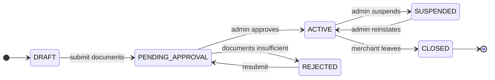

# BANHAO — Business Rules

The source of truth for **how BANHAO works as a business**, written so that an
AI agent can read it and know what to build without re-asking the Product Owner
about anything already decided.

Written 2026-08-10 (EVENT-013). Companion documents:
[`DOMAIN_MODEL.md`](DOMAIN_MODEL.md) ·
[`ORDER_LIFECYCLE.md`](ORDER_LIFECYCLE.md) ·
[`RIDER_LIFECYCLE.md`](RIDER_LIFECYCLE.md) ·
[`PAYMENT_LIFECYCLE.md`](PAYMENT_LIFECYCLE.md) ·
[`SETTLEMENT_MODEL.md`](SETTLEMENT_MODEL.md) ·
[`OPEN_BUSINESS_QUESTIONS.md`](OPEN_BUSINESS_QUESTIONS.md)

---

## How to read this document

Every rule carries a status. **Do not treat them as equivalent.**

| Status | Meaning | May an agent build on it? |
|---|---|---|
| `DOCUMENTED` | Traceable to an accepted source — a design canvas, a `DEC-NNN`, a `CON-NNN`, or a `REQ-NNN`. This is product truth. | Yes. Changing it needs Product Owner approval. |
| `PROPOSED` | This analysis's suggestion. **Not approved.** | No. Implement only after the Product Owner accepts it. |
| `OPEN` | Genuinely undecided. Tracked in `OPEN_BUSINESS_QUESTIONS.md`. | No. Do not guess — see `AGENTS.md`. |

Where a rule cites a number that came from the design's sample data, it is
labelled `(sample)`. The design canvas states this about itself:
*"ข้อมูลตัวเลขทั้งหมดในเอกสารเป็นข้อมูลตัวอย่างเพื่อการออกแบบ"* — every figure in
that document is illustrative.

Money is always **integer satang** (CON-003). Times are **Asia/Bangkok**.

---

## 1. What BANHAO is

`DOCUMENTED`

A **three-sided local marketplace** for อำเภอบุณฑริก จังหวัดอุบลราชธานี. Phase 1
is Food Delivery; Phases 2–4 (Parcel, Ride, Shopping) reuse the same domain
model (DEC-005, REQ-004).

```
        Customer
           │ pays
           ▼
        BANHAO ──── takes a fee
        ╱      ╲
   Merchant   Rider
   (cooks)    (delivers)
```

### Actors

| Actor | Thai | Role | Identity |
|---|---|---|---|
| **Customer** | ลูกค้า | Places and pays for orders | Phone + OTP (live) |
| **Merchant** | ร้านค้า / ร้านอาหาร | Owns a Restaurant, cooks | `OPEN` — BQ-005 |
| **Rider** | ไรเดอร์ | Collects and delivers; may hold cash | `OPEN` — BQ-022 |
| **BANHAO** | บ้านเฮา | Operates the platform; owns Order, Payment, Ledger | Admin role |

The `user_role` enum already exists in the database with `CUSTOMER` as the
default and role changes restricted to a service-role-only function
(`set_user_role()`), verified live — see migration
`20260809000003_harden_profiles_rls.sql`.

### Launch parameters

`DOCUMENTED` — `docs/05-architecture` § 01 STRATEGY

| Parameter | Value |
|---|---|
| Opening merchants | 20–30 restaurants within a **3 km radius of ตลาดสดบุณฑริก** |
| Merchant ceiling before Phase 2 | Food only until **80 restaurants** |
| Rider pool | **8–12 riders** |
| Payment methods | **Cash and PromptPay only.** No in-app wallet — deliberately excluded for regulatory burden and UI cost |
| Success metric | **35% repeat-order rate within 14 days** — not downloads |
| Failure ceiling | **Under 5%** of orders cancelled for lack of a rider |

The stated competitive position is *accuracy of delivery fee and time*, not
feature count — "ความแม่นของค่าส่งและเวลา ไม่ใช่จำนวนฟีเจอร์". This is why
BQ-026 (delivery fee model) is a strategic decision rather than a pricing
detail.

### The scope rule that overrides feature requests

`DOCUMENTED` — CON-004 / DEC-007

Any feature that lengthens the core path (open app → choose shop → choose food →
order → wait → receive), **even by one step**, is deferred to a later phase.
Services that are not live render as dimmed "coming soon" cards with no
destination screen.

---

## 2. Customer

### 2.1 What a customer needs in order to place an order

`DOCUMENTED` where marked, otherwise `OPEN`

| Requirement | Status | Notes |
|---|---|---|
| A verified phone number | `DOCUMENTED` | Supabase Phone OTP; live and verified. `profiles.phone` mirrors the Auth identity and is **not client-writable** |
| A `profiles` row | `DOCUMENTED` | Auto-created by trigger on signup; role defaults to `CUSTOMER` |
| A delivery address inside the service area | `OPEN` | BQ-001, BQ-003 |
| A cart with one merchant's items meeting that merchant's minimum | `OPEN` | BQ-008, BQ-010 |
| A payment method | `DOCUMENTED` | PromptPay QR or cash |
| A display name | Not required | Optional; `display_name` is the only column a client may write |

No email, no password, no ID document. The whole customer identity is a phone
number.

### 2.2 Authentication

`DOCUMENTED`

Phone + 6-digit OTP. Sessions persist across app restarts. A phone-number change
must go through Supabase Auth's OTP-verified flow — never a direct table update.
Real SMS delivery is **not yet configured** and needs an NBTC-registered sender
ID with roughly two weeks of lead time (Q-019).

### 2.3 Addresses

`OPEN` — BQ-001, BQ-002, BQ-003. What the design shows: a selectable list of
labelled addresses (`บ้านของฉัน`), each with a full Thai address line, a contact
name and a phone number, plus a `+ เพิ่มที่อยู่ใหม่` affordance with no form
behind it.

`PROPOSED` constraint regardless of how BQ-001/002 resolve: **an order stores an
address snapshot**, not only a reference. Editing an address must never rewrite
where a past order went.

### 2.4 Cancellation and refunds — the customer's view

`DOCUMENTED` — `docs/05-architecture` § 03

| When | Rule |
|---|---|
| Before `PREPARING` | Full refund, automatic |
| During `PREPARING` | Requires merchant confirmation |
| After `PICKED_UP` | Cannot cancel; must go through the support centre |

Everything beyond these three sentences is `OPEN` — Q-003, extended by BQ-016
(fees, post-pickup outcomes) and BQ-031 (what a partial refund contains).

**⚠️ The refund promise the app currently makes may not be deliverable.** The
Customer App tells customers *"เงินจะเข้าบัญชีเดิมที่ใช้จ่าย ภายใน 1–3 วันทำการ"*
— back to the original account within 1–3 business days. Q-020 found that **no
examined payment provider supports native PromptPay refunds**. Until Q-020 is
answered, that copy is a commitment the platform cannot keep.

### 2.5 Ratings

`DOCUMENTED` (structure) / `OPEN` (rules — BQ-036)

After delivery the customer may rate the **restaurant** and the **rider**
separately, 1–5 stars each, with predefined tag chips
(`อาหารอร่อย`, `ตรงตามสั่ง`, `แพ็กดี`, `ปริมาณคุ้มค่า` for the shop;
`ส่งเร็ว`, `สุภาพ`, `ขับปลอดภัย` for the rider) and a **skip** option. There is
no free-text comment field in the design. Aggregate ratings are displayed with a
review count (`⭐ 4.8 (326 รีวิว)`).

### 2.6 Support

`DOCUMENTED` (the commitment) / `OPEN` (the mechanism — BQ-037)

The payment detail screen publishes support availability as
**every day 08:00–21:00**. Post-pickup cancellations route here.

---

## 3. Merchant and restaurant

### 3.1 Onboarding

`OPEN` — BQ-005. Documented artefacts only: a `สมัครร้านใหม่` (register) screen,
a `รออนุมัติ` (awaiting approval) state, and an admin approval queue showing
`ทะเบียนพาณิชย์` (commercial registration) and `บัญชีธนาคาร` (bank account) as
the documents reviewed.

### 3.2 Restaurant lifecycle

`PROPOSED` — BQ-006. The design documents only three facts: approval exists,
open/closed exists, suspension exists. The state set below is this analysis's
proposal, **not** an accepted model.



**Kept deliberately separate from lifecycle** — whether a restaurant is
*accepting orders right now* is **derived**, not a lifecycle state:

```
accepting_orders =
      lifecycle == ACTIVE
  AND within opening hours for today (Asia/Bangkok)
  AND NOT temporarily_closed
  AND now < (closing_time − preparation_time)      ← cutoff, BQ-007
```

Merging "approved" and "open" is the classic source of *suspended shop still
taking orders*.

### 3.3 Opening hours

`OPEN` — BQ-007. Documented: `เปิด 09:00–20:00 ทุกวัน` on the shop page; a
closed state that names the **next** opening time
(`ร้านจะเปิดอีกครั้งพรุ่งนี้ 10:00 น.`) and offers a *notify me* action;
`เวลาเปิด-ปิด` and `เปิด/ปิดร้านชั่วคราว` as separate merchant settings.

`PROPOSED`: per-day intervals (allowing multiple windows per day), a temporary
close carrying a reason and an auto-reopen time, and an order cutoff of
`preparation_time` before closing. Timezone is **Asia/Bangkok** everywhere;
store instants in UTC and resolve business days in Bangkok local time.

### 3.4 Menu

`DOCUMENTED` (structure) / `OPEN` (BQ-009)

- A restaurant's menu is organised into **sections/categories**
  (`แนะนำ`, `อาหารจานเดียว`, `ส้มตำ`, `เครื่องดื่ม`).
- An item has a name, description, price, and image.
- An item may have **option groups**. The design shows three, one marked
  `ต้องเลือก` (required): `เลือกเนื้อสัตว์` (required), `ระดับความเผ็ด`,
  `เพิ่มไข่`. Each option may carry a **price delta** (`+฿10`, `+฿15`).
- The customer may attach a free-text **note to the kitchen**
  (`หมายเหตุถึงร้าน`).
- Whether option groups can be multi-select, and how sold-out works, is `OPEN`.

### 3.5 Merchant-controlled settings

`DOCUMENTED` that they exist (merchant sitemap), `OPEN` as to their rules:
minimum order value (`ยอดขั้นต่ำ`), delivery radius (`รัศมีส่ง`), bank account,
staff accounts, notification settings, opening hours, menu and prices.

### 3.6 The merchant's operating loop

`DOCUMENTED`

New order arrives with **an alarm that keeps sounding until acknowledged**
(`มีเสียงเตือนดังจนกว่าจะกดรับ`) → accept or reject **within 3 minutes** → start
cooking → mark food ready → hand to rider. The merchant board is a Kanban with
columns `ใหม่ · รับแล้ว · กำลังทำ · รอไรเดอร์ · ไรเดอร์รับแล้ว · เสร็จแล้ว`,
designed to be readable from **2 metres away** on a tablet behind the counter.

---

## 4. Cart

`OPEN` on every substantive question — BQ-010, BQ-011.

What the design shows: a cart headed by **one shop** with its distance and ETA,
line items with options, notes and quantity steppers, a remove action, an
`+ เพิ่มรายการ` action, an empty state, and a price breakdown of
`ค่าอาหาร / ค่าส่ง / ค่าบริการ / ส่วนลด / รวมทั้งหมด`.

`PROPOSED` rules, pending BQ-010/BQ-011:

1. **One merchant per cart.** Adding an item from a different shop prompts to
   clear the cart.
2. **The cart is a draft, not a contract.** Prices are re-validated at checkout.
3. **The order is the contract.** At creation, an order snapshots every line
   price, fee and discount in satang. It is never recomputed from the catalogue
   afterwards — CON-003 depends on this.

---

## 5. Pricing

### 5.1 The documented formula

`DOCUMENTED` as a design **sample**, `OPEN` as business rule.

```
total = subtotal + delivery_fee + service_fee − discount        (never below 0)
```

Sample values carried through the design and the implemented app:
`delivery ฿15` (sample) · `service ฿5` (sample) · `BANHAO7 −฿10` (sample) ·
`฿170 + ฿15 + ฿5 − ฿10 = ฿180`, verified by QA without drift.

**Inconsistency to resolve (BQ-026):** onboarding and the shop cards say
`ค่าส่งเริ่มต้น 10 บาท` / `ค่าส่ง ฿10`, while the shop page and checkout say
`ค่าส่ง ฿15` and label it `ค่าส่ง (1.2 กม.)`. Base-plus-distance would reconcile
them, but no rule is stated.

### 5.2 Delivery fee models under consideration

`OPEN` — BQ-026

| Model | Complexity | Fairness | Needs good geodata? | Fit for Buntharik |
|---|---|---|---|---|
| Flat | Lowest | Poor at range | No | Workable but wastes the accuracy advantage |
| **Distance banded** (0–2 / 2–5 / 5–10 km) | Low | Good | Tolerant | **Recommended** — survives geocoding error |
| Base + per-km | Medium | Best in theory | **Sensitive** — 200 m of error moves the price | Risky while Q-018 is open |
| Zone-to-zone matrix | High | Good | Needs zones defined | Stage 2 |

Bands and prices belong in `ServiceArea` configuration, never hard-coded (§32 of
the task brief).

### 5.3 Service fee

`OPEN` — BQ-027. Documented only as a ฿5 (sample) line the customer pays, folded
into platform revenue in the ledger.

---

## 6. Order

Full treatment: [`ORDER_LIFECYCLE.md`](ORDER_LIFECYCLE.md).

Load-bearing rules:

- `DOCUMENTED` **CON-001** — Order state and Payment state are two separate
  machines and must never be collapsed into one field.
- `DOCUMENTED` **REQ-002** — every client reads the same canonical order state
  and only varies the wording. No screen may compute its own status.
- `DOCUMENTED` — merchant accept window **3 minutes**; rider search timeout
  **5 minutes** → `NO_DRIVER`.
- `OPEN` — the missing `PENDING_PAYMENT` order state (BQ-012), `NO_DRIVER`
  semantics (BQ-014), who pays for wasted food (BQ-015), delivery failure
  (BQ-017).

---

## 7. Rider

Full treatment: [`RIDER_LIFECYCLE.md`](RIDER_LIFECYCLE.md).

**Rider availability is a first-class business constraint, not an
implementation detail.** With 8–12 riders for an entire district, the dispatch
model (BQ-019) and the no-rider ladder (BQ-025) determine whether the product
works at all.

Load-bearing rules:

- `DOCUMENTED` **DEC-004 / REQ-001** — cash a rider collects is a **platform
  liability**, never rider income, and must be displayed as a separate number.
- `DOCUMENTED` — a rider holding cash above a configured limit **stops being
  assigned new jobs automatically**. The limit's value is `OPEN` (Q-004).
- `DOCUMENTED` — rider earnings are netted against outstanding cash before a
  transfer round.
- `DOCUMENTED` — riders pay a platform fee out of their earnings
  (`ค่าธรรมเนียมแพลตฟอร์ม −฿38` in `D-13`). The rate is `OPEN` (BQ-029).
- `OPEN` — dispatch model, accept window, batching, compensation, and whether
  the rider really fronts cash to the merchant at pickup (BQ-023).

---

## 8. Payment

Full treatment: [`PAYMENT_LIFECYCLE.md`](PAYMENT_LIFECYCLE.md).

- `DOCUMENTED` **CON-002** — only a **signature-verified provider webhook** may
  move a payment to `SUCCESS` or `REFUNDED`. A client screen never decides that
  money arrived.
- `DOCUMENTED` **REQ-003** — every webhook is idempotent on a single payment
  reference. A duplicate callback reads back the existing result.
- `DOCUMENTED` — PromptPay QR expires after **10 minutes**; expiry kills the QR,
  not the order.
- `DOCUMENTED` — cash money enters the system when the **rider confirms
  collection**, not when the customer places the order.
- `DOCUMENTED` **DEC-015** — provider access only through the `PaymentProvider`
  abstraction. **No provider is selected** (Q-001).

---

## 9. Settlement

Full treatment: [`SETTLEMENT_MODEL.md`](SETTLEMENT_MODEL.md).

- `DOCUMENTED` **CON-003** — every order's ledger balances to exactly zero.
- `DOCUMENTED` — merchants and riders are paid in **transfer rounds**
  (`รอบโอน`), weekly in the design's sample (`โอนทุกวันจันทร์ เวลา 10:00 น.`).
- `DOCUMENTED` — **cash orders do not enter a merchant transfer round**; the
  commission is netted from the next round instead.
- `DOCUMENTED` — the admin's daily screen is a **reconciliation** view, not a
  revenue chart, and must show two identities matching:
  `online + cash-held = total sales` and
  `merchant payouts + rider payouts + platform revenue + refunds = total sales`.
- `OPEN` — commission rate (Q-010/BQ-028), cycle specifics (BQ-032), negative
  balances (BQ-033, BQ-034).

---

## 10. Cash on delivery

`DOCUMENTED` — cash is **in scope for Phase 1** and is not optional; the launch
strategy names cash and PromptPay as the only two methods.

| Aspect | Rule | Status |
|---|---|---|
| Customer declares the note they will pay with at checkout | `เตรียมเงินมาเท่าไหร่ เผื่อไรเดอร์เตรียมเงินทอน` | `DOCUMENTED` |
| The system computes change; the rider does not do arithmetic | `ต้องทอน ฿370` from a declared ฿500 on a ฿130 order | `DOCUMENTED` |
| Order becomes `COMPLETED` only when the rider confirms collection | | `DOCUMENTED` |
| Collected cash becomes a rider liability immediately | DEC-004 | `DOCUMENTED` |
| Rider has a "customer paid short / problem" escape | `ลูกค้าจ่ายไม่ครบ / มีปัญหา` | `DOCUMENTED` |
| Customer refuses a cash order | No money collected, no refund needed, recorded as a **damaged order** (`ออเดอร์เสียหาย`) — but nobody is charged for the food | `DOCUMENTED` / cost allocation `OPEN` (BQ-015) |
| Rider pays the merchant in cash at pickup | Implied twice by the design | `DOCUMENTED` but **flagged** — BQ-023 |
| Missing cash / fraud | Not addressed anywhere | `OPEN` — BQ-034, Q-013 |

Cash also has a **regulatory** dimension: OCPB's "Dee-Delivery" initiative
targets cash-on-delivery in delivery services specifically (Q-017).
`LEGAL_REVIEW_REQUIRED`.

---

## 11. Promotions

`DOCUMENTED` (one example) / `OPEN` (the model — BQ-030)

The only documented promotion is `BANHAO7`: **฿10 off when the order reaches
฿100**, framed as "free delivery for the first 7 days" — a discount presented as
a delivery subsidy. The account screen shows a coupon wallet (`2 คูปอง`,
`คูปองของฉัน`) and the admin sitemap has `โปรโมชั่นและคูปอง`.

Derived from the design's own ledger arithmetic (see BQ-030): **the platform
absorbs the discount** — the merchant is paid commission on the full,
undiscounted menu price. This is a strong signal but it is inference from sample
data, not policy.

`PROPOSED` model:

| Dimension | Proposal |
|---|---|
| Types | Percentage off · fixed amount off · delivery-fee subsidy · free item |
| Scope | Platform-wide · per merchant · per customer segment (e.g. first order) |
| Conditions | Minimum spend · first order only · date window · usage cap |
| **Funder** | **Recorded on the promotion and copied onto the order.** `PLATFORM` or `MERCHANT` or a split |
| Stacking | At most one coupon **plus** one merchant promotion per order |

Without a funder field the ledger cannot balance a discounted order (CON-003).

---

## 12. Refunds

Full treatment: [`PAYMENT_LIFECYCLE.md`](PAYMENT_LIFECYCLE.md) § Refund.

Four things must be kept distinct — collapsing them is how refunds corrupt a
ledger:

| Concern | What it is |
|---|---|
| **Payment refund** | Money returned to the customer through the provider rail |
| **Merchant settlement reversal** | Removing an amount from what the merchant is owed |
| **Rider compensation** | Whether the rider still gets paid — usually **yes** if they did the work |
| **Platform fee reversal** | Whether BANHAO keeps its commission and service fee |

`DOCUMENTED` cash refund rule: cancel **before** collection → nothing to refund;
cancel **after** collection → create a cash-adjustment entry and admin refunds
the customer.

🚨 `OPEN` and blocking (Q-020): PromptPay has **no native refund**. Candidate
mechanisms — wallet credit (which may itself be regulated e-money), manual bank
transfer, cash refund via rider, or narrowing the cancellation window. Note the
launch strategy explicitly rejected an in-app wallet for regulatory reasons,
which makes the wallet-credit workaround harder than it first appears.

---

## 13. Notifications

`DOCUMENTED` (the events) / `OPEN` (channels — BQ-035)

Events that must produce a notification, per actor:

| Event | Customer | Merchant | Rider | Admin |
|---|---|---|---|---|
| Order created / payment pending | ✓ | — | — | — |
| Payment succeeded | ✓ | ✓ (new order alarm) | — | — |
| Payment failed / expired | ✓ | — | — | — |
| Merchant accepted | ✓ | — | — | — |
| Merchant rejected | ✓ | — | — | ✓ |
| Preparing / ready | ✓ | — | ✓ (job offer) | — |
| Rider assigned | ✓ | ✓ | ✓ | — |
| Picked up / delivering | ✓ | ✓ | — | — |
| Delivered | ✓ (+ rating prompt) | ✓ | ✓ | — |
| No rider found | ✓ | ✓ | — | ✓ |
| Cancelled | ✓ | ✓ | ✓ | ✓ |
| Refund initiated / completed | ✓ | — | — | ✓ |
| Cash limit reached | — | — | ✓ | ✓ |
| Payout sent / failed | — | ✓ | ✓ | ✓ |

The merchant's new-order alert is not an ordinary notification: the design
requires **a sound that continues until the order is acknowledged**.

No notification provider may be selected here — see `ai/RESEARCH/NOTIFICATIONS.md`
and Q-019.

---

## 14. Manual operations and support

`DOCUMENTED` — required capabilities. **No Admin App is to be built now.**

Because BANHAO starts as one operator in one district, the system must assume a
human will intervene, and every intervention must be recorded:

| Capability | Source |
|---|---|
| Manual dispatch — assign a rider by hand | Admin sitemap `จ่ายงานด้วยมือ` |
| Force-unassign a rider from a job | `A-03` Live Map side panel `ปุ่มบังคับปลดงาน` |
| Cancel an order | Order state machine — `CANCELLED` actor is `ลูกค้า / แอดมิน` |
| Issue a refund | Payment state machine — `REFUND_PENDING` actor is `ระบบ / แอดมิน` |
| Match an unreconciled payment by hand | `P-A2` — "เปิดดูรายการเพื่อจับคู่ด้วยมือ" |
| Approve or reject merchants and riders | `A-12` approval queue |
| Suspend / reinstate an account | Admin sitemap `ระงับ / ปลดระงับ` |
| Call merchant, rider or customer | `A-03` panel has a call button |
| Review damaged orders | Cash edge case routes `ออเดอร์เสียหาย` to admin |

`PROPOSED`: **every manual override writes an audit record** — actor, timestamp,
before and after state, and a reason. Sub-roles can wait (Q-014, BQ-038);
missing audit trail cannot be reconstructed later.

---

## 15. Business hours and time

`DOCUMENTED` / `PROPOSED` as noted

| Rule | Status |
|---|---|
| Timezone is **Asia/Bangkok** for all business-day logic | `PROPOSED` (implied throughout; never stated) |
| Store instants in UTC; resolve days, hours and settlement cutoffs in Bangkok time | `PROPOSED` |
| Restaurant opening hours govern whether orders may be placed | `DOCUMENTED` |
| Temporary close overrides opening hours | `DOCUMENTED` (setting exists) |
| Order cutoff = closing time − preparation time | `PROPOSED` — BQ-007 |
| Average preparation time is tracked per merchant (`เวลาทำเฉลี่ย 11 นาที`) | `DOCUMENTED` (sample) |
| Support hours 08:00–21:00 daily | `DOCUMENTED` |
| Merchant transfer round: Mondays 10:00 | `DOCUMENTED` (sample) |

Thai holidays are **not** modelled and, per BQ-007, temporary close is proposed
as sufficient for Phase 1.

---

## 16. Service area and geography

`OPEN` — BQ-003, BQ-026, Q-018

`PROPOSED` model, per §32 of the task brief — **nothing about Buntharik may be
hard-coded**:

| Concept | Purpose |
|---|---|
| `ServiceArea` | A named region BANHAO operates in. Buntharik is the first row, not a constant |
| `Zone` | A subdivision of a service area. Used later for zone dispatch and zone pricing; **defined now, unused at launch** |
| `DeliveryRadius` | Per-merchant limit on how far that shop will deliver |
| `DeliveryFeeBand` | Distance bands and prices, per service area |

Launch configuration is one `ServiceArea` (อำเภอบุณฑริก) with one `Zone` and a
3 km merchant catchment around ตลาดสดบุณฑริก. Expansion should be a row, not a
release.

---

## 17. Data ownership

`PROPOSED` — refined from the matrix in the task brief against BANHAO's actual
domain. "Owner" means who the data is *about* and who may correct it; write
access is narrower than ownership in every financial row.

| Data | Owner | Read | Write |
|---|---|---|---|
| Auth identity (`auth.users`) | Customer / Merchant / Rider | Self, Admin | Supabase Auth only |
| Profile | The person | Self, Admin | Self (`display_name` only — enforced live) |
| Address | Customer | Self, Admin; **assigned rider for the active order only** | Customer |
| Restaurant | Merchant | Public | Merchant; Admin for lifecycle |
| Menu / items / options | Merchant | Public | Merchant |
| Restaurant hours | Merchant | Public | Merchant |
| Cart | Customer | Self | Self |
| **Order** | **BANHAO** | Customer (own), Merchant (own shop), assigned Rider, Admin | **State machine only** — no actor writes state directly |
| Order items (snapshot) | BANHAO | Same as Order | Immutable after creation |
| **Payment** | **BANHAO** | Customer (own), Admin | **Payment service only**; `SUCCESS`/`REFUNDED` by verified webhook only (CON-002) |
| **Ledger entry** | **BANHAO** | Admin; aggregates to the party concerned | **Append-only.** Corrections are reversing entries (DEC-014) |
| Delivery / assignment | BANHAO | Order parties, Admin | Dispatch service, Rider (own status), Admin |
| Rider profile + documents | Rider | Self, Admin | Self; Admin for approval |
| Rider location | Rider | Admin; customer **only during an active delivery** | Rider device |
| Settlement | BANHAO | Merchant (own), Rider (own), Admin | Settlement engine, Admin |
| Rating | Customer (author) | Public in aggregate; Admin in detail | Author within an edit window (BQ-036) |
| Notification | Recipient | Recipient, Admin | System |
| Support ticket | Reporter | Reporter, Admin | Reporter, Admin |
| Promotion / coupon | BANHAO or Merchant | Public when active | Owner, Admin |

Two rules that override the table:

1. **Rider location is the most sensitive flow in the system** (Q-012).
   Retention and access need a lawful basis before the first byte is stored.
2. **RLS is a second line of defence, not the only one.** The API enforces
   authorization; RLS ensures a leaked anon key cannot read another customer's
   row — as already verified live, 14/14.

---

## 18. Legal review required

`LEGAL_REVIEW_REQUIRED` — **no AI agent may conclude that any of the following
is lawful.** See `OPEN_BUSINESS_QUESTIONS.md` § Items requiring legal review for
the full table with triggers. Areas: payment facilitation licensing (Q-002),
ETDA platform notification (Q-015), PDPA including rider GPS and delivery photos
(Q-012), rider worker classification (BQ-022), consumer protection and cash on
delivery (Q-017), tax/VAT/withholding, refund enforceability (Q-020), and any
stored-value mechanism.

---

## 19. Cost and complexity discipline

`DOCUMENTED` (DEC-009) / `PROPOSED` (the rest)

Every proposal in these documents was checked against five costs — implementation
complexity, infrastructure cost, operational complexity, maintenance burden, and
AI-development complexity — because BANHAO is one founder using AI as the team.

Consequences that show up repeatedly in these documents:

- **Broadcast dispatch over zone dispatch** — less code, no zone maintenance,
  better fit for 8–12 riders (BQ-019).
- **Banded delivery fees over per-kilometre** — tolerates bad geodata, easier to
  explain, no routing service required (BQ-026).
- **Weekly settlement over daily** — fewer transfers, fewer fees, one
  reconciliation session a week (BQ-032).
- **No wallet** — already the documented launch decision, and it avoids the
  e-money question entirely.
- **Manual admin overrides as a designed feature, not a workaround** — at this
  volume a phone call outperforms an algorithm, and the design already assumes
  it.

Start simple → cheap → reliable → upgradeable. Do not build Grab's architecture
for a district with fifty restaurants.
