# BANHAO — Supabase Database Design v1

The PostgreSQL blueprint implementing the approved business decisions
(DEC-001…DEC-032) under the approved architecture.

Written 2026-08-11 (EVENT-016). **Locked 2026-08-11 (EVENT-017) by DEC-033 and
DEC-034.**

> ## ✅ DATABASE DESIGN IS APPROVED
> ## ⛔ DATABASE MIGRATION HAS NOT STARTED
>
> **No migration exists. No SQL has been executed. The live Supabase project is
> untouched** — `supabase/migrations/` still holds exactly the three files
> applied on 2026-08-09. Every SQL fragment below is **illustrative**, showing
> intent and constraint shape; none of it is a migration to copy.
>
> Approval of the blueprint is not approval to write it. Four questions still
> gate the first migration: **DBQ-011** (order number format), **DBQ-004**
> (bank account storage), **TQ-011** (migration workflow) and **TQ-012**
> (concurrency test strategy) — see § 21.

Companion: [`TECHNICAL_ARCHITECTURE.md`](TECHNICAL_ARCHITECTURE.md) ·
[`ARCHITECTURE_DECISIONS.md`](ARCHITECTURE_DECISIONS.md) ·
[`OPEN_DATABASE_QUESTIONS.md`](OPEN_DATABASE_QUESTIONS.md) ·
[`DOMAIN_MODEL.md`](DOMAIN_MODEL.md) · [`DECISIONS.md`](DECISIONS.md)

> **Downstream of the business record, never upstream.** If anything here
> contradicts `docs/BUSINESS_RULES.md` or `docs/DECISIONS.md`, those win.
> **No business decision is created, changed or reversed by this document.**

---

## 1. What already exists — respected, not redesigned

Three migrations are applied live and **verified 14/14 by execution**. This
design extends them; it does not rewrite them.

| Live object | Keep as-is |
|---|---|
| `extension postgis`, `uuid-ossp` | Yes — PostGIS already enabled (DBQ-001) |
| `public.user_role` enum | Yes, **plus `OPERATOR`** — see § 4.2 |
| `public.profiles` | Yes |
| `public.set_updated_at()` | Yes — **reuse for every new table** |
| `public.handle_new_user()` + `on_auth_user_created` | Yes |
| `public.enforce_profile_immutable_columns()` | Yes |
| `public.set_user_role()` | Yes, with a note in § 4.2 |
| The RLS pattern itself | **Yes — it is the template for every table below** |

### The established security pattern, generalised

Learned from `20260809000003_harden_profiles_rls.sql`. **Every new table follows
all five steps**, in this order:

1. **`revoke all on <table> from anon, authenticated;` first.** Supabase grants
   `ALL` on public tables by default. Skipping the revoke silently leaves a
   client able to write every column.
2. **`grant select (…)` / `grant update (…)` narrowly** — column-level, never
   table-level, wherever a client writes at all.
3. **`alter table … enable row level security;`**
4. **Policies scoped `to authenticated`**, never `PUBLIC` (which includes
   `anon`). **Omitting a policy denies that verb** regardless of grants — that
   is how most tables below get "no client INSERT" for free.
5. **A `security definer` trigger backstop** on the few tables where an
   over-broad future grant would be dangerous, gated on
   `pg_has_role(current_user, 'service_role', 'member')`.

**Never express "which columns may change" in a `WITH CHECK` subquery.** RLS
`WITH CHECK` sees only the new row, so column rules force a self-referencing
subquery — which is the latent-recursion trap migration 3 exists to remove.
Column privileges are the right primitive.

---

## 2. Design principles

| Principle | Applied as |
|---|---|
| UUID primary keys | `uuid primary key default gen_random_uuid()` everywhere except `profiles` (FK to `auth.users`) |
| Money is never floating point | `bigint` satang + `currency char(3)`. **No `float`, `double`, `real`, `numeric`, or `money`** (ADR-007) |
| Timestamps unambiguous | `timestamptz` everywhere, UTC. Business days resolved in `Asia/Bangkok` by the app (TQ-013) |
| Historical truth is snapshotted | Orders never recompute from live catalogue (§ 8) |
| One writer per table | The owning NestJS module; clients get no write grants (ADR-001/002) |
| Constraints over conventions | Cross-restaurant carts and double rider claims are made **structurally impossible**, not merely validated |
| No unnecessary JSON | `jsonb` only for audit before/after and raw webhook payloads |
| Indexes justified individually | § 15 — each has a named query |

### Deliberately deferred

Not designed here, to avoid building around an `OPEN` business question:

| Deferred | Why |
|---|---|
| `promotions`, `coupons`, `coupon_redemptions` | **BQ-030 (who funds a discount) is `OPEN`.** Without a funder the ledger cannot balance a discounted order — the schema would be a guess. `orders.discount_satang` exists so the column is ready |
| Cash tables (`rider_cash_balances`) | COD disabled (DEC-016). Modelled in `DOMAIN_MODEL.md`, not created |
| Rider location history | 🔴 Q-012 unanswered (DBQ-005). **No location schema should exist before the legal basis does** |
| Support tickets | BQ-037 `OPEN`; not on the critical path |
| Settlement execution detail | DEC-026 says domain accepted, **implementation not started** |

---

## 3. Entity-relationship diagram

```mermaid
erDiagram
    AUTH_USERS ||--|| PROFILES : "1:1 (trigger)"
    PROFILES ||--o{ USER_ROLES : "has capabilities"
    PROFILES ||--o{ ADDRESSES : saves
    PROFILES ||--o{ RESTAURANT_MEMBERS : "member of"

    MERCHANTS ||--|{ RESTAURANTS : operates
    MERCHANTS ||--o{ MERCHANT_BANK_ACCOUNTS : "paid into"
    RESTAURANTS ||--o{ RESTAURANT_MEMBERS : "staffed by"
    RESTAURANTS ||--o{ RESTAURANT_HOURS : "opens by"
    RESTAURANTS ||--|{ MENU_CATEGORIES : organises
    MENU_CATEGORIES ||--|{ MENU_ITEMS : lists
    MENU_ITEMS ||--o{ MENU_OPTION_GROUPS : offers
    MENU_OPTION_GROUPS ||--|{ MENU_OPTIONS : contains

    PROFILES ||--o| CARTS : holds
    CARTS ||--|{ CART_ITEMS : contains
    RESTAURANTS ||--o{ CARTS : "scoped to"

    PROFILES ||--o{ ORDERS : places
    RESTAURANTS ||--o{ ORDERS : receives
    ORDERS ||--|{ ORDER_ITEMS : "snapshots"
    ORDER_ITEMS ||--o{ ORDER_ITEM_OPTIONS : "snapshots"
    ORDERS ||--|{ ORDER_STATUS_HISTORY : "audited by"

    ORDERS ||--|| PAYMENTS : "paid by"
    PAYMENTS ||--|{ PAYMENT_ATTEMPTS : "tried via"
    PAYMENT_ATTEMPTS ||--o{ PAYMENT_TRANSACTIONS : records
    PAYMENTS ||--o{ PAYMENT_EVENTS : "confirmed by"
    PAYMENTS ||--o{ REFUNDS : "reversed by"

    ORDERS ||--|| DELIVERIES : "fulfilled by"
    DELIVERIES ||--o{ RIDER_ASSIGNMENTS : "claimed via"
    DELIVERIES ||--o{ RIDER_ASSIGNMENT_ATTEMPTS : "offered via"
    DELIVERIES ||--o{ DELIVERY_ATTEMPTS : "handover tried"
    DELIVERIES ||--|{ DELIVERY_STATUS_HISTORY : "audited by"
    RIDERS ||--o{ RIDER_ASSIGNMENTS : accepts
    RIDERS ||--o{ RIDER_ASSIGNMENT_ATTEMPTS : "offered"
    PROFILES ||--o| RIDERS : "may be"
    RIDERS ||--|| RIDER_AVAILABILITY : "state of"
    RIDERS ||--o{ RIDER_DOCUMENTS : "verified by"

    ORDERS ||--|{ LEDGER_ENTRY_GROUPS : "accounted by"
    LEDGER_ENTRY_GROUPS ||--|{ LEDGER_ENTRIES : contains
    MERCHANTS ||--o{ SETTLEMENTS : "paid by"
    RIDERS ||--o{ SETTLEMENTS : "paid by"
    SETTLEMENTS ||--|{ SETTLEMENT_ITEMS : "made of"
    LEDGER_ENTRIES ||--o{ SETTLEMENT_ITEMS : "derived from"

    SERVICE_AREAS ||--|{ ZONES : "divided into"
    SERVICE_AREAS ||--|{ DELIVERY_FEE_BANDS : "priced by"

    PROFILES ||--o{ NOTIFICATIONS : receives
    NOTIFICATIONS ||--o{ NOTIFICATION_DELIVERIES : "sent via"
```



Infrastructure tables (`audit_logs`, `outbox`, `jobs`, `idempotency_records`,
`reconciliation_cases`) are intentionally outside the ERD — they reference
everything and would obscure it.

---

## 4. Identity

### 4.1 How `auth.users` and `profiles` relate

`ACCEPTED` and live. `auth.users` is owned by Supabase Auth; `public.profiles`
is the application row, `1:1`, `profiles.id = auth.users.id`, created by the
`on_auth_user_created` trigger, deleted by cascade. **Do not duplicate identity
and do not write `auth.users` from application code.**

### 4.2 Role membership — domain relationships, not a role column

`ACCEPTED` — **DEC-033** (approved 2026-08-11 under the label
"DEC-014 — Multi-role Identity Model"; see the numbering note in
`DECISIONS.md`).

**`profiles` is identity. Authorization is a domain relationship.**
A single `profiles.role` column is **not** the authoritative role model, and
**no generic RBAC layer is built** where a domain table already answers the
question.

> The authoritative question is **"what relationship does this user have with
> this domain?"** — never "what single role does this user have?"

| Capability | Established by | Scope |
|---|---|---|
| **Customer** | **Implicit** — every authenticated profile | Own data |
| **Merchant** | `restaurant_members` row | **Per restaurant**, not global |
| **Rider** | `riders` row | Own rider identity |
| **Operator / Admin** | `platform_staff` row | Platform-wide, elevated |

A user may hold several of these at once, which is the point: in Buntharik a
rider orders food, and a restaurant owner orders food. Under a single role
column, promoting someone to `DRIVER` would strip their ability to be a
customer.

Note that `MERCHANT` as a global role authorises nothing useful anyway — the
real question is *which restaurant*, and only `restaurant_members` answers it.
A role column would still need the membership table, so it would only add a
second, weaker answer to the same question.

**An earlier draft of this document proposed a generic `user_roles` table. The
Product Owner rejected it** (DEC-033): where a domain table exists, membership
*is* the grant. `user_roles` is **not** part of this design, and neither are
`roles` / `permissions` / `role_permissions`. Adding generic RBAC later requires
a new decision.

#### `profiles.role` is deprecated

It stays in the table for now but **must not be read for authorization**. It
cannot be dropped by a design change — three live objects reference it:
`RolesGuard` (`apps/api`), `set_user_role()`, and the `role` clause of
`enforce_profile_immutable_columns()`. Removing it is implementation work,
sequenced as:

1. Create `platform_staff`; backfill from `profiles.role` where role is
   `ADMIN`/`OPERATOR`.
2. Change `RolesGuard` to resolve capability from `restaurant_members`, `riders`
   and `platform_staff`. **Code change — out of scope for a design step.**
3. Drop `profiles.role`, its trigger clause, and `set_user_role()`. The
   `user_role` enum then becomes unused.

Until step 3, `profiles.role` is legacy scaffolding: writable only by the
service role, read by nothing that matters.

#### `platform_staff` — NEW
- **Purpose** — operator and admin membership. The only capability with no other
  domain table, so it gets a small dedicated one rather than a generic RBAC
  layer.
- **PK** `id uuid` · **Unique** `(user_id)`
- **Columns** `user_id`, `staff_role text` + CHECK (`OPERATOR|ADMIN`),
  `granted_by`, `granted_at`, `revoked_at timestamptz null`, `reason text`
- **FK** `user_id → profiles(id) on delete restrict`;
  `granted_by → profiles(id) on delete set null`
- **Index** `(user_id) where revoked_at is null`
- **RLS** self `SELECT` own row; **no client write**. Granted only through a
  service-role path.
- **Mutability** append-mostly; revocation sets `revoked_at`, never deletes —
  an operator's past authority must stay explicable alongside the audit log.

---

## 5. Table catalog

Format per table: **Purpose · PK · Key columns · FKs · Indexes · RLS ·
Mutability**. `sat` = `bigint` satang. Every table gets
`created_at timestamptz not null default now()`; mutable tables also get
`updated_at` with the existing `set_updated_at()` trigger.

### 5.1 Identity

#### `profiles` — **EXISTS, unchanged**
Live. See § 1.

#### `addresses` — NEW
- **Purpose** — saved delivery addresses (BQ-001/BQ-002 `OPEN` on composition;
  the columns below are the union the design already shows).
- **PK** `id uuid`
- **Columns** `user_id`, `label`, `recipient_name`, `recipient_phone`,
  `address_line text`, `landmark text`, `lat numeric(9,6)`, `lng numeric(9,6)`,
  `location geography(Point,4326) generated`, `zone_id`, `instructions`,
  `is_default boolean`, `archived_at`
- **FK** `user_id → profiles(id) on delete cascade`;
  `zone_id → zones(id) on delete set null`
- **Index** `(user_id) where archived_at is null`; partial unique
  `(user_id) where is_default and archived_at is null`
- **RLS** owner `SELECT`/`INSERT`/`UPDATE` own rows. **The one table where a
  client legitimately writes** — it carries no financial or state meaning.
- **Mutability** editable; **soft delete only** (`archived_at`), because orders
  reference it. Orders snapshot the address regardless (§ 8).

### 5.2 Merchant

#### `merchants` — NEW
- **Purpose** — the business that gets paid. Separate from `restaurants` because
  **settlement pays a merchant, not a storefront**; collapsing them would give a
  two-branch owner two commission relationships and two payouts, contradicting
  `SETTLEMENT_MODEL.md`.
- **PK** `id uuid`
- **Columns** `owner_user_id`, `legal_name`, `tax_id`, `status text`
  (`DRAFT|PENDING_APPROVAL|ACTIVE|SUSPENDED|CLOSED` — BQ-006 `OPEN`),
  `commission_bps int null`, `approved_at`, `approved_by`
- **FK** `owner_user_id → profiles(id) on delete restrict`
- **RLS** owner + members `SELECT`; **no client write**.
- **Mutability** mutable by API; `status` transitions audited.
- **Note** `commission_bps` is **basis points, nullable, and unset** — DEC-025
  keeps the rate `OPEN`. The column exists so the ledger has somewhere to read
  from; **no default value may be invented.**

#### `merchant_bank_accounts` — NEW
- **Purpose** — payout destination.
- **PK** `id uuid` · **Columns** `merchant_id`, `bank_code`,
  `account_name`, `account_number_last4`, `account_number_encrypted`,
  `is_primary`, `verified_at`
- **FK** `merchant_id → merchants(id) on delete cascade`
- **RLS** 🔴 **No client SELECT at all.** API-only.
- **Mutability** append + supersede; never hard-deleted (settlement history
  references it).
- **Note** only `last4` is ever returned by an API. Full number storage/encryption
  is DBQ-004.

#### `restaurants` — NEW
- **Purpose** — the Phase-1 storefront customers browse.
- **PK** `id uuid` · **Unique** `(id, merchant_id)` *(needed for the composite FK
  in § 6)*
- **Columns** `merchant_id`, `name`, `description`, `cuisine`, `image_url`,
  `phone`, `address_line`, `lat`, `lng`, `location geography generated`,
  `zone_id`, `status text` (`DRAFT|PENDING_APPROVAL|ACTIVE|SUSPENDED|CLOSED`),
  `temporarily_closed_until timestamptz null`, `temporary_close_reason`,
  `min_order_satang bigint null`, `service_radius_m int null`,
  `avg_prep_minutes int null`, `rating_avg numeric(2,1)`, `rating_count int`
- **FK** `merchant_id → merchants(id) on delete restrict`;
  `zone_id → zones(id) on delete set null`
- **Index** `(status)`; `(zone_id)`; GiST on `location`
- **RLS** **public `SELECT` where `status = 'ACTIVE'`** — the only genuinely
  public table. Members `SELECT` own. **No client write.**
- **Mutability** mutable; **never deleted** — `status = 'CLOSED'`.

> **"Open right now" is derived, never stored.** `status = 'ACTIVE'` ∧ within
> `restaurant_hours` ∧ `temporarily_closed_until` passed ∧ before cutoff. The
> cutoff rule is BQ-007 `OPEN`, so **the database does not enforce it** — the
> `catalog` service derives it. Storing an `is_open` boolean would need a job to
> keep it true and would be wrong between ticks.

#### `restaurant_members` — NEW
- **Purpose** — **the merchant authorization boundary.** A `MERCHANT` role grants
  nothing by itself; this table grants access to a specific restaurant.
- **PK** `id uuid` · **Unique** `(restaurant_id, user_id)`
- **Columns** `restaurant_id`, `user_id`, `member_role text`
  (`OWNER|MANAGER|STAFF`), `invited_by`, `accepted_at`, `revoked_at`
- **FK** both `on delete cascade` / `restrict` respectively
- **Index** `(user_id) where revoked_at is null`
- **RLS** members `SELECT` rows for their own restaurants; **no client write**.
- **Mutability** revoke, never delete.

### 5.3 Catalog

#### `restaurant_hours` — NEW
- **Purpose** — per-day opening intervals; **multiple rows per day allowed** so a
  shop that closes in the afternoon is representable.
- **PK** `id uuid` · **Columns** `restaurant_id`, `day_of_week smallint`
  (`check between 0 and 6`), `opens_at time`, `closes_at time`
- **Check** `closes_at > opens_at` *(overnight spans are DBQ-006)*
- **RLS** public `SELECT` for active restaurants; no client write.
- **Mutability** replaced wholesale on edit.

#### `menu_categories` — NEW
`id`, `restaurant_id`, `name`, `sort_order`, `archived_at`.
Public `SELECT`; no client write. Soft delete.

#### `menu_items` — NEW
- **PK** `id uuid` · **Unique** `(id, restaurant_id)` *(composite-FK anchor)*
- **Columns** `restaurant_id`, `category_id`, `name`, `description`,
  `base_price_satang bigint not null check (>= 0)`, `image_url`,
  `is_available boolean not null default true`, `sort_order`, `archived_at`
- **FK** `category_id → menu_categories(id) on delete restrict`
- **Index** `(restaurant_id) where archived_at is null`
- **RLS** public `SELECT` where not archived; **no client write.**
- **Mutability** freely editable — **which is exactly why orders snapshot
  (§ 8)**. Soft delete only.

#### `menu_option_groups` / `menu_options` — NEW
- `menu_option_groups`: `id`, `menu_item_id`, `title`, `min_select smallint`,
  `max_select smallint`, `sort_order`. **Check** `max_select >= min_select`.
- `menu_options`: `id`, `group_id`, `label`,
  `price_delta_satang bigint not null default 0`, `is_available`, `sort_order`.

> **Why `min_select`/`max_select` rather than an `is_required` boolean:**
> BQ-009 (single- vs multi-select) is `OPEN`. `min=1,max=1` is required
> single-select; `min=0,max=N` is optional multi-select. **The open question
> becomes data, not a schema change** — which is the difference between
> answering it later for free and answering it later with a migration over live
> menus.

### 5.4 Cart — one restaurant, enforced by the database

`ACCEPTED` — DEC-017.

#### `carts`
- **PK** `id uuid` · **Unique** `(user_id)` — one open cart per user ·
  **Unique** `(id, restaurant_id)` *(composite-FK anchor)*
- **Columns** `user_id`, `restaurant_id not null`, `updated_at`
- **FK** `user_id → profiles(id) on delete cascade`;
  `restaurant_id → restaurants(id) on delete cascade`

#### `cart_items`
- **PK** `id uuid`
- **Columns** `cart_id`, `restaurant_id not null` *(denormalised on purpose)*,
  `menu_item_id`, `quantity int check (> 0)`, `note text`
- **Two composite foreign keys — this is the enforcement:**

```sql
-- illustrative, not a migration
foreign key (cart_id, restaurant_id)      references carts      (id, restaurant_id),
foreign key (menu_item_id, restaurant_id) references menu_items (id, restaurant_id)
```

> **A cross-restaurant cart is now structurally impossible.** The first FK ties
> the row to its cart's restaurant; the second ties it to the menu item's
> restaurant. They share the `restaurant_id` column, so both must agree. No
> trigger, no application check, no race — the database simply cannot store the
> bad state. §9 asked for exactly this, and it costs one denormalised column.
>
> Chosen over a `BEFORE INSERT` trigger (a trigger can be dropped, is invisible
> in the table definition, and must be re-derived by every agent that reads the
> schema).

`cart_item_options` mirrors the same shape (`cart_item_id`, `menu_option_id`).
**RLS:** owner-only `SELECT`/`INSERT`/`UPDATE`/`DELETE` on their own cart — the
second and last place a client writes directly, because a cart carries no
financial or state meaning until it becomes an order.

### 5.5 Order

#### `orders`
- **Purpose** — the contract. BANHAO-owned.
- **PK** `id uuid` · **Unique** `order_number text` (customer-visible,
  e.g. `BH000125`) · **Unique** `(id, restaurant_id)` *(composite-FK anchor)*
- **State** `state text not null` + CHECK — see § 7
- **Snapshots (§ 8)** `restaurant_name_snapshot`,
  `delivery_address_snapshot text`, `delivery_lat`, `delivery_lng`,
  `delivery_landmark`, `recipient_name_snapshot`, `recipient_phone_snapshot`
- **Money (all `bigint` satang, all `not null`, all `check >= 0`)**
  `subtotal_satang`, `delivery_fee_satang`, `service_fee_satang`,
  `discount_satang`, `grand_total_satang`, `currency char(3) default 'THB'`
- **Check** `grand_total_satang = subtotal_satang + delivery_fee_satang +
  service_fee_satang - discount_satang` **and** `grand_total_satang >= 0`
- **Other** `customer_id`, `restaurant_id`, `address_id null`,
  `payment_method text`, `distance_m int`, `quoted_eta_minutes int`,
  `cause_code text null`, `placed_at`, `paid_at`, `accepted_at`, `ready_at`,
  `picked_up_at`, `delivered_at`, `cancelled_at`
- **FK** `customer_id → profiles(id) on delete restrict`;
  `restaurant_id → restaurants(id) on delete restrict`;
  `address_id → addresses(id) on delete set null`
- **RLS** customer own; restaurant members own restaurant's; assigned rider
  (limited columns via a view). **No client write.**
- **Mutability** state advances only through the state machine; **money columns
  and snapshots are immutable after creation** (trigger backstop, § 13).

> `on delete restrict` on customer and restaurant is deliberate: **an order must
> outlive attempts to remove the parties to it.**

#### `order_items`
- **PK** `id uuid` · **Columns** `order_id`, `restaurant_id`,
  `menu_item_id uuid null`, `item_name_snapshot text not null`,
  `unit_price_satang bigint not null`, `quantity int not null check (> 0)`,
  `line_total_satang bigint not null`, `note text`
- **FK** `(order_id, restaurant_id) → orders (id, restaurant_id)`;
  **`menu_item_id → menu_items(id) on delete set null`**
- **Mutability** 🔒 **write-once. Never updated, never deleted.**

> **`menu_item_id` is nullable with `ON DELETE SET NULL` on purpose.** The
> snapshot is the truth; the FK is only a convenience link back to the live
> item. Making it `NOT NULL`/`RESTRICT` would let a historical order block a
> merchant from ever removing a discontinued dish.

#### `order_item_options`
`order_item_id`, `group_name_snapshot`, `option_name_snapshot`,
`price_delta_satang`, `menu_option_id uuid null`. Write-once.
**A child table rather than `jsonb`** — these amounts participate in refund
arithmetic (BQ-031), and money should be queryable and checkable, not buried in
a document.

#### `order_status_history`
`order_id`, `from_state`, `to_state`, `actor_type`, `actor_id`, `reason`,
`correlation_id`, `occurred_at`. **Append-only.** The customer timeline is
derived from it (REQ-002). Index `(order_id, occurred_at)`.

---

## 6. Composite-key enforcement summary

Three places use the same technique — a denormalised `restaurant_id` plus two
composite FKs — to make an invalid cross-restaurant row impossible:

| Child | Ties to | Guarantees |
|---|---|---|
| `cart_items` | `carts(id, restaurant_id)` + `menu_items(id, restaurant_id)` | DEC-017: one cart, one restaurant |
| `order_items` | `orders(id, restaurant_id)` | An order line can only belong to its own order's restaurant |
| `cart_item_options` | `cart_items` | Options belong to their line |

Each anchor table therefore carries a redundant-looking
`unique (id, restaurant_id)`. That is the cost, and it is small: PostgreSQL
needs a unique constraint on the referenced column pair for a composite FK to be
legal.

---

## 7. Order state — lifecycle only

`ACCEPTED` — DEC-018/DEC-019. **`orders.state` never contains a payment,
delivery or settlement value.**

```
CREATED → PENDING_PAYMENT → PAID → MERCHANT_ACCEPTED → PREPARING
        → READY_FOR_PICKUP → PICKED_UP → DELIVERING → DELIVERED
```

| Aspect | Decision |
|---|---|
| Core states | `ACCEPTED` — DEC-019, exactly as above |
| Exception states | ⚠️ **`PROPOSED`, names not approved** — `PAYMENT_FAILED`, `PAYMENT_EXPIRED`, `MERCHANT_REJECTED`, `CANCELLED`, `DELIVERY_FAILED` |
| Who transitions | § 17 matrix |
| Enforcement | `text` + `CHECK` (§ 14); transitions guarded in NestJS (ADR-003), **not** in the database |

> The CHECK list must include the exception states to be usable, but **five of
> the fourteen values are provisional**. Whoever writes the migration should
> expect the exception names to change once `ORDER_LIFECYCLE.md` § 3 is
> approved — which is a one-line constraint swap under the `text + CHECK`
> choice, and a painful type migration under an enum. This is the concrete
> reason for § 14's decision.

**Transitions are not enforced by the database.** A CHECK constraint cannot see
the old row, and a trigger encoding the state machine would split it across two
languages (ADR-001). The database constrains the *vocabulary*; NestJS constrains
the *sequence*, via guarded conditional `UPDATE` (§ 12).

---

## 8. Snapshots — what an order preserves

**Rule: an order must be fully explicable from its own rows.** If every
restaurant, menu item and address were edited tomorrow, a printed order must
still show what the customer agreed to.

| Snapshotted | Why | Not snapshotted | Why not |
|---|---|---|---|
| `restaurant_name_snapshot` | Shops rename | Restaurant phone/address | Read live; only needed while active |
| `item_name_snapshot`, `unit_price_satang` | **Menu prices change** — the core reason | Menu descriptions, images | Cosmetic |
| Option name + `price_delta_satang` | Feed refund arithmetic | Option group config | Reconstructable from the snapshot |
| Delivery address text, lat/lng, landmark, recipient name + phone | Addresses are edited and soft-deleted | | |
| All fee and discount amounts | **DEC-023/024/025 rates will change** | Rate/bps used | See below |

> **The order stores amounts, not rates.** Storing `commission_bps` on the order
> and recomputing invites drift and lets a rate change rewrite history. The
> commission *amount* is a ledger entry (§ 10); the order stores what the
> customer was charged. `grand_total_satang` is a stored column with a CHECK,
> never a computed view — it is the number the customer agreed to.

---

## 9. Payment

`payment_method` is `text` + CHECK (`ONLINE`, `CASH`) — **`CASH` is present and
rejected at the service boundary** (DEC-016: disabled, not removed).

#### `payments`
- **PK** `id uuid` · **Unique `order_id`** (1:1) · **Unique `payment_reference`**
- **Columns** `order_id`, `payment_reference text` (BANHAO's own, e.g.
  `PAY-BH000125`), `state text` + CHECK, `method text`,
  `amount_satang bigint not null`, `currency`, `provider text null`,
  `provider_payment_id text null`, `succeeded_at`, `failed_at`,
  `failure_reason text null`
- **Unique** `(provider, provider_payment_id) where provider_payment_id is not null`
- **FK** `order_id → orders(id) on delete restrict`
- **RLS** 🔴 **no client SELECT, no client write.** API-only.
- **Mutability** state advances by guarded update; amount immutable.
- **Provider-neutral:** `provider` is a `text` label, never a hard-coded vendor
  (DEC-015).

#### `payment_attempts`
- **Unique** `(payment_id, attempt_no)`
- **Columns** `payment_id`, `attempt_no int`, `state`, `qr_payload text null`,
  `expires_at`, `provider_attempt_id`, `failure_reason`
- **Mutability** state advances; **rows survive expiry** — that identity is what
  makes late payment resolvable (DEC-029).

#### `payment_events` — webhook ingest
- **PK** `id uuid` · **🔑 Unique `(provider, provider_event_id)`**
- **Columns** `payment_id null`, `provider`, `provider_event_id`,
  `event_type`, `signature_verified boolean not null`,
  `raw_payload jsonb not null`, `received_at`, `processed_at null`,
  `processing_error text null`
- **Index** `(processed_at) where processed_at is null` — the sweeper's query
- **Mutability** 🔒 raw payload and identity immutable; only `processed_at` /
  `processing_error` are written after insert.

> `payment_id` is **nullable**: an event may arrive that cannot be matched. It is
> still recorded — receiving an unmatchable event is exactly the situation you
> need evidence of.

#### `payment_transactions`
- **Purpose** — an actual money movement the provider reports. **This is where
  a surplus (second) payment is recorded** so real cash never vanishes from the
  books.
- **Unique** `(provider, provider_transaction_id)`
- **Columns** `payment_id`, `payment_attempt_id null`, `direction text`
  (`IN|OUT`), `amount_satang`, `provider_transaction_id`, `occurred_at`
- **Mutability** 🔒 immutable.

#### `refunds`
- **Unique `refund_reference`**;
  **Unique** `(provider, provider_refund_id) where … not null`
- **Columns** `payment_id`, `refund_reference`, `state`,
  `amount_satang check (> 0)`, `reason text not null`, `requested_by`,
  `approved_by`, `provider_refund_id`, `completed_at`
- **Mutability** state advances; amount immutable. **Never deleted.**
- **Note** `REFUNDED` is a **payment**-domain state (DEC-027). No order column
  ever holds it.

---

## 10. Financial ledger — recommended, and why

**Recommendation: yes, a ledger — but a small one.**

The five questions §21 requires answering (*how much did the customer pay / is
the merchant's / is the rider's / is BANHAO's / was refunded*) can each be
answered from `orders` and `refunds` alone. A ledger is still worth it for three
reasons that Phase 1 already has:

1. **CON-003 requires a zero-sum check.** Without entries there is nothing to
   sum. Under DEC-034 the check is asserted in the transaction and verified by
   reconciliation rather than by a trigger — but it still needs entries to run
   against.
2. **Settlement must be derived from financial records** (§20, DEC-026). Deriving
   payouts from order columns means re-deriving them identically in two places
   forever.
3. **Corrections must be compensating entries, not edits** (DEC-014). That
   requires an append-only structure to append to.

It is deliberately *not* double-entry bookkeeping with a chart of accounts —
that would exceed Phase 1.

**DEC-034 also requires the system to answer "what financial events produced
these values?"** That is precisely what `ledger_entry_groups` provides: each
group names its cause (`kind`, `order_id`/`refund_id`/`settlement_id`,
`correlation_id`), so any amount can be traced back to the event that created
it. Without the groups, the other five questions would be answerable but the
sixth would not.

#### `ledger_entry_groups`
- **PK** `id uuid` · **🔑 Unique `group_key text`** — deterministic per economic
  event, e.g. `payment:PAY-BH000125:txn:<providerTxnId>`
- **Columns** `order_id null`, `refund_id null`, `settlement_id null`,
  `kind text`, `occurred_at`, `correlation_id`
- **Mutability** 🔒 immutable.

> **Grouping is what makes idempotency and zero-sum both work.** The unique
> `group_key` is the "fail loudly on duplicate" mechanism DEC-028 requires, and
> the group is the unit the sum-to-zero assertion runs over.
>
> This also encodes the review finding: a **duplicate webhook** is rejected by
> `payment_events`' unique key, while a **duplicate payment** gets a *different*
> `group_key` (it includes the provider transaction id) and is therefore
> correctly recorded rather than swallowed.

#### `ledger_entries`
- **PK** `id uuid` · **Columns** `group_id`, `account text` + CHECK
  (`CUSTOMER_PAYMENT`, `MERCHANT_PAYABLE`, `RIDER_PAYABLE`, `PLATFORM_REVENUE`,
  `REFUND_PAYABLE`, `PROMOTION_FUNDING`, `RIDER_COMPENSATION`,
  `PLATFORM_WRITE_OFF`, `RIDER_CASH_HELD` *(dormant)*),
  `party_type text null`, `party_id uuid null`,
  **`amount_satang bigint not null`** *(signed)*, `currency`
- **FK** `group_id → ledger_entry_groups(id) on delete restrict`
- **Index** `(group_id)`; `(party_type, party_id, created_at)` for settlement;
  `(account, created_at)` for reporting
- **RLS** 🔴 no client access whatsoever.
- **Mutability** 🔒 **append-only. No `UPDATE`, no `DELETE` — ever.**

### Zero-sum enforcement — no database trigger in Phase 1

`ACCEPTED` — **DEC-034** (approved 2026-08-11 under the label
"DEC-015 — Phase 1 Financial Integrity").

**An earlier draft of this document recommended a `DEFERRABLE INITIALLY
DEFERRED` constraint trigger asserting `sum(amount_satang) = 0` per group at
commit. The Product Owner rejected it for Phase 1.**

**CON-003 is not repealed.** Every order's ledger still balances to zero. What
changes is *where that is enforced*:

| Layer | Role |
|---|---|
| **Immutable records** | `ledger_entries` and `ledger_entry_groups` are append-only; no `UPDATE`, no `DELETE`, ever (§ 13) |
| **Database constraints** | `unique (group_key)`, FKs, `not null`, CHECKs on account values |
| **NestJS transaction** | Payment + Order + Ledger + Outbox commit together; the ledger service **asserts the group sums to zero before commit** and aborts the transaction if not |
| **Idempotency** | `group_key` uniqueness stops a duplicate group (DEC-028) — this is idempotency, not zero-sum |
| **Auditability** | Every group carries `correlation_id` and links to the event that produced it |
| **Reconciliation** | A scheduled process re-verifies balance across all groups and **alerts on any drift** |

> **The trade this makes.** With the trigger, an unbalanced group was
> *physically impossible*. Without it, it is *asserted in one place and
> monitored continuously*. That is a weaker guarantee, and it makes the
> **reconciliation process mandatory rather than optional** — it is now the only
> thing that would notice a service-layer bug or a hand-written correction. It
> needs a schedule and an alert (TQ-006), not just an intention.
>
> In exchange, the rule stays in NestJS where ADR-001 keeps every other rule,
> and a discrepancy surfaces with domain context instead of as a commit-time
> exception with none.
>
> DEC-034 explicitly leaves a stronger ledger invariant available for a later
> phase. **No future accounting rules are invented here.**

**Corrections are compensating entries, never edits** — unchanged, and required
by DEC-034's "financial history must not be silently rewritten".

---

## 11. Delivery and rider

#### `deliveries`
- **PK** `id uuid` · **Unique `order_id`** (1:1)
- **Columns** `order_id`, `state text` + CHECK (`UNASSIGNED`, `RIDER_SEARCHING`,
  `RIDER_ASSIGNED`, `RIDER_REASSIGNING`, `AT_MERCHANT`, `PICKED_UP`,
  `EN_ROUTE`, `DELIVERED`, `FAILED`, `ABANDONED`),
  **`rider_id uuid null`**, `assigned_at`, `pickup_lat/lng`,
  `dropoff_lat/lng`, `distance_m int`, `rider_earning_satang bigint null`,
  `reassignment_count int not null default 0`, `proof_photo_path text null`,
  `failure_cause text null`, timestamps per milestone
- **FK** `order_id → orders(id) on delete restrict`;
  `rider_id → riders(id) on delete restrict`
- **Index** `(state) where state in ('RIDER_SEARCHING','RIDER_REASSIGNING')` —
  the dispatcher's hot query; `(rider_id) where rider_id is not null`
- **RLS** order parties + currently assigned rider `SELECT`; **no client write.**

> `rider_earning_satang` is **nullable and unset** — BQ-029/DEC-023 keep the
> formula `OPEN`.

#### `delivery_status_history`
Same shape as `order_status_history`, scoped to `delivery_id`. Append-only.
**Separate from order history** — DEC-018.

#### `rider_assignments` — claim history
- **PK** `id uuid`
- **Columns** `delivery_id`, `rider_id`, `status text` + CHECK
  (`ACCEPTED`, `CANCELLED`, `RELEASED`, `COMPLETED`), `accepted_at`,
  `closed_at null`, `close_reason text null`
- **🔑 Partial unique index** — the race backstop:

```sql
create unique index rider_assignments_one_active
  on rider_assignments (delivery_id)
  where status = 'ACCEPTED';
```

- **Index** `(rider_id, accepted_at desc)` — "my deliveries"
- **Mutability** `status`/`closed_at` may advance; rows never deleted.

#### `rider_assignment_attempts` — the offer log
- **Columns** `delivery_id`, `rider_id`, `round_no int`, `offered_at`,
  `expires_at`, `outcome text` (`PENDING|ACCEPTED|DECLINED|EXPIRED|SUPERSEDED`)
- **Unique** `(delivery_id, rider_id, round_no)`
- **Index** `(rider_id) where outcome = 'PENDING'` — **the rider's inbox**
- **RLS** rider `SELECT` **own rows only** — this is how a rider sees a broadcast
  offer; they are not yet a party to the order.
- **Mutability** outcome advances once; append-only otherwise.

#### `delivery_attempts`
`delivery_id`, `attempt_no`, `outcome text`, `notes`, `occurred_at`.
Minimal — BQ-017 (delivery failure policy) is `OPEN`, so only the record exists,
not a workflow.

#### `riders`
`id`, `user_id unique`, `full_name`, `vehicle_type`, `plate`,
`status text` (`REGISTERED|DOCUMENTS_SUBMITTED|PENDING_APPROVAL|APPROVED|
DOCUMENTS_REJECTED|SUSPENDED|DEACTIVATED`), `service_area_id`,
`zone_id null`, `rating_avg`, `rating_count`, `approved_at/by`.
**RLS** self `SELECT`; no client write.

#### `rider_documents`
`rider_id`, `doc_type`, `storage_path`, `status`, `reviewed_by`, `review_note`.
🔴 **No client SELECT of another rider's documents; operator-only review.**
Requirements are BQ-022 `OPEN` — the table stores whatever is submitted without
prescribing the set.

#### `rider_availability` — separate table, justified
- **PK** `rider_id` (1:1 with `riders`)
- **Columns** `is_online boolean`, `last_lat`, `last_lng`,
  `location geography generated`, `location_updated_at`,
  `active_delivery_count int`, `blocked_reason text null`
- **Index** GiST on `location` where `is_online`

> **Why separate from `riders`:** this row is written on **every location ping**
> while `riders` changes a few times a year. Splitting keeps the high-churn
> columns out of the identity row — fewer dead tuples on a table that is read
> constantly, and a clean boundary for the retention rule Q-012 will impose.
>
> **Only the latest position is stored — no history table.** 🔴 Location history
> must not exist before Q-012 answers the legal basis (DBQ-005). "Store the
> minimum that works" is both the cheapest and the lowest-risk option here.

### 11.1 Rider race — the exact strategy

Mandatory (§19). Three layers, in order:

**1. Guarded conditional UPDATE** — the primary mechanism (ADR-003):

```sql
-- both riders execute this concurrently; the guard is in the WHERE clause
update deliveries
   set state = 'RIDER_ASSIGNED', rider_id = :riderId, assigned_at = now()
 where id = :deliveryId
   and state in ('RIDER_SEARCHING', 'RIDER_REASSIGNING')
   and rider_id is null;
```

Rows affected `1` = won, `0` = lost. Under `READ COMMITTED` the second writer
blocks on the row lock, then **re-evaluates its `WHERE` against the committed
row** and matches nothing. Exactly one winner, no advisory lock, no queue.

**2. Partial unique index** on `rider_assignments (delivery_id) where status =
'ACCEPTED'` — inserted in the same transaction. Even if a future refactor broke
the guard, the database refuses a second active claim.

**3. Release invariants** — required for DEC-021 reassignment to work at all:

```sql
update deliveries
   set state = 'RIDER_SEARCHING', rider_id = null,       -- ← must null
       reassignment_count = reassignment_count + 1
 where id = :deliveryId and state in ('RIDER_ASSIGNED','RIDER_REASSIGNING');

update rider_assignments                                  -- ← must leave ACCEPTED
   set status = :cancelledOrReleased, closed_at = now(), close_reason = :reason
 where delivery_id = :deliveryId and status = 'ACCEPTED';
```

> ⚠️ **Both statements are mandatory.** Leaving `rider_id` set makes the accept
> guard's `rider_id is null` unsatisfiable forever; leaving the old claim
> `ACCEPTED` makes the partial unique index reject the next rider. Either
> omission renders the delivery **permanently unassignable** — the constraint
> protecting DEC-020 would block DEC-021. Found by the 2026-08-11 architecture
> review; the post-condition is a required test (TQ-012).

**Not constrained:** one-active-delivery-per-rider. A partial unique index on
`deliveries (rider_id) where state in (<active>)` would enforce it, but
**BQ-021 is `OPEN`** — the limit is a business decision, so it stays a
service-layer check against configuration. Recorded as DBQ-007.

---

## 12. Idempotency — the exact unique columns

§13 asks for precision. Every one of these is a database constraint, not a
convention:

| Protects against | Table | Unique on |
|---|---|---|
| Two payments for one order | `payments` | `(order_id)` |
| Reference reuse | `payments` | `(payment_reference)` |
| Provider payment collision | `payments` | `(provider, provider_payment_id)` partial |
| **Duplicate webhook** | `payment_events` | **`(provider, provider_event_id)`** |
| Duplicate money movement | `payment_transactions` | `(provider, provider_transaction_id)` |
| Duplicate attempt | `payment_attempts` | `(payment_id, attempt_no)` |
| **Duplicate refund** | `refunds` | `(refund_reference)`, `(provider, provider_refund_id)` partial |
| **Duplicate ledger write** | `ledger_entry_groups` | **`(group_key)`** |
| Double-tap order creation | `idempotency_records` | `(idempotency_key, endpoint)` |
| Two active rider claims | `rider_assignments` | `(delivery_id) where status='ACCEPTED'` |
| Duplicate offer | `rider_assignment_attempts` | `(delivery_id, rider_id, round_no)` |
| Duplicate settlement line | `settlement_items` | `(settlement_id, ledger_entry_id)` |

#### `idempotency_records`
`id`, `idempotency_key`, `endpoint`, `user_id`, **`request_hash text not null`**,
`response_status int`, `response_body jsonb`, `created_at`.
Unique `(idempotency_key, endpoint)`.

> `request_hash` matters: the same key with a *different* body is a client bug
> and must return `422`, not a stale success. Retention: purge after ~30 days
> (DBQ-008).

---

## 13. Mutability and delete strategy

| Table group | Delete strategy | Immutable after insert |
|---|---|---|
| `ledger_entries`, `ledger_entry_groups` | **Never deleted** | 🔒 Entirely. Corrections are reversing entries |
| `payment_events`, `payment_transactions` | Never deleted | 🔒 Except `processed_at` |
| `order_items`, `order_item_options` | Never deleted | 🔒 Entirely |
| `*_status_history`, `audit_logs` | Never deleted | 🔒 Entirely |
| `orders`, `payments`, `refunds`, `settlements` | **Never deleted** — terminal status only | Money columns + snapshots 🔒; `state` advances |
| `deliveries`, `rider_assignments` | Never deleted | `state`/`status` advance |
| `restaurants`, `merchants`, `riders` | Status → `CLOSED`/`DEACTIVATED` | — |
| `menu_items`, `menu_categories`, `addresses` | **Soft delete** (`archived_at`) | — |
| `carts`, `cart_items` | **Hard delete** — the only ones | — |
| `outbox`, `jobs`, `idempotency_records`, `notification_deliveries` | Purged on retention schedule | — |

**Retention principle:** *anything that answers "what happened and who owed
whom" is retained; anything that is scaffolding is purged.* Two forces pull
against each other — CON-003 needs history, PDPA (Q-012, BQ-004) grants erasure.
The reconciliation is **anonymise the person, keep the record**: a ledger entry
keeps `party_id`, and the *profile* behind it is anonymised. The retention
windows themselves are `LEGAL_REVIEW_REQUIRED` (DBQ-008).

**Immutability enforcement:** a `security definer` `BEFORE UPDATE`/`BEFORE
DELETE` trigger on the 🔒 tables, using the same
`pg_has_role(current_user, 'service_role', 'member')` escape as
`enforce_profile_immutable_columns()` — except here **even the service role is
refused** on ledger and history tables. Revoking `UPDATE`/`DELETE` grants alone
is insufficient because the service role bypasses RLS and holds broad rights.

---

## 14. Enum strategy — `text` + `CHECK`, with one exception

**Decision: `text` + `CHECK` constraints for all domain state and type columns.
Keep the existing `user_role` enum.**

| | PostgreSQL `enum` | `text` + `CHECK` |
|---|---|---|
| Add a value | `ALTER TYPE … ADD VALUE`; **cannot be used in the same transaction that adds it** | One-line constraint swap |
| **Remove / rename** | **Painful** — new type, alter every column, drop old | Trivial |
| Visible to a reader | Requires looking up a separate type | **In the table DDL, next to the column** |
| Type safety | Stronger | CHECK is enforced equally at write time |

**Why this matters here specifically:** the order state vocabulary **has already
changed once** — DEC-019 superseded the 12-state machine — and **five exception
state names are still `PROPOSED`**. A vocabulary that is known to be unsettled
should not be stored in the type system's least-alterable construct. AI
maintainability points the same way: an agent reading `create table orders` sees
the legal values inline instead of chasing a type definition.

**Exception:** `public.user_role` stays an enum. It is live, small, stable, and
referenced by a function and a trigger — churning it buys nothing. Adding
`OPERATOR` is a one-line `ALTER TYPE`.

---

## 15. Index design

Each index has a named query. **No index without one.**

| Index | Serves |
|---|---|
| `orders (customer_id, placed_at desc)` | Customer order history |
| `orders (restaurant_id, state)` | Merchant board — the most frequent merchant query |
| `orders (state) where state not in (<terminal>)` | Operator "live orders" |
| `orders (order_number)` unique | Support lookup by the number the customer reads out |
| `order_items (order_id)` | Order detail |
| `deliveries (state) where state in ('RIDER_SEARCHING','RIDER_REASSIGNING')` | **The dispatcher's polling query** — partial keeps it tiny |
| `deliveries (rider_id) where rider_id is not null` | Rider's active job |
| `rider_assignments (rider_id, accepted_at desc)` | Rider earnings history |
| `rider_assignment_attempts (rider_id) where outcome='PENDING'` | **Rider's offer inbox** |
| `payments (order_id)` unique | Order → payment |
| `payment_events (provider, provider_event_id)` unique | **Webhook dedup** |
| `payment_events (processed_at) where processed_at is null` | Sweeper |
| `payment_attempts (payment_id, attempt_no)` unique | Attempt lookup |
| `ledger_entries (group_id)` | Zero-sum assertion |
| `ledger_entries (party_type, party_id, created_at)` | **Settlement derivation** |
| `settlements (payee_type, payee_id, period_end)` | Payout history |
| `restaurants (status)`, GiST `(location)` | Browse, nearby |
| `menu_items (restaurant_id) where archived_at is null` | Menu render |
| `rider_availability (location)` GiST where `is_online` | Dispatch eligibility |
| `outbox (dispatched_at) where dispatched_at is null` | Outbox poll |
| `jobs (next_run_at) where state='PENDING'` | Job poll |

Deliberately **not** indexed: audit/history tables beyond their parent FK
(written far more than read); every FK by default (PostgreSQL does not require
it, and unused indexes cost writes).

---

## 16. Settlement, audit, notifications, infrastructure

#### `settlements` / `settlement_items`
- `settlements`: `payee_type text` (`MERCHANT|RIDER`), `payee_id`,
  `period_start`, `period_end`, `gross_satang`, `deductions_satang`,
  `net_satang`, `state text` (`ACCRUING|PENDING|PROCESSING|PAID|FAILED|
  CANCELLED`), `bank_account_id`, `executed_at`, `failure_reason`
- `settlement_items`: `settlement_id`, **`ledger_entry_id`**, `order_id null`,
  `amount_satang`. **Unique `(settlement_id, ledger_entry_id)`**
- **Derived from the ledger, never from orders** (§20, DEC-026) — the FK to
  `ledger_entry_id` is what makes that structural.
- ⛔ **Not to be implemented.** Every amount is `OPEN` (DEC-023/024/025) and
  Q-002 is `LEGAL_REVIEW_REQUIRED`. **No assumption about legal ownership of
  funds is encoded here.**

#### `audit_logs`
`id`, `actor_type text` (`CUSTOMER|MERCHANT|RIDER|OPERATOR|SYSTEM|WEBHOOK`),
`actor_id uuid null`, `action text`, `entity_type text`, `entity_id uuid`,
`before jsonb null`, `after jsonb null`, **`reason text`**, `correlation_id`,
`source text` (`api|worker|webhook`), `created_at`.
Index `(entity_type, entity_id, created_at desc)`; `(actor_id, created_at desc)`.
🔒 Append-only, never deleted. 🔴 No client access.

> **`reason` is mandatory for every operator action** (DEC-032) — enforced by a
> CHECK: `actor_type <> 'OPERATOR' or reason is not null`. That single
> constraint is what makes the audit trail answer *why* and not just *what*.
>
> **PII discipline:** `before`/`after` capture changed columns only, with
> phone/address/bank fields redacted at write time. An audit log that quietly
> becomes a second copy of every customer's address is a PDPA liability, not an
> asset (DBQ-009).

#### `notifications` / `notification_deliveries`
**Persistence is needed in Phase 1** — the design has an in-app notification
list, and *"was the merchant actually told?"* must be answerable when an order
is missed.
- `notifications`: `recipient_id`, `recipient_type`, `event_type`, `title`,
  `body`, `deep_link`, `order_id null`, `read_at null`
- `notification_deliveries`: `notification_id`, `channel text`
  (`PUSH|SMS|EMAIL|IN_APP`), `state`, `attempts int`, `last_error`, `sent_at`
- **RLS** recipient `SELECT` own; `UPDATE (read_at)` own — the third and last
  client write.
- Channel selection is BQ-035 `OPEN`; no provider is named.

#### Infrastructure
- **`outbox`** — `aggregate_type`, `aggregate_id`, `event_type`,
  `payload jsonb`, `created_at`, `dispatched_at null`, `attempts`, `last_error`.
  Written in the same transaction as its cause (ADR-005).
- **`jobs`** — `job_type`, `payload jsonb`, `run_after`, `next_run_at`,
  `state`, `attempts`, `locked_at`, `locked_by`, `last_error`,
  `dead_lettered_at`. Consumed with `FOR UPDATE SKIP LOCKED` (ADR-006).
- **`reconciliation_cases`** — `kind text` (`LATE_PAYMENT|SURPLUS_PAYMENT|
  AMOUNT_MISMATCH|UNMATCHED_EVENT`), `payment_id null`, `order_id null`,
  `payment_event_id null`, `state`, `assigned_to`, `resolution_note`.
  Where a late or surplus payment lands for an operator (DEC-029, DEC-032).
- **`service_areas`, `zones`, `delivery_fee_bands`** — geography as
  configuration (DEC-031). `delivery_fee_bands (service_area_id, min_m, max_m,
  fee_satang)` exists **with no rows** — DEC-023 keeps prices `OPEN`.

---

## 17. State / data-model matrix

| Domain | State owner (module) | Who may transition | Persistence table | History table |
|---|---|---|---|---|
| **Order** | `orders` | System (create) · **verified webhook only** (`→PAID`, CON-002) · Merchant (`accept/preparing/ready`) · assigned Rider (`picked_up/delivering/delivered`) · Customer, Merchant, **Operator** (`cancel`) · **never a Rider** (DEC-021) | `orders.state` | `order_status_history` |
| **Payment** | `payments` | Payment service · **`SUCCESS`/`REFUNDED` only from a signature-verified webhook** (CON-002) | `payments.state`, `payment_attempts.state` | `payment_events` + `payment_transactions` |
| **Delivery** | `delivery` | Dispatcher (system) · Rider (own progress) · **Operator** (assign, force-unassign) | `deliveries.state` | `delivery_status_history`, `rider_assignments`, `rider_assignment_attempts` |
| **Settlement** | `settlements` | Settlement engine · Operator | `settlements.state` | `settlement_items` + `ledger_entries` |

**No actor writes a state column directly.** Every transition is a guarded
conditional `UPDATE` issued by the owning module's service (ADR-001, ADR-003).

---

## 18. RLS matrix

`S` select · `I` insert · `U` update · `D` delete · `—` none ·
**own** = scoped by ownership · **member** = via `restaurant_members`

> **Authorization is a relationship, never a role column** (DEC-033). Every
> policy below resolves through a domain membership:
>
> | Actor column | Resolved by |
> |---|---|
> | **Customer** | `auth.uid()` matching the owning column — implicit, no membership row |
> | **Merchant** | `exists (select 1 from restaurant_members m where m.user_id = auth.uid() and m.restaurant_id = <row>.restaurant_id and m.revoked_at is null)` |
> | **Rider** | `exists (select 1 from riders r where r.user_id = auth.uid() and r.id = <row>.rider_id)` |
> | **Operator** | Not an RLS role at all — see below |
>
> **No policy may reference `profiles.role`.** It is deprecated and
> non-authoritative (DEC-033).

| Table | Customer | Merchant | Rider | Operator | Public (anon) |
|---|---|---|---|---|---|
| `profiles` | S,U(own, `display_name`) | S(own) | S(own) | via API | — |
| `platform_staff` | — | — | — | S(own) · via API | — |
| `addresses` | **S,I,U(own)** | — | S(active delivery, via API) | via API | — |
| `merchants` | — | S(own) | — | via API | — |
| `merchant_bank_accounts` | — | 🔴 — | — | via API | — |
| `restaurants` | S(active) | S(member) | S(active) | via API | **S(active)** |
| `restaurant_members` | — | S(member) | — | via API | — |
| `restaurant_hours` | S(active) | S(member) | — | via API | **S(active)** |
| `menu_categories`, `menu_items`, `menu_option_*` | S(available) | S(member) | — | via API | **S(available)** |
| `carts`, `cart_items`, `cart_item_options` | **S,I,U,D(own)** | — | — | via API | — |
| `orders` | S(own) | S(own restaurant) | S(assigned, limited) | via API | — |
| `order_items`, `order_item_options` | S(own order) | S(own restaurant) | S(assigned) | via API | — |
| `order_status_history` | S(own order) | S(own restaurant) | — | via API | — |
| `payments`, `payment_attempts` | 🔴 — | 🔴 — | 🔴 — | via API | — |
| `payment_events`, `payment_transactions` | 🔴 — | 🔴 — | 🔴 — | via API | — |
| `refunds` | 🔴 — | 🔴 — | 🔴 — | via API | — |
| `ledger_*` | 🔴 — | 🔴 — | 🔴 — | via API | — |
| `settlements`, `settlement_items` | — | 🔴 — | 🔴 — | via API | — |
| `deliveries` | S(own order) | S(own restaurant) | S(assigned) | via API | — |
| `delivery_status_history` | S(own order) | — | S(assigned) | via API | — |
| `rider_assignments` | — | — | S(own) | via API | — |
| **`rider_assignment_attempts`** | — | — | **S(own)** | via API | — |
| `delivery_attempts` | — | — | S(own delivery) | via API | — |
| `riders` | — | — | S(own) | via API | — |
| `rider_documents` | — | — | 🔴 S(own) | via API | — |
| `rider_availability` | 🔴 — | — | S,U(own online flag) | via API | — |
| `notifications` | S,U(own `read_at`) | S,U(own) | S,U(own) | via API | — |
| `notification_deliveries` | — | — | — | via API | — |
| `audit_logs`, `outbox`, `jobs`, `idempotency_records`, `reconciliation_cases` | 🔴 — | 🔴 — | 🔴 — | via API | — |
| `service_areas`, `zones`, `delivery_fee_bands` | S | S | S | via API | S |

### What "via API" means, and why Operator has no RLS row

**The Operator is not a database role.** Operator capability is a
`platform_staff` membership (DEC-033) checked by NestJS guards; the query then
runs on the **service-role connection, which bypasses RLS entirely**. Giving
operators broad RLS `SELECT` would create a second authorization system that
could drift from the first.

This is also why `platform_staff` needs no elevated RLS of its own — a policy
granting operators wide read access would be exactly the duplicate authority the
design avoids.

This is why §25's rule holds structurally:

| §25 concern | Why it cannot happen |
|---|---|
| `payment.status` client-writable | No grant, no policy, no client `SELECT` |
| `order.status` client-writable | No write grant on `orders` at all |
| `delivery.assignment` client-writable | No write grant; assignment is a guarded server update |
| `settlement.status` client-writable | No client access to `settlements` |

**Only three tables accept a direct client write** — `addresses`, `carts`
(+children), and `notifications.read_at`. None carries financial or state
meaning. Everything else is server-mediated.

### The rider's read path

A rider who has not yet accepted **is not a party to the order**, so `deliveries`
and `orders` are unreadable to them. They see a broadcast through their **own
`rider_assignment_attempts` rows**, which carry only what an accept decision
needs. Full order and customer detail becomes readable once assigned. At any
moment most riders have been offered an order they will never deliver — this is
a privacy boundary, not only an authorization one.

---

## 19. Foreign keys and cascade behaviour

| Parent → Child | On delete | Why |
|---|---|---|
| `auth.users` → `profiles` | **CASCADE** | Existing, live |
| `profiles` → `addresses`, `carts` | CASCADE | Personal scaffolding |
| `profiles` → `platform_staff` | **RESTRICT** | 🔒 An operator's past authority must stay explicable alongside the audit log |
| `profiles` → `orders` (customer) | **RESTRICT** | 🔒 An order must outlive an attempt to delete its customer |
| `profiles` → `riders`, `merchants` | RESTRICT | Same |
| `merchants` → `restaurants` | RESTRICT | Financial parent |
| `restaurants` → `orders` | RESTRICT | 🔒 History |
| `restaurants` → `menu_categories` → `menu_items` | CASCADE | Catalogue is disposable; orders hold snapshots |
| `menu_items` → `order_items` | **SET NULL** | 🔑 Snapshot is truth; the link is a convenience |
| `menu_items` → `cart_items` | CASCADE | A cart is transient |
| `addresses` → `orders` | **SET NULL** | Order snapshots the address |
| `orders` → `order_items`, `*_history` | CASCADE | Children of an order that is itself never deleted |
| `orders` → `payments`, `deliveries` | RESTRICT | 🔒 Separate domains, separate lifetimes |
| `payments` → `payment_*`, `refunds` | RESTRICT | 🔒 Financial |
| `ledger_entry_groups` → `ledger_entries` | RESTRICT | 🔒 Never deleted anyway |
| `riders` → `deliveries`, `rider_assignments` | RESTRICT | 🔒 History |
| `settlements` → `settlement_items` | RESTRICT | 🔒 Financial |

**Rule of thumb applied throughout:** `CASCADE` where the child is meaningless
without the parent *and* nothing financial depends on it; `RESTRICT` everywhere
money or history is involved; `SET NULL` where a link is a convenience over a
snapshot.

---

## 20. Time and location

| Concern | Type | Note |
|---|---|---|
| All timestamps | **`timestamptz`**, UTC | Never `timestamp`. `now()` is authoritative (TQ-013) |
| Business days, settlement cutoffs | Resolved in **`Asia/Bangkok`** by the app | Not stored as local time |
| Opening hours | `time` (wall-clock) + `day_of_week` | Local by definition; overnight spans DBQ-006 |
| Latitude / longitude | **`numeric(9,6)`** | ~11 cm precision; exact, human-readable, exportable |
| Spatial queries | **`geography(Point,4326)` generated column** | `ST_DWithin` for dispatch eligibility, `ST_Distance` in metres |

```sql
-- illustrative
location geography(Point,4326)
  generated always as (st_setsrid(st_makepoint(lng, lat), 4326)::geography) stored
```

> **Both, not either.** `numeric` lat/lng is the captured truth — inspectable and
> provider-independent, which matters while Q-018 (geocoding accuracy) is
> unresolved. The generated `geography` column keeps one source of truth while
> giving PostGIS something to index. Storing only a geography would make the raw
> captured value unrecoverable.

---

## 21. Migration readiness

**Ready.** A later agent can generate `CREATE TABLE`, `FOREIGN KEY`, `UNIQUE`,
`CHECK`, `INDEX` and RLS policies from §§ 5–20 without inventing anything.

Suggested migration order (dependency-safe):

```
1  identity      platform_staff; addresses            (no user_roles — DEC-033)
2  geo           service_areas; zones; delivery_fee_bands            (empty)
3  merchant      merchants; merchant_bank_accounts; restaurants;
                 restaurant_members; restaurant_hours
4  catalog       menu_categories; menu_items; menu_option_groups; menu_options
5  cart          carts; cart_items; cart_item_options
6  order         orders; order_items; order_item_options; order_status_history
7  payment       payments; payment_attempts; payment_events;
                 payment_transactions; refunds
8  ledger        ledger_entry_groups; ledger_entries   (no zero-sum trigger — DEC-034)
9  rider         riders; rider_documents; rider_availability
10 delivery      deliveries; delivery_status_history; rider_assignments;
                 rider_assignment_attempts; delivery_attempts
11 settlement    settlements; settlement_items                       (unused)
12 infra         audit_logs; outbox; jobs; idempotency_records;
                 reconciliation_cases
13 notification  notifications; notification_deliveries
14 rls           grants + policies for all of the above
```

Each file names its owning module (ADR-012). **Migration workflow itself —
naming, review, rollback, who applies to production — is TQ-011 and must be
settled first.**

Before the first migration is written: **TQ-011** (workflow), **TQ-012**
(concurrency test strategy), and **DBQ-002** (role model).

---

## 22. Summary

**46 tables**, of which 1 exists (`profiles`) and 45 are new. Five are created
but deliberately unused in Phase 1 (`settlements`, `settlement_items`,
`delivery_fee_bands`, `zones`, `delivery_attempts`).

| Domain | Tables |
|---|---|
| Identity | 3 — `profiles`*, `platform_staff`, `addresses` |
| Merchant | 4 — `merchants`, `merchant_bank_accounts`, `restaurants`, `restaurant_members` |
| Catalog | 5 — `restaurant_hours`, `menu_categories`, `menu_items`, `menu_option_groups`, `menu_options` |
| Cart | 3 — `carts`, `cart_items`, `cart_item_options` |
| Order | 4 — `orders`, `order_items`, `order_item_options`, `order_status_history` |
| Payment | 5 — `payments`, `payment_attempts`, `payment_events`, `payment_transactions`, `refunds` |
| Ledger | 2 — `ledger_entry_groups`, `ledger_entries` |
| Delivery | 5 — `deliveries`, `delivery_status_history`, `rider_assignments`, `rider_assignment_attempts`, `delivery_attempts` |
| Rider | 3 — `riders`, `rider_documents`, `rider_availability` |
| Settlement | 2 — `settlements`, `settlement_items` |
| Geo | 3 — `service_areas`, `zones`, `delivery_fee_bands` |
| Notification | 2 — `notifications`, `notification_deliveries` |
| Infrastructure | 5 — `audit_logs`, `outbox`, `jobs`, `idempotency_records`, `reconciliation_cases` |

\* already live.

Not created: promotions/coupons (BQ-030 `OPEN`), cash/rider-cash tables
(DEC-016), location history (Q-012), support tickets (BQ-037).

**No migration was written. No SQL was executed. The live database is
untouched.**

### Approval status

| | |
|---|---|
| **Design (this document)** | ✅ **APPROVED** — 2026-08-11, locked by DEC-033 and DEC-034 |
| **Migration implementation** | ⛔ **NOT STARTED** — no file exists in `supabase/migrations/` beyond the original three |
| Remaining gates | DBQ-004, DBQ-011, TQ-011, TQ-012 (§ 21) |

Two decisions changed this design after it was first written:
**DEC-033** replaced the proposed generic `user_roles` table with domain
membership (§ 4.2), and **DEC-034** removed the proposed zero-sum constraint
trigger in favour of transaction-level assertion plus reconciliation (§ 10).
Both rejections are recorded in place rather than deleted, so a later reader can
see what was considered.
