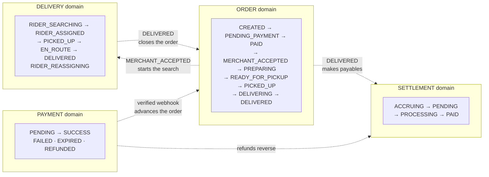
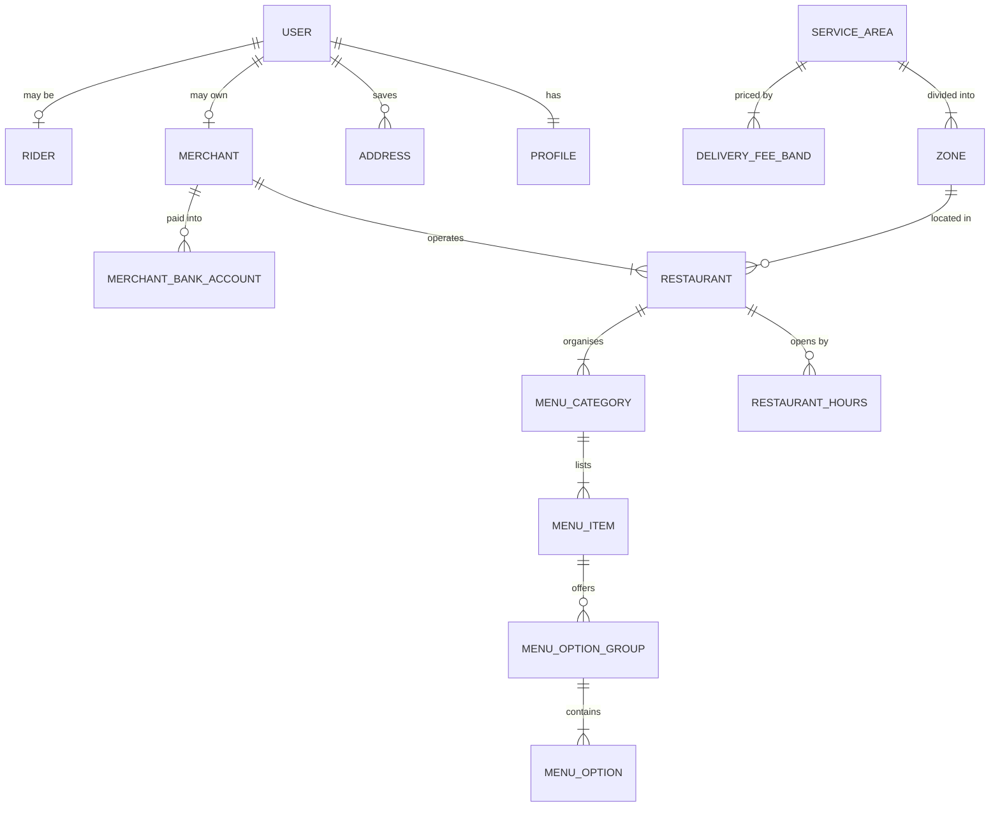
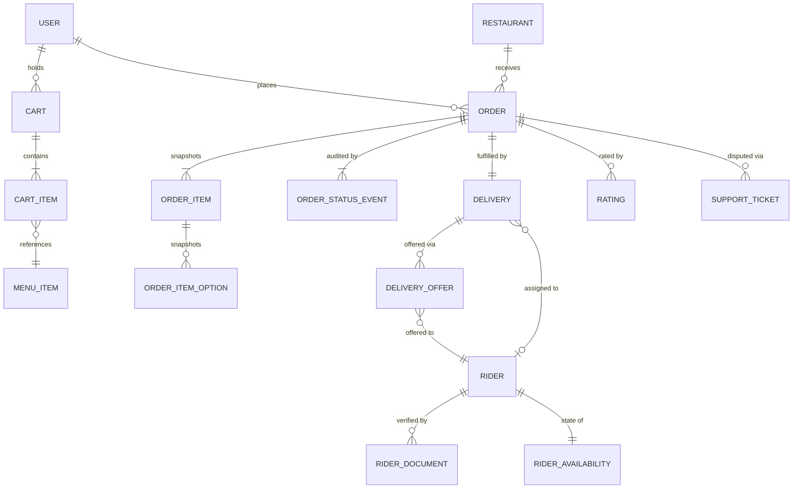
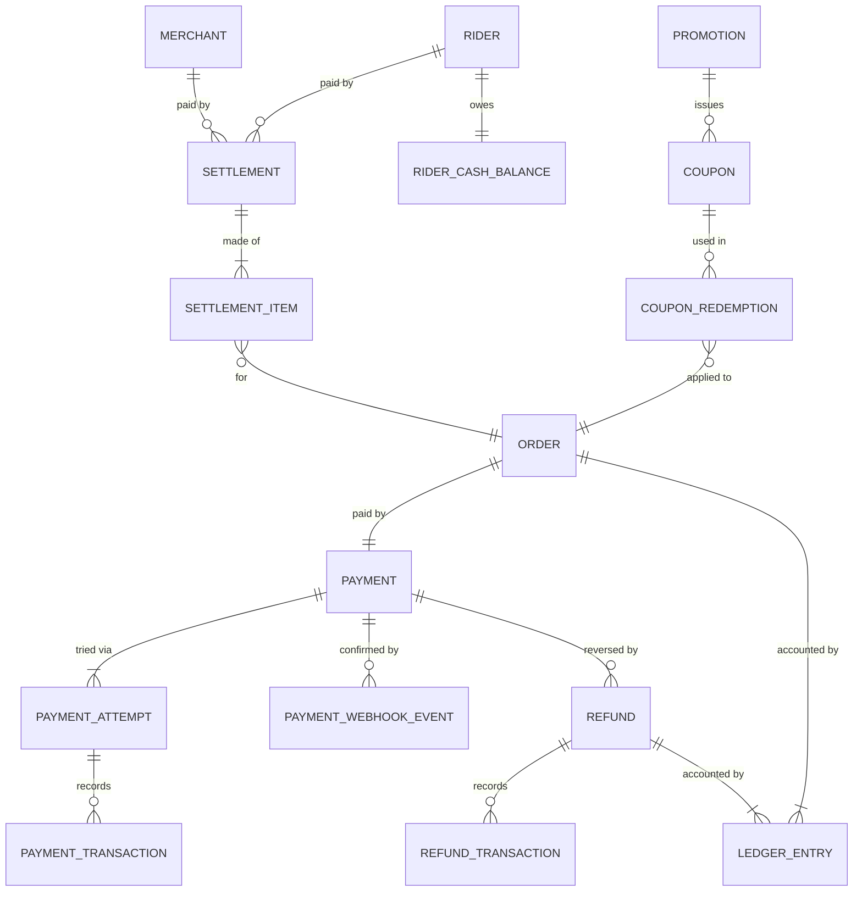

# BANHAO — Domain Model

**The entity shapes remain PROPOSED. The domain boundaries are now ACCEPTED.**
Produced by EVENT-013 (2026-08-10); domain separation locked by **DEC-018** in
EVENT-014 (2026-08-10). **No database schema and no migration may be written
from this document** — DEC-026 and the decision lock are explicit that
implementation has not started.

| Status | Meaning |
|---|---|
| `ACCEPTED` | Approved by the Product Owner (`DEC-NNN`) or accepted product truth (`CON`/`REQ`/design canvas) |
| `PROPOSED` | This analysis's suggestion — entity shapes, field lists, names |
| `OPEN` | Undecided; see `OPEN_BUSINESS_QUESTIONS.md` |
| `LEGAL_REVIEW_REQUIRED` | No agent may conclude this is lawful |

Companion: [`BUSINESS_RULES.md`](BUSINESS_RULES.md) ·
[`ORDER_LIFECYCLE.md`](ORDER_LIFECYCLE.md) ·
[`PAYMENT_LIFECYCLE.md`](PAYMENT_LIFECYCLE.md) ·
[`SETTLEMENT_MODEL.md`](SETTLEMENT_MODEL.md) ·
[`OPEN_BUSINESS_QUESTIONS.md`](OPEN_BUSINESS_QUESTIONS.md)

---

## 1. Modelling principles

| # | Principle | Source |
|---|---|---|
| 1 | **Generic entity names.** Merchant, Product, Order, Delivery, Driver — never `Restaurant`/`Dish` at the core. Food-phase names are aliases, not types. | `ACCEPTED` — DEC-005, REQ-004 |
| 2 | **Order, Payment, Delivery and Settlement are four separate state domains** — never one giant Order status enum. | `ACCEPTED` — **DEC-018**, extending DEC-002 / CON-001 |
| 3 | **Money is integer satang.** No floating point, ever. | `ACCEPTED` — CON-003 |
| 4 | **The ledger is append-only.** Corrections are reversing entries. | `ACCEPTED` — DEC-014 |
| 5 | **Orders snapshot their prices.** An order never recomputes a total from the live catalogue. | `PROPOSED` — required by CON-003 |
| 6 | **Geography is configuration, not code.** `ServiceArea` / `Zone` / bands — Buntharik is a row. | `PROPOSED` — §32 of the Step 4 brief |
| 7 | **Every state change has an actor and a reason.** Especially manual overrides. | `PROPOSED` |
| 8 | One deployable service, module boundaries by discipline. | `ACCEPTED` — DEC-009 |

### Merchant vs Restaurant

`REQ-004` requires generic naming, but the brief also asks for a `Restaurant`
entity. Both are satisfied by separating them:

- **`Merchant`** — the *business and its money*: owner identity, bank account,
  commission terms, settlement balance. Phase-generic.
- **`Restaurant`** — the *Phase-1 storefront profile*: cuisine, hours, service
  radius, rating. In Phase 2 the equivalent profile is a parcel drop-off point;
  in Phase 4 a shop.

One `Merchant` owns one or more `Restaurant`s (the design's approval queue
contains `ไก่ย่างวิเชียร สาขา 2` — branch 2 — so multi-branch is already
implied). Money attaches to `Merchant`; the catalogue attaches to `Restaurant`.

---

## 2. The four state domains

`ACCEPTED` — **DEC-018**. Each domain owns its own states, transitions and
actors. Cross-domain effects are **explicit mappings, never shared fields**.

| Domain | Owns | Canonical states | Decision |
|---|---|---|---|
| **Order** | What the customer bought and where the order is | 9 core states + exceptions | DEC-019 |
| **Payment** | Whether money arrived, and refunds | `PENDING`, `SUCCESS`, `FAILED`, `EXPIRED`, `REFUNDED` (+ retained) | DEC-016, DEC-027…DEC-030 |
| **Delivery** | Rider assignment and physical fulfilment | `RIDER_SEARCHING`, `RIDER_ASSIGNED`, `RIDER_REASSIGNING`, + progression | DEC-020, DEC-021, DEC-022 |
| **Settlement** | Periodic payouts and platform revenue | `ACCRUING → PENDING → PROCESSING → PAID` | DEC-026 |

Three consequences that fall straight out of the separation:

1. **A rider cancelling never cancels the order** (DEC-021) — it is a delivery
   transition, and the order does not move.
2. **A cancelled order can still hold money** until the refund completes
   (DEC-027) — `Order = CANCELLED` with `Payment = REFUND_PENDING` is normal.
3. **No-rider is not an order state** (DEC-022) — it is a prolonged
   `RIDER_SEARCHING` plus an operator alert.

The customer-facing status is derived from the **Order domain alone** (REQ-002).
Delivery detail is operational, not a second status for the customer to read.

---

## 3. Aggregates

An **aggregate root** is the only entity outside code may address directly;
everything inside it changes through it. This is what keeps a modular monolith
modular (DEC-009).

| Aggregate root | Contains | Owning module |
|---|---|---|
| `User` | `Profile` | `users` |
| `Merchant` | `MerchantBankAccount`, staff links | `merchants` |
| `Restaurant` | `RestaurantHours`, `MenuCategory`, `MenuItem`, `MenuOptionGroup`, `MenuOption` | `catalog` |
| `Cart` | `CartItem` | `carts` |
| **`Order`** | `OrderItem`, `OrderItemOption`, `OrderStatusEvent`, address snapshot | `orders` |
| **`Payment`** | `PaymentAttempt`, `PaymentTransaction`, `PaymentWebhookEvent` | `payments` |
| `Refund` | `RefundTransaction` | `refunds` |
| `Delivery` | `DeliveryOffer`, `DeliveryStatusEvent`, proof of delivery | `delivery` |
| `Rider` | `RiderDocument`, `RiderAvailability`, `RiderCashBalance` | `drivers` |
| `Settlement` | `SettlementItem` | `settlements` |
| `LedgerEntry` | — (append-only leaf, written inside the transaction that causes it) | `ledger` |
| `Promotion` | `Coupon`, `CouponRedemption` | `promotions` |
| `Rating` | — | `ratings` |
| `Notification` | — | `notifications` |
| `SupportTicket` | `SupportMessage` | `support` |
| `ServiceArea` | `Zone`, `DeliveryFeeBand` | `geo` |

**Order, Payment and LedgerEntry are the three aggregates that must change
inside one database transaction** when money moves. That single requirement is
the reason DEC-009 chose a monolith.

---

## 4. Entity relationships

### 4.1 Identity, merchant and catalogue

### 4.2 Ordering and delivery

### 4.3 Money

---

## 5. Entity catalogue

Format per entity: **purpose · owner · key fields · relationships · lifecycle ·
security boundary.** Field lists are conceptual — no types, no DDL, no
migrations (§2 of the Step 4 brief).

### 5.1 Identity

#### `User`
- **Purpose** — one human, one login. Backed by Supabase `auth.users`.
- **Owner** — the person. `ACCEPTED`, live.
- **Key fields** — id, phone (E.164), created_at.
- **Relationships** — one `Profile`; optionally one `Merchant` and/or one
  `Rider`; many `Address`, `Order`, `Rating`.
- **Lifecycle** — created on first OTP verification → active → (deletion is
  `OPEN`, BQ-004).
- **Security** — managed entirely by Supabase Auth. **Nothing in application
  code writes it.**

#### `Profile`
- **Purpose** — application-side identity: role and display name.
- **Owner** — the person. `ACCEPTED`, live and RLS-verified.
- **Key fields** — id (= `auth.users.id`), phone (mirror), display_name, role
  (`CUSTOMER` | `MERCHANT` | `RIDER` | `ADMIN`).
- **Lifecycle** — auto-created by trigger on signup, role defaults to
  `CUSTOMER`.
- **Security** — `ACCEPTED` and verified live 14/14: a client may write only
  `display_name`; `id`, `phone` and `role` are immutable to clients; role
  changes go through the service-role-only `set_user_role()`.

#### `Address`
- **Purpose** — where an order goes.
- **Owner** — Customer.
- **Key fields** — label, recipient name, recipient phone, text address,
  landmark, geo point, delivery instructions, zone, is_default.
- **Relationships** — belongs to `User`; **snapshotted onto `Order`**.
- **Lifecycle** — created → edited → soft-deleted (never hard-deleted while an
  order references it).
- **Security** — owner and admin; **the assigned rider may read it only while
  their delivery is active**, and only the fields needed to deliver.
- **Status** — `OPEN` on composition and CRUD: BQ-001, BQ-002.

### 5.2 Merchant and catalogue

#### `Merchant`
- **Purpose** — the business entity that gets paid.
- **Owner** — Merchant; approval state owned by Admin.
- **Key fields** — owner user id, legal/business name, tax id, commission terms,
  lifecycle state, approved_at, approved_by.
- **Relationships** — one or more `Restaurant`; bank accounts; settlements.
- **Lifecycle** — see `BUSINESS_RULES.md` § 3.2 (`PROPOSED`, BQ-006).
- **Security** — merchant reads its own; admin reads all; **commission terms are
  admin-write only**.

#### `Restaurant`
- **Purpose** — the Phase-1 storefront customers browse.
- **Owner** — Merchant.
- **Key fields** — merchant id, display name, cuisine, description, images,
  address + geo point, zone, service radius, minimum order value, average
  preparation minutes, rating aggregate, review count, temporarily_closed,
  temporary_close_reason, reopen_at.
- **Relationships** — hours, menu categories, orders, ratings.
- **Lifecycle** — follows its `Merchant`'s approval, plus its own open/closed
  derivation.
- **Security** — **public read** for active restaurants; merchant write; admin
  override.

#### `RestaurantHours`
- **Purpose** — when the kitchen accepts orders.
- **Key fields** — restaurant id, day of week, opens_at, closes_at (multiple
  rows per day allowed for a lunch/dinner split).
- **Lifecycle** — replaced wholesale when the merchant edits the schedule.
- **Status** — `OPEN`, BQ-007.

#### `MenuCategory` · `MenuItem` · `MenuOptionGroup` · `MenuOption`
- **Purpose** — the catalogue. `MenuItem` is `Product` in Phase-1 clothing.
- **Owner** — Merchant.
- **Key fields** —
  `MenuCategory`: restaurant id, name, sort order.
  `MenuItem`: category id, name, description, base price (satang), image,
  is_available, sort order.
  `MenuOptionGroup`: item id, title, is_required, min_select, max_select.
  `MenuOption`: group id, label, price delta (satang), is_available.
- **Lifecycle** — draft → available → unavailable (sold out) → archived. Items
  referenced by historical orders are **archived, never deleted** — the order
  holds a snapshot regardless.
- **Security** — public read; merchant write.
- **Status** — multi-select and quantity semantics are `OPEN`, BQ-009.

### 5.3 Cart

#### `Cart` · `CartItem`
- **Purpose** — a draft order. **Not a contract**; prices are indicative.
- **Owner** — Customer.
- **Key fields** — `Cart`: user id, restaurant id, updated_at.
  `CartItem`: menu item id, quantity, chosen options, kitchen note, indicative
  unit price.
- **Lifecycle** — created on first add → mutated → converted to an `Order` →
  cleared. Adding an item from a different restaurant clears or blocks the cart,
  with an explicit prompt.
- **Security** — owner only.
- **Status** — **`ACCEPTED` — DEC-017: one cart = one restaurant.** `Cart`
  therefore carries exactly one `restaurant_id`, and the delivery fee has a
  single pickup point to measure from. **Resolves BQ-010.** Revalidation of
  prices and availability at checkout remains `OPEN` (BQ-011). Currently
  client-local in the Customer App, which already behaves this way.

### 5.4 Order

#### `Order` — **aggregate root, BANHAO-owned**
- **Purpose** — the contract. The single source of truth every client reads
  (REQ-002).
- **Owner** — **BANHAO.** Not the customer, not the merchant.
- **Key fields** — order number (customer-visible, e.g. `BH000125`), customer
  id, restaurant id, **order state**, address snapshot, contact snapshot,
  payment method, subtotal, delivery fee, service fee, discount, total (all
  satang), promotion/funder reference, distance at order time, requested/quoted
  ETA, cause code for failures, timestamps per state.
- **Relationships** — one `Payment`, one `Delivery`, many `OrderItem`, many
  `OrderStatusEvent`, zero or more `Rating`, `Refund`, `SupportTicket`.
- **Lifecycle** — `ACCEPTED` — **DEC-019**:
  `CREATED → PENDING_PAYMENT → PAID → MERCHANT_ACCEPTED → PREPARING →
  READY_FOR_PICKUP → PICKED_UP → DELIVERING → DELIVERED`, with `PREPARING` and
  the delivery domain's `RIDER_SEARCHING` running **in parallel**. Full detail
  and the supersession mapping: [`ORDER_LIFECYCLE.md`](ORDER_LIFECYCLE.md).
- **`payment_method`** — an **extensible enum**, not a boolean. Phase 1 permits
  online only; COD must be reintroducible without redesigning this entity
  (**DEC-016**).
- **Security** — **no actor writes `state` directly.** All transitions go
  through the order state machine, which records who caused each one. Read: the
  customer (own), the restaurant's merchant (own shop), the assigned rider
  (limited fields), operator.
- **Never holds a refund status** — `REFUNDED` is a payment state (**DEC-027**).

#### `OrderItem` · `OrderItemOption`
- **Purpose** — the immutable snapshot of what was ordered and what it cost.
- **Key fields** — name at order time, unit price, quantity, chosen option
  labels and their price deltas, kitchen note, line total (satang).
- **Lifecycle** — **written once, never updated.** A change means a new order or
  a refund.
- **Security** — read with the order.

#### `OrderStatusEvent`
- **Purpose** — the audit trail: every transition, who caused it, why.
- **Key fields** — order id, from state, to state, actor type, actor id, reason,
  occurred_at.
- **Lifecycle** — append-only.
- **Security** — admin read; the timeline the customer sees is derived from it.

### 5.5 Delivery and rider

#### `Delivery`
- **Purpose** — the physical fulfilment of an order. Separate from `Order` so
  Phase 3 (Ride) can have a delivery with no merchant.
- **Owner** — BANHAO; operated by the assigned Rider.
- **Key fields** — order id, pickup point, dropoff point, distance, delivery
  state, assigned rider id, assigned_at, picked_up_at, delivered_at, rider
  earning (satang), reassignment count, proof-of-delivery reference, failure
  cause.
- **Lifecycle** — `ACCEPTED` state names — **DEC-020 / DEC-021 / DEC-022**:
  `RIDER_SEARCHING → RIDER_ASSIGNED`, with `RIDER_REASSIGNING → RIDER_SEARCHING`
  when a rider cancels. Search starts when the order reaches
  `MERCHANT_ACCEPTED`; **it has no timeout that cancels anything.** Full detail:
  [`RIDER_LIFECYCLE.md`](RIDER_LIFECYCLE.md) § 4.
- **The delivery's state never cancels the order** (**DEC-021**). A lost rider
  is a delivery event; the order does not move.
- **Security** — assigned rider writes only its own progress transitions; an
  operator may force-unassign (**DEC-032**); customer reads status and, during
  an active delivery, the rider's location and masked contact.

#### `DeliveryOffer`
- **Purpose** — a job offered to a rider. **This is what makes dispatch
  auditable** — without it, "why did nobody take this order?" is unanswerable.
- **Key fields** — delivery id, rider id, offered_at, expires_at, outcome
  (`ACCEPTED` | `DECLINED` | `EXPIRED` | `SUPERSEDED`), round number.
- **Lifecycle** — created by the dispatcher → resolved within the accept window.
  Under **DEC-020** a round is a **broadcast**: one round produces one offer per
  eligible online rider, and the first acceptance wins atomically.
- **Security** — rider sees their own offers; operator sees all.
- **Status** — the dispatch model is `ACCEPTED` (DEC-020); the entity shape is
  `PROPOSED` and the accept-window duration is `OPEN` (BQ-020).

#### `Rider`
- **Purpose** — a delivery partner.
- **Owner** — the person; approval owned by Admin.
- **Key fields** — user id, full name, vehicle type, plate, licence reference,
  lifecycle state, service area, working zone (nullable), rating aggregate,
  approved_at/by.
- **Lifecycle** — [`RIDER_LIFECYCLE.md`](RIDER_LIFECYCLE.md).
- **Security** — self and admin. Documents are admin-read only.

#### `RiderAvailability`
- **Purpose** — can this rider be offered work **right now**.
- **Key fields** — rider id, online/offline, current location, location updated
  at, active delivery count, blocked_reason (e.g. `CASH_LIMIT_REACHED`).
- **Lifecycle** — toggled by the rider; the automatic cash-limit block is
  **dormant in Phase 1** because COD is disabled (**DEC-016**) — no rider holds
  platform cash, so nothing can exceed a limit.
- **Security** — 🔴 **the most privacy-sensitive entity in the system.**
  Continuous location. Retention and access require a lawful basis before
  storage (Q-012). Customers see rider location **only during their own active
  delivery**.

#### `RiderCashBalance` — **dormant in Phase 1**
- **Purpose** — how much platform money the rider is currently holding.
- **Phase 1** — **unused. COD is disabled (DEC-016)**, so no rider ever holds
  cash. Retained because the model must stay extensible and because **DEC-004
  and REQ-001 remain ACCEPTED**: the moment COD returns, collected cash is a
  liability, never income, and must be displayed as a separate number.
- **Key fields** — rider id, outstanding cash (satang), last remittance at.
- **Security** — rider reads own; **written only by the ledger/settlement
  service.**
- **Deferred question** — BQ-023: the documented cash design has the rider
  paying the merchant at pickup, fronting their own money. Unanswered, and it
  returns with COD.

### 5.6 Payment

Detailed in [`PAYMENT_LIFECYCLE.md`](PAYMENT_LIFECYCLE.md); summarised here for
completeness.

| Entity | Purpose | Key point |
|---|---|---|
| `Payment` | One payment intent per order | Holds the canonical payment state (DEC-018 keeps it out of `Order`) |
| `PaymentAttempt` | One try — one QR, one expiry | A regenerated QR is a **new attempt on the same payment**, not a new payment. Attempts retain identity after expiry so a late payment can be resolved (**DEC-029**) |
| `PaymentMethod` | **Extensible enum.** Phase 1: online only; `CASH` retained and disabled | **DEC-016** — COD must not be hard-coded as permanently unsupported |
| `PaymentTransaction` | A movement the provider reports | Immutable. Matched against the order's authoritative value — a surplus is a refund obligation, never extra order value (**DEC-030**) |
| `PaymentWebhookEvent` | Raw inbound webhook + verification result | The **idempotency anchor** (**DEC-028** / REQ-003); stored before processing |
| `Refund` | A refund request against a payment | Own state machine. **`REFUNDED` is never an order status** (**DEC-027**) |
| `RefundTransaction` | A movement executed for a refund | Immutable |

**Owner: BANHAO.** Write access: the payment service only; `SUCCESS` and
`REFUNDED` reachable **only** from a signature-verified webhook (CON-002).
Idempotency keys — `order_id`, `payment_reference`, `idempotency_key` — are
required on every operation (**DEC-028**).

### 5.7 Money and settlement

#### `LedgerEntry`
- **Purpose** — the financial system of record (DEC-014).
- **Key fields** — order id (or settlement id), account
  (`CUSTOMER_PAYMENT`, `MERCHANT_PAYABLE`, `RIDER_PAYABLE`, `PLATFORM_REVENUE`,
  `RIDER_CASH_HELD`, `REFUND_PAYABLE`, `PROMOTION_FUNDING`,
  `PLATFORM_WRITE_OFF`), direction, amount (satang), currency, entry group,
  idempotency key, created_at.
- **Lifecycle** — **append-only.** Never updated, never deleted; a correction is
  a reversing entry.
- **Invariant** — `ACCEPTED` CON-003: the entries for one order sum to exactly
  zero.
- **Security** — written only inside the transaction that causes the money to
  move; read by admin and, in aggregate, by the party concerned.

#### `Settlement` · `SettlementItem`
- **Purpose** — a transfer round (`รอบโอน`) paying a merchant or rider.
  **`ACCEPTED` as a separate financial domain — DEC-026.**
- **Key fields** — payee type and id, period start/end, gross, fees, cash
  netting (dormant in Phase 1), net amount (satang), state, bank account
  reference, executed_at, failure reason.
- **Lifecycle** — `ACCRUING → PENDING → PROCESSING → PAID`, with `FAILED →
  PENDING` on retry. Detail: [`SETTLEMENT_MODEL.md`](SETTLEMENT_MODEL.md).
- **Reads the ledger, not the order table.**
- **Security** — payee reads own; settlement engine and operator write.
- **Status** — ⛔ **IMPLEMENTATION NOT STARTED and blocked.** DEC-026 accepts
  the domain, not the build. Every amount in it is still `OPEN` (DEC-023,
  DEC-024, DEC-025), and Q-002 is `LEGAL_REVIEW_REQUIRED`.

### 5.8 Promotion

#### `Promotion` · `Coupon` · `CouponRedemption`
- **Purpose** — discounts and subsidies.
- **Key fields** — `Promotion`: type (percentage / fixed / delivery subsidy /
  free item), value, **funder (`PLATFORM` | `MERCHANT` | split)**, scope,
  minimum spend, validity window, usage cap, per-customer cap.
  `Coupon`: code (e.g. `BANHAO7`), promotion id, issued-to (nullable).
  `CouponRedemption`: coupon id, order id, customer id, amount applied.
- **Lifecycle** — draft → active → expired/exhausted.
- **Security** — public read while active; owner (platform or merchant) writes.
- **Status** — `OPEN`, BQ-030. **The funder field is not optional**: without it
  the ledger cannot balance a discounted order.

### 5.9 Interaction

#### `Rating`
- Purpose: customer feedback on a restaurant **and, separately, on a rider**.
  Key fields: order id, target type, target id, stars 1–5, tags, created_at,
  edited_at. One rating per target per order. Editable within a window
  (`OPEN`, BQ-036). Aggregates are denormalised onto `Restaurant` and `Rider`.

#### `Notification`
- Purpose: a message delivered to one recipient. Key fields: recipient, type,
  title, body, deep link, channel, read_at, sent_at, delivery status. Read by
  its recipient only. Channel matrix is `OPEN`, BQ-035.

#### `SupportTicket` · `SupportMessage`
- Purpose: a human-handled problem, usually attached to an order. Key fields:
  reporter, order id (nullable), category, state
  (`OPEN → IN_PROGRESS → RESOLVED → CLOSED`), assigned admin, resolution,
  linked refund. Reporter and admin read. `OPEN`, BQ-037.

### 5.10 Geography

#### `ServiceArea` · `Zone` · `DeliveryFeeBand`
- **Purpose** — make expansion configuration rather than a release.
- **Key fields** — `ServiceArea`: name, country, timezone, boundary, is_active.
  `Zone`: service area id, name, boundary. `DeliveryFeeBand`: service area id,
  min km, max km, fee (satang).
- **Launch state** — one service area (อำเภอบุณฑริก, `Asia/Bangkok`), one zone,
  a small band table.
- **Security** — public read of what affects pricing; admin write.
- **Status** — `PROPOSED`; values are `OPEN` (BQ-026).

---

## 6. Phase genericity

`ACCEPTED` — `docs/05-architecture` § 06 SCALING. The same core entities carry
across all four phases; only the display layer and a pricing formula change.

| Core entity | Phase 1 Food | Phase 2 Parcel | Phase 3 Ride | Phase 4 Shopping |
|---|---|---|---|---|
| `Merchant` | Restaurant | Drop-off point | — | Shop / market |
| `Product` (`MenuItem`) | Menu item | Parcel + size | Vehicle type | Item + stock |
| `Order` | Food order | Delivery job | Trip | Purchase order |
| `Delivery` | Shop → home | Origin → destination | Pickup → dropoff | Shop → home |
| `Driver` (`Rider`) | Motorbike rider | Rider / pickup truck | Chauffeur | Rider |

The documented cost of a new phase is exactly three things: a service icon, a
service-specific detail screen, and a pricing formula. Cart, checkout, tracking,
rating, order history and the Driver App are meant to be reused unchanged
**because every screen reads one Order state machine**. Any modelling choice
that breaks that reuse is a modelling error.

Two consequences for this model:

1. `Delivery` must not require a `Restaurant` — Phase 3 has no merchant.
2. Pricing must be a **strategy selected per service**, not a hard-coded food
   formula.

---

## 7. Where the model already exists in code

| Concept | Where | Reality |
|---|---|---|
| `Profile`, roles, RLS | `supabase/migrations/`, live | **Real and verified** — 14/14 live RLS checks |
| `OrderState`, `PaymentState` unions | `apps/customer/src/mocks/types.ts` | ⚠️ **Now diverges from DEC-019.** Encodes the superseded 12 order states (`NEW`, `ACCEPTED`, `READY`, `DRIVER_ASSIGNED`, `COMPLETED`, `NO_DRIVER`) |
| Cash payment UI | `apps/customer` checkout (screen 10) | ⚠️ **Now contradicts DEC-016.** A cash option and cash-prepared-amount selector are live in the app |
| `Shop`, `MenuItem`, `Address`, `CartLine` | same file | Mock shapes for the UI; the file itself notes they belong in `@banhao/types` once a backend contract exists |
| `Satang`, `Money` | `packages/types` | Integer money, in use |
| `PaymentProvider` interface | `apps/api/src/modules/payments/` | Abstraction only; already carries `idempotencyKey` per DEC-028. `NullPaymentProvider` throws by design |
| Everything else | — | **Does not exist** |

**Two known divergences were created by the 2026-08-10 decision lock** (rows
marked ⚠️). No code was changed in that step, deliberately — reconciling the
Customer App with DEC-016 and DEC-019 is follow-up work for an implementation
phase, and it needs the exception state names settled first.

Promoting the mock types into `@banhao/types` is the natural first implementation
step **after** the entity shapes are accepted — not before.

---

## 8. What this model deliberately does not include

| Not modelled | Why |
|---|---|
| **Cash on Delivery** | **Disabled in Phase 1 — DEC-016.** *Modelled but dormant*, never removed: `payment_method` stays extensible, `CASH_PENDING`/`CASH_COLLECTED` and `RiderCashBalance` remain in the model, and DEC-004 / REQ-001 stay ACCEPTED |
| Wallet / stored value | Explicitly out of the launch scope; would raise an e-money question (Q-002) |
| Scheduled or pre-orders | Lengthens the core path — CON-004 |
| Multi-merchant orders | **Excluded by DEC-017** — one cart, one restaurant |
| Loyalty points | Not in the design |
| Chat between customer and rider | The design shows a chat icon, but no chat model is documented; treat as `OPEN` if it is real |
| Inventory / stock counts | Phase 4 concern; `is_available` is enough for food |
| Tips | Not in the design — BQ-029 |
| Driver shift scheduling | Riders go online at will; no shift model documented |

Each omission is a decision, not an oversight. Adding any of them is a new scope
conversation with the Product Owner.
