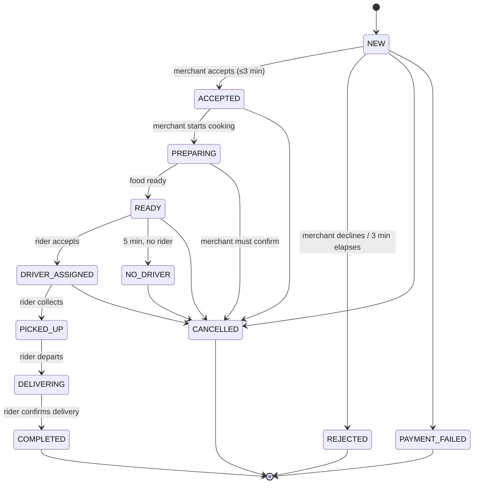
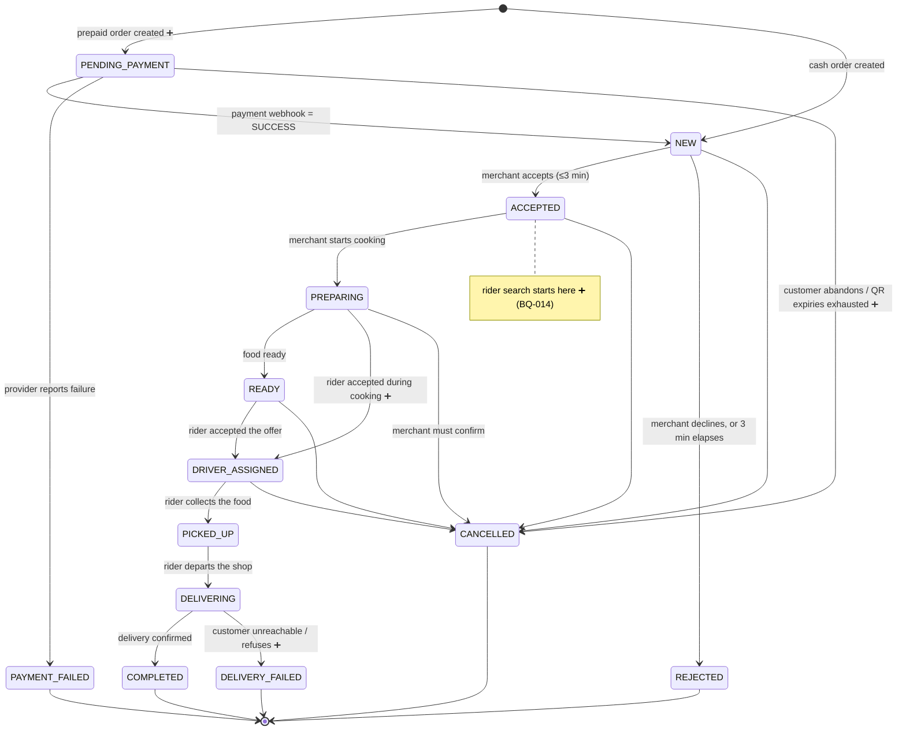

# BANHAO — Order Lifecycle

How an order moves from placed to delivered, and every way it can fail.

Written 2026-08-10 (EVENT-013). Companion:
[`BUSINESS_RULES.md`](BUSINESS_RULES.md) ·
[`PAYMENT_LIFECYCLE.md`](PAYMENT_LIFECYCLE.md) ·
[`RIDER_LIFECYCLE.md`](RIDER_LIFECYCLE.md) ·
[`OPEN_BUSINESS_QUESTIONS.md`](OPEN_BUSINESS_QUESTIONS.md)

---

## Status of this document

| Part | Status |
|---|---|
| The **twelve documented states**, their per-role wording, and their actors | `DOCUMENTED` — accepted product truth from `docs/05-architecture` § 03, restated in `docs/ARCHITECTURE.md`, encoded in `apps/customer/src/mocks/types.ts`. **An agent must not change these.** |
| The **three documented error paths** and the **three documented refund rules** | `DOCUMENTED` |
| **Additional states, transitions, guards, timeouts and cause codes proposed below** | `PROPOSED` — needs Product Owner approval before any implementation |

> Two rules override everything in this document.
> **CON-001** — Order state and Payment state are separate machines. A cancelled
> order still holds money until the refund completes.
> **REQ-002** — every client reads the same state value and only the wording
> differs. No screen computes its own status.

---

## 1. The documented state machine

`DOCUMENTED`. Wording per role is part of the contract between design and
backend, not decoration.

| State | Customer sees | Rider sees | Merchant sees | Changed by |
|---|---|---|---|---|
| `NEW` | ส่งออเดอร์ให้ร้านแล้ว | — | ออเดอร์ใหม่ · กดรับใน 3 นาที | System |
| `ACCEPTED` | ร้านรับออเดอร์แล้ว | — | รับแล้ว รอเริ่มทำ | Merchant |
| `PREPARING` | ร้านกำลังเตรียมอาหาร | งานถูกจับคู่ · ไปที่ร้าน | กำลังทำ | Merchant |
| `READY` | อาหารพร้อมแล้ว | อาหารพร้อม · รับได้เลย | รอไรเดอร์ | Merchant |
| `DRIVER_ASSIGNED` | ไรเดอร์กำลังไปรับอาหาร | กำลังไปที่ร้าน | ไรเดอร์กำลังมา | System |
| `PICKED_UP` | ไรเดอร์รับอาหารแล้ว | รับแล้ว · ไปส่งลูกค้า | ส่งออกจากร้านแล้ว | Rider |
| `DELIVERING` | อาหารกำลังเดินทางมาหาคุณ | กำลังไปหาลูกค้า | — | Rider |
| `COMPLETED` | ส่งสำเร็จ · ให้คะแนนหน่อย | งานเสร็จ · ได้ ฿38 | เสร็จสิ้น | Rider |
| `NO_DRIVER` | ยังหาไรเดอร์ไม่ได้ | — | ยังไม่มีไรเดอร์รับ | System (5 min) |
| `PAYMENT_FAILED` | ชำระเงินไม่สำเร็จ | — | — | Payment system |
| `REJECTED` | ร้านไม่สามารถรับออเดอร์ได้ | — | ปฏิเสธแล้ว | Merchant |
| `CANCELLED` | ออเดอร์ถูกยกเลิก · คืนเงินแล้ว | งานถูกยกเลิก | ยกเลิก | Customer / Admin |

**Documented error paths:** `NEW → REJECTED` (merchant declines within 3
minutes) · `READY → NO_DRIVER` (no rider found within 5 minutes) · any state
before `PICKED_UP` → `CANCELLED` by the customer · `PAYMENT_FAILED` can occur
only while PromptPay is unconfirmed.

**Documented refund rules:** cancel before `PREPARING` → automatic full refund ·
cancel during `PREPARING` → requires merchant confirmation · after `PICKED_UP` →
cannot cancel, must go through the support centre.

---

## 2. Three gaps in the documented machine

These are not opinions — each is a contradiction or an omission inside accepted
documents.

### Gap 1 — `PENDING_PAYMENT` is referenced but does not exist

**BQ-012, P0.** The Payment State Machine pairs five payment states with an
Order state called **`PENDING_PAYMENT`**, which is not one of the twelve. So an
order awaiting a PromptPay transfer is currently in no nameable state — and
REQ-002 says every client must read a canonical state value.

The design also requires the unpaid order to **survive**:
- *"ปิดแอประหว่างรอ QR → Payment ยังอยู่ในสถานะ PENDING จนหมดอายุ … เปิดแอปกลับมา
  เจอ QR เดิมพร้อมเวลาที่เหลือ"*
- *"QR หมดอายุ → Payment = EXPIRED แต่ Order ยังอยู่ ไม่สร้างออเดอร์ใหม่"*

An order must therefore exist before payment succeeds. `PROPOSED` resolution:
add `PENDING_PAYMENT` as the initial state for prepaid orders, making `NEW`
mean specifically *"the merchant has it"*.

### Gap 2 — `NO_DRIVER` contradicts the Customer App

**BQ-014, P0.** The state machine puts `NO_DRIVER` after `READY` — the food is
cooked. The Customer App's no-rider screen says
*"อาหารของคุณยังไม่ถูกปรุง หากยกเลิกตอนนี้จะได้เงินคืนเต็มจำนวน"* — your food has
**not** been cooked, cancel now for a full refund.

Both cannot be true, and the difference decides who pays for the food (BQ-015).
Supporting evidence for the app's version: the state table's own `PREPARING` row
already shows the rider seeing `งานถูกจับคู่ · ไปที่ร้าน` — matched **while the
merchant is still cooking**.

`PROPOSED` resolution: **dispatch begins at `ACCEPTED`**, in parallel with
cooking, and `NO_DRIVER` becomes a **transient flag on a still-searching order**
rather than a state the order rests in. That also removes the odd `NO_DRIVER →`
dead end from the diagram above.

### Gap 3 — no state for a failed delivery

**BQ-017, P1.** The payment canvas already handles a customer refusing a cash
order (`ลูกค้าเงินสดไม่รับของ → บันทึกเป็นออเดอร์เสียหาย`), and the Driver App
has a `ลูกค้าจ่ายไม่ครบ / มีปัญหา` escape — but the order has nowhere to land.
Reusing `CANCELLED` would erase the distinction the ledger needs: a cancellation
and a failed delivery have different money outcomes and different rider
compensation.

`PROPOSED` resolution: add `DELIVERY_FAILED` as a terminal state with a cause
code.

---

## 3. The proposed state machine

**STATUS: PROPOSED.** Additions are marked ➕. Everything unmarked is
`DOCUMENTED` and unchanged.

`NO_DRIVER` is deliberately absent from the diagram: under the proposal it is a
**searching flag** on `ACCEPTED`/`PREPARING`/`READY`, surfaced to clients as the
documented `NO_DRIVER` display state so no client wording changes. If the
Product Owner prefers to keep it a real state, it stays exactly where the
documented machine puts it — that is BQ-014.

---

## 4. Transition table

`PROPOSED` detail over `DOCUMENTED` transitions. "Guard" is what must be true
before the transition may occur; "effects" are what else must happen inside the
same database transaction.

| # | From → To | Trigger | Actor | Guard | Effects |
|---|---|---|---|---|---|
| 1 | — → `PENDING_PAYMENT` ➕ | Customer confirms a prepaid order | Customer | Cart valid; merchant accepting orders; address in area | Snapshot prices; create `Payment` (`CREATED`) |
| 2 | — → `NEW` | Customer confirms a cash order | Customer | as above | Snapshot prices; create `Payment` (`CASH_PENDING`); alert merchant |
| 3 | `PENDING_PAYMENT` → `NEW` | Verified webhook, payment `SUCCESS` | **Webhook only** (CON-002) | Signature valid; amount and order match | Ledger entries; alert merchant; notify customer |
| 4 | `PENDING_PAYMENT` → `PAYMENT_FAILED` | Provider reports failure | Payment system | — | Notify customer; offer retry or method change |
| 5 | `PENDING_PAYMENT` → `CANCELLED` ➕ | Customer abandons, or QR attempts exhausted | Customer / System | No successful payment exists | Release nothing (no money moved) |
| 6 | `NEW` → `ACCEPTED` | Merchant accepts | Merchant | Within 3 min; merchant still open | **Start rider search** ➕; notify customer |
| 7 | `NEW` → `REJECTED` | Merchant declines or 3 min elapses | Merchant / System | — | Auto-refund if prepaid; notify; suggest nearby shops |
| 8 | `ACCEPTED` → `PREPARING` | Merchant starts cooking | Merchant | — | Notify customer |
| 9 | `PREPARING` → `READY` | Merchant marks food ready | Merchant | — | Escalate rider search priority ➕ |
| 10 | `ACCEPTED`/`PREPARING`/`READY` → `DRIVER_ASSIGNED` | A rider accepts the offer | System | Rider online, not cash-blocked, within capacity | Bind `Delivery`; notify all three parties |
| 11 | `DRIVER_ASSIGNED` → `PICKED_UP` | Rider confirms collection | Rider | Rider is the assigned one; food `READY` | Cash orders: record merchant hand-off per BQ-023 |
| 12 | `PICKED_UP` → `DELIVERING` | Rider departs | Rider | — | Start customer-visible tracking |
| 13 | `DELIVERING` → `COMPLETED` | Delivery confirmed (+ proof, BQ-018) | Rider | Cash: collection confirmed first | Ledger settles; rider earning recorded; cash becomes rider liability; prompt rating |
| 14 | `DELIVERING` → `DELIVERY_FAILED` ➕ | Customer unreachable or refuses | Rider (+ admin review) | Wait rule satisfied | Cause code; cost allocation per BQ-015; no cash collected |
| 15 | any pre-`PICKED_UP` → `CANCELLED` | Customer cancels | Customer | `PREPARING` requires merchant confirmation | Refund per rules; unassign rider; compensate rider (BQ-024) |
| 16 | any pre-`COMPLETED` → `CANCELLED` | Admin cancels | Admin | Reason mandatory | Full audit record; refund; compensation |

Transitions not in this table are **forbidden**. In particular: no transition
skips backwards, and nothing re-enters a terminal state.

---

## 5. Timeouts

| Timer | Value | On expiry | Status |
|---|---|---|---|
| Merchant accept window | **3 minutes** | `REJECTED` (+ admin alert at ~90 s proposed) | Value `DOCUMENTED`; behaviour `OPEN` — BQ-013 |
| Rider search | **5 minutes** | `NO_DRIVER` surfaced to the customer | Value `DOCUMENTED`; semantics `OPEN` — BQ-014 |
| Customer "keep waiting" extension | **3 minutes** | Return to the choice, or cancel | `DOCUMENTED` (Customer App copy) |
| Rider accept window per offer | 20 s (title) vs 12 s (button) | Offer expires, next round | **Contradictory in the design** — BQ-020 |
| PromptPay QR validity | **10 minutes** | Payment `EXPIRED`; **order survives** | `DOCUMENTED` |
| Webhook wait before reconciliation | **10 minutes** | Flagged for admin reconciliation | `DOCUMENTED` (`P-A2`) |
| Rider wait at customer before failing | Not specified | — | `OPEN` — BQ-017 |

All timers must be **configuration**, not constants — they are exactly the
values that will be tuned against real Buntharik data.

---

## 6. Cancellation matrix

`PROPOSED`, derived from the three documented refund rules.

| Order state | Customer | Merchant | Rider | Admin | Refund (prepaid) |
|---|---|---|---|---|---|
| `PENDING_PAYMENT` ➕ | ✅ free | — | — | ✅ | Nothing paid |
| `NEW` | ✅ free | ✅ (= `REJECTED`) | — | ✅ | Full, automatic |
| `ACCEPTED` | ✅ free | ⚠️ counts as merchant fault | — | ✅ | Full, automatic |
| `PREPARING` | ⚠️ merchant must confirm | ⚠️ merchant fault | — | ✅ | Full if confirmed; otherwise `OPEN` (BQ-016) |
| `READY` | ⚠️ merchant must confirm | ❌ | — | ✅ | Food is cooked — cost allocation `OPEN` (BQ-015) |
| `DRIVER_ASSIGNED` | ⚠️ | ❌ | ⚠️ unassign, not cancel | ✅ | As `READY`, plus rider compensation (BQ-024) |
| `PICKED_UP` onwards | ❌ support centre only | ❌ | ❌ | ✅ | `OPEN` — BQ-016 |
| `COMPLETED` | ❌ | ❌ | ❌ | ✅ refund only | Partial refund path — BQ-031 |

✅ allowed · ⚠️ conditional · ❌ not allowed

---

## 7. Cause codes

`PROPOSED`. Every terminal failure carries one. This is what lets the ledger
allocate cost (BQ-015) and lets ops answer "why did this fail?" without reading
a timeline.

| Code | Applies to | Fault |
|---|---|---|
| `CUSTOMER_CANCELLED` | `CANCELLED` | Customer |
| `CUSTOMER_UNREACHABLE` | `DELIVERY_FAILED` | Customer |
| `CUSTOMER_REFUSED` | `DELIVERY_FAILED` | Customer |
| `MERCHANT_REJECTED` | `REJECTED` | Merchant |
| `MERCHANT_TIMEOUT` | `REJECTED` | Merchant |
| `MERCHANT_CANCELLED_LATE` | `CANCELLED` | Merchant |
| `MERCHANT_CLOSED` | `REJECTED` | Merchant |
| `ITEM_UNAVAILABLE` | `REJECTED` / partial refund | Merchant |
| `NO_RIDER` | `CANCELLED` | **Platform** |
| `RIDER_CANCELLED` | reassignment, or `CANCELLED` if exhausted | Rider → platform |
| `PAYMENT_EXPIRED` | `CANCELLED` | Customer / none |
| `PAYMENT_FAILED` | `PAYMENT_FAILED` | Provider |
| `ADMIN_CANCELLED` | `CANCELLED` | Platform (reason mandatory) |
| `FORCE_MAJEURE` | any | None — write-off |

---

## 8. Order state × Payment state

`DOCUMENTED` pairings from the payment canvas, plus the `PENDING_PAYMENT`
proposal. **The two columns move independently** — that is the whole point of
CON-001.

| Payment state | Valid order states | Note |
|---|---|---|
| `CREATED` | `PENDING_PAYMENT` ➕ | Payment record exists, no QR yet |
| `PENDING` | `PENDING_PAYMENT` ➕ | QR shown, counting down |
| `PROCESSING` | `PENDING_PAYMENT` ➕ | Customer says paid; awaiting webhook. **Never show success here** |
| `SUCCESS` | `NEW` … `COMPLETED` | Webhook only (CON-002) |
| `FAILED` | `PENDING_PAYMENT` ➕ / `PAYMENT_FAILED` | Retry allowed |
| `EXPIRED` | `PENDING_PAYMENT` ➕ | **Order survives**; new QR = new attempt |
| `CANCELLED` | `CANCELLED` | No money moved |
| `REFUND_PENDING` | `CANCELLED`, `DELIVERY_FAILED` ➕, `COMPLETED` (partial) | Money still with the platform |
| `REFUND_PROCESSING` | same | Bank in progress |
| `REFUNDED` | same | Webhook only |
| `CASH_PENDING` | `NEW` … `DELIVERING` | Cash order in flight |
| `CASH_COLLECTED` | `COMPLETED` | Rider confirmed collection |

The essential consequence, quoted from the source: a cancelled order still has
money in the system until the refund completes. `CANCELLED` + `REFUND_PENDING`
is a normal, common combination — not an inconsistency.

---

## 9. What each client shows

`DOCUMENTED` — REQ-002. All four surfaces read the same value. The Customer App
already implements this: its `OrderState` union in
`apps/customer/src/mocks/types.ts` is exactly the twelve documented values, and
its tracking screen renders the timeline
`ร้านรับออเดอร์ · ทำอาหาร · ไรเดอร์รับ · กำลังส่ง · ถึงแล้ว` from state alone.

Rules that follow, and that a reviewer should check every PR against:

1. No screen may derive status from a timestamp, a payment result, or a rider's
   position.
2. Per-role wording differences are presentation. They never become extra
   states.
3. Adding a state means updating **all four** clients and the shared types
   package — which is exactly why `@banhao/types` exists (DEC-013).

---

## 10. Worked failure scenarios

`PROPOSED` outcomes — each depends on an open decision, named inline.

**A. Merchant never responds (prepaid).** 3 min elapses → `REJECTED`
(`MERCHANT_TIMEOUT`) → automatic full refund → customer sees nearby suggestions.
Money: payment refunded; no merchant payable; platform keeps nothing.
*Blocked by:* BQ-013 (auto vs escalate), Q-020 (how a PromptPay refund actually
happens).

**B. No rider, food already cooked.** Search from `ACCEPTED` → 5 min → customer
told → offered 3 more minutes → admin alerted for manual dispatch → if exhausted
and the customer cancels: order `CANCELLED` (`NO_RIDER`), customer refunded in
full, **merchant still paid** (the platform's failure, not theirs), platform
books `PLATFORM_WRITE_OFF`.
*Blocked by:* BQ-014, BQ-015, BQ-025.

**C. Customer not home, prepaid.** Rider waits the defined period, calls twice →
`DELIVERY_FAILED` (`CUSTOMER_UNREACHABLE`) → rider **is** paid, merchant **is**
paid, customer refund is `OPEN`.
*Blocked by:* BQ-017, BQ-015.

**D. Customer refuses a cash order.** Documented: no money collected, no refund
needed, recorded as `ออเดอร์เสียหาย` for admin review. The rider has already
paid the merchant at pickup under the current design (BQ-023), so **the rider is
out of pocket** unless compensated.
*Blocked by:* BQ-023, BQ-015, BQ-024.

**E. Duplicate PromptPay transfer.** Documented: the same payment reference is
reused, no second payment record is created, and the customer sees
*"ออเดอร์นี้ชำระเงินแล้ว"* (screen 12f) with the promise that a double transfer
is refunded automatically. That promise is only keepable once Q-020 is answered.
*Blocked by:* Q-020.

**F. Merchant cancels after payment.** Documented: refund created automatically,
Order = `CANCELLED`, Payment = `REFUND_PENDING`, customer sees a reference and
an expected date.
*Blocked by:* Q-020, BQ-015.

---

## 11. Open questions owned by this document

**P0:** BQ-012 (`PENDING_PAYMENT`) · BQ-014 (`NO_DRIVER` semantics) ·
BQ-015 (who pays for wasted food)
**P1:** BQ-013 (accept timeout) · BQ-016 (cancellation policy, extends Q-003) ·
BQ-017 (delivery failure) · BQ-018 (proof of delivery)

No transition in this document may be implemented while the question that
governs it is `OPEN`.
