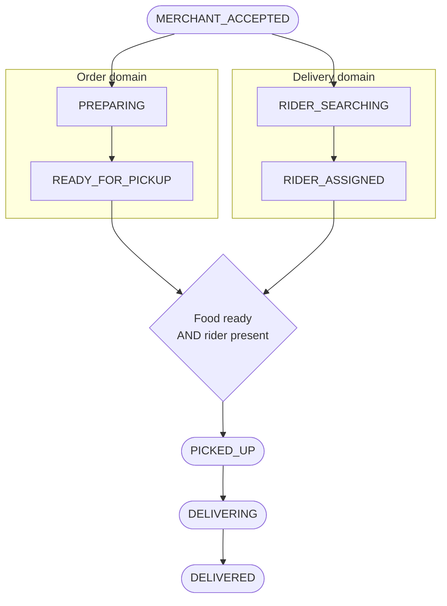
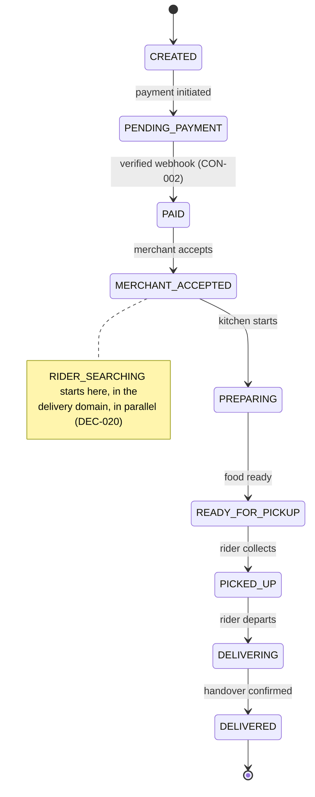
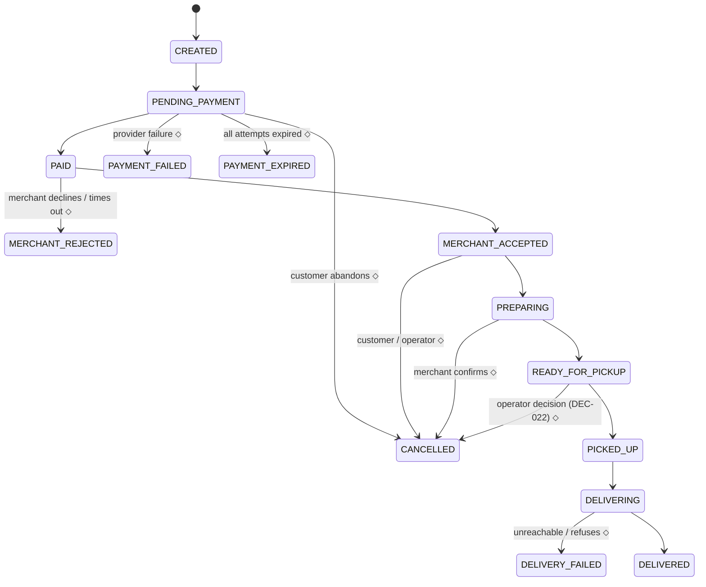

# BANHAO — Order Lifecycle

How an order moves from placed to delivered, and every way it can fail.

Written 2026-08-10 (EVENT-013), locked to the approved decisions 2026-08-10
(EVENT-014). Companion: [`BUSINESS_RULES.md`](BUSINESS_RULES.md) ·
[`PAYMENT_LIFECYCLE.md`](PAYMENT_LIFECYCLE.md) ·
[`RIDER_LIFECYCLE.md`](RIDER_LIFECYCLE.md) ·
[`SETTLEMENT_MODEL.md`](SETTLEMENT_MODEL.md) ·
[`OPEN_BUSINESS_QUESTIONS.md`](OPEN_BUSINESS_QUESTIONS.md)

---

## Status legend

| Status | Meaning | May an agent build on it? |
|---|---|---|
| `ACCEPTED` | Approved by the Product Owner (a `DEC-NNN`) or accepted product truth (`CON`/`REQ`/design canvas) | **Yes** |
| `PROPOSED` | Analysis awaiting approval | No |
| `OPEN` | Undecided — see `OPEN_BUSINESS_QUESTIONS.md` | No. Do not guess |

> Rules that override everything below.
> **DEC-018 / CON-001** — Order, Payment, Delivery and Settlement are four
> separate state domains. Never a single mega-enum.
> **REQ-002** — every client reads the same Order state value; only the wording
> differs. No screen computes its own status.

---

## 1. The approved core lifecycle

`ACCEPTED` — **DEC-019**, Product Owner, 2026-08-10.

```
CREATED → PENDING_PAYMENT → PAID → MERCHANT_ACCEPTED → PREPARING
        → READY_FOR_PICKUP → PICKED_UP → DELIVERING → DELIVERED
```

| State | Meaning | Changed by |
|---|---|---|
| `CREATED` | Order exists; prices snapshotted; payment not yet initiated | System |
| `PENDING_PAYMENT` | Awaiting the customer's online payment | System / waiting on user |
| `PAID` | Payment confirmed by a verified webhook (CON-002). Sent to the merchant | **Webhook only** |
| `MERCHANT_ACCEPTED` | Merchant accepted. **Rider search starts here** (DEC-020) | Merchant |
| `PREPARING` | Kitchen is cooking. Runs **in parallel** with `RIDER_SEARCHING` | Merchant |
| `READY_FOR_PICKUP` | Food is ready | Merchant |
| `PICKED_UP` | Rider has collected the food | Rider |
| `DELIVERING` | En route to the customer | Rider |
| `DELIVERED` | Handed over. Terminal success | Rider |

### The parallel branch

`ACCEPTED` — **DEC-019**. After `MERCHANT_ACCEPTED`, two processes run at the
same time in two different domains. **The restaurant never waits for a rider
before starting to cook.**



`PICKED_UP` is the **join point**: it requires both `READY_FOR_PICKUP` in the
order domain and an assigned rider in the delivery domain. Either may arrive
first, and neither blocks the other.



### What this supersedes

**DEC-019 replaces the Order State Machine documented on 2026-08-09.** The
mapping, recorded so nothing is lost:

| Old (design canvas, FACT-005) | New (DEC-019) | Note |
|---|---|---|
| `NEW` | `PAID` → `MERCHANT_ACCEPTED` | The old `NEW` conflated "paid" with "merchant has it" |
| — | `CREATED`, `PENDING_PAYMENT` | New. **Resolves BQ-012** — the payment machine referenced `PENDING_PAYMENT` while the order machine lacked it |
| `ACCEPTED` | `MERCHANT_ACCEPTED` | Renamed; also unambiguous against the `ACCEPTED` status token |
| `PREPARING` | `PREPARING` | Unchanged, but now parallel with rider search |
| `READY` | `READY_FOR_PICKUP` | Renamed |
| `DRIVER_ASSIGNED` | *(delivery domain)* `RIDER_ASSIGNED` | **Moved out of the order domain** — DEC-018 |
| `PICKED_UP`, `DELIVERING` | unchanged | |
| `COMPLETED` | `DELIVERED` | Renamed |
| `NO_DRIVER` | *(delivery domain)* prolonged `RIDER_SEARCHING` | **No longer an Order state** — DEC-022. **Resolves BQ-014** |
| `PAYMENT_FAILED`, `REJECTED`, `CANCELLED` | exception states, § 3 | Names not yet approved |

**FACT-005 remains VERIFIED as a statement about the 2026-08-09 design
artifact.** It is no longer the canonical machine.

⚠️ **The Customer App encodes the old twelve values** in
`apps/customer/src/mocks/types.ts` and renders its tracking timeline from them.
That code now diverges from the approved lifecycle and will need updating. **No
code was changed in this step.**

---

## 2. Order state × Payment state

`ACCEPTED` — DEC-018 / CON-001. The two columns move **independently**.

| Order state | Typical Payment state | Note |
|---|---|---|
| `CREATED` | `CREATED` | Nothing charged |
| `PENDING_PAYMENT` | `PENDING` · `PROCESSING` · `FAILED` · `EXPIRED` | Order survives a failed or expired attempt. A new QR is a **new attempt on the same payment** |
| `PAID` … `DELIVERED` | `SUCCESS` | Money received |
| `CANCELLED` | `SUCCESS` → `REFUND_PENDING` → `REFUNDED` | **DEC-027** — a cancelled order still holds money until the refund completes. This pairing is normal, not an inconsistency |

**`REFUNDED` is never an Order state** (DEC-027). A refunded, cancelled order is
`Order = CANCELLED` **and** `Payment = REFUNDED`.

Because COD is disabled in Phase 1 (**DEC-016**), the payment states
`CASH_PENDING` and `CASH_COLLECTED` are unreachable. They remain in the model
for the phase that reintroduces COD.

---

## 3. Exception paths

The **policies** below are `ACCEPTED` where marked. The **state names** for
exceptions were not part of the DEC-019 approval and remain `PROPOSED`.



⬦ = state name `PROPOSED`.

| Situation | Policy | Status |
|---|---|---|
| **Payment failure** | Order stays alive in `PENDING_PAYMENT`; the customer may retry or change method | `ACCEPTED` — DEC-019 (the state exists), design canvas |
| **Payment expiration** | QR expires after 10 minutes; **the order survives**; a new QR is a new attempt | `ACCEPTED` — design canvas |
| **Late payment** | Must be resolvable to an order and attempt; accept / refund / manual review | `ACCEPTED` technically — DEC-029; **`OPEN`** for the policy |
| **Merchant rejection** | 3-minute accept window; on rejection notify the customer, refund, suggest nearby shops | Window and flow `ACCEPTED` (design canvas); auto-reject-vs-escalate `OPEN` — BQ-013 |
| **Customer cancellation** | Free before `PREPARING`; merchant confirmation during `PREPARING`; support-only after `PICKED_UP` | `ACCEPTED` — design canvas. Fees and post-pickup outcomes `OPEN` — Q-003, BQ-016 |
| **Rider cancellation** | Delivery reassigns; **the order is not cancelled** | `ACCEPTED` — **DEC-021** |
| **No rider** | Retry → manual dispatch → operator decision. **Never auto-cancel** | `ACCEPTED` — **DEC-022** |
| **Delivery failure** | Rider escalates; order does not silently complete | `PROPOSED` — BQ-017 |
| **Cost of wasted food** | Who pays when a cooked order fails | **`OPEN` — BQ-015** |

### No-rider, in the order domain

`ACCEPTED` — **DEC-022**. From the order's point of view, no-rider is **not a
state**. The order sits in `PREPARING` or `READY_FOR_PICKUP` while the delivery
domain keeps searching. Only an **operator decision** can end it, and cancelling
is one option among several — see [`RIDER_LIFECYCLE.md`](RIDER_LIFECYCLE.md) § 7.

The customer must still be told rather than left in silence; the existing
5-minute notification with a 3-minute extension offer remains valid.

---

## 4. Timeouts

| Timer | Value | Status |
|---|---|---|
| Merchant accept window | 3 minutes | `ACCEPTED` (value) · behaviour at expiry `OPEN` — BQ-013 |
| PromptPay QR validity | 10 minutes | `ACCEPTED` |
| Webhook wait before reconciliation | 10 minutes | `ACCEPTED` |
| Customer no-rider notification | 5 minutes | `ACCEPTED` |
| Customer "keep waiting" extension | 3 minutes | `ACCEPTED` |
| Rider accept window per offer | 20 s (title) vs 12 s (button) — contradictory | **`OPEN` — BQ-020** |
| Rider search retry interval / escalation | — | **`OPEN`** — DEC-022 sets the shape, not the timings |
| Rider wait at customer before failing | — | **`OPEN` — BQ-017** |

All timers must be **configuration**, not constants (DEC-031).

---

## 5. Cancellation matrix

`PROPOSED` except where a DEC is cited.

| Order state | Customer | Merchant | Rider | Operator | Payment outcome |
|---|---|---|---|---|---|
| `CREATED`, `PENDING_PAYMENT` | ✅ free | — | — | ✅ | Nothing charged |
| `PAID` | ✅ free | ✅ (rejection) | — | ✅ | Full refund |
| `MERCHANT_ACCEPTED` | ✅ free | ⚠️ merchant fault | — | ✅ | Full refund |
| `PREPARING` | ⚠️ merchant confirms | ⚠️ merchant fault | ❌ **DEC-021** | ✅ | Full if confirmed; otherwise `OPEN` |
| `READY_FOR_PICKUP` | ⚠️ merchant confirms | ❌ | ❌ **DEC-021** | ✅ **DEC-022** | Food cooked — cost allocation **`OPEN`, BQ-015** |
| `PICKED_UP` onward | ❌ support only | ❌ | ❌ | ✅ | `OPEN` — BQ-016 |
| `DELIVERED` | ❌ | ❌ | ❌ | ✅ refund only | Partial refund — BQ-031 |

✅ allowed · ⚠️ conditional · ❌ not allowed

**A rider can never cancel the order** — DEC-021. A rider abandoning a job
returns the *delivery* to `RIDER_SEARCHING`.

---

## 6. Cause codes

`PROPOSED`. Every terminal failure carries one, so the ledger can allocate cost
(BQ-015) and operations can answer "why?" without reading a timeline.

| Code | Terminal state | Fault |
|---|---|---|
| `CUSTOMER_CANCELLED` | `CANCELLED` | Customer |
| `CUSTOMER_UNREACHABLE` | `DELIVERY_FAILED` | Customer |
| `CUSTOMER_REFUSED` | `DELIVERY_FAILED` | Customer |
| `MERCHANT_REJECTED` / `MERCHANT_TIMEOUT` | `MERCHANT_REJECTED` | Merchant |
| `MERCHANT_CANCELLED_LATE` | `CANCELLED` | Merchant |
| `ITEM_UNAVAILABLE` | rejection or partial refund | Merchant |
| `NO_RIDER_OPERATOR_CANCELLED` | `CANCELLED` | **Platform** — DEC-022 |
| `PAYMENT_EXPIRED` | `PAYMENT_EXPIRED` | None |
| `PAYMENT_FAILED` | `PAYMENT_FAILED` | Provider |
| `OPERATOR_CANCELLED` | `CANCELLED` | Platform — reason mandatory (DEC-032) |

Note there is **no `RIDER_CANCELLED` order cause code**: DEC-021 makes rider
cancellation a delivery event, never an order outcome.

---

## 7. Worked scenarios

**A. Happy path.** `CREATED` → `PENDING_PAYMENT` → webhook → `PAID` → merchant
accepts → `MERCHANT_ACCEPTED` (**rider search begins**) → `PREPARING` ∥
`RIDER_SEARCHING` → rider accepts → `RIDER_ASSIGNED` → `READY_FOR_PICKUP` →
`PICKED_UP` → `DELIVERING` → `DELIVERED`.

**B. Rider accepts, then cancels.** Delivery goes `RIDER_ASSIGNED` →
`RIDER_REASSIGNING` → `RIDER_SEARCHING` → broadcast. **The order does not
move** — it stays in `PREPARING` or `READY_FOR_PICKUP` (DEC-021). Rider
compensation is `OPEN` (BQ-024).

**C. No rider found.** Search continues past the customer notification; an
operator is alerted and chooses: keep searching, merchant delivery, or cancel +
refund (DEC-022). Only the last moves the order, to `CANCELLED`. **Who pays for
the cooked food is `OPEN` (BQ-015).**

**D. Merchant never responds.** 3 minutes elapse → rejection → refund → nearby
suggestions. Auto vs escalate is `OPEN` (BQ-013); the refund **mechanism** is
`OPEN` (Q-020).

**E. Customer pays twice.** The order's value stays at the expected amount
(**DEC-030**); the surplus becomes a refund obligation handled in the payment
domain. Mechanism blocked on Q-020.

**F. Payment arrives after expiry.** The system must identify the order and the
attempt (**DEC-029**), then accept, refund or queue for review — which of those
is `OPEN`.

---

## 8. Open questions owned by this document

**Resolved by this lock:** BQ-012 (`PENDING_PAYMENT` — DEC-019) · BQ-014
(`NO_DRIVER` contradiction — DEC-019, DEC-022) · BQ-010 (one cart, one
restaurant — DEC-017).

**Still `OPEN`:** BQ-013 (merchant accept timeout behaviour) · BQ-015 (**who
bears the cost of wasted food** — P0) · BQ-016 / Q-003 (full cancellation and
refund policy) · BQ-017 (delivery failure) · BQ-018 (proof of delivery) ·
BQ-011 (cart revalidation) · exception **state names**.

No exception-path code may be written while the policy governing it is `OPEN`.
