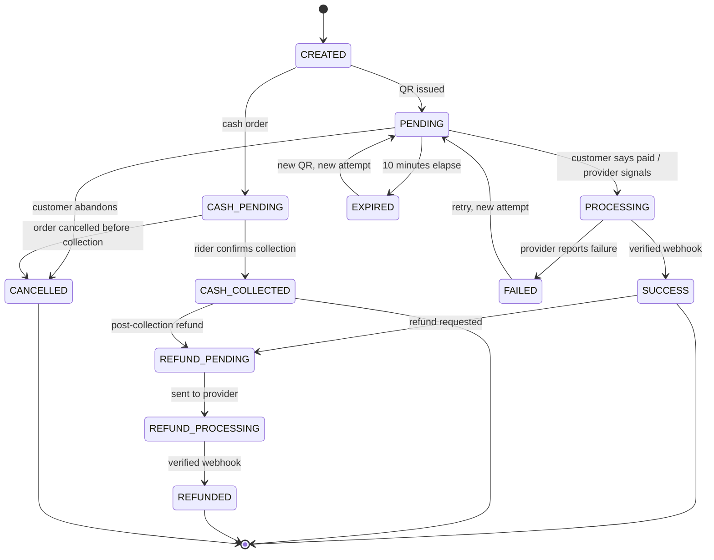
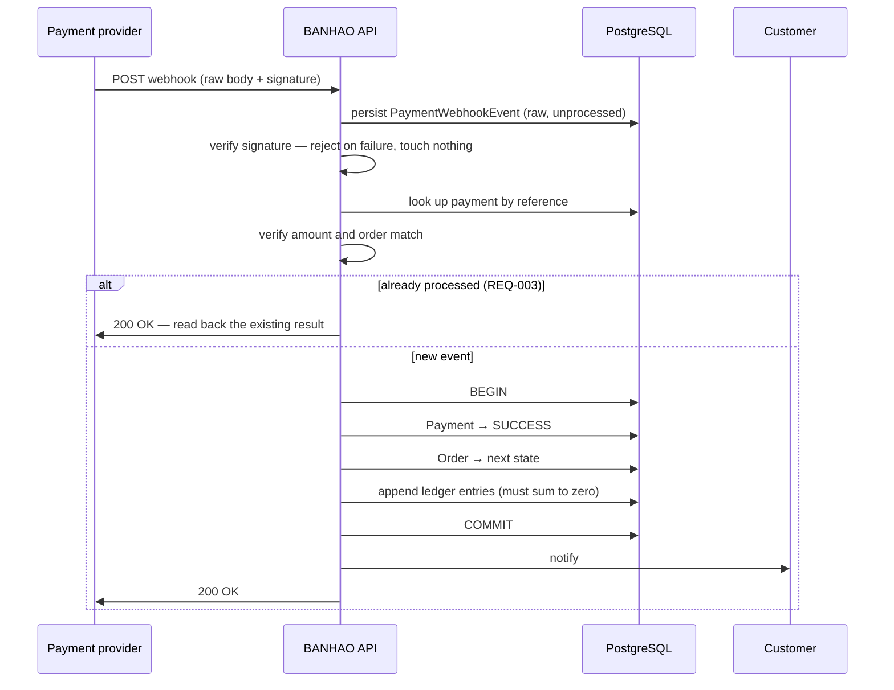

# BANHAO — Payment Lifecycle

How money enters the system, how it is confirmed, and how it comes back out.

Written 2026-08-10 (EVENT-013). Companion:
[`BUSINESS_RULES.md`](BUSINESS_RULES.md) ·
[`ORDER_LIFECYCLE.md`](ORDER_LIFECYCLE.md) ·
[`SETTLEMENT_MODEL.md`](SETTLEMENT_MODEL.md) ·
[`OPEN_BUSINESS_QUESTIONS.md`](OPEN_BUSINESS_QUESTIONS.md)

**No payment provider may be selected in this document** (DEC-015, Q-001).
Nothing here is an integration design.

---

## 0. The four rules that cannot bend

| Rule | Source | Consequence |
|---|---|---|
| Only a **signature-verified provider webhook** may set `SUCCESS` or `REFUNDED` | `DOCUMENTED` — CON-002 / DEC-003 | A client screen never decides that money arrived. *"แอปไม่ใช่ผู้ตัดสินว่าจ่ายสำเร็จหรือยัง"* |
| Every operation is **idempotent on one payment reference** | `DOCUMENTED` — REQ-003 | A duplicate callback reads back the existing result; it never writes a second ledger entry |
| Payment state is **separate** from Order state | `DOCUMENTED` — CON-001 | A cancelled order can still hold money until the refund finishes |
| Provider access goes through the **`PaymentProvider` abstraction** only | `DOCUMENTED` — DEC-015 | No SDK import outside `apps/api/src/modules/payments/providers/` |

The abstraction already exists in code
(`apps/api/src/modules/payments/payment-provider.interface.ts`) and
`NullPaymentProvider` throws on every call **by design** — so no money path can
appear to work untested. Do not "fix" it.

---

## 1. Payment entities

`PROPOSED` shapes; the responsibilities are `DOCUMENTED`.

| Entity | Purpose | Cardinality | Key rule |
|---|---|---|---|
| **`Payment`** | The payment intent for one order. Holds the canonical payment state | 1 per order | Kept out of `Order` by CON-001 |
| **`PaymentAttempt`** | One try at collecting: one QR, one expiry | many per payment | **Regenerating a QR creates a new attempt, not a new payment** — the payment reference is stable |
| **`PaymentMethod`** | `PROMPTPAY_QR` \| `CASH` | enum | No wallet, no cards in Phase 1 (`DOCUMENTED`) |
| **`PaymentTransaction`** | A money movement the provider reports | many per attempt | Immutable once written |
| **`PaymentWebhookEvent`** | The raw inbound callback plus its verification result | many per payment | **The idempotency anchor.** Persist *before* processing |
| **`Refund`** | A refund request against a payment | many per payment | Its own state machine |
| **`RefundTransaction`** | A movement executed for a refund | many per refund | Immutable |

Why `PaymentAttempt` exists as a separate entity: the design requires the QR to
be regenerable (`สร้าง QR ใหม่` on the expiry screen) while the order and the
payment reference survive (*"Payment = EXPIRED แต่ Order ยังอยู่ ไม่สร้าง
ออเดอร์ใหม่"*). Without attempts, either the reference changes — breaking
REQ-003 — or expiry history is lost.

---

## 2. Payment state machine

`DOCUMENTED` — twelve states, `docs/04-payment` § 02. **Actors are part of the
contract.**

| Payment state | Customer sees | Paired order state | Changed by |
|---|---|---|---|
| `CREATED` | กำลังสร้างรายการชำระเงิน | `PENDING_PAYMENT` | System |
| `PENDING` | รอการชำระเงิน · QR + countdown | `PENDING_PAYMENT` | Waiting on the user |
| `PROCESSING` | กำลังตรวจสอบการชำระเงิน | `PENDING_PAYMENT` | Provider |
| `SUCCESS` | ชำระเงินสำเร็จ | `NEW → COMPLETED` | **Webhook only** |
| `FAILED` | ยังยืนยันการชำระเงินไม่ได้ | `PENDING_PAYMENT` | Provider |
| `EXPIRED` | QR นี้หมดอายุแล้ว | `PENDING_PAYMENT` | System (10 min) |
| `CANCELLED` | ยกเลิกรายการชำระเงิน | `CANCELLED` | Customer / System |
| `REFUND_PENDING` | กำลังดำเนินการคืนเงิน | `CANCELLED` | System / Admin |
| `REFUND_PROCESSING` | ธนาคารกำลังดำเนินการ | `CANCELLED` | Provider |
| `REFUNDED` | คืนเงินสำเร็จ | `CANCELLED` | **Webhook only** |
| `CASH_PENDING` | จ่ายเงินสดปลายทาง | `NEW → DELIVERING` | System |
| `CASH_COLLECTED` | จ่ายเงินแล้ว ขอบคุณครับ | `COMPLETED` | Rider |

Note the `PENDING_PAYMENT` order state referenced here does not exist in the
Order State Machine — that is **BQ-012**, open and P0.



**`SUCCESS` and `REFUNDED` have exactly one inbound edge each, and both come
from a verified webhook.** If a code path can reach either state any other way,
that path is a bug (CON-002).

---

## 3. The six documented money flows

`DOCUMENTED` — `docs/04-payment` § 03.

| Flow | Path |
|---|---|
| **PromptPay** | cart → confirm → choose PromptPay → create Payment → issue QR → wait → **bank confirms** → paid → send order to the merchant |
| **Cash** | choose cash → declare the note carried → send order to the merchant → rider delivers → collect + change → **rider confirms** → order complete → record outstanding cash |
| **Refund** | order cancelled → create refund request → send to provider → processing → **bank confirms** → refunded |
| **Cash refund** | cancelled *before* collection → nothing to refund · cancelled *after* → cash adjustment entry → admin refunds the customer |
| **Merchant payout** | order complete → merchant payable accrues → grouped into a transfer round → transferred |
| **Rider payout** | delivered → rider earning recorded → **outstanding cash deducted** → grouped into a round → transferred |

Two things this makes explicit and that implementations get wrong:
**cash money enters the system when the rider confirms, not when the order is
placed**; and **the platform never announces a refund succeeded until the bank
confirms it** (*"ไม่ประกาศว่าคืนสำเร็จจนกว่าธนาคารยืนยัน"*).

---

## 4. Webhook processing

`DOCUMENTED` sequence, quoted from the source: *"ผู้ให้บริการยิงเข้ามา → ตรวจ
ลายเซ็น → ตรวจยอดและ order → อัปเดต Payment → อัปเดต Order → บันทึก Ledger →
แจ้งลูกค้า"*.



Non-negotiable properties:

1. **Persist the raw event before processing.** An unverifiable event is still
   evidence.
2. **A failed signature changes nothing** — not the payment, not the order, not
   the ledger. Return an error and alert.
3. **Amount and order must both match** before anything is written. A correct
   signature on the wrong amount is a reconciliation case, not a success.
4. **One transaction** covers Payment + Order + Ledger. This single requirement
   is why DEC-009 chose a monolith.
5. **Return 200 for a duplicate**, or the provider will keep retrying.
6. **Never log a secret, a token or a full account number.** The design already
   holds this line in the UI: *"แสดงเฉพาะเลขอ้างอิงบางส่วน ไม่แสดงเลขบัญชีเต็ม
   คีย์ หรือข้อมูลลับ"*.

---

## 5. Idempotency

`DOCUMENTED` — REQ-003. This is the property most likely to be quietly broken
during implementation, so the rules are spelled out.

| Operation | Idempotency key | Duplicate behaviour |
|---|---|---|
| Create payment | The order's payment reference (`PAY-BH000125`) | Return the existing payment; **never create a second** |
| Issue QR | Payment reference + attempt number | Return the live attempt if it has not expired |
| Webhook delivery | Provider event id, plus payment reference | Read back the stored result, return 200 |
| Refund request | Refund reference | Return the existing refund |
| Ledger write | Entry-group key | Unique constraint; a second insert must fail loudly, not silently |

The already-shipped `PaymentProvider` interface carries an explicit
`idempotencyKey` on every operation, so this is enforced at the type level
before any provider exists.

**Duplicate customer payment** — the customer transfers twice for the same QR.
`DOCUMENTED` UI promise (screen 12f): *"ระบบจะไม่เรียกเก็บซ้ำ ถ้าคุณโอนไปสองครั้ง
ทีมงานจะคืนให้อัตโนมัติ"* — we will not double-charge, and a double transfer is
refunded automatically. **That promise depends on Q-020**, because refunding it
requires the very PromptPay refund capability no provider offers. Until Q-020 is
answered, this is a commitment without a mechanism.

---

## 6. Documented edge cases

`DOCUMENTED` — `docs/04-payment` § 06, reproduced because these are behavioural
requirements, not examples.

| Situation | System behaviour | What the user sees |
|---|---|---|
| Re-tap pay / navigate back in | Reuse the same payment reference; create nothing | Returned to the existing status; if paid, "ออเดอร์นี้ชำระเงินแล้ว" |
| Provider sends a duplicate callback | Detect the repeat reference, read back, no second ledger entry | Nothing changes |
| App closed while the QR is open | Payment stays `PENDING` until expiry | Reopening shows the same QR with the remaining time |
| Transferred but the webhook is slow | Stay `PROCESSING` and wait for the real webhook | "กำลังตรวจสอบการชำระเงิน" + a re-check button. **Never show success** |
| QR expires | Payment `EXPIRED`; **the order survives** | "QR นี้หมดอายุแล้ว" + new QR / change method |
| Over- or under-payment | Mismatch → reconciliation queue for an admin | Customer sees "กำลังตรวจสอบ"; admin sees the mismatch |
| Merchant cancels after payment | Refund created automatically; Order `CANCELLED`, Payment `REFUND_PENDING` | "กำลังดำเนินการคืนเงิน" with a reference and an expected date |
| Cash customer refuses the order | Nothing collected, nothing to refund; recorded as a damaged order | Rider taps "ลูกค้าไม่รับของ"; admin reviews |
| Rider over the cash limit | Stop assigning new jobs until remittance | "กรุณานำส่งเงินสดก่อนรับงานเพิ่ม" + the amount |
| Connection drops at pay | No payment created, or one stuck at `CREATED` | "เชื่อมต่อไม่ได้ ยังไม่มีการตัดเงิน" + retry |

Every one of these is already implemented as a **screen** in the Customer App
(12b–12h, verified by screenshot) with no backend behind it. The screens are
correct; the behaviour is missing.

---

## 7. PromptPay specifics

Required by §15 of the brief. **UI only today — nothing here may be
implemented.**

| Aspect | Position |
|---|---|
| **QR generation** | A provider concern behind `PaymentProvider.createPayment()`, which already returns `presentation: { type: 'QR_STRING', value, expiresAt }`. The QR string is **not** a secret, but it is also not proof of anything |
| **Expiry** | **10 minutes**, `DOCUMENTED`; implemented in the Customer App as a real 600 s countdown, and screen 12e was verified by letting it actually elapse |
| **Verification** | Webhook only (CON-002). Polling may exist as a **UI affordance** — the design has "ฉันโอนแล้ว ตรวจสอบให้หน่อย" and "ตรวจสอบอีกครั้ง" — but polling asks the backend to re-read provider state; it never lets the client assert success |
| **Duplicate payment** | See § 5. Detected by reference; refund path blocked on Q-020 |
| **Wrong amount** | Reconciliation queue, admin decides. `DOCUMENTED` |
| **Late payment** | Money arrives after `EXPIRED`. The design does not cover it. `PROPOSED`: treat as a reconciliation case — either revive the payment if the order is still viable, or refund. **Do not auto-resurrect an order the merchant has already been told is dead** |
| **Refund** | 🚨 **No examined provider supports native PromptPay refunds** (Q-020). Omise states PromptPay charges cannot be voided or refunded; Beam excludes the method; Xendit marks it unsupported; Stripe only by emailing the customer for a bank account. **This is a property of the rail, not a provider quirk** |

### The refund contradiction, stated plainly

The Customer App tells customers: *"เงินจะเข้าบัญชีเดิมที่ใช้จ่าย ภายใน
1–3 วันทำการ"* — back to the account you paid from, within 1–3 business days.
The refund detail screen states the method as `คืนเข้าพร้อมเพย์เดิม`.

Research says that cannot be done natively. Candidate mechanisms, none chosen:

| Candidate | Problem |
|---|---|
| Wallet / store credit | May itself be **regulated e-money** (Q-002); and the launch strategy already rejected an in-app wallet for exactly this reason |
| Manual bank transfer | Requires collecting the customer's bank account — new PDPA surface, manual labour per refund |
| Cash refund via rider | Only works when a rider is going there anyway |
| Narrow the cancellation window | Reduces how often refunds are needed; does not remove the case (merchant rejection is not the customer's choice) |

Until Q-020 is answered, **the app's refund copy is a promise the platform
cannot keep.** That is a consumer-protection exposure (Q-017), not only an
engineering gap.

---

## 8. Refund state machine

`DOCUMENTED` states, `PROPOSED` structure.


➕ = `PROPOSED` addition. `REFUND_FAILED` is not optional in practice: with no
native PromptPay refund, failure is the *expected* path until Q-020 is resolved.

### Refund triggers and composition

| Trigger | Auto or manual | Amount | Status |
|---|---|---|---|
| Customer cancels before `PREPARING` | Auto | Full | `DOCUMENTED` |
| Customer cancels during `PREPARING` | Merchant confirms | Full | `DOCUMENTED` |
| Merchant rejects / times out | Auto | Full | `DOCUMENTED` |
| No rider, customer cancels | Auto | Full | `DOCUMENTED` |
| Payment failed / expired | N/A | Nothing was taken | `DOCUMENTED` |
| Duplicate transfer | Auto (promised) | The duplicate | `DOCUMENTED` promise, `OPEN` mechanism |
| Missing or wrong item | Manual | Partial | `OPEN` — BQ-031 |
| Delivery failed | Manual | `OPEN` | BQ-015, BQ-017 |
| Quality complaint after delivery | Manual, support | `OPEN` | Q-003, BQ-016 |

Four things a refund must keep separate — see
[`SETTLEMENT_MODEL.md`](SETTLEMENT_MODEL.md) § Refund impact: the **payment
refund**, the **merchant settlement reversal**, **rider compensation** (normally
*not* clawed back — the rider did the work), and the **platform fee reversal**.

---

## 9. Reconciliation

`DOCUMENTED` — the admin's daily screen is a reconciliation view, not a revenue
chart: *"หน้าที่แอดมินเปิดทุกเช้าคือหน้ากระทบยอด ไม่ใช่กราฟรายได้"*.

Two identities must both read **ตรงกัน ✓**:

```
online received + cash held by riders            = total sales
merchant payouts + rider payouts + platform revenue + refunds = total sales
```

Documented per-payment statuses: `ตรงกัน` (matched), `รอยืนยัน` (awaiting — e.g.
*"ยังไม่ได้รับ webhook · รอครบ 10 นาที"*), `ไม่ตรง` (mismatched — e.g.
*"ผู้ให้บริการแจ้งรับเงิน ฿145 · ระบบยัง PENDING"*). A mismatch is resolved by
manual matching or by refunding the customer.

`PROPOSED`: run reconciliation as a scheduled job against the provider's
settlement report, not only against inbound webhooks — a webhook that never
arrived is exactly the failure reconciliation exists to catch.

---

## 10. Chargebacks

`OPEN` — Q-011. Not mentioned anywhere in the design. A customer disputing with
their bank rather than asking BANHAO can pull money back **after** the merchant
and rider have been paid, leaving the platform short.

PromptPay is a push-based bank transfer rather than a card rail, so the
card-style chargeback may not apply in the same form — but "may not" is doing
real work in that sentence, and the answer depends on the provider (Q-001) and
the legal model (Q-002). Do not assume the risk is zero.

---

## 11. What must not be built yet

| Not now | Why |
|---|---|
| Any provider SDK integration | Q-001 `OPEN`, DEC-015 |
| Anything that sets `SUCCESS` outside a verified webhook | CON-002 |
| A refund implementation | Q-020 — the mechanism does not exist yet |
| A wallet or stored-value balance | Excluded at launch; possible e-money exposure (Q-002) |
| Card payments | Not in Phase 1 |
| Replacing `NullPaymentProvider` with a stub that returns success | It throws deliberately |

What **can** be built once the domain model is accepted, without prejudging
Q-001: the payment, attempt, transaction, webhook-event and refund tables; the
idempotency keys and unique constraints; the state machine and its guards; the
ledger; and the reconciliation job. All of that is provider-agnostic, and all of
it is where the correctness risk actually lives.

---

## 12. Open questions owned by this document

**P0:** Q-001 (provider) · Q-002 (legal model) · Q-020 (PromptPay refund) ·
BQ-012 (`PENDING_PAYMENT`) · BQ-027 (service fee refundability)
**P1:** Q-011 (chargebacks) · BQ-031 (partial refund composition) ·
Q-003 / BQ-016 (refund policy)
**Design questions closed by this document:** DQ-02 — screen 12f's trigger is
the documented duplicate-payment edge case (§ 5, § 6), i.e. re-entering payment
for an already-`SUCCESS` payment reference. Recommend the Product Owner close it
as documented rather than open.
