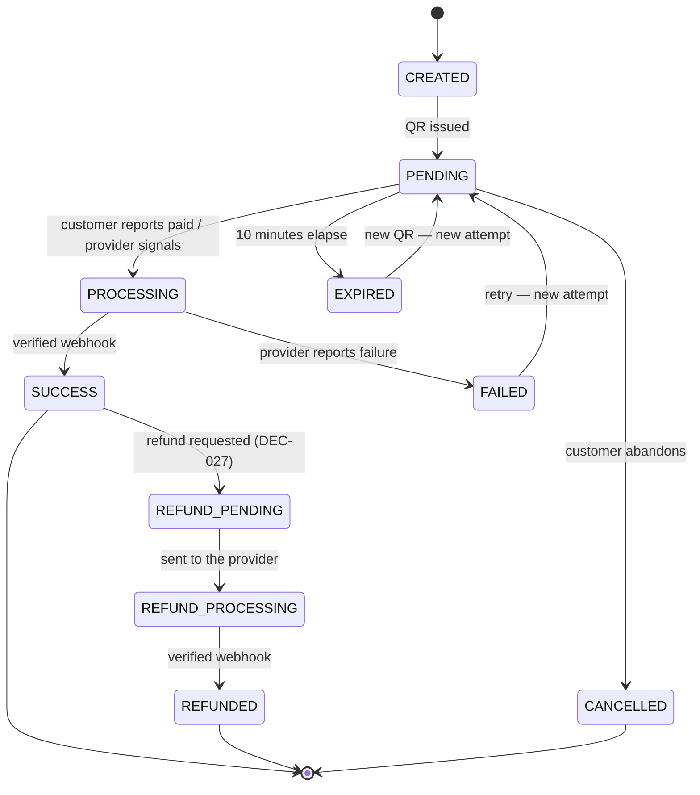
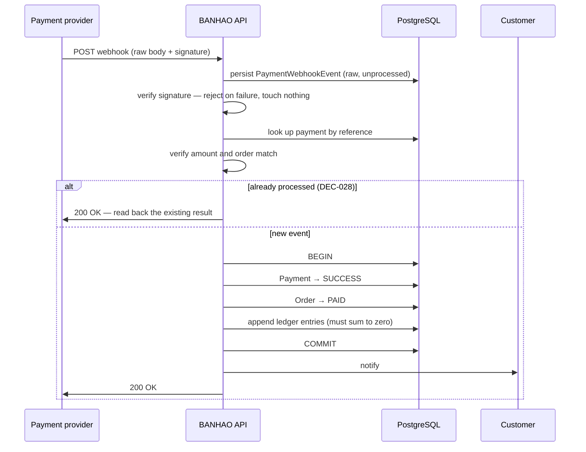
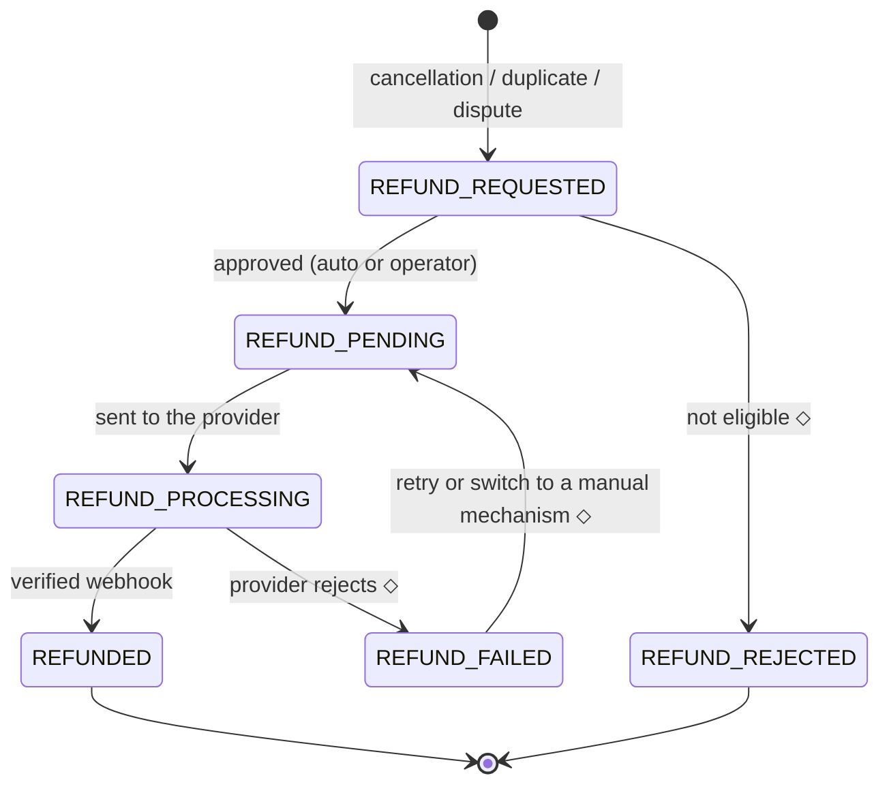

# BANHAO — Payment Lifecycle

How money enters the system, how it is confirmed, and how it comes back out.

Written 2026-08-10 (EVENT-013), locked to the approved decisions 2026-08-10
(EVENT-014). Companion: [`BUSINESS_RULES.md`](BUSINESS_RULES.md) ·
[`ORDER_LIFECYCLE.md`](ORDER_LIFECYCLE.md) ·
[`SETTLEMENT_MODEL.md`](SETTLEMENT_MODEL.md) ·
[`OPEN_BUSINESS_QUESTIONS.md`](OPEN_BUSINESS_QUESTIONS.md)

**The Phase 1 provider is Stripe** — **DEC-055** (2026-09-08), resolving
**Q-001**: PromptPay, THB, behind the existing `PaymentProvider` abstraction
(DEC-015, unchanged), with **no Stripe Connect in Phase 1**. **Runtime is not
implemented**: `NullPaymentProvider` is still the bound provider, and no Stripe
adapter, credential or SDK exists in the repository. Nothing here is an
integration design.

**The PromptPay presentation contract is locked** — **DEC-055 Addendum A**
(2026-09-08): a provider-neutral `QR_CODE` presentation carrying a QR **image
URL** (from Stripe's `image_url_png`) and an optional hosted-instructions URL.
There is no raw QR string, and **no provider-supplied expiry** — expiry is
BANHAO's own, see § 2 and § 3. Still not implemented.

## Status legend

`ACCEPTED` — approved by the Product Owner (`DEC-NNN`) or accepted product truth
· `PROPOSED` — awaiting approval · `OPEN` — undecided, do not guess ·
`LEGAL_REVIEW_REQUIRED` — no agent may conclude this is lawful.

---

## 0. The rules that cannot bend

| Rule | Source | Consequence |
|---|---|---|
| Only a **signature-verified provider webhook** may set `SUCCESS` or `REFUNDED` | `ACCEPTED` — CON-002 / DEC-003 | A client screen never decides that money arrived |
| Payment operations are **idempotent**; a duplicate cannot create duplicate financial value | `ACCEPTED` — **DEC-028** / REQ-003 | Keys: `order_id`, `payment_reference`, `idempotency_key` |
| Payment, Order, Delivery and Settlement are **four separate domains** | `ACCEPTED` — **DEC-018** / CON-001 | A cancelled order can still hold money until refunded |
| `REFUNDED` is a **payment** state, never an order outcome | `ACCEPTED` — **DEC-027** | `Order = CANCELLED` **and** `Payment = REFUNDED` |
| A duplicate payment **never increases an order's value** | `ACCEPTED` — **DEC-030** | ฿185 + ฿185 ≠ ฿370 |
| Provider access only through the **`PaymentProvider` abstraction** | `ACCEPTED` — DEC-015 | No SDK import outside `payments/providers/` |

The abstraction already exists in code
(`apps/api/src/modules/payments/payment-provider.interface.ts`) and
`NullPaymentProvider` throws on every call **by design** — so no money path can
appear to work untested. Do not "fix" it.

---

## 1. Phase 1 scope — online payment only

`ACCEPTED` — **DEC-016**.

| Method | Phase 1 | Note |
|---|---|---|
| **Online (PromptPay QR)** | **Enabled** — the only method | Provider selected: **Stripe** (DEC-055). Not yet implemented |
| **Cash on Delivery** | **Disabled** | Not removed from the model |
| Wallet / stored value | Excluded | Would raise an e-money question (Q-002) |
| Cards | Not in Phase 1 | — |

**COD must not be hard-coded as permanently unsupported.** `payment_method`
stays an extensible concept so COD can return without redesigning Order,
Payment, Delivery or Settlement. Concretely:

- `PaymentMethod` remains an open enum, not a boolean "is PromptPay".
- Payment states `CASH_PENDING` and `CASH_COLLECTED` stay in the model,
  unreachable in Phase 1.
- The cash money flow, the rider cash liability (DEC-004 / REQ-001) and the cash
  refund path stay documented and dormant.

⚠️ **Consequence the Product Owner should hold onto:** removing cash makes
**Q-020** (PromptPay refund mechanism) *more* blocking, not less. In Phase 1,
100% of revenue and 100% of refunds run through one rail, with no cash fallback
for either. **Q-001 is resolved** — the provider is Stripe (**DEC-055**) — but
that does **not** relieve this: Stripe's PromptPay refunds require the customer
to supply their bank account by email, so the refund *mechanism* and its
customer experience remain open under Q-020.

✅ **Resolved.** The Customer App's cash option at checkout, its cash CTA
variant and the `เปลี่ยนเป็นเงินสด` fallback on payment failure have been
removed — the customer-facing surface is now online-only, matching this
section. The cash-prepared-amount selector no longer exists either. CASH
remains in the database CHECK constraint, in `create_order()`'s argument and
in the app's historical order rendering, exactly as this section requires.

---

## 2. Payment entities

`PROPOSED` shapes; the responsibilities are `ACCEPTED`.

| Entity | Purpose | Cardinality | Key rule |
|---|---|---|---|
| **`Payment`** | The payment intent for one order; holds the canonical payment state | 1 per order | Kept out of `Order` — DEC-018 |
| **`PaymentAttempt`** | One try at collecting: one QR, one expiry | many per payment | **A regenerated QR is a new attempt, not a new payment** — the reference is stable (DEC-028) |
| **`PaymentMethod`** | Extensible enum; Phase 1 allows online only | enum | DEC-016 |
| **`PaymentTransaction`** | A movement the provider reports | many per attempt | Immutable |
| **`PaymentWebhookEvent`** | Raw inbound callback + verification result | many per payment | **The idempotency anchor.** Persist *before* processing |
| **`Refund`** | A refund request against a payment | many per payment | Own state machine — DEC-027 |
| **`RefundTransaction`** | A movement executed for a refund | many per refund | Immutable |

`PaymentAttempt` exists separately because the design requires the QR to be
regenerable (`สร้าง QR ใหม่`) while the order and the payment reference survive
(*"Payment = EXPIRED แต่ Order ยังอยู่ ไม่สร้างออเดอร์ใหม่"*). Without attempts,
either the reference changes — breaking DEC-028 — or expiry history is lost.
Attempts are also what make **DEC-029** (late payment) answerable: a late
transfer must resolve to *which attempt*, not just which order.

**What an attempt actually carries, and who owns its clock** — `ACCEPTED`,
**DEC-055 Addendum A**. The QR an attempt presents is a **provider-hosted image
URL**, not a raw payload BANHAO renders: Stripe PromptPay returns
`image_url_png` / `image_url_svg`, a hosted-instructions page URL, and a
provider-internal `data` field — and **no expiry timestamp of any kind**.

So the attempt's `expires_at` is, and must remain, **BANHAO's own**:

```
Provider presentation  ≠  BANHAO payment-attempt lifecycle
```

The provider says what the customer scans. **BANHAO decides how long it may be
scanned**, and it must — Stripe explicitly does not invalidate a PromptPay QR
after payment, so nothing but BANHAO's own window stops a customer re-scanning
a stale code. Stripe documents no lifetime for the image URL either; it is
treated as a short-lived presentation, valid for the active attempt only, which
is why no image copying, proxying or storage is introduced.

**A payment cannot be initiated without a customer email** — `ACCEPTED`,
**DEC-056**. Stripe PromptPay's confirm call requires `billing_details[email]`,
so issuing a QR has a customer-data precondition that the `CREATED --> PENDING`
edge in § 3 does not otherwise show. The rules, in full:

- The email is **BANHAO-owned customer data**, collected **at payment time**
  (never at phone-OTP signup), validated, and persisted on `profiles` — a
  **future** migration; no column exists today.
- The payment service reads it **server-side**, never from the request body
  (the endpoint has none) and never from the JWT claim.
- When it is absent or invalid, **payment initiation fails closed** — an
  explicit error, never a synthetic or substituted address.

**Not implemented**: no migration, no validation, no collection UI. Under
DEC-016 (online-only, no cash fallback) this makes a valid email a hard
precondition for paying at all — which is precisely why it must fail visibly.
DEC-056 resolves neither **Q-020** nor **Q-012**.

---

## 3. Payment state machine

`ACCEPTED` — the five core states named in the decision lock are **`PENDING`,
`SUCCESS`, `FAILED`, `EXPIRED`, `REFUNDED`**. The remaining states from the
2026-08-09 design canvas are retained and marked below.

| Payment state | Status | Paired Order state (DEC-019 names) | Changed by |
|---|---|---|---|
| `CREATED` | retained | `CREATED` / `PENDING_PAYMENT` | System |
| **`PENDING`** | **`ACCEPTED`** | `PENDING_PAYMENT` | Waiting on the user |
| `PROCESSING` | retained | `PENDING_PAYMENT` | Provider |
| **`SUCCESS`** | **`ACCEPTED`** | `PAID` … `DELIVERED` | **Webhook only** (CON-002) |
| **`FAILED`** | **`ACCEPTED`** | `PENDING_PAYMENT` | Provider |
| **`EXPIRED`** | **`ACCEPTED`** | `PENDING_PAYMENT` | System (10 min) |
| `CANCELLED` | retained | `CANCELLED` | Customer / System |
| `REFUND_PENDING` | retained | `CANCELLED` | System / Operator |
| `REFUND_PROCESSING` | retained | `CANCELLED` | Provider |
| **`REFUNDED`** | **`ACCEPTED`** | `CANCELLED` | **Webhook only** (CON-002) |
| `CASH_PENDING` | **dormant** — DEC-016 | — | — |
| `CASH_COLLECTED` | **dormant** — DEC-016 | — | — |

**BQ-012 is resolved.** `PENDING_PAYMENT` is now a real Order state (DEC-019),
so the pairing column above no longer references a state that does not exist.



**`SUCCESS` and `REFUNDED` have exactly one inbound edge each, and both come
from a verified webhook.** A code path reaching either state any other way is a
bug (CON-002).

### `EXPIRED` is BANHAO's, not the provider's

`ACCEPTED` — **DEC-055 Addendum A**. The `Changed by` column above already says
`System (10 min)` for `EXPIRED`, and that is exact: **no provider reports it.**
Verified against Stripe: **PromptPay has no distinct `EXPIRED` PaymentIntent
state**, and nothing in BANHAO may pretend it does.

The three Stripe events Phase 1 subscribes (DEC-055 clause 7) map as:

| Stripe event | Real Stripe status | Maps to | Terminal? |
|---|---|---|---|
| `payment_intent.succeeded` | `succeeded` | `SUCCESS` | Yes |
| `payment_intent.payment_failed` | `requires_payment_method` | `FAILED` | **No** — the same PaymentIntent is retryable |
| `payment_intent.canceled` | `canceled` | BANHAO's cancellation path | Yes |

Two distinctions that must not be collapsed:

1. **Provider failure ≠ BANHAO expiry.** A failed attempt is an event the
   provider reports; expiry is a deadline BANHAO enforces itself, on its own
   clock, with no provider involvement at all. Both land on
   `PENDING_PAYMENT`-paired states and both allow a new attempt
   (`FAILED --> PENDING`, `EXPIRED --> PENDING` above), but they arrive by
   entirely different routes.
2. **Provider failure ≠ provider cancellation.** `payment_intent.payment_failed`
   leaves the PaymentIntent alive and retryable; only an explicit cancel is
   terminal. Treating a failed attempt as a dead order would be a bug.

Nothing in this section changes the generic event processor, which stays
provider-agnostic — Stripe's event names are normalized inside the Stripe
adapter, never matched by generic code (DEC-055 clause 5, Addendum A-10).

---

## 4. Money flows in Phase 1

`ACCEPTED` — the online flows. The cash flows are retained and dormant
(DEC-016).

| Flow | Path | Phase 1 |
|---|---|---|
| **Online payment** | cart → confirm → create Payment → issue QR → wait → **bank confirms** → `PAID` → order sent to the merchant | **Active** |
| **Refund** | order cancelled → refund request → provider → processing → **bank confirms** → refunded | Active in principle; **mechanism `OPEN` (Q-020)** |
| **Merchant payout** | order `DELIVERED` → payable accrues → transfer round → transferred | Active — DEC-026, not implemented |
| **Rider payout** | delivered → earning recorded → transfer round → transferred | Active — DEC-026, not implemented |
| ~~Cash collection~~ | rider collects, confirms, remits | **Dormant — DEC-016** |
| ~~Cash refund~~ | before/after collection split | **Dormant — DEC-016** |

Two rules that survive from the original design and must not be lost: the
platform **never announces a refund succeeded until the bank confirms it**
(*"ไม่ประกาศว่าคืนสำเร็จจนกว่าธนาคารยืนยัน"*), and money is never assumed from
client state.

---

## 5. Webhook processing

`ACCEPTED` sequence — *"ผู้ให้บริการยิงเข้ามา → ตรวจลายเซ็น → ตรวจยอดและ order →
อัปเดต Payment → อัปเดต Order → บันทึก Ledger → แจ้งลูกค้า"*.



Non-negotiable properties:

1. **Persist the raw event before processing.** An unverifiable event is still
   evidence.
2. **A failed signature changes nothing** — not the payment, not the order, not
   the ledger.
3. **Amount and order must both match** before anything is written. A valid
   signature on the wrong amount is a reconciliation case, not a success.
4. **One transaction** covers Payment + Order + Ledger — the reason DEC-009
   chose a monolith.
5. **Return 200 for a duplicate**, or the provider retries forever.
6. **Never log a secret, token or full account number.** The design already
   holds this line: *"แสดงเฉพาะเลขอ้างอิงบางส่วน"*.

---

## 6. Idempotency

`ACCEPTED` — **DEC-028** / REQ-003. Required concepts: `order_id`,
`payment_reference`, `idempotency_key`.

| Operation | Idempotency key | Duplicate behaviour |
|---|---|---|
| Create payment | The order's `payment_reference` (e.g. `PAY-BH000125`) | Return the existing payment; **never create a second** |
| Issue QR | `payment_reference` + attempt number | Return the live attempt if unexpired |
| Webhook delivery | Provider event id + `payment_reference` | Read back the stored result, return 200 |
| Refund request | Refund reference | Return the existing refund |
| Ledger write | Entry-group key | Unique constraint; a second insert **fails loudly**, never silently |

The shipped `PaymentProvider` interface already carries an explicit
`idempotencyKey` on every operation, so DEC-028 is satisfied at the type level
before any provider exists.

---

## 7. Duplicate and late payment

### Duplicate payment

`ACCEPTED` — **DEC-030**. If an order expects ฿185 and two ฿185 payments
succeed, the order does **not** become ฿370. The order's value is authoritative
and immutable at creation; received transactions are matched against it, and a
surplus becomes a **refund obligation**, not order value.

The Customer App already promises this on screen 12f:
*"ระบบจะไม่เรียกเก็บซ้ำ ถ้าคุณโอนไปสองครั้ง ทีมงานจะคืนให้อัตโนมัติ"*.
🚨 **The promise exists ahead of the mechanism** — automatic return depends on
Q-020.

### Late payment

`ACCEPTED` as a technical requirement — **DEC-029**. A payment that succeeds
after the order or attempt has timed out must be resolvable:

| The system must determine | How |
|---|---|
| Which order? | `payment_reference` resolves to an order for as long as the order exists |
| Which payment attempt? | Attempts retain identity after expiry (§ 2) |
| Current order state? | Read from the order domain (DEC-018) |
| Accept, refund, or manual review? | **`OPEN` — the business policy is not decided** |

`PROPOSED` handling until the policy lands: surface late payments as a **distinct
reconciliation category**, never as a generic mismatch, and never auto-apply
them to an order that has already been cancelled and refunded.

---

## 8. Refunds

`ACCEPTED` — **DEC-027**: refund lives in the payment domain.
`Order = CANCELLED`, `Payment = REFUNDED`. Never a `REFUNDED` order status.



⬦ = `PROPOSED`. `REFUND_FAILED` is not optional in practice: with no native
PromptPay refund, failure is the *expected* path until Q-020 is resolved.

Four movements a refund must keep separate — see
[`SETTLEMENT_MODEL.md`](SETTLEMENT_MODEL.md): the **payment refund**, the
**merchant settlement reversal**, **rider compensation** (normally *not* clawed
back — the rider did the work), and the **platform fee reversal**.

| Trigger | Amount | Status |
|---|---|---|
| Customer cancels through `MERCHANT_ACCEPTED` | Full | **`ACCEPTED` — DEC-050** (the free window ends when `PREPARING` begins) |
| Customer cancels during `PREPARING` (merchant confirms) | Full | **`ACCEPTED` — DEC-050**; explicitly **not** partial |
| Merchant rejects or times out | Full | `ACCEPTED` |
| Operator cancels for no rider (DEC-022) | Full to the customer | `ACCEPTED`; the cooked-food cost is **absorbed by BANHAO** as a platform-caused loss — **DEC-051** (`PLATFORM_WRITE_OFF`; not implemented) |
| Payment failed / expired | Nothing was taken | `ACCEPTED` |
| Duplicate transfer | The duplicate | `ACCEPTED` (DEC-030); mechanism `OPEN` |
| Missing or wrong item | Partial | `OPEN` — BQ-031 |
| Delivery failed, incl. customer refusal after `PICKED_UP` | **Cause-dependent** — none where customer-caused; full otherwise | **`ACCEPTED` — DEC-053**; service fee follows DEC-048, delivery fee refunded only on non-customer-caused failure. Not implemented |
| Quality complaint after delivery | — | `OPEN` — Q-003, BQ-031 |

**No cancellation fee is deducted from any of the above** — DEC-050 sets none
for Phase 1. **None of these refunds can execute yet:** the mechanism is
`OPEN` (Q-020) and no refund code exists.

### 🚨 The refund mechanism is still open — Q-020

The Customer App tells customers *"เงินจะเข้าบัญชีเดิมที่ใช้จ่าย ภายใน
1–3 วันทำการ"* and states the method as `คืนเข้าพร้อมเพย์เดิม`. Research found
**no examined provider supports native PromptPay refunds** — Omise states
PromptPay charges cannot be voided or refunded, Beam excludes the method,
Xendit marks it unsupported, Stripe only by emailing the customer for a bank
account. **This is a property of the rail, not a provider quirk.**

| Candidate mechanism | Problem |
|---|---|
| Wallet / store credit | May itself be regulated e-money (Q-002); the launch strategy already rejected an in-app wallet |
| Manual bank transfer | Collects bank details — new PDPA surface; manual labour per refund |
| Cash refund via rider | **No longer available in Phase 1** — DEC-016 removed cash entirely |
| Narrow the cancellation window | Reduces frequency; does not remove merchant rejection or no-rider cases |

Note that DEC-016 **deleted one of the four candidates**. Until Q-020 is
answered, the app's refund copy is a promise the platform cannot keep — a
consumer-protection exposure (Q-017), not only an engineering gap.

---

## 9. Reconciliation

`ACCEPTED`. The operator's morning screen is a reconciliation view, not a
revenue chart. With COD disabled the first identity simplifies:

```
Phase 1:  online received                                        = total sales
          merchant payouts + rider payouts + platform revenue + refunds
                                                                 = total sales
```

(The `+ cash held by riders` term returns with COD.)

Documented per-payment statuses: `ตรงกัน` (matched), `รอยืนยัน` (awaiting — e.g.
no webhook yet, 10-minute grace), `ไม่ตรง` (mismatched). Mismatches are resolved
by manual matching or by refunding the customer — an operator capability under
DEC-032.

`PROPOSED`: reconcile against the **provider's settlement report** on a
schedule, not only against inbound webhooks — a webhook that never arrived is
exactly what this catches. Late payments (DEC-029) get their own queue.

---

## 10. Chargebacks

`OPEN` — Q-011. Not mentioned anywhere in the design. A customer disputing with
their bank can pull money back **after** merchant and rider have been paid.

PromptPay is a push-based bank transfer rather than a card rail, so a card-style
chargeback may not apply in the same form — but that depends on the provider's
own dispute handling (**Stripe**, DEC-055) and on the legal model (Q-002, still
`OPEN`). Do not assume the risk is zero.

---

## 11. What must not be built yet

| Not now | Why |
|---|---|
| Any provider SDK integration | Q-001 `OPEN`, DEC-015 |
| Anything setting `SUCCESS` outside a verified webhook | CON-002 |
| A refund implementation | Q-020 — the mechanism does not exist yet |
| A wallet or stored-value balance | Excluded; possible e-money exposure (Q-002) |
| Cash payment paths | **DEC-016** — disabled in Phase 1 |
| Replacing `NullPaymentProvider` with a stub returning success | It throws deliberately |

What **can** be designed once the domain model is accepted, without prejudging
Q-001: the payment, attempt, transaction, webhook-event and refund structures;
idempotency keys and unique constraints (DEC-028); the state machine and its
guards; the ledger; and the reconciliation process. That is where the
correctness risk actually lives, and none of it depends on which provider wins.

**Still no implementation in this step** — no schema, no migration, no module.

---

## 12. Open questions owned by this document

**Resolved by this lock:** BQ-012 (`PENDING_PAYMENT` — DEC-019) · the
idempotency requirement (DEC-028) · duplicate-payment semantics (DEC-030) ·
refund/order separation (DEC-027) · Phase 1 payment scope (DEC-016).

**Still `OPEN` — and P0:** Q-001 (provider) · Q-002 (legal model,
`LEGAL_REVIEW_REQUIRED`) · Q-020 (PromptPay refund mechanism) · BQ-027 (service
fee refundability).
**Still `OPEN` — P1:** Q-011 (chargebacks) · BQ-031 (partial refund
composition) · Q-003 (the refund edge cases DEC-050 did not cover) · BQ-024
(rider compensation amount) · the late-payment business handling under
DEC-029.
**Resolved 2026-09-07:** BQ-016 — cancellation window, cancellation fee and
the merchant-confirmed `PREPARING` outcome (**DEC-050**) · BQ-017 —
post-pickup delivery failure, with cause-dependent refund treatment
(**DEC-053**). Both policy only; **neither is implemented**.

**Design question closed by this document:** DQ-02 — screen 12f's trigger is the
documented duplicate-payment case, now formalised by DEC-030.
