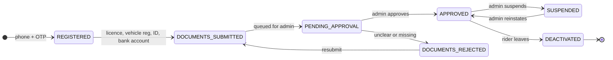
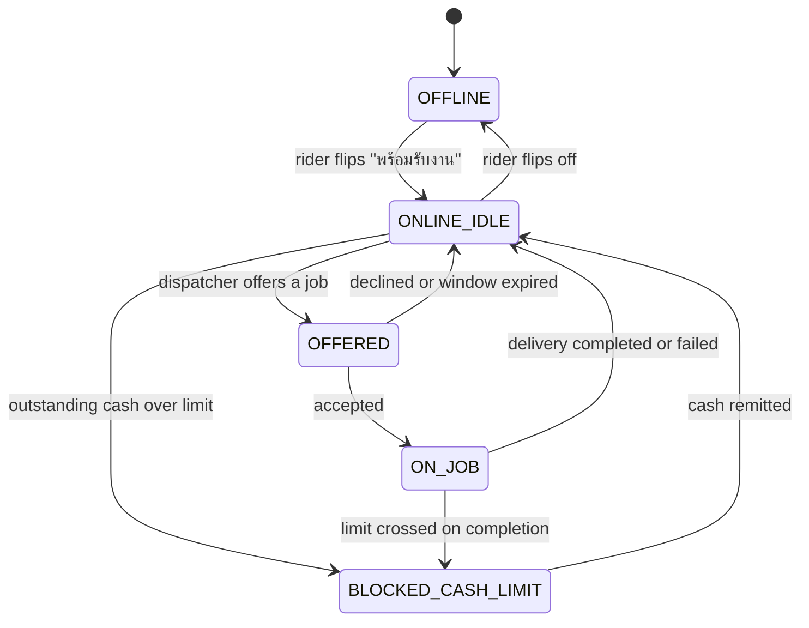
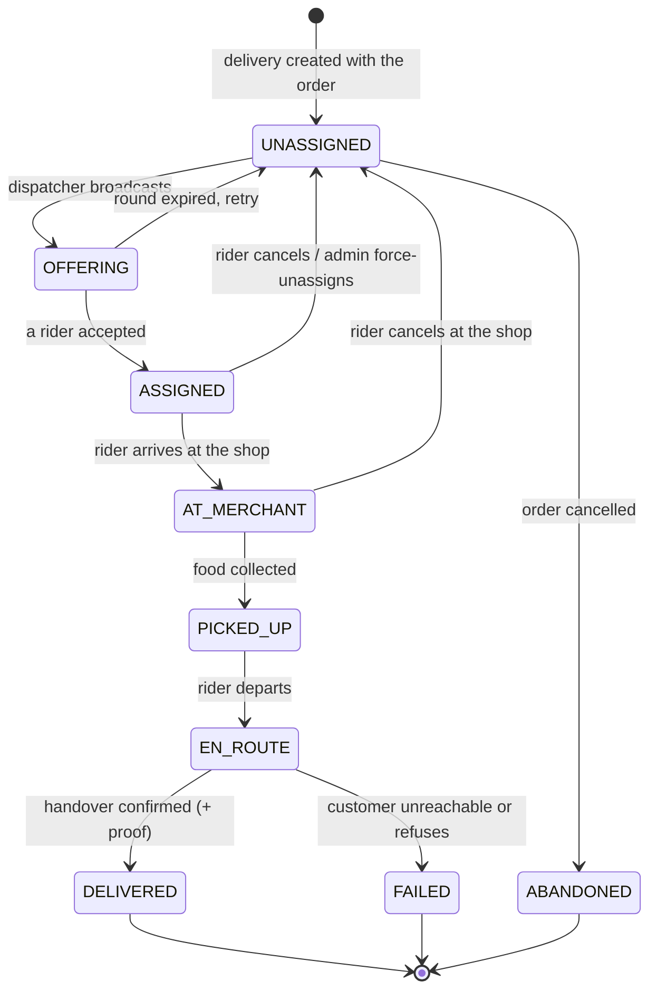

# BANHAO — Rider Lifecycle and Dispatch

**Rider availability is BANHAO's binding business constraint, not an
implementation detail.** Everything else in the product can be adequate and the
product still fails if orders cannot be picked up.

Written 2026-08-10 (EVENT-013). Companion:
[`BUSINESS_RULES.md`](BUSINESS_RULES.md) ·
[`ORDER_LIFECYCLE.md`](ORDER_LIFECYCLE.md) ·
[`SETTLEMENT_MODEL.md`](SETTLEMENT_MODEL.md) ·
[`OPEN_BUSINESS_QUESTIONS.md`](OPEN_BUSINESS_QUESTIONS.md)

**STATUS: PROPOSED** except where marked `DOCUMENTED`.

---

## 1. The constraint

`DOCUMENTED` — `docs/05-architecture` § 01 STRATEGY

| Fact | Value |
|---|---|
| Rider pool at launch | **8–12 riders**, total, for the whole district |
| Merchants at launch | 20–30, within 3 km of ตลาดสดบุณฑริก |
| Failure ceiling | **Under 5%** of orders cancelled for lack of a rider |
| Success metric | 35% repeat orders within 14 days |

Grab operates with thousands of riders per city; a declined offer costs nothing
because the next rider is already nearby. **BANHAO has at most twelve.** Every
design decision here follows from that single number:

- A rider going offline removes roughly **10% of national capacity**.
- Sequential offers spend the scarcest resource in the system — seconds — while
  food goes cold.
- Splitting the pool into zones would leave two or three riders per zone, which
  is not a pool.
- One rider blocked by the cash limit is a **capacity incident**, not an
  accounting event.

Any dispatch design borrowed from a large platform will be wrong here.

---

## 2. Rider lifecycle

`PROPOSED` — BQ-022. Documented inputs: the Driver App sitemap
(`เข้าสู่ระบบ`, `ยืนยันตัวตน + เอกสาร`, `ข้อมูลรถ`, `รออนุมัติ`), the admin
approval queue showing `ใบขับขี่ + ทะเบียนรถ` (licence + vehicle registration)
and a rejection example `เอกสารไม่ชัด ต้องขอใหม่` (documents unclear, resubmit),
and the admin `ระงับ / ปลดระงับ` action.



**Only an `APPROVED` rider may go online.** Deactivation must be blocked while
`RiderCashBalance > 0` — a rider cannot quit holding platform money (BQ-034).

⚖️ `LEGAL_REVIEW_REQUIRED` — the contractual relationship behind this lifecycle
is unresolved (BQ-022). `ai/RESEARCH/THAILAND_COMPLIANCE.md` §5 flags that
algorithmic dispatch, an accept timer and auto-suspension on a cash limit are
precisely the control factors a worker-reclassification argument turns on.

---

## 3. Availability

`PROPOSED`, with the blocked transition `DOCUMENTED`.



`BLOCKED_CASH_LIMIT` is `DOCUMENTED`:
*"ถ้ายังมีเงินสดค้างนำส่งเกินวงเงินที่กำหนด ระบบจะหยุดจ่ายงานใหม่ให้อัตโนมัติ"* —
the system stops assigning new jobs automatically. The rider sees
*"กรุณานำส่งเงินสดก่อนรับงานเพิ่ม"* with the amount owed. **The limit's value is
`OPEN`** (Q-004).

> **Capacity warning.** With 8–12 riders, this automatic block is also an
> automatic capacity cut. It must raise an admin alert, not just a rider
> message — see BQ-034.

`OPEN`: whether a rider has a `working_area`/zone (BQ-022) and whether they may
hold more than one job (BQ-021 — recommended **one at a time** for launch).

---

## 4. Delivery state machine

`PROPOSED`, mirroring the `DOCUMENTED` one-button-per-state Driver App flow
(`ถึงร้านแล้ว → รับอาหารแล้ว → ถึงจุดส่ง → ส่งสำเร็จ`).



Mapping to Order state (REQ-002 — the order stays the single source of truth for
customers): `ASSIGNED`/`AT_MERCHANT` → `DRIVER_ASSIGNED` · `PICKED_UP` →
`PICKED_UP` · `EN_ROUTE` → `DELIVERING` · `DELIVERED` → `COMPLETED` · `FAILED` →
`DELIVERY_FAILED` ➕.

Admin **force-unassign** (`ปุ่มบังคับปลดงาน`) is `DOCUMENTED` and returns the
delivery to `UNASSIGNED` with an audit record.

---

## 5. Dispatch models

Required by §9 of the brief. **STATUS: PROPOSED — the Product Owner decides
(BQ-019).**

What the design documents, without naming a model: a job card with a countdown
(`D-05`), an accept/decline pair, a map showing *"ร้านที่มีงานเยอะ"* (shops with
lots of jobs — a supply-positioning hint, not an assignment), and an admin
`จ่ายงานด้วยมือ` (manual dispatch) action.

### Model A — First available / nearest-first sequential offer

Rank eligible riders by distance to the merchant; offer to #1; on decline or
timeout, offer to #2; and so on.

- **Complexity:** medium. Needs a ranking function, an offer queue, and a
  per-round timer. PostGIS KNN is available (DEC-010).
- **Cost:** low.
- **Fairness:** poor. The rider who happens to idle near the market gets almost
  everything; others see nothing and go offline.
- **Speed:** **poor at this scale.** Three declines at 20 s each is a minute of
  a cooked meal's life.
- **Buntharik fit:** weak — optimises for a rider surplus that does not exist.
- **Scalability:** good; this is what large platforms converge on.

### Model B — Zone-based

Divide the district into zones; offer only to riders in the order's zone.

- **Complexity:** high. Zones must be drawn, maintained, and rebalanced; you
  also need cross-zone fallback or orders strand.
- **Cost:** low technically, high operationally — someone owns the zone map.
- **Fairness:** good in principle, brittle in practice at low headcount.
- **Speed:** poor when a zone is empty, and with 8–12 riders zones are routinely
  empty.
- **Buntharik fit:** **poor.** Splitting twelve riders across even three zones
  leaves four each; one bathroom break empties a zone.
- **Scalability:** the right answer later — at Stage 2, several districts.

### Model C — Broadcast / first accept

Offer simultaneously to every eligible online rider; the first to accept wins;
the rest see the offer disappear.

- **Complexity:** **lowest.** One broadcast, one atomic claim, one loser-notify.
  No ranking, no queue, no zone map.
- **Cost:** lowest.
- **Fairness:** "fastest thumb wins" — genuinely a downside, and it favours
  riders who stare at the phone. At twelve riders this is visible and can be
  corrected socially or with a later tie-break.
- **Speed:** **best.** Assignment happens in the seconds it takes one person to
  tap.
- **Buntharik fit:** **best.** It treats the whole pool as one pool, which at
  this size it is.
- **Scalability:** degrades with pool size (notification storms, wasted taps).
  Revisit at Stage 2.

### Model D — Manual dispatch

An admin assigns each job by hand.

- **Complexity:** near zero in code; the admin action is already documented.
- **Cost:** a person's attention, continuously.
- **Fairness:** whatever the dispatcher decides — which in a district where the
  operator knows every rider by name is not necessarily worse than an algorithm.
- **Speed:** good while someone is watching; zero at 21:00 on a Sunday.
- **Buntharik fit:** viable as a **fallback**, not as the default.
- **Scalability:** none.

### Comparison

| Criterion | A First-available | B Zone | **C Broadcast** | D Manual |
|---|---|---|---|---|
| Implementation complexity | Medium | High | **Low** | Very low |
| Infrastructure cost | Low | Low | **Low** | Low |
| Operational burden | Low | **High** | Low | **Very high** |
| Fairness | Poor | Good | Medium | Discretionary |
| Assignment speed | Poor | Poor | **Best** | Medium |
| Fit for 8–12 riders | Weak | **Poor** | **Best** | Fallback |
| Scalability to Stage 2+ | **Good** | **Good** | Medium | None |
| AI-development complexity | Medium | High | **Low** | Low |

### Recommendation

**Model C (broadcast, first accept) as the default, with Model D (admin manual
dispatch) always available as an override.** `PROPOSED` — BQ-019.

Reasons, in order of weight:

1. **Speed is the product.** The design's own positioning is accuracy of fee and
   time; the failure ceiling is a ≤5% no-rider cancellation rate. C minimises
   time-to-assignment, which is the only lever that moves that number.
2. **Twelve riders is one pool.** A and B both assume you can afford to ask one
   subset first. You cannot.
3. **It is the least code**, and a solo founder with an AI team maintains it.
4. **D is already designed** (`จ่ายงานด้วยมือ`), so the fallback costs an admin
   screen that was going to exist anyway.

What to add once real data exists: a **tie-break** on top of C (prefer the rider
with fewer jobs today, or nearer the merchant, when two accept within the same
second) to soften the fairness objection without changing the model. Reassess A
or B at Stage 2 when the pool passes roughly 30 riders.

**Design the dispatcher behind an interface** so the model is swappable — the
same discipline DEC-015 applies to payment providers.

---

## 6. Offers, timeouts and the retry cascade

`PROPOSED` — BQ-020.

| Parameter | Proposal | Why |
|---|---|---|
| Accept window | **20 s** (the wireframe title's value), configurable | The design contradicts itself — title says 20 s, button shows 12 s. `ai/RESEARCH/THAILAND_COMPLIANCE.md` cites "12 seconds" having read the button; do not treat that as established |
| Round interval | Re-broadcast every **30 s** | Keeps the job visible to riders who just came online |
| Search start | At `ACCEPTED`, in parallel with cooking | BQ-014 — the only way to hit ≤5% |
| Escalation | Priority flag when the order reaches `READY` | Food is now cooling |
| Customer notification | At **5 minutes** (`DOCUMENTED`) | Then a 3-minute extension offer |
| Admin alert | At **5 minutes** | Enables Model D before the customer gives up |
| Give up | Only when the customer chooses, or the ladder is exhausted | BQ-025 |

Every offer is recorded as a `DeliveryOffer` (see
[`DOMAIN_MODEL.md`](DOMAIN_MODEL.md)) with its outcome. Without that record,
"why did this order sit for eleven minutes?" is unanswerable — and at launch
that question will be asked about specific orders, by name, by the merchant.

---

## 7. The no-rider scenario

Required by §10 of the brief. **Every option is analysed; none is chosen —
BQ-025.**

Situation: order paid, merchant accepted, food ready or nearly ready, no rider
available.

| Option | How it works | Pros | Cons | Cost / complexity |
|---|---|---|---|---|
| **1. Keep waiting silently** | Retry rounds, tell nobody | Simple; many cases resolve | Customer anxiety; the merchant watches food die | Nil |
| **2. Notify and let the customer choose** | Show the no-rider state, offer *keep waiting* or *cancel with full refund* — **this is what the design already does** | Honest; customer keeps control; matches built UI | Some customers cancel who would have waited | Low — the screen exists |
| **3. Merchant self-delivery** | Offer the merchant the delivery fee to deliver it themselves | Saves the order; merchant earns extra | Not every shop has a spare person or bike; needs merchant-app support and a different payout path | Medium; needs a per-merchant opt-in |
| **4. Admin manual dispatch** | Admin phones a known rider, or an off-duty one, and assigns | Very effective at this scale; the operator knows everyone | Needs a human awake; not a system property | Low code, high human |
| **5. Cancel and refund** | Terminate, refund in full | Clean for the customer | Merchant loses cooked food (BQ-015); repeat rate suffers; counts against the ≤5% ceiling | Low — but the most expensive outcome |
| **6. Retry later with an incentive** | Re-broadcast with a bonus attached | Pulls offline riders back online | Costs money per rescue; needs a bonus mechanism in earnings | Medium |
| **7. Customer self-pickup** | Offer the customer collection at a discount | Occasionally delightful; food is not wasted | Only works if the customer is mobile and near; not designed | Medium |

### Recommended ladder

`PROPOSED`. Not one option — a sequence, because the right answer changes with
elapsed time.

```
t=0      merchant accepts → broadcast begins (BQ-014)
t=0–5m   silent retry every 30s                                    ← option 1
t=5m     tell the customer: keep waiting (3 min) or cancel free    ← option 2 (documented)
t=5m     raise an admin alert                                      ← option 4
t=5–8m   admin phones riders / offers a bonus                      ← options 4, 6
t=6m     if the merchant is opted in, offer self-delivery          ← option 3
t=8m+    customer decides again; cancel + full refund if they wish ← option 5
```

Rules that hold across the whole ladder:

- **The customer is never left in silence past 5 minutes.** That is already the
  documented behaviour and it is right.
- **Cancellation is the customer's choice wherever possible**, not a timeout —
  a timeout-cancel converts a recoverable delay into a lost customer.
- **Merchant self-delivery is opt-in per merchant**, never assumed.
- **`NO_RIDER` is the platform's fault.** The merchant should be paid for food
  they cooked (BQ-015), and the loss booked to the platform.
- Every rung is **configurable**; these minute values are proposals, not
  measurements.

---

## 8. Cash handling

`DOCUMENTED` except where noted. This is the most operationally dangerous part
of the rider role.

| Step | Rule |
|---|---|
| At checkout | The customer declares the note they will pay with (`เตรียมเงินมาเท่าไหร่`) |
| At pickup | Under the current design the rider **pays the merchant in cash** — flagged, BQ-023 |
| At delivery | The system tells the rider the amount to collect and the change to give (`฿130` collected from a declared `฿500` → `ต้องทอน ฿370`). *"ไรเดอร์ไม่ต้องคิดเลขเอง"* — the rider never does arithmetic |
| Confirmation | The rider taps to confirm collection. **Only then** does the order become `COMPLETED` and the cash enter their outstanding balance |
| Problem path | `ลูกค้าจ่ายไม่ครบ / มีปัญหา` escalates instead of forcing a confirmation |
| Accounting | Collected cash is a **platform liability** (DEC-004 / REQ-001), never income, and must be displayed as a separate number from earnings |
| Limit | Above a configured outstanding amount, dispatch stops automatically. Value `OPEN` (Q-004) |
| Remittance | The rider declares a remittance (`แจ้งนำส่งเงินสด`); admin reconciles it (`CASH-00087 · ไรเดอร์นำส่ง ฿610 · ตรงกัน`) |

The documented rider screen `P-D2` is the model for every cash UI:

```
รายได้วันนี้ (เป็นของคุณ)        ฿400      ← yours
  ค่าจัดส่ง ฿350 · โบนัส ฿50

เงินสดที่เก็บมาแทนบ้านเฮา        ฿850      ← not yours
  หักรายได้ของคุณ −฿240
  ต้องนำส่งบ้านเฮา ฿610
```

**Never sum these two blocks into one total.** That is REQ-001's acceptance
criterion, verbatim.

`OPEN`: missing cash, short payment, theft, and the recovery path when a rider
stops working while holding cash (BQ-034, Q-013).

---

## 9. Earnings

`DOCUMENTED` samples, `OPEN` formula — BQ-029.

From `D-13` (a single sample day):

```
ค่าส่ง 12 งาน                  ฿408      ≈ ฿34 per job
โบนัสชั่วโมงเร่งด่วน            ฿72      peak-hour bonus — surge exists
ค่าธรรมเนียมแพลตฟอร์ม          −฿38      riders pay a platform fee too
รายได้สุทธิวันนี้               ฿442
```

Three findings worth the Product Owner's attention:

1. **Riders pay a platform fee.** `ค่าธรรมเนียมแพลตฟอร์ม −฿38` appears nowhere
   else in the repository — not in the ledger examples, not in `Q-010`. Whether
   this is real, and at what rate, is undecided.
2. **A peak-hour bonus is already assumed.** Surge exists as a concept; its
   trigger and amount are undefined.
3. **Delivery may run at a loss.** In the documented per-order ledger the
   customer's net delivery-side contribution is ฿10 while the rider receives
   ฿12 — commission covers the gap. Intentional cross-subsidy or arithmetic
   drift in a sample? BQ-026 and BQ-029 must be answered together.

Components to decide (BQ-029): base per order · distance component · peak bonus ·
minimum guarantee · waiting fee · cancellation compensation (BQ-024) · tips (not
in the design at all).

Whatever is chosen, **each component must be a separate ledger line**. Folding
compensation into "delivery earnings" destroys the separation REQ-001 requires
and makes rider disputes unanswerable.

---

## 10. Proof of delivery

`DOCUMENTED` intent, `OPEN` rules — BQ-018.

The Driver App sitemap includes `ยืนยันส่งสำเร็จ + ถ่ายรูป` — confirm delivery
and take a photo. Undecided: mandatory or optional, where stored, how long
retained (🔴 PDPA, Q-012), and what it is worth in a dispute (Q-013).

`PROPOSED`: mandatory photo, no faces required in frame, retained for a defined
period set under Q-012, admin-viewable, and attached to the `Delivery`
aggregate. Cash orders additionally require the collection confirmation, which
already gates `COMPLETED`.

---

## 11. Rider-facing rules that must be honest

`PROPOSED` — these are product-ethics choices, and they are cheap to get right
now and expensive later.

1. **Show the whole job before the accept tap.** The design already does:
   pickup 0.9 km, dropoff 1.2 km, total 2.1 km, ~18 min, ฿38 earning, and
   `ลูกค้าจ่ายเงินสด ฿130`. A rider deciding in 20 seconds needs the cash
   exposure in front of them.
2. **Never present held cash as income.** REQ-001.
3. **Explain every automatic block.** `BLOCKED_CASH_LIMIT` must state the
   amount, the limit, and how to clear it.
4. **Log every forced unassignment** with the admin's reason, visible to the
   rider.
5. **Do not penalise a rider for a platform failure** — a merchant cancelling
   after the rider arrived is not the rider's decline.

---

## 12. Open questions owned by this document

**P0:** BQ-019 (dispatch model) · BQ-023 (cash float at pickup) ·
BQ-025 (no-rider ladder)
**P1:** BQ-020 (accept window) · BQ-021 (batching) · BQ-022 (onboarding,
working area, contractor status — `LEGAL_REVIEW_REQUIRED`) ·
BQ-024 (cancellation and compensation) · BQ-029 (earnings formula) ·
BQ-034 (payout netting, negative balance) · Q-004 (cash limit value)

No dispatch code may be written while BQ-019 is `OPEN`.
