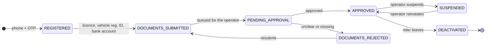
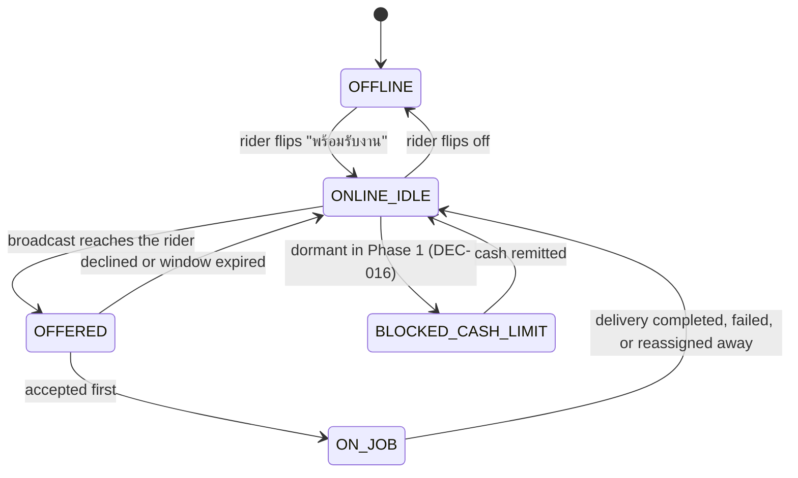
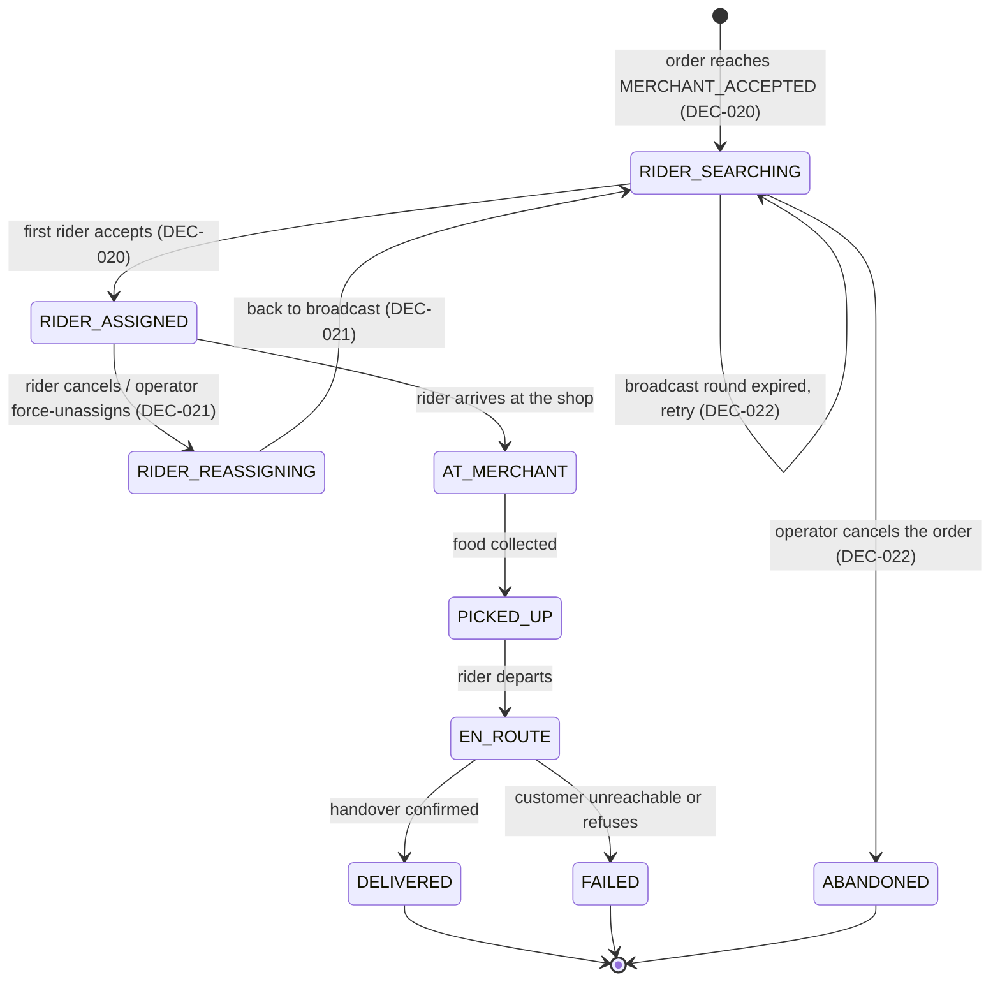

# BANHAO — Rider Lifecycle and Dispatch

**Rider availability is BANHAO's binding business constraint, not an
implementation detail.** Everything else in the product can be adequate and the
product still fails if orders cannot be picked up.

Written 2026-08-10 (EVENT-013), locked to the approved decisions 2026-08-10
(EVENT-014). Companion: [`BUSINESS_RULES.md`](BUSINESS_RULES.md) ·
[`ORDER_LIFECYCLE.md`](ORDER_LIFECYCLE.md) ·
[`SETTLEMENT_MODEL.md`](SETTLEMENT_MODEL.md) ·
[`OPEN_BUSINESS_QUESTIONS.md`](OPEN_BUSINESS_QUESTIONS.md)

## Status legend

`ACCEPTED` — approved by the Product Owner (`DEC-NNN`) or accepted product truth
(`CON`/`REQ`/design canvas). **Build on it.**
`PROPOSED` — analysis awaiting approval. **Do not build.**
`OPEN` — undecided. **Do not guess.**
`LEGAL_REVIEW_REQUIRED` — no agent or engineer may conclude this is lawful.

---

## 1. The constraint

`ACCEPTED` — `docs/05-architecture` § 01 STRATEGY, reaffirmed by **DEC-031**.

| Fact | Value |
|---|---|
| Rider pool at launch | **8–12 riders**, total, for the whole district |
| Merchants at launch | ~50 (20–30 within 3 km of ตลาดสดบุณฑริก initially) |
| Failure ceiling | **Under 5%** of orders cancelled for lack of a rider |
| Success metric | 35% repeat orders within 14 days |

Grab operates with thousands of riders per city; a declined offer costs nothing
because the next rider is already nearby. **BANHAO has at most twelve.** Every
decision here follows from that number:

- A rider going offline removes roughly **10% of national capacity**.
- Sequential offers spend the scarcest resource in the system — seconds — while
  food goes cold.
- Splitting the pool into zones would leave two or three riders per zone, which
  is not a pool.

Any dispatch design borrowed from a large platform will be wrong here.

---

## 2. Rider lifecycle

`PROPOSED` — BQ-022. Documented inputs: the Driver App sitemap
(`เข้าสู่ระบบ`, `ยืนยันตัวตน + เอกสาร`, `ข้อมูลรถ`, `รออนุมัติ`), the admin
approval queue showing `ใบขับขี่ + ทะเบียนรถ` (licence + vehicle registration)
and a rejection example `เอกสารไม่ชัด ต้องขอใหม่`, and the admin
`ระงับ / ปลดระงับ` action.



**Only an `APPROVED` rider may go online.**

⚖️ `LEGAL_REVIEW_REQUIRED` — the contractual relationship behind this lifecycle
is unresolved (BQ-022). `ai/RESEARCH/THAILAND_COMPLIANCE.md` §5 flags that
algorithmic dispatch and an accept timer are precisely the control factors a
worker-reclassification argument turns on.

---

## 3. Availability

`PROPOSED`. Note that the cash-limit block documented in the original design is
**dormant in Phase 1** because COD is disabled (**DEC-016**) — no rider holds
platform cash, so nothing can exceed a cash limit.



`ACCEPTED` — **DEC-037**: no rider has a per-rider `working_area`/zone in
Phase 1 (the working-area half of BQ-022), and a rider holds **one active
delivery at a time** (BQ-021). Eligibility for a broadcast is `APPROVED` +
online + a valid recorded location — **no radius, no zone, no score**.
`OPEN`: the rest of BQ-022 — onboarding artefacts, who approves them, and
contractor status — remains undecided and `LEGAL_REVIEW_REQUIRED`.

---

## 4. Delivery state machine

`ACCEPTED` for the three named states — **DEC-020**, **DEC-021**, **DEC-022**
name `RIDER_SEARCHING`, `RIDER_ASSIGNED` and `RIDER_REASSIGNING` explicitly. The
remaining progression states mirror the Driver App's `ACCEPTED` one-button-per-state
flow (`ถึงร้านแล้ว → รับอาหารแล้ว → ถึงจุดส่ง → ส่งสำเร็จ`) and are `PROPOSED`.



**`RIDER_SEARCHING` has no timeout that cancels anything.** It loops until a
rider accepts or an operator decides otherwise — DEC-022.

Mapping to Order state (the customer-facing single source of truth, REQ-002):

| Delivery state | Order state | Customer impression |
|---|---|---|
| `RIDER_SEARCHING` | `PREPARING` / `READY_FOR_PICKUP` | Normal progress; after 5 min, "ยังหาไรเดอร์ไม่ได้" |
| `RIDER_ASSIGNED`, `AT_MERCHANT` | unchanged | "ไรเดอร์กำลังไปรับอาหาร" |
| `RIDER_REASSIGNING` | **unchanged** — DEC-021 | Searching again; the order is untouched |
| `PICKED_UP` | `PICKED_UP` | — |
| `EN_ROUTE` | `DELIVERING` | — |
| `DELIVERED` | `DELIVERED` | — |
| `FAILED` | `DELIVERY_FAILED` ⬦ | State name `PROPOSED` — BQ-017 |

Operator **force-unassign** (`ปุ่มบังคับปลดงาน`) is `ACCEPTED` (DEC-032) and
routes through `RIDER_REASSIGNING` with an audit record.

---

## 5. Dispatch model

`ACCEPTED` — **DEC-020**: **broadcast to eligible online riders, first to accept
wins.** No scoring, ranking or route optimisation in Phase 1. Operator manual
dispatch (DEC-032) is always available as an override.

The comparison that led here is retained below as the rationale — **the decision
is made; this is why.**

### Model A — First available / nearest-first sequential offer

Rank riders by distance; offer to #1; on decline or timeout offer to #2.

- Complexity medium (ranking, offer queue, per-round timer; PostGIS KNN exists).
- Fairness poor — the rider idling near the market gets nearly everything.
- **Speed poor at this scale**: three declines at 20 s each is a minute of a
  cooked meal's life.
- Scales well; this is where large platforms converge.

### Model B — Zone-based

Offer only to riders in the order's zone.

- Complexity high: zones drawn, maintained, rebalanced, plus cross-zone
  fallback or orders strand.
- **Poor fit**: twelve riders across three zones is four each; one break empties
  a zone.
- The right answer at Stage 2, across several districts.

### Model C — Broadcast / first accept ← **ACCEPTED (DEC-020)**

Offer simultaneously to every eligible online rider; first to accept wins.

- **Lowest complexity**: one broadcast, one atomic claim, one loser-notify.
- Fairness is "fastest thumb wins" — a real downside, correctable later with a
  tie-break.
- **Best speed**, which is the only lever that moves the ≤5% ceiling.
- Degrades with pool size; revisit at Stage 2.

### Model D — Manual dispatch ← **ACCEPTED as override (DEC-032)**

An operator assigns by hand. Near-zero code; needs a human; excellent at this
scale because the operator knows every rider by name.

### Comparison

| Criterion | A First-available | B Zone | **C Broadcast** ✅ | D Manual ✅ override |
|---|---|---|---|---|
| Implementation complexity | Medium | High | **Low** | Very low |
| Operational burden | Low | **High** | Low | **Very high** |
| Fairness | Poor | Good | Medium | Discretionary |
| Assignment speed | Poor | Poor | **Best** | Medium |
| Fit for 8–12 riders | Weak | **Poor** | **Best** | Fallback |
| Scalability to Stage 2+ | **Good** | **Good** | Medium | None |
| AI-development complexity | Medium | High | **Low** | Low |

**Build the dispatcher behind an interface** so the model is swappable — the
same discipline DEC-015 applies to payment providers. A tie-break (fewer jobs
today, or nearer the merchant) may be added on top of C without changing the
decision.

---

## 6. Offers and the retry cascade

Search **starts at `MERCHANT_ACCEPTED`** — `ACCEPTED`, DEC-020. The numbers
below it were all `OPEN` until **DEC-037** fixed the accept window, the round
interval and the eligibility rule on 2026-08-24.

| Parameter | Status |
|---|---|
| Search start | **`ACCEPTED`** — at `MERCHANT_ACCEPTED`, parallel with `PREPARING` (DEC-019, DEC-020) |
| Accept window | **`ACCEPTED` — 60 s per offer (DEC-037, resolves BQ-020).** The design contradicted itself — wireframe title `นับถอยหลัง 20 วิ`, button `รับงาน · 12 วิ` — and `ai/RESEARCH/THAILAND_COMPLIANCE.md` cites "12 seconds" having read the button. **Neither 12 s nor 20 s is the answer.** Still a configuration value, not a constant (DEC-031) |
| Round interval | **`ACCEPTED` — re-broadcast every 60 s (DEC-037)**, aligned to the existing one-minute tick (DEC-APP-010). The earlier "every 30 s" was a proposal and is **not** approved; it would need a second scheduler, which DEC-APP-010 forbids |
| Eligibility for a round | **`ACCEPTED` — `APPROVED` + online + a valid recorded location (DEC-037).** **No radius, distance threshold, zone, ranking or fairness score.** One active delivery per rider (BQ-021) |
| Escalation when food is ready | `PROPOSED` — priority flag at `READY_FOR_PICKUP` |
| Customer notification | **`ACCEPTED`** — 5 minutes, then a 3-minute extension offer |
| Operator alert | **`ACCEPTED` in shape** (DEC-022); timing `OPEN` |
| Give up | **Never automatic** — DEC-022. Only an operator decision ends the search |

Every offer is recorded as a `DeliveryOffer` with its outcome. Without that
record, "why did this order sit for eleven minutes?" is unanswerable — and at
launch that question will be asked about specific orders, by name, by the
merchant.

---

## 7. The no-rider scenario

**The shape is `ACCEPTED` — DEC-022:**

```
RIDER_SEARCHING → retry → manual dispatch → operator decision
```

**An order is never cancelled merely because the first rider search failed.**
Operator options may include continuing the search, merchant delivery,
cancel + refund, or another approved operational resolution.

The seven options analysed before the decision, retained as the rationale for
what an operator may choose from:

| Option | Pros | Cons | Status |
|---|---|---|---|
| **1. Keep searching** | Many cases resolve | Customer anxiety; food cooling | `ACCEPTED` as an operator option |
| **2. Notify and let the customer choose** | Honest; the UI already exists | Some cancel who would have waited | `ACCEPTED` — existing 5-min / 3-min flow |
| **3. Merchant self-delivery** | Saves the order; merchant earns the fee | Not every shop has a spare person or bike; needs merchant-app support | `ACCEPTED` as an option; **per-merchant opt-in is `OPEN`** |
| **4. Operator manual dispatch** | Very effective at this scale | Needs a human awake | **`ACCEPTED`** — DEC-022, DEC-032 |
| **5. Cancel + refund** | Clean for the customer | Merchant loses cooked food; counts against the ≤5% ceiling | `ACCEPTED` as a **last** operator option |
| **6. Retry with an incentive** | Pulls offline riders back | Costs money per rescue; needs a bonus mechanism | `PROPOSED` — depends on BQ-029 |
| **7. Customer self-pickup** | Food not wasted | Not designed; only works if the customer is mobile | `PROPOSED` |

### Recommended operating ladder

`PROPOSED` timings inside an `ACCEPTED` shape. The sequence is a proposal; that
it ends in an operator decision rather than an automatic cancellation is
decided.

```
t=0      merchant accepts → broadcast begins            (DEC-019, DEC-020)
t=0–5m   silent retry rounds                            option 1
t=5m     tell the customer: keep waiting or cancel      option 2 — accepted UI
t=5m     alert the operator                             option 4 — DEC-022
t=5–8m   operator phones riders / offers a bonus        options 4, 6
t=6m     if opted in, offer merchant self-delivery      option 3
t=8m+    operator decision, cancel + refund if chosen   option 5
```

Rules that hold across the ladder:

- **The customer is never left in silence past 5 minutes.**
- **Cancellation is a decision, never a timeout** — DEC-022.
- **`NO_RIDER` is the platform's failure.** Whether the merchant is still paid
  for food they cooked is **`OPEN` — BQ-015**, and it is P0.

---

## 8. Cash handling — deferred in Phase 1

**`ACCEPTED` — DEC-016: Cash on Delivery is disabled in Phase 1.** No rider
collects money, holds a float, or remits cash. Everything in this section is
**retained for the phase that reintroduces COD** and must not be implemented
now.

What stays true and must not be deleted:

| Rule | Source | Phase 1 |
|---|---|---|
| Cash collected by a rider is a **platform liability**, never income, and is displayed separately | DEC-004 / REQ-001 | Dormant |
| Above a configured outstanding amount, dispatch stops automatically | design canvas | Dormant; limit value still `OPEN` (Q-004) |
| Rider earnings are netted against outstanding cash before a transfer round | design canvas | Dormant |
| The system computes change; the rider never does arithmetic | design canvas | Dormant |
| Payment states `CASH_PENDING` / `CASH_COLLECTED` | design canvas | Unreachable |

🚩 **The question DEC-016 defers, not answers — BQ-023.** The documented cash
design has the **rider paying the merchant at pickup**, before collecting
anything from the customer: on a ฿130 order the rider fronts ฿108 to earn ฿12.
Two independent statements in `docs/04-payment` say so. With a pool of 8–12
riders that is a recruitment barrier, and **it returns unchanged the day COD is
switched back on.** Decide it before then, not during.

The rider earnings screen model (`P-D2`) remains the reference for any future
cash UI: two blocks, never summed.

---

## 9. Earnings

`ACCEPTED` — **DEC-023**: the delivery fee funds rider compensation
(`Customer → delivery fee → rider earning`).
**`OPEN` — the numbers.** BQ-026 (fee), BQ-029 (earnings formula). Per DEC-023
and §22 of the decision lock, **no agent may invent a delivery price, a distance
band, a rider base rate or a bonus amount.**

Design samples, retained as evidence of intent only (`D-13`, one day):

```
ค่าส่ง 12 งาน                  ฿408      ≈ ฿34 per job
โบนัสชั่วโมงเร่งด่วน            ฿72      a peak-hour bonus — surge exists as a concept
ค่าธรรมเนียมแพลตฟอร์ม          −฿38      riders pay a platform fee too
รายได้สุทธิวันนี้               ฿442
```

Three things the Product Owner should carry into the pricing decision:

1. **Riders pay a platform fee** — appears nowhere else in the repository, and
   is not covered by DEC-025 (which is about merchant commission).
2. **A peak-hour bonus is already assumed** by the design; trigger and amount
   undefined.
3. **Delivery may not cover itself.** In the documented ledger the net
   delivery-side contribution is ฿10 against ฿12 paid to the rider — see
   `SETTLEMENT_MODEL.md` § 3. DEC-023 fixes the direction of the money, not
   whether it balances.

Whatever is chosen, **each component is a separate ledger line**. Folding
compensation into "delivery earnings" destroys the separation REQ-001 requires
and makes rider disputes unanswerable.

`OPEN`: cancellation compensation and waiting fees (BQ-024) — note DEC-021 makes
reassignment routine, so a rider who rode to a shop for a job that moved on will
happen and needs an answer. Tips are not in the design at all.

---

## 10. Proof of delivery

`PROPOSED` — BQ-018. The Driver App sitemap includes
`ยืนยันส่งสำเร็จ + ถ่ายรูป`. Undecided: mandatory or optional, storage, retention
(🔴 PDPA, Q-012), and evidential weight in a dispute (Q-013).

With COD disabled, the cash-collection confirmation no longer gates `DELIVERED`,
which makes proof of delivery the **only** evidence that a handover happened.
That raises BQ-018's importance rather than lowering it.

---

## 11. Rider-facing rules that must be honest

`PROPOSED` — cheap to get right now, expensive later.

1. **Show the whole job before the accept tap** — the design already does:
   pickup 0.9 km, dropoff 1.2 km, total 2.1 km, ~18 min, ฿38.
2. **Never present held cash as income** — REQ-001, when COD returns.
3. **Explain every automatic block**, with the amount and how to clear it.
4. **Log every forced unassignment** with the operator's reason, visible to the
   rider (DEC-032).
5. **Do not penalise a rider for a platform failure** — a reassignment under
   DEC-021 that was not their fault is not a decline.

---

## 12. Open questions owned by this document

**Resolved by this lock:** BQ-019 (dispatch model — DEC-020) · BQ-025 (no-rider
policy shape — DEC-022) · the rider-cancellation policy (DEC-021).

**Deferred by DEC-016 (COD disabled), not answered:** BQ-023 (rider cash float)
· Q-004 (cash remittance limit) · the cash half of BQ-034.

**Resolved 2026-08-24 — DEC-037:** BQ-020 (accept window — **60 s**) · BQ-021
(batching — **one active delivery per rider**) · the round interval (**60 s**) ·
the **working-area half** of BQ-022 (eligibility is `APPROVED` + online + valid
location, **no radius**).

**Still `OPEN`:** BQ-022's remainder (onboarding artefacts, who approves them,
contractor status — `LEGAL_REVIEW_REQUIRED`) · BQ-024 (cancellation
compensation) · BQ-026 / BQ-029 (**all rider and delivery numbers**) · BQ-018
(proof of delivery) · BQ-015 (who bears the cost of wasted food — P0).

Dispatch **structure** may now be designed (DEC-020) and its **parameters** are
fixed (DEC-037). Dispatch **economics** may not be built — every rider *money*
number is still open (BQ-029).
