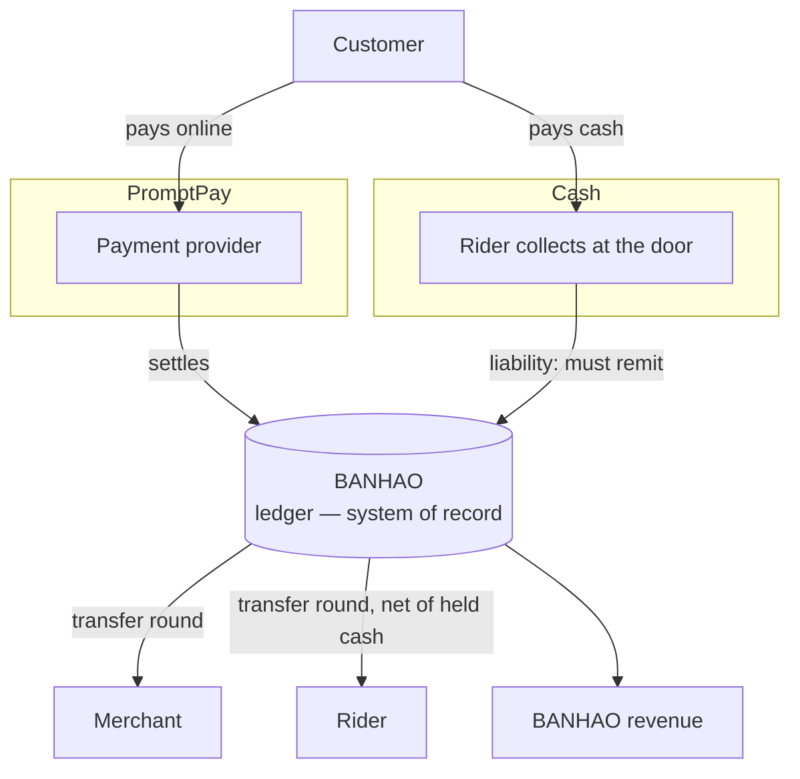
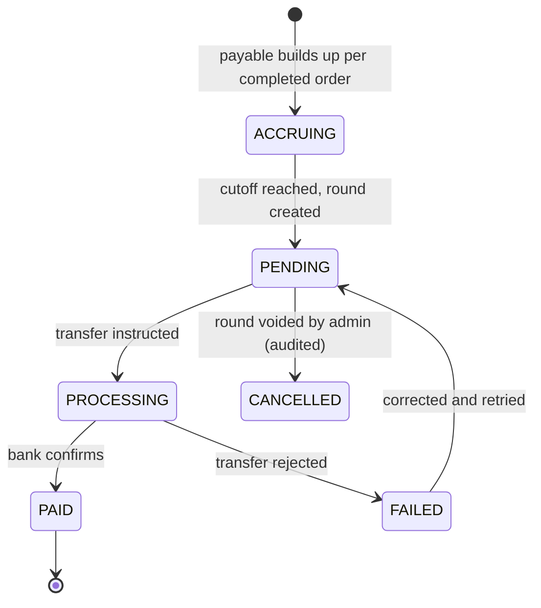

# BANHAO — Settlement Model

Who gets paid what, when, and how the books stay balanced.

Written 2026-08-10 (EVENT-013). Companion:
[`BUSINESS_RULES.md`](BUSINESS_RULES.md) ·
[`PAYMENT_LIFECYCLE.md`](PAYMENT_LIFECYCLE.md) ·
[`RIDER_LIFECYCLE.md`](RIDER_LIFECYCLE.md) ·
[`OPEN_BUSINESS_QUESTIONS.md`](OPEN_BUSINESS_QUESTIONS.md)

**STATUS: PROPOSED** except where marked `DOCUMENTED`. All amounts are integer
**satang** (CON-003) — `฿130` is `13000`.

---

## 0. The invariant

`DOCUMENTED` — CON-003:

> **Every order's ledger balances to exactly zero.**
> *"ทุกออเดอร์ต้องกระทบยอดเป็นศูนย์ … ห้ามมีเศษหายไปในระบบ"* — no remainder may
> disappear inside the system.

Everything in this document exists to keep that true. A model that cannot be
reconciled to zero is wrong regardless of how reasonable it sounds.

Related accepted rules: **DEC-014** — PostgreSQL is the sole system of record;
Realtime, caches and app state are projections and never financial truth.
**DEC-004 / REQ-001** — rider-held cash is a platform liability, never rider
income.

---

## 1. Money flow



Two payment methods, **two very different money paths**:

- **PromptPay** — money reaches a platform-controlled account first, then is
  split out. The platform owes the merchant and the rider.
- **Cash** — money never touches the platform's bank. The rider physically holds
  it and **owes** the platform. Settlement is netting, not transferring.

Whether the platform may legally hold and split funds this way is
**Q-002** — `LEGAL_REVIEW_REQUIRED`, and the single most important compliance
question in the project.

---

## 2. Ledger accounts

`PROPOSED`. Account names are a proposal; the concepts behind them are
`DOCUMENTED`.

| Account | Meaning | Normal direction |
|---|---|---|
| `CUSTOMER_PAYMENT` | Money received from a customer online | In |
| `RIDER_CASH_HELD` | Cash a rider is holding on the platform's behalf | Liability to the platform |
| `MERCHANT_PAYABLE` | What the platform owes a merchant | Out |
| `RIDER_PAYABLE` | What the platform owes a rider for delivery work | Out |
| `PLATFORM_REVENUE` | Commission + service fee + delivery margin | Out (to the platform) |
| `PROMOTION_FUNDING` | Whoever funds a discount (BQ-030) | Out |
| `REFUND_PAYABLE` | Money owed back to a customer | Out |
| `RIDER_COMPENSATION` | Paid to a rider for a job that failed through no fault of theirs (BQ-024) | Out |
| `PLATFORM_WRITE_OFF` | Cost the platform absorbs — wasted food on a `NO_RIDER` cancellation (BQ-015) | Out |

Rules, all `DOCUMENTED` via DEC-014 / CON-003:

1. **Append-only.** Never update, never delete a ledger entry. Correct with a
   reversing entry.
2. **One transaction.** Ledger entries are written in the same database
   transaction as the Payment and Order changes that caused them.
3. **Grouped and keyed.** Every group carries an idempotency key, so a duplicate
   webhook cannot write it twice (REQ-003).
4. **Integer satang.** No floats anywhere in the path.

---

## 3. Worked example — PromptPay

`DOCUMENTED` figures, from the design's own ledger for order `BH000125`
(*"ตัวอย่าง"* — a sample, not a rate card). Rebuilt in satang and checked.

**What the customer paid**

| Component | Satang | ฿ |
|---|---:|---:|
| Food subtotal | 12 000 | 120 |
| Delivery fee | 1 500 | 15 |
| Service fee | 500 | 5 |
| Discount `BANHAO7` | −1 000 | −10 |
| **Total charged** | **13 000** | **130** |

**How it is distributed**

| Ledger line | Satang | ฿ |
|---|---:|---:|
| `CUSTOMER_PAYMENT` (in) | +13 000 | +130 |
| `MERCHANT_PAYABLE` — food less 10% commission | −10 800 | −108 |
| `RIDER_PAYABLE` | −1 200 | −12 |
| `PLATFORM_REVENUE` | −1 000 | −10 |
| **Remaining in the system** | **0** | **฿0** ✓ |

**Where the platform's ฿10 comes from** — this decomposition is *derived* from
the design's numbers, not stated by it:

```
  commission on food      +1 200      (10% of 12 000)
+ delivery fee collected  +1 500
+ service fee             +  500
− paid to the rider       −1 200
− discount absorbed       −1 000
= platform revenue         1 000      (฿10)
```

Three findings the Product Owner should see, because none of them is written
down anywhere:

1. **The platform funds the discount.** The merchant is paid commission on the
   full ฿120 menu price, not the discounted total. → **BQ-030**.
2. **Delivery does not pay for itself.** ฿15 is collected and ฿10 of it survives
   the discount, against ฿12 paid to the rider. Commission covers the gap.
   → **BQ-026, BQ-029**.
3. **10% is internally consistent** across every sample: 120→12, 180→18,
   260→26, 95→10, 75→8, and the merchant card states `10% ของยอดอาหาร` outright.
   It is a **sample**, but a coherent one — Q-010 did not record that.

---

## 4. Worked example — cash

`DOCUMENTED` figures, order `BH000131` pattern, same ฿130 order.

| Ledger line | Satang | ฿ |
|---|---:|---:|
| `RIDER_CASH_HELD` — rider collects from the customer | +13 000 | +130 |
| Merchant received cash **at the counter** | −10 800 | −108 |
| Rider earning, retained from the cash held | −1 200 | −12 |
| Rider must remit to BANHAO | −1 000 | −10 |
| **Remaining** | **0** | **฿0** ✓ |

Note what this says: the rider hands the merchant ฿108 **at pickup**, before
collecting anything from the customer, then keeps ฿12 and owes BANHAO ฿10. It
is confirmed twice in the design — the ledger line
`ร้านได้รับเงินสดหน้าร้านแล้ว` and the merchant-finance note *"ออเดอร์เงินสดไม่
เข้ารอบโอน เพราะร้านได้รับเงินจากไรเดอร์หน้าร้านแล้ว"*.

🚩 **This is BQ-023, and it is a P0 business decision, not an implementation
detail.** The rider must carry a working float of their own money — several
hundred baht to run a shift — and absorbs the exposure if a customer refuses
delivery. In a district where the entire supply is 8–12 people, a float
requirement is a recruitment barrier.

**Alternative under BQ-023 option B** — same order, no rider float:

| Ledger line | Satang | ฿ |
|---|---:|---:|
| `RIDER_CASH_HELD` | +13 000 | +130 |
| Rider earning netted out of held cash | −1 200 | −12 |
| Rider remits to BANHAO | −11 800 | −118 |
| `MERCHANT_PAYABLE` (paid in the next transfer round) | −10 800 | −108 |
| `PLATFORM_REVENUE` | −1 000 | −10 |
| Cash remitted, applied against payables | +10 800 +1 000 | — |
| **Remaining** | **0** | **฿0** ✓ |

Both balance. They differ in **who carries the working capital** — the rider, or
BANHAO. That is the Product Owner's call.

---

## 5. Commission models

`OPEN` — Q-010, extended by BQ-028. Required by §12 of the brief.

| Model | Merchant friendliness | BANHAO revenue | Operational simplicity | Tax / accounting |
|---|---|---|---|---|
| **Percentage of food subtotal** (the design's implicit model) | Familiar; scales with the merchant's own take | Scales with GMV; low on small orders | **Simplest** — one number per merchant | Straightforward: commission is service revenue |
| **Fixed fee per order** | Punishing on cheap orders — and ส้มตำ orders *are* cheap | Predictable; poor upside on large orders | Simple | Straightforward |
| **Hybrid** (small % + small fixed) | Harder to explain | Covers per-order cost while keeping upside | Medium | Straightforward |
| **Monthly subscription** | Attractive to high-volume shops, hostile to occasional ones | Predictable but capped; needs volume to work | Adds billing, dunning, and suspension logic | Adds recurring-revenue accounting |

**Recommendation (`PROPOSED`, BQ-028):** percentage of the **food subtotal
only** — not of delivery or service fees. Reasons: it is the model the design's
arithmetic already validates end to end; it is what merchants recognise from
national platforms; and it needs no billing machinery a solo founder would have
to operate.

Two things to state explicitly whichever model is chosen, because leaving them
implicit is how ledgers drift:

- **The base.** Food subtotal only (design's answer) or the whole order.
- **The rounding rule.** The samples round to whole baht — `95 → 10`, `75 → 8`.
  Pick one rule (**round half up to the nearest satang** is proposed) and apply
  it in one place, because CON-003 admits no remainder.

A note on positioning: in a 20–30-shop district won by relationships, the
commission rate is a competitive instrument, not just a revenue dial. That is
the Product Owner's judgement to make with local knowledge this analysis does
not have.

---

## 6. Settlement lifecycle

`PROPOSED` — the states; `DOCUMENTED` — that transfer rounds exist, are dated,
and can fail (`โอนแล้ว` / `รอโอน` / `ล้มเหลว`).



An amount only becomes **payable** when the order reaches `COMPLETED` — the
documented merchant-payout flow is explicit that a transfer round covers *only
orders paid online and successfully delivered*.

### Cycle parameters — `OPEN`, BQ-032

| Parameter | Design says | Status |
|---|---|---|
| Cadence | `โอนทุกวันจันทร์ เวลา 10:00 น.` — weekly, Mondays 10:00 | `DOCUMENTED` (sample), and contradicted by `โอนแล้วเดือนนี้ ฿41,470 · 6 รอบ` (six rounds in a month) |
| Cutoff instant | Not stated | `OPEN` |
| Minimum payout | Not stated | `OPEN` — proposal: below the minimum, roll forward |
| Failed-transfer recovery | A `ล้มเหลว` round is shown; no recovery defined | `OPEN` |
| Payout account | One bank account per payee (`···4821`) | `DOCUMENTED` |

**Recommendation:** weekly at launch. Fewer transfers, fewer fees, one
reconciliation session a week for one operator — and it is what the design
already shows. Note that Q-002 may constrain how long platform-held funds are
allowed to sit.

---

## 7. Merchant settlement

`DOCUMENTED` behaviour.

The merchant sees: today's sales, the amount awaiting transfer, the amount
transferred this month, fees this month, a table of paid-and-awaiting-transfer
orders (order id, payment method, gross, fee, net), and a transfer-round
history. *"ร้านไม่ต้องเช็กสลิปเอง"* — the merchant never has to check payment
slips.

**The cash rule, `DOCUMENTED`:**

> *"ออเดอร์เงินสดไม่เข้ารอบโอน เพราะร้านได้รับเงินจากไรเดอร์หน้าร้านแล้ว ระบบหัก
> ค่าธรรมเนียมจากยอดโอนรอบถัดไปแทน"*
> Cash orders do not enter a transfer round — the shop already has the money —
> so the commission is deducted from the **next** round instead.

The settlement engine therefore needs a state that is easy to miss:
**"fee owed, no transfer due."** A merchant can end a period owing the platform
money rather than being owed it.

```
merchant round net =
    Σ (online order food subtotal − commission)     for delivered online orders
  − Σ (commission)                                   for delivered cash orders
  − Σ (reversals for refunded orders)
  + carried-forward balance (may be negative)
```

`OPEN` — BQ-033: a cash-only merchant accrues commission debt with no payout to
net it against. Recommendation: adopting BQ-023 option B removes the cause
entirely, with a carried negative balance as the safety net and a debt cap as
the escalation.

---

## 8. Rider settlement

`DOCUMENTED` behaviour, mirroring the merchant flow with one addition: **cash
netting comes first.**

Documented flow: *"ส่งสำเร็จ → บันทึกรายได้ไรเดอร์ → หักเงินสดค้างนำส่ง → รวมเป็น
รอบโอน → โอนสำเร็จ"*.

```
rider round net =
    Σ delivery earnings + bonuses
  − platform fee charged to the rider          (documented in D-13; rate OPEN, BQ-029)
  − outstanding cash held                      (DEC-004 / REQ-001)
  + compensation for platform-caused failures  (BQ-024)
```

The documented rider screen keeps two numbers apart and **must never sum them**:

```
รายได้วันนี้ (เป็นของคุณ)   ฿400     ← the rider's money
เงินสดที่เก็บมาแทนบ้านเฮา   ฿850     ← the platform's money
  หักรายได้ของคุณ          −฿240
  ต้องนำส่งบ้านเฮา          ฿610
```

Dispatch is **automatically blocked** when outstanding cash exceeds a configured
limit (`DOCUMENTED`; the value is Q-004). At 8–12 riders this is also a capacity
event and must alert an admin, not only the rider.

`OPEN` — BQ-034: what happens when cash owed exceeds earnings, and how the
platform recovers from a rider who stops working while holding cash.

---

## 9. Refund and cancellation impact

`PROPOSED`. Four distinct movements — collapsing them is how refunds corrupt a
ledger.

| Movement | Question it answers |
|---|---|
| Payment refund | How much goes back to the customer, by what mechanism (🚨 Q-020) |
| Merchant settlement reversal | Is the merchant's payable reduced, or do they keep it? |
| Rider compensation | Does the rider still get paid? **Normally yes if they rode.** |
| Platform fee reversal | Does BANHAO keep its commission and service fee? |

Proposed treatment by cause (each row depends on BQ-015 / BQ-031):

| Cause | Customer | Merchant | Rider | Platform |
|---|---|---|---|---|
| Cancelled before `ACCEPTED` | Full refund | Nothing accrued | Nothing | Fee reversed |
| Merchant rejected / timed out | Full refund | Nothing | Nothing | Fee reversed |
| Cancelled during `PREPARING` (merchant agrees) | Full refund | `OPEN` — food may exist | Nothing | Fee reversed |
| **`NO_RIDER`, food cooked** | Full refund | **Paid in full** | Nothing | **`PLATFORM_WRITE_OFF`** |
| Rider cancelled, order reassigned | No refund | Paid | Compensation to the first rider | Absorbs the compensation |
| Delivery failed — customer unreachable | `OPEN` — BQ-017 | Paid | **Paid** | `OPEN` |
| Missing item | Partial refund | Reversal of that item | **Paid in full** | Commission reversed proportionally |
| Duplicate payment | Refund the duplicate | Unaffected | Unaffected | Unaffected |

Two rules that hold across every row:

- **A refund never mutates the original entries.** It writes reversing entries.
  Both groups remain in the ledger; the pair still sums to zero.
- **Cash orders after collection** follow the documented path: a cash adjustment
  entry plus an admin-executed refund to the customer.

---

## 10. Promotion subsidy

`OPEN` — BQ-030. Derived from the worked example in § 3: the design's own
numbers have the platform absorbing the ฿10 discount while the merchant is paid
on the full menu price.

Whatever the Product Owner decides, the ledger requires the same thing: **every
promotion carries a funder, and the funder is copied onto the order.** Then:

```
PROMOTION_FUNDING (platform-funded)  → PLATFORM_REVENUE absorbs the discount
PROMOTION_FUNDING (merchant-funded)  → MERCHANT_PAYABLE is reduced by it
PROMOTION_FUNDING (shared)           → split by the configured ratio
```

Without a funder field, a discounted order cannot be reconciled at all — CON-003
fails on the first coupon redemption.

---

## 11. Reconciliation

`DOCUMENTED`. The admin's morning screen is a reconciliation view, not a revenue
chart. Two identities must both show **ตรงกัน ✓**:

```
(1)  online received  +  cash held by riders                        = total sales
(2)  merchant payouts + rider payouts + platform revenue + refunds  = total sales
```

Per-payment statuses are documented as `ตรงกัน` (matched), `รอยืนยัน`
(awaiting — e.g. no webhook yet, 10-minute grace) and `ไม่ตรง` (mismatched —
e.g. the provider reports ฿145 received while the system still shows `PENDING`).
Mismatches are resolved by manual matching or by refunding the customer. Rider
remittances reconcile the same way (`CASH-00087 · ไรเดอร์นำส่ง ฿610 · ตรงกัน`).

`PROPOSED` additions:

- Reconcile against the **provider's settlement report** on a schedule, not only
  against inbound webhooks — the webhook that never arrived is exactly what this
  is for.
- Reconcile **rider cash** daily; cash discrepancies compound and get harder to
  investigate with every day that passes.
- Alert on any order whose ledger group does not sum to zero. That should be
  impossible; if it happens, it is the most important alert in the system.

---

## 12. Cost and complexity

| Choice | Why it suits a solo founder |
|---|---|
| Weekly transfer rounds | Fewer transfers, fewer fees, one reconciliation session a week |
| Percentage commission | One number per merchant; no billing system |
| Cash netting instead of collection | No collection process; the money is already in the rider's payout path |
| Banded delivery fees | No routing service, no per-km disputes |
| Append-only ledger | Auditable by construction; no "how did this get edited?" |
| PostgreSQL only (DEC-014) | One store to reconcile, one transaction to trust |

What deliberately is **not** built: an accounting integration, automated tax
filing, multi-currency, instant payouts, and rider wallets. Each is a real
product with real maintenance, and none is needed to launch a district.

---

## 13. Open questions owned by this document

**P0:** Q-002 (legal settlement model) · Q-010 / BQ-028 (commission) ·
BQ-023 (rider cash float) · BQ-026 (delivery fee) · BQ-027 (service fee) ·
BQ-030 (promotion funding) · BQ-015 (who pays for wasted food)
**P1:** BQ-029 (rider earnings) · BQ-031 (partial refund composition) ·
BQ-032 (cycle) · BQ-033 (merchant negative balance) · BQ-034 (rider negative
balance) · Q-004 (cash limit) · Q-011 (chargebacks)

⚖️ `LEGAL_REVIEW_REQUIRED` before any of this is implemented: whether BANHAO
calculating splits, running transfer rounds and holding rider cash as a
liability constitutes regulated **payment facilitation** under the Payment
Systems Act (Q-002); VAT treatment of commission; and withholding obligations on
merchant and rider payouts.
