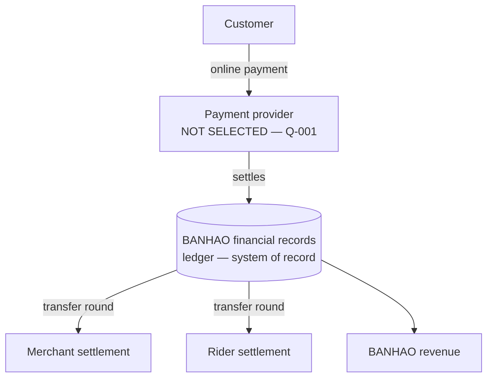
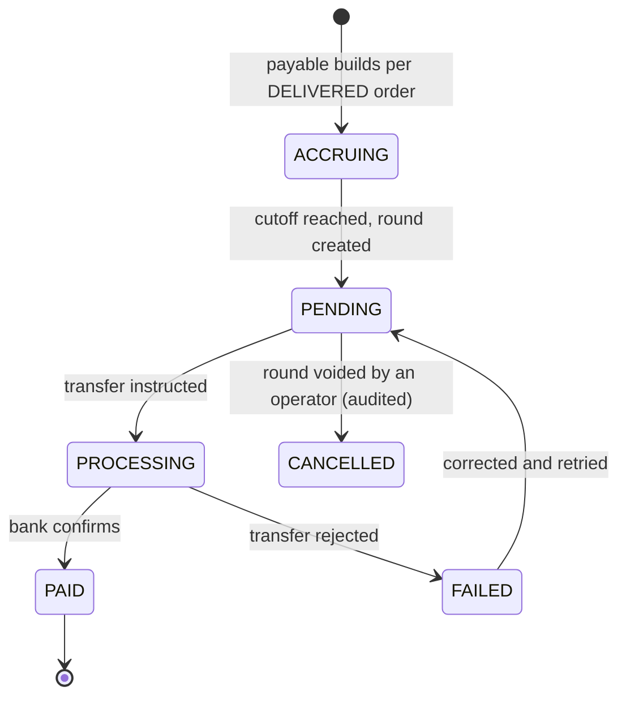

# BANHAO — Settlement Model

Who gets paid what, when, and how the books stay balanced.

Written 2026-08-10 (EVENT-013), locked to the approved decisions 2026-08-10
(EVENT-014). Companion: [`BUSINESS_RULES.md`](BUSINESS_RULES.md) ·
[`PAYMENT_LIFECYCLE.md`](PAYMENT_LIFECYCLE.md) ·
[`RIDER_LIFECYCLE.md`](RIDER_LIFECYCLE.md) ·
[`OPEN_BUSINESS_QUESTIONS.md`](OPEN_BUSINESS_QUESTIONS.md)

All amounts are integer **satang** (CON-003) — `฿130` is `13000`.

## Status legend

`ACCEPTED` — approved by the Product Owner (`DEC-NNN`) or accepted product truth
· `PROPOSED` — awaiting approval · `OPEN` — undecided, do not guess ·
`LEGAL_REVIEW_REQUIRED` — no agent may conclude this is lawful.

> **IMPLEMENTATION: NOT STARTED, and blocked.** DEC-026 accepts settlement as a
> domain; it explicitly does not authorise building it. Every number in the
> model was `OPEN` (DEC-023, DEC-024, DEC-025) — **as of 2026-09-05 all three
> are numerically resolved** (delivery **DEC-035**, service fee **DEC-036**,
> commission **DEC-043** — 8% of food subtotal, round to whole baht). **This
> does not itself authorise building the ledger.** DEC-026's authorisation gap
> is unchanged, no ledger-posting code has been written, and this is a
> documentation lock only — see DEC-043's own Consequences clause.

---

## 0. The invariant

`ACCEPTED` — CON-003:

> **Every order's ledger balances to exactly zero.**
> *"ทุกออเดอร์ต้องกระทบยอดเป็นศูนย์ … ห้ามมีเศษหายไปในระบบ"*

Related accepted rules: **DEC-014** — PostgreSQL is the sole system of record;
Realtime, caches and app state are projections, never financial truth.
**DEC-018** — Settlement is one of four separate state domains.
**DEC-026** — Settlement is its own financial domain, reading the ledger rather
than the order table.

---

## 1. Money flow

`ACCEPTED` — **DEC-026**, with the Phase 1 scope set by **DEC-016**.



**Phase 1 has one money path.** Cash on Delivery is disabled (DEC-016), so the
rider-held-cash path — and with it the netting, the remittance and the
cash-limit dispatch block — is dormant. It is documented in § 4 for the phase
that reintroduces COD, and must not be implemented now.

⚖️ `LEGAL_REVIEW_REQUIRED` — whether BANHAO calculating splits, running transfer
rounds and (later) holding rider cash constitutes regulated **payment
facilitation** under the Payment Systems Act is **Q-002**, the single most
important compliance question in the project. Merchant of record, settlement
legal structure, tax structure and regulatory classification all remain `OPEN`.

---

## 2. The three approved fee relationships

`ACCEPTED — MODEL`. Direction of money is decided for all three; **the
customer-facing amounts and the commission rate are now all approved** — only
the rider's side of the delivery fee remains open.

| Flow | Decision | Model | Numbers |
|---|---|---|---|
| `Customer → delivery fee → rider earning` | **DEC-023** | `ACCEPTED` | Customer side **`ACCEPTED`** — flat ฿10 / 1000 satang (**DEC-035**). Rider side **`ACCEPTED`** — flat ฿12 / 1200 satang per completed delivery (**DEC-044**, resolving BQ-029) |
| `Customer → service fee → BANHAO` | **DEC-024** | `ACCEPTED` | **`ACCEPTED`** — fixed ฿5 / 500 satang (**DEC-036**) |
| `Merchant → commission → BANHAO` | **DEC-025** | `ACCEPTED` | **`ACCEPTED`** — 8% of the food subtotal, rounded to whole baht (**DEC-043**) |

> **No agent may invent a price.** The design's `฿15` delivery, `฿5` service,
> `฿10` coupon and `10%` commission are illustrative samples — the payment
> canvas says so about itself. DEC-025 states explicitly that the 10% example
> must not become a business rule by default, and **DEC-043 confirms the
> approved commission rate is 8%, not 10% — the two are not the same number
> and the old sample is not retroactively relabelled.** `apps/customer/src/mocks/pricing.ts`
> labels its constants `SAMPLE_*` for the same reason; do not copy them into
> backend code.

---

## 3. Ledger accounts

`PROPOSED` names; the concepts are `ACCEPTED`.

| Account | Meaning | Phase 1 |
|---|---|---|
| `CUSTOMER_PAYMENT` | Money received from a customer online | Active |
| `MERCHANT_PAYABLE` | What the platform owes a merchant | Active |
| `RIDER_PAYABLE` | What the platform owes a rider for delivery work | Active |
| `PLATFORM_REVENUE` | Commission + service fee + delivery margin | Active |
| `PROMOTION_FUNDING` | Whoever funds a discount | Active — funder model **resolved** (DEC-046: per-promotion, `PLATFORM` or `MERCHANT`, no split); posting **not implemented**. Stacking still `OPEN` (BQ-030) |
| `REFUND_PAYABLE` | Money owed back to a customer | Active — mechanism `OPEN` (Q-020) |
| `RIDER_COMPENSATION` | Paid to a rider for a job lost through no fault of theirs | Active — amount `OPEN` (BQ-024) |
| `PLATFORM_WRITE_OFF` | Cost the platform absorbs — food wasted on an operator cancellation (policy still `OPEN`, BQ-015), and, **as of DEC-045**, the ฿2 delivery-side funding gap per completed delivery | Active — BQ-015 half `OPEN`; delivery-gap half `ACCEPTED` (DEC-045) **and implemented** (`b813b5c6`) as part of the rider-earning completion ledger flow. This does not mean full settlement/payout or a `CUSTOMER_PAYMENT` ledger is implemented — those remain outside DEC-045's scope |
| `RIDER_CASH_HELD` | Cash a rider holds on the platform's behalf | **Dormant — DEC-016** |

Rules, `ACCEPTED` via DEC-014 / CON-003 / DEC-028:

1. **Append-only.** Never update, never delete. Correct with a reversing entry.
2. **One transaction.** Ledger entries are written in the same database
   transaction as the Payment and Order changes that caused them.
3. **Grouped and keyed.** Every group carries an idempotency key, so a duplicate
   webhook cannot write it twice.
4. **Integer satang.** No floats anywhere in the path.

---

## 4. Worked examples

### 4.1 Online order — the Phase 1 path

Figures from the design's own ledger for order `BH000125`, rebuilt in satang.
**Illustrative arithmetic, not approved pricing** (DEC-023/024/025).

**What the customer paid**

| Component | Satang | ฿ |
|---|---:|---:|
| Food subtotal | 12 000 | 120 |
| Delivery fee | 1 500 | 15 |
| Service fee | 500 | 5 |
| Discount `BANHAO7` | −1 000 | −10 |
| **Total charged** | **13 000** | **130** |

**How it distributes**

| Ledger line | Satang | ฿ |
|---|---:|---:|
| `CUSTOMER_PAYMENT` (in) | +13 000 | +130 |
| `MERCHANT_PAYABLE` — food less 10% commission | −10 800 | −108 |
| `RIDER_PAYABLE` | −1 200 | −12 |
| `PLATFORM_REVENUE` | −1 000 | −10 |
| **Remaining** | **0** | **฿0** ✓ |

**Where the platform's ฿10 comes from** — derived, not stated by the design:

```
  commission on food      +1 200      (10% of 12 000 — a sample, DEC-025)
+ delivery fee collected  +1 500
+ service fee             +  500
− paid to the rider       −1 200
− discount absorbed       −1 000
= platform revenue         1 000
```

Three unit-economics findings the Product Owner should carry into the pricing
decisions. **None is settled by this lock:**

1. **The platform funds the discount.** The merchant is paid commission on the
   full ฿120 menu price, not the discounted total. As of **DEC-046** (2026-09-05)
   this is now a recognized valid Phase 1 shape — a `PLATFORM`-funded
   promotion — rather than an unexamined default; whether *this specific*
   `BANHAO7` sample would be tagged `PLATFORM` or `MERCHANT` is a promotion-
   definition detail, not decided by this worked example.
2. **Delivery does not pay for itself.** ฿10 of net delivery-side revenue
   against ฿12 paid to the rider; commission covers the gap. DEC-023 fixes the
   *direction* of the money, not that it balances. **DEC-035 has since set the
   Phase 1 delivery fee at exactly this ฿10**, so the gap this worked example
   describes is now the approved position rather than a sample.
   **Resolved 2026-09-05 by DEC-044: the rider side is also now locked, at
   exactly this ฿12** (flat, per completed delivery) — so the ฿2-per-delivery
   gap between the two is the actual Phase 1 position, not a sample.
   **Resolved 2026-09-05 by DEC-045: BANHAO intentionally absorbs this ฿2
   (200 satang) as a platform delivery write-off (`PLATFORM_WRITE_OFF`),
   independent of commission or service fee.** Commission does not fund the
   gap — that reading of this example was never locked as a rule, and
   DEC-045 explicitly declines it.
3. **10% is internally consistent** across every sample (120→12, 180→18,
   260→26, 95→10, 75→8) and stated outright as `10% ของยอดอาหาร`. **DEC-025
   explicitly refuses to let that become the rate by default** → Q-010, BQ-028.
   **Resolved 2026-09-05 by DEC-043: the approved Phase 1 rate is 8% of the
   food subtotal, round to whole baht — not 10%.** This worked example's own
   arithmetic is left as originally published, at the design's illustrative
   10%, and is not recomputed at 8% here.

### 4.2 Cash order — dormant, retained for the COD phase

**Not applicable in Phase 1 (DEC-016).** Kept because the model must remain
extensible and because the open question inside it does not go away.

| Ledger line | Satang | ฿ |
|---|---:|---:|
| `RIDER_CASH_HELD` — rider collects from the customer | +13 000 | +130 |
| Merchant received cash **at the counter** | −10 800 | −108 |
| Rider earning, retained from the cash held | −1 200 | −12 |
| Rider must remit to BANHAO | −1 000 | −10 |
| **Remaining** | **0** | **฿0** ✓ |

🚩 **BQ-023 is deferred, not answered.** This model has the rider paying the
merchant ฿108 **at pickup**, before collecting anything — a working-capital
requirement on the scarcest resource in the system. It returns unchanged the day
COD is switched back on. **Decide it before then, not during.**

---

## 5. Commission models

`ACCEPTED` — **DEC-025** fixes the direction (`Merchant → commission → BANHAO`).
**RESOLVED 2026-09-05 — DEC-043: the model shape and the rate are both now
approved as Percentage of food subtotal, 8%, rounded to whole baht.** The
comparison below is retained as the record of how that decision was reached —
read it as history and rationale, not as an open question.

| Model | Merchant friendliness | BANHAO revenue | Operational simplicity | Tax / accounting |
|---|---|---|---|---|
| **Percentage of food subtotal** — **approved, DEC-043, at 8%** | Familiar; scales with the merchant's own take | Scales with GMV; low on small orders | **Simplest** — one number per merchant | Straightforward service revenue |
| **Fixed fee per order** — not chosen | Punishing on cheap orders — and ส้มตำ orders *are* cheap | Predictable; poor upside on large orders | Simple | Straightforward |
| **Hybrid** (small % + small fixed) — not chosen | Harder to explain | Covers per-order cost, keeps upside | Medium | Straightforward |
| **Monthly subscription** — not chosen | Good for high-volume shops, hostile to occasional ones | Predictable but capped | Adds billing, dunning, suspension | Recurring-revenue accounting |

The two things this table used to leave implicit are now stated, by DEC-043:

- **The base — food subtotal only** (the design's answer, and the
  merchant-friendly one). The whole-order-including-fees alternative was
  considered and not chosen.
- **The rounding rule — whole baht**, matching the samples (95→10, 75→8) and
  CON-003's ban on any remainder.

In a district won by relationships, the rate is a competitive instrument, not
just a revenue dial — the reasoning DEC-043 itself records for choosing 8%
over the design's illustrative 10%.

---

## 6. Settlement lifecycle

`ACCEPTED` — **DEC-026** that the domain exists and is separate. `PROPOSED` —
the state names.



An amount becomes **payable** only when the order reaches `DELIVERED`
(DEC-019) — the documented merchant-payout flow covers online-paid,
successfully-delivered orders.

### Cycle parameters — `OPEN`, BQ-032

| Parameter | Design says | Status |
|---|---|---|
| Cadence | `โอนทุกวันจันทร์ เวลา 10:00 น.` — weekly | Sample, and contradicted by `โอนแล้วเดือนนี้ · 6 รอบ` |
| Cutoff instant | — | `OPEN` |
| Minimum payout | — | `OPEN` — proposal: roll forward below the minimum |
| Failed-transfer recovery | A `ล้มเหลว` round is shown; no recovery defined | `OPEN` |
| Payout account | One bank account per payee | `ACCEPTED` |

Weekly is the recommendation for launch — fewest transfers, fewest fees, one
reconciliation session a week for one operator. **Payout timing may be
constrained by Q-002**, so this cannot be finalised ahead of legal review.

---

## 7. Merchant settlement

`ACCEPTED` — the mechanism; `OPEN` — every number.

The merchant sees today's sales, the amount awaiting transfer, the amount
transferred this month, fees this month, a table of delivered-and-awaiting-transfer
orders, and a transfer-round history. *"ร้านไม่ต้องเช็กสลิปเอง"* — the merchant
never checks payment slips.

```
merchant round net =
    Σ (food subtotal − commission)   for DELIVERED online orders
  − Σ reversals for refunded orders
  + carried-forward balance (may be negative)
```

**Simplified by DEC-016.** The documented cash rule — cash orders skip the
transfer round because the shop already holds the money, with the commission
netted from the next round — **does not apply in Phase 1**, because there are no
cash orders. Consequences:

- The awkward "fee owed, no transfer due" state does not arise in Phase 1.
- **BQ-033** (cash-order fee netting, negative merchant balances) is **deferred**
  along with COD. It returns if COD does.
- Every merchant's money now flows through one mechanism, which is materially
  simpler to build and to reconcile.

---

## 8. Rider settlement

`ACCEPTED` — the mechanism. **RESOLVED 2026-09-05 — DEC-044**: delivery
earnings are a flat ฿12 (1200 satang) per completed delivery, with no bonus
and no rider-side platform fee in Phase 1. Compensation and cash remain as
below.

**The customer delivery fee (DEC-035, ฿10) and this rider earning (DEC-044,
฿12) are separate values, not the same number read twice.** The rider is
paid ฿12 regardless of what the customer's ฿10 delivery-fee charge alone
could cover. **RESOLVED 2026-09-05 — DEC-045**: the ฿2 (200 satang)
difference is a BANHAO platform write-off (`PLATFORM_WRITE_OFF`), not a draw
against merchant commission or service fee.

```
rider round net =
    Σ delivery earnings                   (flat ฿12 / delivery — DEC-044)
  + compensation for platform-caused failures  (BQ-024 — still OPEN, likelier under DEC-021)
  − outstanding cash held                 (DORMANT — DEC-016)
```

No bonus term and no rider-side platform-fee deduction appear in Phase 1's
formula — both were considered (the `D-13` design sample assumes a peak-hour
bonus and a rider-side platform fee) and **neither is activated** by DEC-044.

With COD disabled the cash-netting term is zero and the automatic cash-limit
dispatch block cannot trigger. **DEC-004 and REQ-001 remain ACCEPTED and must
not be deleted** — cash is still a liability, still displayed separately, the
moment COD returns.

Note that **DEC-021 makes rider reassignment routine**: a rider who rides to a
shop for a job that is then reassigned away will happen, and BQ-024
(compensation) is the question that answers what they are owed. Any compensation
must be its own ledger line, never folded into delivery earnings.

`OPEN` — BQ-034: recovery when a rider's balance goes negative. The cash half is
deferred; the compensation and platform-fee half is live.

---

## 9. Refund and cancellation impact

`ACCEPTED` — **DEC-027**: refund is a payment-domain event; the order is
`CANCELLED`, the payment is `REFUNDED`. Four distinct movements — collapsing
them is how refunds corrupt a ledger:

| Movement | Question it answers |
|---|---|
| Payment refund | How much goes back, by what mechanism (🚨 Q-020) |
| Merchant settlement reversal | Is the merchant's payable reduced? |
| Rider compensation | Does the rider still get paid? **Normally yes if they rode** |
| Platform fee reversal | Does BANHAO keep commission and service fee? |

| Cause | Customer | Merchant | Rider | Platform | Status |
|---|---|---|---|---|---|
| Cancelled before `MERCHANT_ACCEPTED` | Full refund | Nothing accrued | Nothing | Fee reversed | `ACCEPTED` |
| Merchant rejected / timed out | Full refund | Nothing | Nothing | Fee reversed | `ACCEPTED` |
| Cancelled during `PREPARING` (merchant agrees) | Full refund | `OPEN` — food may exist | Nothing | Fee reversed | Partly `OPEN` |
| **Operator cancels for no rider, food cooked** (DEC-022) | Full refund | **`OPEN`** | Compensation? | **`PLATFORM_WRITE_OFF`?** | **`OPEN` — BQ-015, P0** |
| Rider cancelled, delivery reassigned (DEC-021) | No refund | Paid | Compensation to the first rider | Absorbs it | Amount `OPEN` — BQ-024 |
| Delivery failed — customer unreachable | `OPEN` | Paid | **Paid** | `OPEN` | `OPEN` — BQ-017 |
| Missing item | Partial | Item reversal | **Paid in full** | Commission reversed proportionally | `OPEN` — BQ-031 |
| Duplicate payment (DEC-030) | Refund the duplicate | Unaffected | Unaffected | Unaffected | Mechanism `OPEN` |

Two rules across every row: **a refund never mutates the original entries** —
it writes reversing entries, and the pair still sums to zero; and a **cancelled
order legitimately sits with money still held** until the refund completes
(DEC-018 / DEC-027).

---

## 10. Promotion funding

**Funder model RESOLVED — DEC-046 (2026-09-05).** Every promotion carries a
funder, decided per promotion, and the funder is copied onto the order. Phase
1 allows exactly two funders — no other party, and no split:

```
PROMOTION_FUNDING (platform-funded)  → PLATFORM_REVENUE absorbs the discount
PROMOTION_FUNDING (merchant-funded)  → MERCHANT_PAYABLE is reduced by it
```

The third line this section previously carried — a configured platform/merchant
split — is **not supported in Phase 1** (DEC-046 rejects it explicitly). A
future decision could add it back; nothing here forecloses that, but it is not
today's rule.

**Stacking remains `OPEN` — BQ-030.** DEC-046 resolves only who may fund a
promotion, not how many promotions may combine on one order.

**Posting is not implemented.** No `promotions`/`coupons` table, no `funder`
column, and no `PROMOTION_FUNDING` ledger entry exist yet — DEC-046 is a
business decision, not an engineering task, and building any of this remains
separately unauthorized. Without them, a discounted order still cannot be
reconciled — CON-003 would fail on the first coupon redemption — but the rule
that will govern that ledger entry, once built, is no longer a guess.

---

## 11. Reconciliation

`ACCEPTED`. The operator's morning screen is a reconciliation view, not a revenue
chart: *"หน้าที่แอดมินเปิดทุกเช้าคือหน้ากระทบยอด ไม่ใช่กราฟรายได้"*.

Phase 1 identities, with the cash term removed by DEC-016:

```
(1)  online received                                                = total sales
(2)  merchant payouts + rider payouts + platform revenue + refunds  = total sales
```

Per-payment statuses `ตรงกัน` / `รอยืนยัน` / `ไม่ตรง` are `ACCEPTED`. Mismatches
are resolved by manual matching or by refunding — an operator capability under
**DEC-032**.

`PROPOSED` additions: reconcile against the **provider's settlement report** on a
schedule, not only against inbound webhooks; give **late payments** (DEC-029)
their own queue; and alert on any order whose ledger group does not sum to zero
— that should be impossible, and if it happens it is the most important alert in
the system.

---

## 12. Cost and complexity

`ACCEPTED` — **DEC-031**. Every choice below is justified by one solo operator
at launch volume:

| Choice | Why it suits a solo founder |
|---|---|
| Online-only in Phase 1 (DEC-016) | Removes cash reconciliation, rider floats and remittance entirely |
| Weekly transfer rounds | Fewer transfers, fewer fees, one reconciliation session a week |
| Percentage commission (if chosen) | One number per merchant; no billing system |
| Append-only ledger | Auditable by construction |
| PostgreSQL only (DEC-014) | One store to reconcile, one transaction to trust |
| Manual operator resolution (DEC-032) | A phone call beats an algorithm at this volume |

Deliberately not built: accounting integration, automated tax filing,
multi-currency, instant payouts, rider wallets.

---

## 13. Open questions owned by this document

**Resolved by this lock:** settlement as a separate domain (DEC-026) · the three
fee directions (DEC-023, DEC-024, DEC-025) · refund/order separation (DEC-027) ·
duplicate payment (DEC-030).

**Deferred by DEC-016:** BQ-023 (rider cash float) · BQ-033 (cash fee netting) ·
Q-004 (cash limit) · the cash half of BQ-034.

**Still `OPEN` — P0:** Q-002 (legal settlement model) · BQ-027 (service fee
**refundability** only — the amount is set by DEC-036) · BQ-030 (**stacking**
only — the funder model is resolved by DEC-046) · BQ-015 (who bears the cost
of wasted food). **Resolved 2026-08-24:** BQ-026 (DEC-035, flat ฿10) and the
amount half of BQ-027 (DEC-036, fixed ฿5). **Resolved 2026-09-05:** Q-010 /
BQ-028 (**DEC-043** — commission is 8% of the food subtotal, rounded to whole
baht) · BQ-029 (**DEC-044** — rider earning is a flat ฿12 per completed
delivery; BQ-024 is unaffected and stays open below) · BQ-040 (**DEC-045** —
the ฿2 delivery funding gap is a BANHAO platform write-off) · the **funder-model**
half of BQ-030 (**DEC-046** — per-promotion funder, `PLATFORM` or `MERCHANT`,
no split; stacking is unaffected and stays open above).
**Still `OPEN` — P1:** BQ-024 (rider cancellation/waiting compensation) ·
BQ-031 (partial refund composition) · BQ-032 (settlement cycle) · BQ-034
(negative balances) · Q-011 (chargebacks).

⚖️ `LEGAL_REVIEW_REQUIRED` before any of this is implemented: payment
facilitation licensing (Q-002), merchant of record, settlement legal structure,
tax structure and regulatory classification, VAT on commission, and withholding
on merchant and rider payouts. **None of these may be marked accepted by an
agent.**
