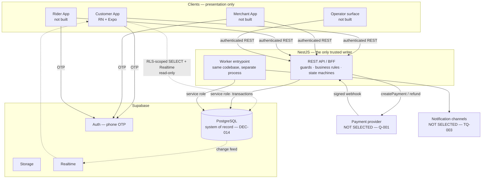
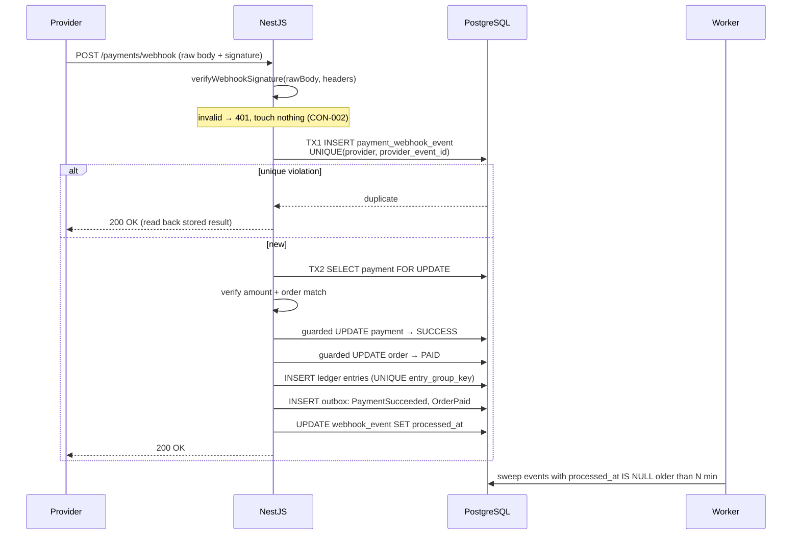

# BANHAO — Technical Architecture v1

How the approved business decisions (DEC-001…DEC-032) get implemented.

Written 2026-08-11 (EVENT-015). **STATUS: PROPOSED — awaiting architecture
review.** Nothing here is built, and no business decision is created, changed or
reversed by this document.

Companion: [`ARCHITECTURE_DECISIONS.md`](ARCHITECTURE_DECISIONS.md) (ADR-001…)
· [`OPEN_TECHNICAL_QUESTIONS.md`](OPEN_TECHNICAL_QUESTIONS.md) (TQ-001…) ·
[`DECISIONS.md`](DECISIONS.md) (product, DEC-001…) ·
[`BUSINESS_RULES.md`](BUSINESS_RULES.md)

> **This document is downstream of the business decisions, never upstream.**
> If anything here appears to contradict `docs/BUSINESS_RULES.md` or
> `docs/DECISIONS.md`, those win and this document is wrong. Report it; do not
> resolve it by changing the business rule.

---

## 1. Goals

| # | Goal | Why |
|---|---|---|
| G1 | Implement DEC-016…DEC-032 faithfully | They are the Source of Truth |
| G2 | **Financial safety** — the ledger balances to zero, always | CON-003 |
| G3 | **Exactly-one-winner** on every contested operation | DEC-020 broadcast dispatch, DEC-030 duplicate payment |
| G4 | Operable by **one founder** | DEC-031 |
| G5 | **AI-maintainable** — an agent can find what it owns and what it must not touch | §20; project is built by AI |
| G6 | Low cost at ~50 restaurants, 8–12 riders, low volume | `SCALE_MODEL.md` |
| G7 | Extensible to Phases 2–4 without redesign | DEC-005, REQ-004 |
| G8 | Nothing about Buntharik hard-coded | DEC-031 |

## 2. Non-goals

Explicitly **not** designed for, and deliberately so:

- Millions of users, multi-region, sharding, microservices (DEC-009 forbids).
- Route optimisation, rider scoring, ETA prediction models (DEC-020 says
  broadcast → first accept, no optimisation in Phase 1).
- A message broker, event-sourcing, or CQRS.
- Cash handling — **disabled in Phase 1** (DEC-016), modelled but dormant.
- An Admin App (DEC-032 documents the capability, not the app).
- Anything that picks a payment provider (Q-001), a price (DEC-023/024/025), or
  a legal structure (Q-002).

---

## 3. System overview



### The one rule that shapes everything

> **NestJS writes. Clients read. Postgres decides.**

Every domain mutation goes through NestJS using the service-role client, inside
a database transaction, guarded by the state machine. Clients get **no
INSERT/UPDATE/DELETE grants on domain tables at all** — see § 12.

This is deliberate and is the answer to §4's "do not let business rules scatter".
RLS can express *"you may only see your own rows"* precisely. It cannot express
*"an order may move to `MERCHANT_ACCEPTED` only if the caller owns the
restaurant, the payment is `SUCCESS`, and the 3-minute window has not
expired."* Encoding half a state machine in policies and half in TypeScript is
how a system becomes unmaintainable — and unmaintainable by an AI agent
especially, because the rule is no longer in one findable place.

### Deployment shape

One repository, one image, **two entrypoints**:

| Entrypoint | Process | Responsibility |
|---|---|---|
| `api` | HTTP server | Requests, webhooks |
| `worker` | Long-running loop | Timers, retries, outbox dispatch, sweeps |

Same NestJS modules, same services, same transaction code. The worker is not a
separate service and does not get its own copy of business logic (ADR-012).

---

## 4. Component architecture

### 4.1 Client — presentation only

**Owns:** UI, navigation, local/optimistic state, form validation as *user
convenience*, formatting, offline caching for display, the design tokens.

**Never owns:** anything in the "NestJS" list below. Specifically the client may
never decide a payment succeeded (CON-002), compute an order status (REQ-002),
price an order, or assign a rider.

Client-side validation is duplicated server-side **always**. Client validation
is a UX affordance; server validation is the rule.

### 4.2 NestJS — business rules and the trusted writer

**Owns:**

| Responsibility | Governed by |
|---|---|
| Order state machine and every transition | DEC-018, DEC-019 |
| Payment orchestration and webhook verification | CON-002, DEC-028/029/030 |
| Refund orchestration | DEC-027 |
| Delivery dispatch, assignment, reassignment | DEC-020, DEC-021, DEC-022 |
| Pricing calculation (formula; **rates are config**) | DEC-023/024/025 |
| Settlement calculation | DEC-026 |
| Ledger writes | CON-003, DEC-014 |
| Authorization (who may do what) | REQ-002, Q-014 |
| Idempotency | DEC-028 |
| Audit records | DEC-032 |
| Emitting domain events to the outbox | ADR-006 |

### 4.3 Supabase — platform, not logic

**Owns:** PostgreSQL persistence and transactions; Auth (phone OTP, JWT
issuance); RLS as **defence in depth**; Storage (menu images, delivery-proof
photos); Realtime as a **change signal** on read-safe projections.

**Does not own:** business rules. No business logic in triggers or RPC
functions, with two narrow exceptions where the database is genuinely the right
enforcer:

1. **Integrity constraints** — unique indexes, check constraints, foreign keys.
   These are backstops for the rules NestJS enforces, not duplicates of them.
2. **Immutability triggers** — e.g. the existing `profiles` trigger rejecting
   client changes to `role`/`id`/`phone`. Pattern proven live, 14/14.

### 4.4 Worker — time and retries

**Owns:** everything that happens *because time passed* or *because something
failed*:

| Job | Trigger | Governed by |
|---|---|---|
| Merchant accept timeout (3 min) | Timer | Value accepted; behaviour `OPEN` (BQ-013) |
| Rider broadcast rounds and re-broadcast | Timer | DEC-020, DEC-022 |
| Customer no-rider notification (5 min) + operator alert | Timer | DEC-022 |
| Payment expiry (QR 10 min) | Timer | Accepted |
| Webhook sweeper — process events stuck unprocessed | Timer | DEC-028 |
| Outbox dispatch | Poll | ADR-006 |
| Notification delivery + retry | Queue | TQ-003 |
| Reconciliation against provider settlement report | Schedule | Accepted |
| Settlement accrual and round creation | Schedule | DEC-026 — **not built** |

**The worker never invents a transition.** It calls the same domain service the
API calls, with a system actor.

---

## 5. Domain boundaries

`ACCEPTED` — **DEC-018**: four separate state domains. One NestJS module owns
each aggregate; a module's tables are written **only** by that module's service
(existing rule, `apps/api/src/modules/README.md`).

| Module | Owns (tables) | Owns (state machine) | Governed by |
|---|---|---|---|
| `users` | `profiles` | — | Live |
| `merchants` | `merchant`, `merchant_bank_account` | Merchant lifecycle | BQ-006 `OPEN` |
| `catalog` | `restaurant`, `restaurant_hours`, `menu_*` | Restaurant open/closed (derived) | BQ-007 `OPEN` |
| `carts` | `cart`, `cart_item` | — | DEC-017 |
| **`orders`** | `order`, `order_item`, `order_item_option`, `order_status_event` | **Order** | DEC-019 |
| **`payments`** | `payment`, `payment_attempt`, `payment_transaction`, `payment_webhook_event` | **Payment** | DEC-016, DEC-027…030 |
| `refunds` | `refund`, `refund_transaction` | Refund | DEC-027 |
| **`delivery`** | `delivery`, `rider_assignment`, `rider_assignment_attempt`, `delivery_attempt`, `delivery_status_event` | **Delivery** | DEC-020/021/022 |
| `drivers` | `rider`, `rider_document`, `rider_availability`, `rider_cash_balance` (dormant) | Rider lifecycle | BQ-022 `OPEN` |
| `ledger` | `ledger_entry` | — (append-only) | CON-003, DEC-014 |
| **`settlements`** | `settlement`, `settlement_item` | **Settlement** | DEC-026 — **not built** |
| `promotions` | `promotion`, `coupon`, `coupon_redemption` | — | BQ-030 `OPEN` |
| `notifications` | `notification`, `notification_delivery` | — | TQ-003 |
| `geo` | `service_area`, `zone`, `delivery_fee_band` | — | DEC-031 |
| `audit` | `audit_log`, `outbox` | — | DEC-032, ADR-006 |
| `support` | `support_ticket`, `support_message` | — | BQ-037 `OPEN` |

Cross-module access is **service calls, never foreign table reads**. The one
place this is relaxed: foreign keys may reference another module's primary key
(referential integrity is a database concern), but no module may `SELECT` from
another module's tables.

---

## 6. Order domain

### 6.1 Boundary

`Order` is the aggregate root and is **BANHAO-owned** — not the customer's, not
the merchant's. It holds an immutable price snapshot (`order_item` written once,
never updated) and an address snapshot, so a menu edit or an address edit can
never rewrite history.

`Order` carries **only Order state**. It carries no payment status, no delivery
status, no settlement status (DEC-018). Those are joined for display, never
merged into a column.

### 6.2 Who may cause each transition

**No actor writes `order.state` directly.** All transitions go through
`OrderStateService.transition(orderId, command, actor)`. "Actor" below is who is
*authorised to issue the command*.

| Transition | Authorised actor | Notes |
|---|---|---|
| → `CREATED` | Customer | Via `POST /orders` |
| `CREATED` → `PENDING_PAYMENT` | System | On payment intent creation |
| `PENDING_PAYMENT` → `PAID` | **Verified webhook only** | CON-002 — no other path exists |
| `PAID` → `MERCHANT_ACCEPTED` | Merchant | Starts rider search (DEC-020) |
| `MERCHANT_ACCEPTED` → `PREPARING` | Merchant | |
| `PREPARING` → `READY_FOR_PICKUP` | Merchant | |
| → `PICKED_UP` | Rider (assigned only) | Requires `READY_FOR_PICKUP` + assigned rider |
| `PICKED_UP` → `DELIVERING` | Rider (assigned only) | |
| `DELIVERING` → `DELIVERED` | Rider (assigned only) | + proof of delivery (BQ-018 `OPEN`) |
| → `CANCELLED` | Customer / Merchant / **Operator** | Per the accepted cancellation matrix; **never a rider** (DEC-021) |
| Exception states | System / Merchant / Operator | **Names still `PROPOSED`** — see `ORDER_LIFECYCLE.md` § 3 |

**A rider can never change Order state to a cancelled outcome** (DEC-021). A
rider abandoning a job changes *Delivery* state only.

### 6.3 Order history

`order_status_event` is append-only: `order_id, from_state, to_state,
actor_type, actor_id, reason, occurred_at`. The customer-facing timeline is
**derived** from it, never stored separately (REQ-002).

---

## 7. Payment domain

### 7.1 Boundary

Entities as modelled in `DOMAIN_MODEL.md` § 5.6. Key structural points:

- **`payment` is 1:1 with `order`** — `UNIQUE (order_id)`. This is the natural
  idempotency key for payment creation.
- **`payment_attempt` is where retries live.** A regenerated QR is a new attempt
  on the **same** payment reference (DEC-028). Attempts keep their identity
  after expiry, which is what makes late payment resolvable (DEC-029).
- **`payment_webhook_event` is the idempotency anchor**, with
  `UNIQUE (provider, provider_event_id)`.
- `payment_method` is an **open enum**, not a boolean. Phase 1 permits online
  only; `CASH` exists and is rejected at the service boundary (DEC-016).

### 7.2 Provider abstraction

**Already implemented and correct — do not redesign.**
`apps/api/src/modules/payments/payment-provider.interface.ts` defines
`PaymentProvider` with `createPayment`, `refund`, `verifyWebhookSignature`, an
explicit `idempotencyKey` on every operation, and a `PAYMENT_PROVIDER` DI token.
`NullPaymentProvider` throws on every call **by design**.

Architecture adds only the placement rule already in `modules/README.md`:
provider SDKs may be imported **only** under `payments/providers/`.

⚠️ `refund()` is declared because the domain needs the concept. **Q-020 found no
provider supports native PromptPay refunds**, and DEC-016 deleted the
cash-refund fallback. The adapter contract for refunds is therefore incomplete
by necessity — TQ-008.

### 7.3 Webhook pipeline



Two transactions, deliberately. **TX1 records that the event arrived**, even if
processing then fails — an unverifiable or unprocessable event is still
evidence. **TX2 applies it** atomically across Payment + Order + Ledger + Outbox,
which is the single requirement that made DEC-009's monolith the right choice.

If the process dies between TX1 and TX2, the event sits with `processed_at IS
NULL` and the sweeper retries it. This is why webhook processing appears in the
worker's list even though the happy path is inline.

---

## 8. Delivery domain

### 8.1 Entities

| Entity | Purpose |
|---|---|
| `delivery` | 1:1 with order. Holds delivery state, assigned rider, distances, earning |
| `rider_assignment` | A rider's **claim** on a delivery. At most one may be `ACCEPTED` per delivery |
| `rider_assignment_attempt` | One offer to one rider in one broadcast round — the dispatch audit trail |
| `delivery_attempt` | A physical attempt to hand over; supports the failure path (BQ-017 `OPEN`) |

`rider_assignment_attempt` is what makes *"why did nobody take this order?"*
answerable. Without it the question has no data behind it, and at launch that
question will be asked about specific orders by name.

### 8.2 Dispatch

`ACCEPTED` — DEC-020: broadcast to all eligible online riders, **first to accept
wins**. Search starts when the order reaches `MERCHANT_ACCEPTED`, in parallel
with `PREPARING` (DEC-019). No scoring, no optimisation.

Eligibility is a simple filter: rider is `APPROVED`, `ONLINE_IDLE`, within the
service area, under the concurrent-job limit (BQ-021 — recommended 1). The
cash-limit block is **dormant** (DEC-016).

### 8.3 Preventing two riders from claiming one order

**This is the single most important concurrency requirement in the system.** Full
analysis in § 11.1. Summary: a **guarded conditional UPDATE** (compare-and-set)
on the `delivery` row, plus a **partial unique index** on `rider_assignment` as
a database-level backstop. No distributed lock, no queue, no advisory lock.

### 8.4 Reassignment

`ACCEPTED` — DEC-021: `RIDER_ASSIGNED → RIDER_REASSIGNING → RIDER_SEARCHING →
broadcast`. **The order does not move.** `RIDER_REASSIGNING` exists as a real
state so operations can distinguish "never assigned" from "assigned and lost",
and so `reassignment_count` is a queryable number rather than an inference.

### 8.5 No rider

`ACCEPTED` — DEC-022: `retry → manual dispatch → operator decision`. **There is
no timeout that cancels anything.** Technically this means the dispatch job
loops indefinitely until a terminal decision is recorded, and the only terminal
decisions are "assigned" or "an operator decided". The worker raises the
customer notification at 5 minutes and an operator alert (timings `OPEN`).

---

## 9. Rider, Merchant, and Settlement domains

### 9.1 Rider

`rider` (identity, documents, approval), `rider_availability` (online/offline,
location, blocked reason), `rider_cash_balance` (**dormant** — DEC-016).

Deliberately **not** designed: ranking, scoring, route optimisation, batching
heuristics (DEC-020, BQ-021).

🔴 `rider_availability.location` is the most privacy-sensitive data in the
system. Continuous location; retention and access need a lawful basis before
the first byte is stored (Q-012, TQ-016). Customers may read a rider's location
**only during their own active delivery**, and that read is served by the API,
not by a client-side subscription to a rider table.

### 9.2 Merchant

`merchants` module owns the **business and its money**; `catalog` owns the
**storefront and menu**. Kept apart because Phase 2–4 reuse `Merchant` with a
different storefront (DEC-005, REQ-004).

**Merchant is separate from Order.** A merchant never owns an order row; it is
authorised to issue transitions on orders belonging to its restaurant. Order
acceptance and preparation status are *Order* transitions issued by a merchant
actor, not merchant state.

"Is this restaurant accepting orders right now" is **derived**, not stored:
lifecycle `ACTIVE` ∧ within hours ∧ not temporarily closed ∧ before cutoff. The
inputs are `OPEN` (BQ-006, BQ-007); the derivation belongs in `catalog`.

### 9.3 Settlement

`ACCEPTED` — DEC-026, and ⛔ **not to be built.** The architectural constraints:

- Settlement **reads the ledger**, never the order table. Payables are derived
  from `ledger_entry`, so settlement can be recomputed and audited.
- Settlement is its own module and its own state machine (`ACCRUING → PENDING →
  PROCESSING → PAID`, with `FAILED → PENDING`).
- It cannot be implemented anyway: every rate is `OPEN` (DEC-023/024/025) and
  Q-002 is `LEGAL_REVIEW_REQUIRED`. **No assumption about legal ownership of
  funds is made in this document.**

---

## 10. Money model

`ACCEPTED` — CON-003 (integer satang, ledger sums to zero), DEC-014 (Postgres is
truth). This section defines **representation and arithmetic discipline only** —
no rate, fee or price is set here (DEC-023/024/025 keep every number `OPEN`).

### 10.1 Representation

| Layer | Representation | Rationale |
|---|---|---|
| PostgreSQL | **`bigint` satang** + `currency char(3)` | Exact. Never `float`/`double`/`real`; never `money`. `numeric` would also be exact but invites fractional values the domain does not have |
| TypeScript | Existing `Money { amount: Satang; currency: 'THB' }` in `@banhao/types` | Already correct |
| Recommendation | **Brand `Satang`**: `type Satang = number & { readonly __satang: unique symbol }` | Today `Satang = number`, so a baht value type-checks as satang. Branding makes that a compile error. Cheap now, painful later |
| Wire (JSON) | Integer satang, never a formatted string, never baht | One conversion point, at render |
| Display | `satangToBaht` at the very edge only | Already exists |

JS `number` is a float64, but every integer up to 2^53 is exact — ~90 trillion
baht. Safe. The risk is not magnitude, it is **accidentally introducing a
fraction**, which is what §10.2 addresses.

### 10.2 Arithmetic — the residual rule

Percentage-based amounts (commission) will not divide evenly. The discipline
that keeps CON-003 true:

1. **Rates are integers.** Store percentages as **basis points** (`bigint`),
   never as `0.10`. A 10% rate is `1000` bps. *(10% is a design sample, not a
   rate — DEC-025.)*
2. **One rounding function**, in one module, applied in one direction:
   `floor(amount * bps / 10000)`.
3. **Allocate the residual to a designated component, computed last as a
   subtraction — never as an independent calculation.**

```
merchant_payable = food_subtotal − commission        (rounded)
rider_payable    = <per DEC-023 formula>             (rounded)
platform_revenue = total_charged − merchant_payable − rider_payable   ← residual
```

Because the residual component is derived by subtraction, the four ledger lines
sum to exactly the amount received **by construction**, for any rate and any
rounding. No reconciliation drift is possible. Which component absorbs the
residual is an architecture choice (platform revenue is the natural one); the
*amounts* remain `OPEN`.

4. **A ledger group that does not sum to zero must fail the transaction**, not
   log a warning. Enforced in the ledger service and asserted in tests.

### 10.3 The components

Every one is a distinct, separately-stored satang amount on the order snapshot
or a distinct ledger account — never a computed-on-read value:

`food_subtotal` · `delivery_fee` · `service_fee` · `discount` ·
`total_charged` · `commission` · `merchant_payable` · `rider_payable` ·
`platform_revenue` · `promotion_funding` · `refund_amount` ·
`platform_write_off`.

Ledger accounts are listed in `SETTLEMENT_MODEL.md` § 3. `RIDER_CASH_HELD`
exists and is **dormant** (DEC-016).

---

## 11. Concurrency

The universal primitive is a **guarded conditional UPDATE** — compare-and-set
expressed as a `WHERE` clause. It is used for every contested transition, and it
is why this system needs no distributed lock, no Redis, and no queue for
correctness.

```sql
UPDATE <table>
   SET state = <target>, ...
 WHERE id = $1
   AND state IN (<legal source states>)
```

Then branch on **rows affected**: `1` = you won, `0` = you lost or the state
moved. This works because under PostgreSQL's default `READ COMMITTED`, a second
transaction updating the same row **blocks**, then **re-evaluates its `WHERE`
against the newly committed row** and matches nothing.

> **The bug this prevents:** `SELECT` the state, check it in TypeScript, then
> `UPDATE`. That is check-then-act, and two riders will both pass the check.
> **The guard must be in the `WHERE` clause.** This is the single most important
> implementation rule in this document.

Guards express the **set** of legal source states, not a single value — that is
what makes § 11.3 resolve correctly.

### 11.1 Rider race — two riders accept the same delivery

Riders A and B tap Accept in the same instant.

```sql
-- both execute this, concurrently
UPDATE delivery
   SET state = 'RIDER_ASSIGNED',
       rider_id = :riderId,
       assigned_at = now()
 WHERE id = :deliveryId
   AND state IN ('RIDER_SEARCHING', 'RIDER_REASSIGNING')
   AND rider_id IS NULL;
```

- A commits → 1 row. A is the rider.
- B blocks on A's row lock → A commits → B re-evaluates → `state` is now
  `RIDER_ASSIGNED` → **0 rows**. B loses.
- B's service reads the row back and returns `409 Conflict` with a
  rider-friendly message. **B is never told it succeeded.**

In the same transaction the winner writes `rider_assignment (outcome=ACCEPTED)`,
resolves the other riders' `rider_assignment_attempt` rows to `SUPERSEDED`, and
emits `RiderAssigned` to the outbox.

**Database backstop** (defence in depth, conceptual — no migration here):

```
UNIQUE INDEX ON rider_assignment (delivery_id) WHERE outcome = 'ACCEPTED'
```

Even if a future refactor broke the state guard, the database would still refuse
a second accepted assignment. Two independent mechanisms, because DEC-020 makes
this the hottest contested path in the product.

**Idempotent re-tap:** if 0 rows and the row is already assigned **to the same
rider**, return `200` (already yours) rather than `409`. A rider double-tapping
on a bad connection must not see an error.

Rejected alternatives: advisory locks (extra state to reason about), `SELECT …
FOR UPDATE` then update (correct but an extra round trip for no benefit),
`SERIALIZABLE` (needs retry handling everywhere for a problem one `WHERE` clause
solves), a queue-based single-consumer dispatcher (throughput we do not need,
plus an ordering fairness problem of its own).

### 11.2 Payment webhook race — the same event twice

Two mechanisms, both required:

1. **`UNIQUE (provider, provider_event_id)`** on `payment_webhook_event`. The
   second insert fails; the handler catches the unique violation, reads back the
   stored outcome and returns `200`. Returning 200 matters — anything else and
   the provider retries forever.
2. **`UNIQUE (entry_group_key)`** on `ledger_entry`. Even if the event guard
   were bypassed, the ledger physically cannot be written twice for the same
   economic event. DEC-028 requires this to **fail loudly**, not silently
   no-op.

Two *different* events for the same payment arriving concurrently (e.g. `paid`
and `expired`) are serialised by `SELECT … FOR UPDATE` on the payment row in
TX2, and the state guard resolves the order (`EXPIRED` cannot overwrite
`SUCCESS`).

Because the order transition happens in the same transaction, **DEC-030 holds
structurally**: an order's value is a column on the order, set once at creation.
A second successful payment cannot increase it — it can only create a refund
obligation.

### 11.3 Order transition race — merchant accepts while operator cancels

Both are legal commands. The requirement is *determinism*, not preventing one.

- Merchant's guard: `WHERE state = 'PAID'`
- Operator's cancel guard: `WHERE state IN (<all cancellable states>)` —
  the operator may cancel from many states (DEC-022, DEC-032)

Outcomes:

| Order of commit | Result |
|---|---|
| Merchant first | Merchant gets 1 row → `MERCHANT_ACCEPTED`. Operator's guard still matches (it's cancellable) → cancel succeeds. **Both succeed, sequentially.** Correct: an operator may cancel an accepted order |
| Operator first | Order is `CANCELLED`. Merchant's guard `state='PAID'` matches nothing → **0 rows → 409** "this order was cancelled", with the current state returned |

Deterministic in both directions, with no special-casing: **first commit wins,
the loser is told the truth and does not blind-retry.** Every transition
endpoint returns the current state on 409 so the client can re-render rather
than guess.

### 11.4 Transaction discipline

| Rule | Reason |
|---|---|
| Default isolation `READ COMMITTED` | Sufficient given guarded updates; avoids serialisation-failure retry logic everywhere |
| Payment + Order + Ledger + Outbox in **one** transaction | The requirement DEC-009 was chosen for |
| Never call an external provider **inside** a transaction | A provider timeout must not hold a row lock. Call outside, persist the result inside |
| Lock ordering: `order` → `payment` → `delivery` → `ledger` | A fixed order prevents deadlocks between concurrent multi-aggregate operations |
| Keep transactions short | They run under the service-role connection pool |

---

## 12. Idempotency

`ACCEPTED` — DEC-028: `order_id`, `payment_reference`, `idempotency_key`.

**Prefer a natural key over a generated one.** Where the domain already
guarantees uniqueness, a unique constraint *is* the idempotency mechanism and
needs no extra table.

| Operation | Mechanism | Key | On repeat |
|---|---|---|---|
| **Create order** | `idempotency_record` table | Client `Idempotency-Key` header + endpoint + user | Return the stored response. Prevents a double-tap creating two orders |
| **Create payment** | Natural — `UNIQUE (order_id)` on `payment` | `order_id` | Return the existing payment |
| **Issue QR / new attempt** | `UNIQUE (payment_id, attempt_no)` | Payment ref + attempt | Return the live unexpired attempt |
| **Payment webhook** | `UNIQUE (provider, provider_event_id)` | Provider event id | Read back, return 200 |
| **Refund** | `UNIQUE (refund_reference)` | Refund ref | Return the existing refund |
| **Rider accept** | Natural — the state guard | `(delivery_id, rider_id)` | Same rider → 200; different rider → 409 |
| **Order transition** | Natural — the state guard | Target state | Already in target → 200; otherwise 409 |
| **Ledger write** | `UNIQUE (entry_group_key)` | Deterministic per economic event | **Fails loudly** — DEC-028 |

`idempotency_record` stores: key, endpoint, user, **request hash**, response
body, status, created_at. The request hash matters — the same key with a
*different* body is a client bug and must return `422`, not the old response.

---

## 13. Security

### 13.1 Trust model

| Principal | Credential | Trust |
|---|---|---|
| Client app | Supabase anon key + user JWT | **Untrusted.** Read-scoped by RLS |
| NestJS | Supabase **service role** key | Trusted. Bypasses RLS |
| Worker | Service role | Trusted |
| Provider webhook | Signature | Trusted **only after** `verifyWebhookSignature` (CON-002) |

`SupabaseService` already owns both clients and confines the service-role key to
backend context (CON-005). The service-role key must never appear in a mobile or
browser bundle — enforced today, must stay enforced.

### 13.2 RLS strategy — defence in depth, not the authorization system

Authorization lives in NestJS guards. RLS exists so that **a leaked anon key
cannot read another customer's data**. Both are required; neither replaces the
other.

The proven pattern from `profiles` (live, 14/14 verified) generalises:

1. **Column-level `GRANT`** — the narrowest write surface possible.
2. **Non-recursive RLS policies** for reads.
3. **An immutability trigger** as a backstop against a future over-broad grant.

Applied to the domain tables:

| Table group | Client SELECT | Client write | Rationale |
|---|---|---|---|
| `profiles` | Own row | `display_name` only | Existing, live |
| `restaurant`, `menu_*` | Public where active | **None** | Merchant edits go through the API |
| `order`, `order_item` | Own orders (customer); own restaurant's (merchant); assigned delivery's (rider, limited columns) | **None** | Every transition is a command |
| `delivery` | Parties to the order | **None** | DEC-020/021 need guarded updates |
| `payment`, `refund`, `ledger_entry`, `settlement` | **None** | **None** | API-only. These rows contain other parties' amounts |
| `rider_availability` | 🔴 API-only | **None** | Location. Q-012 |

> **No domain table grants `INSERT`, `UPDATE` or `DELETE` to `authenticated`.**
> This is the concrete form of "NestJS writes, clients read", and it makes §17's
> examples structurally impossible rather than merely forbidden: a customer
> cannot modify payment status or assign a rider because **no grant exists**,
> not because a policy declined.

Realtime subscriptions inherit RLS, so a Realtime feed can never expose more
than the equivalent SELECT.

---

## 14. Auditability

Three complementary records, all append-only, none ever updated or deleted:

| Record | Answers | Scope |
|---|---|---|
| `order_status_event`, `delivery_status_event`, payment transitions | who / what / when / from / to / why | Every domain state change |
| `ledger_entry` | the money | Every economic event (CON-003, DEC-014) |
| `audit_log` | **operator interventions specifically** | Manual overrides (DEC-032) |

Common shape: `actor_type` (`CUSTOMER`/`MERCHANT`/`RIDER`/`OPERATOR`/`SYSTEM`/
`WEBHOOK`), `actor_id`, `occurred_at`, `from_state`, `to_state`, `reason`,
`correlation_id`, `source` (api / worker / webhook).

Three rules:

1. **Written in the same transaction as the change.** An audit row that can be
   lost independently of the change is not an audit trail.
2. **`reason` is mandatory for every operator action** and for every
   cancellation. It is the field that makes the history answer *why*.
3. **A `correlation_id` threads a whole business operation** — request →
   transition → ledger → outbox → notification — so one identifier reconstructs
   the full story.

`PROPOSED` and not yet approved (BQ-038, Q-014): that every manual override
writes an audit record. Architecture assumes it; the Product Owner has not
ratified it.

---

## 15. Operator operations

`ACCEPTED` — DEC-031, DEC-032. ⛔ No Admin App is built.

The architectural requirement is precise: **an operator must be able to act
without bypassing business rules.** That means operator actions are **ordinary
domain commands with an operator actor and a mandatory reason** — never direct
SQL, never a back door, never a service that skips the state machine.

| Operator action | Implemented as | Guard |
|---|---|---|
| Manual rider assignment | The same assignment command a rider accept uses | Same conditional UPDATE, actor = operator |
| Retry / extend rider search | Re-enqueue a broadcast round | Delivery still searching |
| Cancel an order | `OrderStateService.transition(..., CANCEL, operator)` | Same cancellation matrix |
| Trigger refund workflow | `RefundService.request(...)` | Same refund state machine |
| Resolve a delivery exception | Delivery transition + cause code | Same guards |
| Force-unassign a rider | Delivery → `RIDER_REASSIGNING` (DEC-021) | Order untouched |
| Match an unreconciled payment | Reconciliation command | Ledger stays balanced |

Two invariants: **every operator action writes an `audit_log` row with a
reason**, and **there is no operator path that can leave the ledger unbalanced**
— including manual matching, which writes reversing entries rather than editing.

---

## 16. Notifications

Abstraction only; **no provider is selected** (TQ-003, Q-019).

```
NotificationService.send(recipient, event, payload)
        → resolves channel preference per recipient type + event
        → enqueues notification_delivery rows
        → worker dispatches via a NotificationChannel adapter
        → records outcome; retries with backoff
```

`NotificationChannel` mirrors `PaymentProvider`'s shape: an interface with
adapters under `notifications/channels/`, one per channel (push / SMS / email /
in-app), swappable without touching business logic.

- Notifications are **always asynchronous** — via the outbox. A notification
  failure must never fail an order transition.
- `notification_delivery` records per-channel attempts and outcomes, so
  "did the merchant get told?" is answerable.
- The event × recipient matrix is `ACCEPTED` (`BUSINESS_RULES.md` § 13); the
  event × **channel** matrix is `OPEN` (BQ-035).
- The merchant's new-order alert is a **client-side requirement**, not a
  notification-provider one: the design demands a sound that continues until
  acknowledged. That belongs in the merchant app.

---

## 17. Background jobs

**Recommendation: PostgreSQL as the job store for Phase 1** (ADR-007), behind a
`JobQueue` interface so it can be replaced without touching callers.

Justification, as §3 requires:

- Volume is tens to low hundreds of orders/day — on the order of one job per
  minute at peak. This is three to four orders of magnitude below where Postgres
  job queues struggle.
- `SELECT … FOR UPDATE SKIP LOCKED` is the standard, well-understood pattern for
  exactly this.
- Postgres is already the system of record (DEC-014), already backed up, already
  monitored. Redis/BullMQ/SQS would add a service to run, pay for, secure and
  back up — against DEC-031 (one founder) and G6.
- **Jobs can be enqueued in the same transaction as the state change that causes
  them.** With an external broker they cannot, which reintroduces the
  dual-write problem the outbox pattern exists to solve.

Revisit triggers, stated so the decision can be reviewed on evidence rather than
feel: sustained >50 jobs/second, queue latency consistently >5s, or a need for
fan-out across multiple worker hosts. → TQ-001.

**Two mechanisms, not one:**

| Mechanism | For | Table |
|---|---|---|
| **Outbox** | Domain events emitted transactionally with a state change | `outbox` |
| **Scheduled jobs** | Time-based work — timeouts, expiry, sweeps, reconciliation | `job` |

Both need: `attempts`, `next_run_at`, `locked_at`, `last_error`, exponential
backoff, and a **dead-letter state** after N attempts that raises an operator
alert. A silently-dropped job in a financial system is unacceptable.

---

## 18. API boundaries

High-level only, per §18 — **not a specification, and nothing is implemented.**

**State transitions are commands, never `PATCH { state }`.** A client must never
be able to assert a state; it requests a transition and the server decides. This
is the API-level expression of REQ-002 and CON-002.

```
POST   /api/v1/orders                      create (Idempotency-Key required)
GET    /api/v1/orders/:id                  read (RLS-scoped)
POST   /api/v1/orders/:id/cancel           customer / operator
POST   /api/v1/orders/:id/accept           merchant
POST   /api/v1/orders/:id/preparing        merchant
POST   /api/v1/orders/:id/ready            merchant

POST   /api/v1/payments                    create intent for an order
GET    /api/v1/payments/:id                status (never asserts success)
POST   /api/v1/payments/webhook            provider-only, signature-verified
POST   /api/v1/refunds                     operator / system

POST   /api/v1/deliveries/:id/accept       rider — the contested endpoint
POST   /api/v1/deliveries/:id/cancel       rider → reassignment (DEC-021)
POST   /api/v1/deliveries/:id/picked-up    rider
POST   /api/v1/deliveries/:id/delivered    rider (+ proof)
POST   /api/v1/deliveries/:id/assign       operator — manual dispatch

POST   /api/v1/riders/me/availability      rider online/offline
```

Conventions: `409 Conflict` **with the current state in the body** on a lost
guard; `Idempotency-Key` on every non-idempotent create; existing global
`SupabaseAuthGuard` + `RolesGuard`; the response envelope and error filter that
already exist. Versioned under `/api/v1` from the start (TQ-015).

---

## 19. Domain events

**Recommendation: a transactional outbox, and nothing more.** No broker, no
event sourcing, no CQRS. The order table is the state; events are notifications
*about* state, not the source of it.

| Event | Sync or async | Persisted? | Retries? |
|---|---|---|---|
| `OrderCreated` | async | Yes | Yes |
| `PaymentSucceeded` | **sync** (in the webhook TX) | Yes | N/A — the TX is the guarantee |
| `OrderPaid` | **sync** (same TX) | Yes | N/A |
| `MerchantAcceptedOrder` | **sync** transition + async fan-out | Yes | Fan-out only |
| `RiderSearchStarted` | async, immediately after commit | Yes | Yes |
| `RiderAssigned` | async | Yes | Yes |
| `OrderReady` | async | Yes | Yes |
| `OrderPickedUp` / `OrderDelivered` | async | Yes | Yes |
| `PaymentRefunded` | **sync** (webhook TX) + async notify | Yes | Notify only |

The rule behind the column: **anything that changes money or state is
synchronous and transactional; anything that merely tells somebody is
asynchronous and retried.** Ledger writes are never events — they are part of
the transaction.

Everything persisted goes through the `outbox`, written in the same transaction
as the change, then dispatched by the worker at-least-once. Consumers must
therefore be idempotent — which they are, because every consumer's action is
itself guarded (§ 12).

---

## 20. AI maintainability

A stated critical requirement (G5). The goal: an agent opening this repository
tomorrow can determine, for any module, **what it owns, what it must not change,
what it depends on, and which business decision governs it** — without reading
everything.

### 20.1 Module contract

Every module carries a `README.md` with a fixed header:

```markdown
# Module: orders
Owns:        order, order_item, order_item_option, order_status_event
State:       Order (DEC-019)
Governed by: DEC-017, DEC-018, DEC-019, DEC-022, DEC-027, REQ-002, CON-001
Must NOT:    write payment/delivery/settlement tables; merge states;
             use superseded state names; set a price
Depends on:  catalog (read via service), payments (events), geo (fees)
Migrations:  supabase/migrations/*_orders_*.sql
Tests:       apps/api/src/modules/orders/**/*.spec.ts
Open:        BQ-013, BQ-015, BQ-016, BQ-017 — do not guess
```

The `Open:` line is the important one. It tells an agent where the map ends.

### 20.2 Ownership rules

| Boundary | Rule |
|---|---|
| Tables | One owning module. No cross-module table writes; no cross-module `SELECT` |
| Migrations | Filename carries the owning module. One module per migration file |
| State machines | Exactly one service owns each; no transition logic anywhere else |
| Money | Only `ledger` writes `ledger_entry`. Only the pricing module computes amounts |
| Providers | SDKs only under `payments/providers/` and `notifications/channels/` |
| Tests | Live beside the module; concurrency tests are mandatory for guarded transitions (TQ-012) |

### 20.3 Source of Truth chain

```
docs/BUSINESS_RULES.md        what the business does        ← authoritative
docs/DECISIONS.md  (DEC-)     why, and when approved        ← authoritative
docs/TECHNICAL_ARCHITECTURE.md  how it is built             ← this file
docs/ARCHITECTURE_DECISIONS.md (ADR-)  why, technically
docs/OPEN_*_QUESTIONS.md      what is NOT decided           ← do not guess
apps/**                       implementation truth
```

Two rules an agent must not break: **a `DEC-` beats an `ADR-`**, and
**`OPEN` means stop and ask** — never infer a rate, a timing, or a policy that
the question register lists as undecided.

---

## 21. Future scaling

Deliberately deferred, with the trigger that should reopen each:

| Change | Trigger |
|---|---|
| Extract a module to its own service | A module needs independent scaling or deploy cadence. **Not before** (DEC-009) |
| Real queue (Redis/SQS) instead of Postgres | Sustained >50 jobs/s or fan-out across hosts (TQ-001) |
| Zone-based dispatch instead of broadcast | Rider pool past ~30 (DEC-020's own note) |
| Read replicas | Read load affects write latency |
| Rider batching | Measured capacity shortfall (BQ-021) |
| Caching layer | A measured hot path — never pre-emptively; never for financial reads (DEC-014) |

Phase 2–4 (Parcel, Ride, Shopping) need **no architectural change**: `Delivery`
does not require a `Restaurant`, and pricing is a strategy selected per service
(DEC-005, REQ-004).

---

## 22. Open technical decisions

Full register: [`OPEN_TECHNICAL_QUESTIONS.md`](OPEN_TECHNICAL_QUESTIONS.md).

**Blocking implementation:** TQ-008 (provider adapter — gated on Q-001), TQ-005
(deployment/hosting — Q-009), TQ-011 (migration workflow).
**Blocking launch readiness:** TQ-003 (notification providers), TQ-004 (maps),
TQ-006 (observability), TQ-007 (backup/restore), TQ-016 (location retention —
Q-012).
**Design-refining:** TQ-001 (queue at scale), TQ-002 (Realtime strategy),
TQ-012 (concurrency test strategy), TQ-015 (API versioning).

### What this document deliberately does not decide

No payment provider. No price, rate or fee. No legal or tax structure. No
merchant of record. No notification, map or hosting vendor. No exception-state
names (still `PROPOSED` in `ORDER_LIFECYCLE.md`). And no database object —
**no migration, no table, no index, no RLS policy, no trigger, no function was
created by this work.** Everything above describes shape, not schema.
